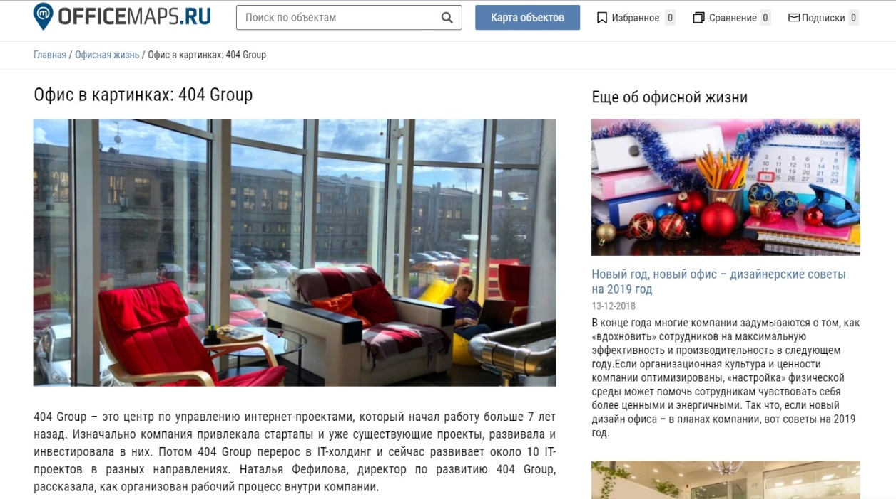

[404 Group](http://404-group.com/) ㅡ это центр по управлению интернет-проектами, который начал работу больше 7 лет назад. Сейчас мы развиваем около 10 ИТ-проектов в разных направлениях: медийные агентства, биржи товаров и услуг, рекламные сети, финансовые сервисы. Наш офис находится в Санкт-Петербурге.

## Публикации в СМИ помогают рассказать о компании всем соискателям

На данном этапе развития одна из целей компании ㅡ сформировать успешный, внушающий доверие HR-бренд 404 Group. На рынке ИТ сейчас жесткая конкуренция за квалифицированные кадры: опытных специалистов хантят и в России, и зарубежом. Мы же хотим создать образ успешной и комфортной для работы компании, чтобы привлекать лучших из лучших.

Нам есть чем гордится: например, мы выделяем ежегодный бюджет на личное обучение персонала. Каждый может выбрать курсы, семинары, тренинги, которые хочет посетить, и компания оплатит их. Действуют и другие программы. Мы вкладываем много сил и средств, чтобы сотрудники получали удовольствие от работы и знали, что их ценят.

Но если мы не будем рассказывать об этом другим, то как соискатели узнают обо всех плюсах работы у нас? Да, есть сарафанное радио: к нам приходит много претендентов, которые знают о нас по отзывам друзей и знакомых.

> Однако если мы регулярно подкрепляем «разговоры» о нас информацией в нескольких авторитетных СМИ, то привлекать новых кандидатов становится легче. Здесь действуют обычные законы маркетинга: чем больше точек контакта будет с потенциальными сотрудниками, тем быстрее мы сможем закрыть нужные позиции и реализовать стратегические планы бизнеса.

Кроме того, есть гипотеза ㅡ когда специалист находится в поиске работы или же задумывается о смене работы, то он обязательно начнет изучать компании, которые кажутся ему достойными, которые он рассматривает как хороший вариант для карьерного роста. Перед тем, как откликнуться на вакансию, потенциальный сотрудник проверит сайт компании, социальные сети, затем начнет искать публикации о ней в интернете. И если уже не на сайте компании, а в известном ему СМИ, да еще и не в одном, он прочитает о каких-то фишках работы на этом месте, то у него неизбежно возникнет мысль: «Да, тут классно работать!».

Именно поэтому публикации в медиа ㅡ ключевой инструмент для построения HR-бренда. В среднем в месяц мы выпускаем по 5-6 публикаций с участием 404 Group. В СМИ мы говорим о работе в компании: какие у нас преимущества, как в целом построены процессы, какие возможности открываются для соискателей.

## Что делать, чтобы продвигать HR-бренд в СМИ

Чтобы вложить в голову соискателя уверенность, что ваша компания ㅡ лучшее место для работы, необходимо инициировать максимум публикаций в медиа с участием компании. Как в деловых изданиях, так и на отраслевых HR и ИТ-площадках ㅡ чем больше и чаще, тем лучше.

**Совет 1.** Если вас интересует продвижение только в одной тематике (для нас это HR-тематика), то проще всего взаимодействовать с журналистами через автоматизированный сервис. Вам не нужно будет постоянно искать новые издания для публикаций и самим обращаться в редакции с просьбой написать о вас. Мы используем сервис журналистских запросов [Pressfeed](https://pressfeed.ru/): он позволяет регулярно появляться на страницах лучших HR-площадок и федеральных крупных медиа.

Как искать запросы, чтобы не пропустить релевантные:

1. Проверяем общую рассылку 2 раза в день (в 10.00 и в 15.00).
2. Параллельно подписываемся на рассылку по ключевым словам. Для этого нужно ввести все слова, которые могут встречаться в подходящих запросах, в поисковую строку сервиса через запятую. Скорее всего, список слов будет пополняться с течением времени. Так как мы ищем запросы в HR-тематике, наши примеры слов ㅡ «hr», «корпоративный», «резюме» и т. д.

_Поиск по ключевым словам_

**Совет 2.** Важно не количество, а качество. Тратьте время только на те публикации, где вы можете рассказать читателям о своем опыте и о работе в компании, чтобы потенциальные соискатели понимали, почему стоит устраиваться к вам. 

Приведу некоторые примеры публикаций. Мы неоднократно сотрудничали с журналистом Анастасией Жигач из «Делового Петербурга» и выпустили 3 совместных материала. В одном из них делились опытом, как выявить талантливого сотрудника и удержать его.

[_Запрос_](https://pressfeed.ru/query/45735) _от «Делового Петербурга»_

В компании часто проводятся тренинги для сотрудников, так мы и находим таланты внутри компании. Вот и рассказали об этом.

  
_Фрагмент_ [_публикации_](https://www.dp.ru/a/2018/08/05/Najti_i_ne_unichtozhit) _с участием компании_

**Совет 3.** Когда журналист увидит, что вы всегда отвечаете на его просьбы четко и оперативно, даете эксклюзивную или интересную информацию, а не пишете банальности, то он сам будет идти вам навстречу. Ставить ваш комментарий первым или обращаться в вашу компанию напрямую. 

Кстати, очень удобно общаться с журналистами прямо на сервисе ㅡ через внутренние чаты. Там можно досылать комментарии, задавать уточняющие вопросы, прикреплять файлы.

_Чаты с журналистами_

Наш офис находится в Санкт-Петербурге, поэтому особую ценность для нас имеют запросы от местных изданий. Мы писали о ежегодном спортивном событии 404 Group для отраслевого спортивного издания Neva Sport (издание базируется в Петербурге). Журналист попросил рассказать о корпоративном спорте.

[_Запрос_](https://pressfeed.ru/query/45799) _от Neva Sport_

В этом СМИ мы опубликовали не маленький комментарий, а большой [материал](https://nevasport.ru/10709-parusnyj-sport-blizhe-k-lyudyam-chem-vam-kazhetsya/) о том, как один из проектов компании выступает спонсором парусной регаты по островам Греции и приглашает на нее своих сотрудников.

[_Публикация с участием компании_](https://nevasport.ru/10709-parusnyj-sport-blizhe-k-lyudyam-chem-vam-kazhetsya/)

**Совет 4.** Если вам, действительно, есть чем похвастаться, а ваша компания делает для сотрудников что-то уникальное ㅡ рассказывайте об этом подробнее и чаще. Есть вероятность, что журналиста заинтересует эта тема, и она превратится в большую публикацию. 

Также мы давали комментарий для блога сайта Rjob.ru ㅡ делились опытом, какие [методы бюджетной мотивации](http://rjob.ru/articles/8_sposobov_vdokhnovit_sotrudnikov_pri_malom_byudzhete/) сотрудников используются в 404 Group.

[_Запрос от Rjob.ru_](https://pressfeed.ru/query/47059)

_Комментарий от HR-директора 404 Group_

**Совет 5.** Офис ㅡ это важная составляющая комфортной работы в компании. Это простая и очевидная тема для публикации в СМИ, и такой материал точно будет интересен потенциальным кандидатам. 

Мы подробно рассказывали о своем офисе, сделали фоторепортажи для двух отраслевых HR-площадок: Officemaps.ru и «HR по-русски».

  
[_Запрос_](https://pressfeed.ru/query/43516) _от Officemaps.ru_

[_Публикация_](https://officemaps.ru/ofisnaia-zhizn/ofis-v-kartinkah-404-group) _с участием компании в издании Officemaps.ru_

**Совет 6.** Обращайте особое внимание на запросы, итогом которого станет не маленький комментарий в издании, а полноценная статья. 

Полноценный материал мы делали для портала «Деловой мир». Редактор хотел получить статью о благоприятной атмосфере в компании.

  
[_Запрос_](https://pressfeed.ru/query/45974) _от «Делового мира»_

Мы написали материал, в котором показали реальный опыт 404 Group. Статью прочитали более 1700 человек.

  
[_Статья в «Деловом мире»_](https://delovoymir.biz/kak-sozdat-atmosferu-v-kotoroy-hochetsya-rabotat.html)

## Результаты работы со СМИ: как развивается HR-бренд

Мы начали заниматься активным продвижением в СМИ весной 2018 года. С тех пор мы ответили на 95 запросов на Pressfeed, в итоге получили более 40 публикаций с участием 404 Group. В среднем в месяц выходит по 5-6 публикаций.

В течение полугода работы мы наблюдаем, как планомерно растет интерес со стороны рынка и соискателей к компании 404 Group. Как мы это поняли?

**Во-первых**, во второй половине 2018 года число брендовых запросов по компании 404 Group выросло в 2 раза.

**Во-вторых**, 30% кандидатов, которые приходят на собеседовании, уже хорошо знают о 404 Group (видели на конференциях, читали в СМИ). Об этом их спрашивают HR-специалисты.

**В-третьих**, 10% резюме, которые приходят в HR-департамент, откликаются не на конкретную размещенную вакансию, а именно с пометкой «Хочу у вас работать». Раньше этот процент был меньше.

**В-четвертых,** мы часто получаем отклик от коллег и контрагентов: «О, я знаю вашу компанию. Вы известны в Петербурге». Когда я прихожу на профессиональные мероприятия, то ко мне подходят коллеги с предложениями о сотрудничестве, напоминая о том, что читали материалы о нас.

> Публикации в СМИ напрямую влияют на узнаваемость и охват. Чем больше точек контакта с аудиторией ― тем лучше результат. За 2018 год наша команда выросла в 2,5 раза, что тоже показатель. 

Более того, публикации работают не только на потенциальных сотрудников, но и на тех, кто уже в компании. Это всегда приятно и вдохновляет, когда о твоей компании пишут в тех СМИ, которые ты читаешь.
