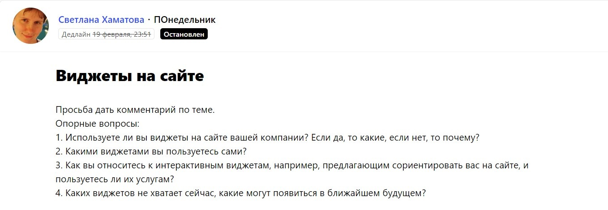
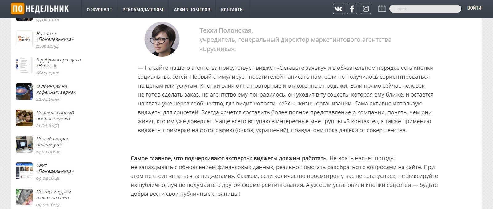
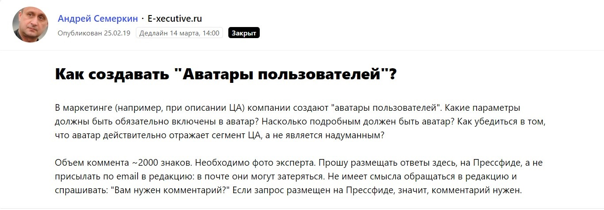
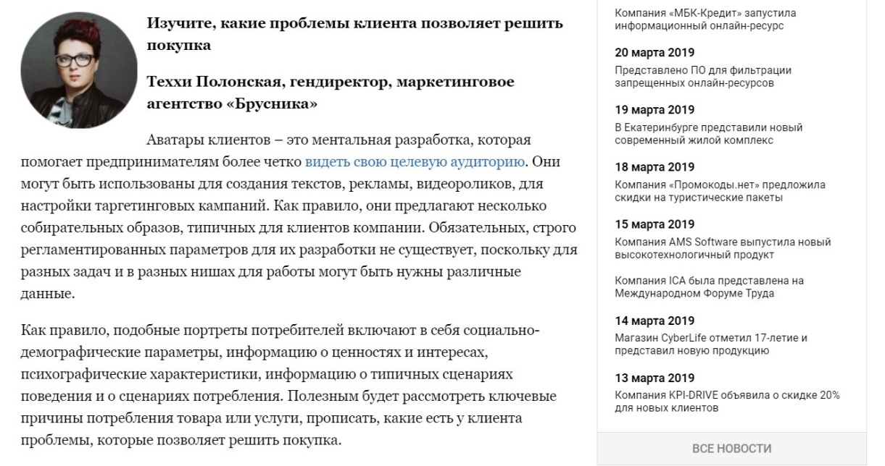
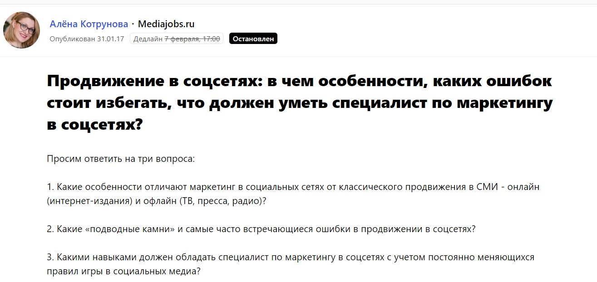
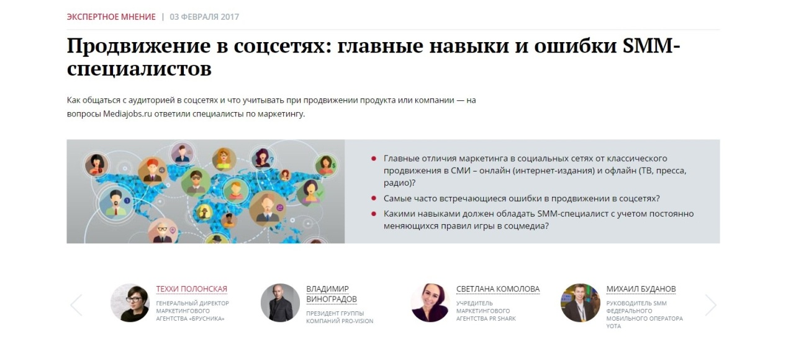
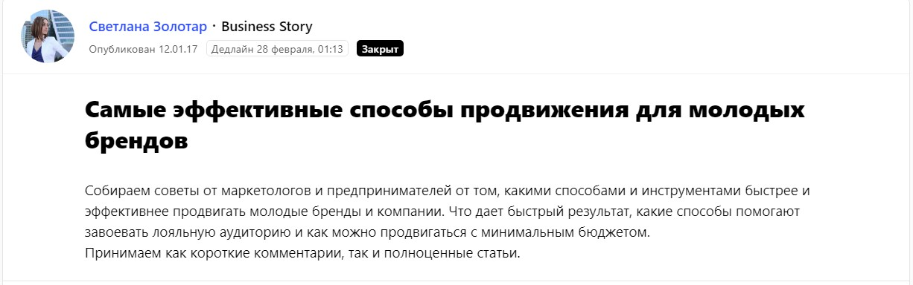
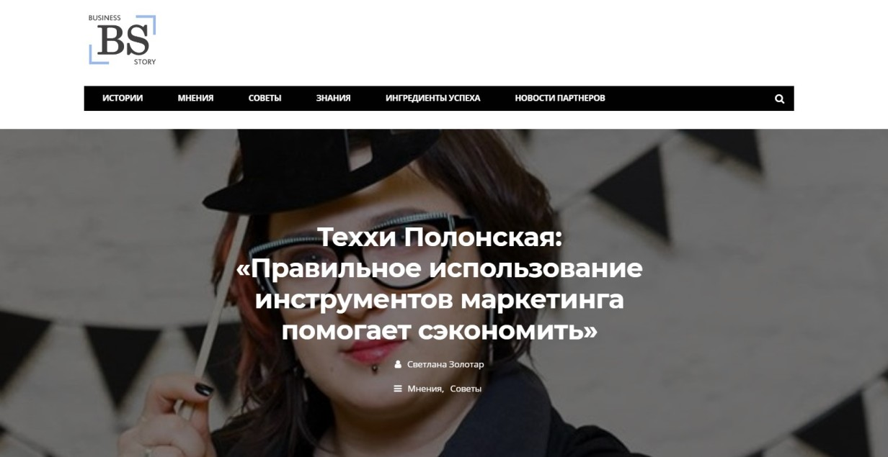
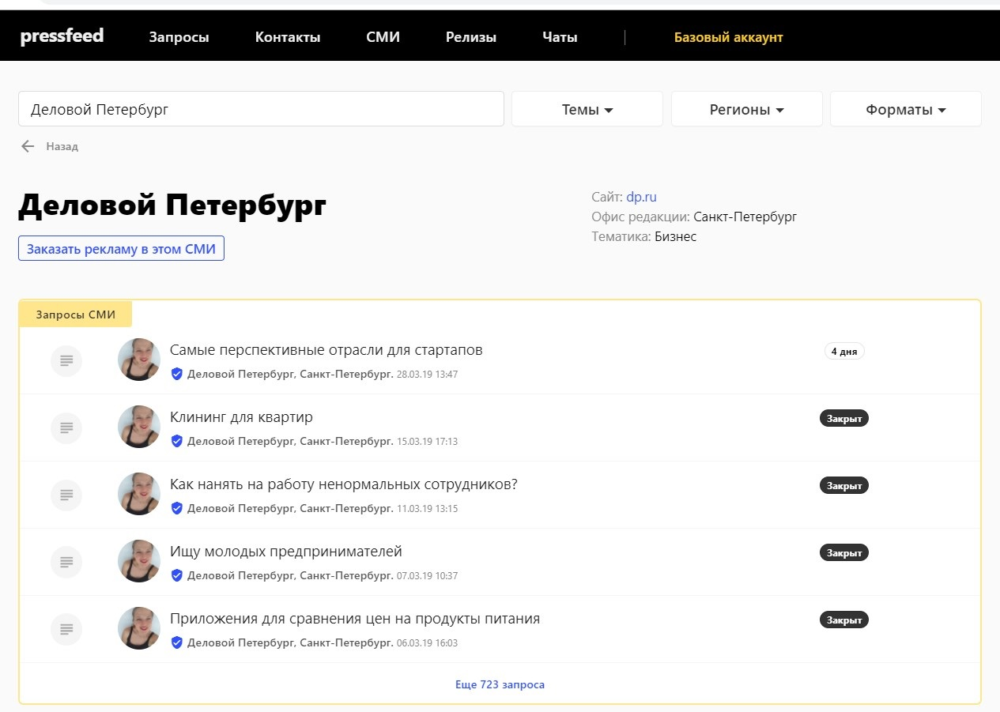
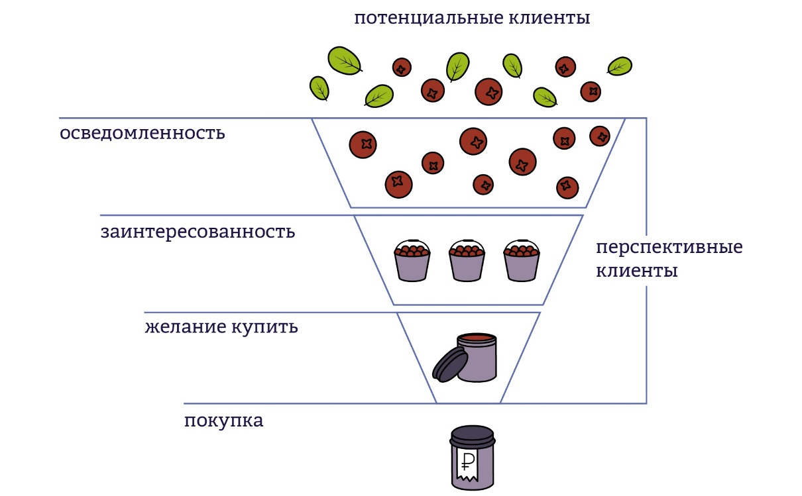

## Репутация и личный бренд руководителя ― то, что отличает нас от других агентств

Я ― директор маркетингового агентства «Брусника». Мы занимаемся разработкой стратегий, продвижением в социальных сетях, настройкой таргетинга, созданием фирменного стиля, дизайном, развитием личного бренда и другим.

Если честно, мы довольно обычные. Как по набору услуг, так и по ценам. Но существует такое понятие, как УТП ― уникальное торговое предложение. Много лет я мучилась, пытаясь ответить себе на вопрос: а в чем наше УТП? Что мы, небольшое маркетинговое агентство, делаем такого, что никто другой не догадался предложить? Мне казалось, что мы не отличались от других, а просто хорошо делали свою работу.

Однако был аспект, на который я всегда обращала внимание. Это имидж. Имидж компании и мой собственный имидж как руководителя. Еще в университете я услышала такое высказывание: «Если вы работаете в публичном поле, у вас обязательно будет имидж. Просто он может быть управляемым или неуправляемым. Если вы им не управляете сами, скорее всего, он будет работать против вас». Уже во времена активного фриланса, пока еще не открыла свое агентство, я поняла, насколько важно то, что мы говорим, как говорим, в каком ключе. Все мои публичные действия складываются в «социальные доказательства» ― то, из чего строится доверие ко мне и к моей компании.

> Я поняла, что не обязательно придумывать какие-то уникальные услуги агентства или снижать цены, чтобы привлечь клиентов. Нужно продолжать вовлеченно работать и приносить результаты, но главное ― постоянно рассказывать об этом нашей целевой аудитории. Имидж и экспертность ― лучшие «крючки» для потенциальных клиентов.

## Как «строить» личный бренд, но не тратить на это деньги

Я поставила себе задачу развивать сарафанное радио, работать с репутацией и узнаваемостью компании, задействуя максимум низкобюджетных каналов продвижения.

Основную ставку сделала на три пиар-инструмента: активную работу в социальных сетях; публикации в СМИ; выступления на конференциях и личные лекции.

Еще с тех времен, когда я работала без команды и была независимым специалистом, я начала развивать страницы в социальных сетях и выступать с различными мастер-классами. Это привлекло первое внимание, а затем появились полезные связи.

> А вот со СМИ долгое время ничего не получалось. Кажется, до 2016 года было всего два-три практически случайных экспертных интервью. Мне казалось, что со своим «бизнесом на коленке» я не представляю интереса для крупных изданий. Однако через пару лет появился Pressfeed, и оказалось, что можно без масштабных кейсов оказаться полезной журналистам.

## Публикации в СМИ: сервис Pressfeed в помощь

Нельзя недооценивать важность публикаций в СМИ. Это и охват, и очередное «социальное доказательство». Как человек, который начинал с журналистики и PR, и только потом перешел в маркетинг, я понимаю, что от публикаций в СМИ не стоит ждать бешеного отклика. Главная цель публикаций в СМИ лично для меня ― появиться еще одной ссылкой в «гугле», вторая цель ― поделиться ссылкой на публикацию в соцсетях, поддержать имидж эксперта. Статьи и кейсы важны для того, чтобы собранная «теплая» база в социальных сетях, а также новая аудитория, которая приходила на мои личные и корпоративные страницы «посмотреть на эксперта» после выступлений, понимали, чем занимается моя компания, в каком ключе работает.

Как я уже сказала, до 2016 года я практически не делала публикаций в СМИ. Не думала, что мой небольшой бизнес будет интересен хорошим изданиям. Но когда появился специальный сервис Pressfeed с журналистскими запросами, оказалось, что я могу быть экспертом в СМИ и журналисты будут брать мои комментарии. 

В 2019 году хочу сделать хотя бы 15 публикаций, то есть это по 1-2 статьи в месяц.

Что касается тематик для публикаций, то это маркетинг в целом, работа с социальными сетями, базовое how to с углублением в детали, наши кейсы, тренды, личный бренд и так далее. Словом, что умеем делать сами, о том и говорим.

**Примеры публикаций**

Если говорить о запросах журналистов, то в первое время были готовы писать материалы на любые запросы, где хотя бы что-то понимали. Но затем осознали, что есть банальные и скучные сайты, которые таким образом пытаются сэкономить на копирайтинге. И стали фильтровать. Теперь оцениваем посещаемость площадки и качество текстов, которые на ней появляются.

Например, однажды на Pressfeed мы пообщались с журналисткой издания «ПОнедельник». Она спрашивала об использовании виджетов.

[_Запрос_](https://pressfeed.ru/query/16447) _от «ПОнедельник»_

Я рассказала, какие виджеты можно встретить на сайте нашего агентства, какие использую в обычной жизни.

  
[_Публикация_](https://ponedelnikmag.com/post/vidzhety-dolzhny-rabotat) _в издании «ПОнедельник»_

После выхода статьи мы остались на связи в Facebook и спустя некоторое время договорились о большом материале, в которой поговорили о том, [как начать работу с персональным брендом](https://ponedelnikmag.com/post/seraya-mysh-na-chuzhih-labutenah).

Это распространенная практика, когда общение с журналистами из Pressfeed переходит в Whats’App или Facebook. Мессенджеры всегда перед глазами, там я отвечаю оперативнее.

Еще из примеров ― публикация в E-xecutive, касающаяся «аватаров пользователей».

[_Запрос_](https://pressfeed.ru/query/52886) _от E-xecutive_

Я объяснила, как мы создаем портреты целевой аудитории, какие механики используем. Статью прочитали около 4 тыс. человек.

  
В другой раз был «идеальный» с точки зрения моего бизнеса запрос о продвижении в социальных сетях от сайта Mediajobs.ru.

  
[_Запрос_](https://pressfeed.ru/query/27950) _от Mediajobs_

Я выступила как эксперт по SMM и поделилась опытом агентства.

  
[_Публикация_](https://mediajobs.ru/expert-opinion/prodvizhenie-v-socsetjah-glavnye-navyki-i-oshibki-smm-specialistov) _на Mediajobs_

Как-то написала полноценный материал для бизнес-сайта Business Story. Запрос вновь касался нашей темы: как продвигаться молодым брендам.

  
[_Запрос от Business Story_](https://pressfeed.ru/query/27315)

Я рассказала, как молодому бренду нужно строить стратегию продвижения и какие каналы наиболее эффективны.

  
[_Публикация на Business Story_](http://businesstory.ru/tehhi-polonskaja-pravilnoe-ispolzovanie-instrumentov-marketinga-pomogaet-sjekonomit/)

Время от времени удается сделать публикации своими силами, без участия сервиса Pressfeed. Так в 2018 году я стала одним из постоянных экспертов в «Деловом Петербурге». Это вышло практически случайно: знакомая, с которой мы сотрудничали на паре проектов, устроилась в издание на работу, дала контакты двум журналистам, а те оценили мою готовность быстро и максимально полно отвечать на их вопросы. Например, я прокомментировала [материал о детях-блогерах](https://www.dp.ru/a/2019/01/18/Deti-blogeri_za_milliard).

Впрочем, если у вас нет прямых связей с журналистами этого издания, в него довольно просто попасть через Pressfeed.

  
_Страница «Делового Петербурга» на Pressfeed_

Схема работы с новыми изданиями:

1. ищите нужное издание в базе СМИ сервиса;
2. смотрите новые актуальные запросы и отвечайте на них;
3. если запросов пока нет или тематики не ваши, то посмотрите архивные запросы, то есть более ранние. Они дадут представление, чем вообще интересуется редакция;
4. подумайте, какую тему вы можете предложить и станьте «катализатором», то есть напишите журналистам издания в чате и объясните, чем можете быть полезным для издания;
5. переговоры обязательно приведут вас к хорошему результату.

> За прошлые годы мы около 30 раз фигурировали в СМИ, что для небольшого маркетингового агентства без впечатляющих кейсов, оборотов или инноваций ― достойная цифра. Для меня важно, чтобы потенциальный клиент, который вводит мое имя или название агентства в поисковой системе, увидел наши публикации в СМИ сразу же после ссылок на официальный сайт агентства и страницы в социальных сетях.

## Что дают публикации в СМИ

Если смотреть на воронку продаж, то СМИ ― это холодное касание до новой аудитории. Затем представитель этой аудитории попадет на ваше выступление, затем прочитает пост в социальных сетях ― и в его голове сложится единая картина, кто вы и что собой представляете.

Воронка продаж ― отличная модель, которая помогает нам увидеть всю взаимосвязь любых инструментов продвижения и итоговых продаж. СМИ в ней отвечают за охват потенциальной аудитории, перевод ее в категорию тех, кто осведомлен о том, что вы существуете. или даже в тех, кто заинтересовался и пошел изучать информацию в ваши собственные каналы.

  
_Воронка продаж_

Я не жду мгновенной реакции и запросов после публикаций. Понимаю, что они если и будут, то единичные. Публикации играют большую роль в рамках работы над имиджем и узнаваемостью. Потенциальные клиенты могут даже не читать и не смотреть интервью с вами. Достаточного самого факта, что вы являетесь «постоянным экспертом в Деловом Петербурге».

## Итоги: как мы выросли за последний год

На текущий момент мы работаем исключительно на входящем потоке заявок и не закладываем бюджет на рекламное продвижение. Все наши клиенты пришли к нам благодаря публичной активности агентства. Публикации в СМИ, выступления, социальные сети ― каждый инструмент делает вклад в нашу узнаваемость и экспертность.

> Главным показателем нашего роста можно считать то, что в 2017 году средний чек на основные услуги был в районе 30-90 тысяч рублей, а теперь он варьируется в пределах 100-400 тысяч. Кстати, это и есть еще один большой плюс долгой и упорной работы над репутацией ― можно спокойно повышать цену на свои услуги и не думать, что клиенты уйдут от вас.

Что касается экономических показателей, то тут они близки к прошлому году. Есть ощущение, что сейчас очередной виток кризиса, поэтому, чтобы оставаться на месте ― приходится быстро бежать.
