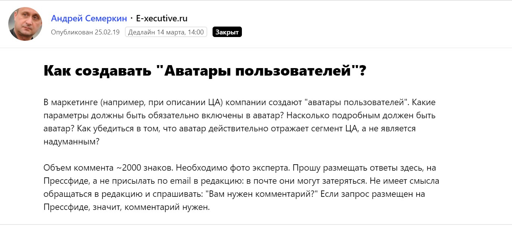
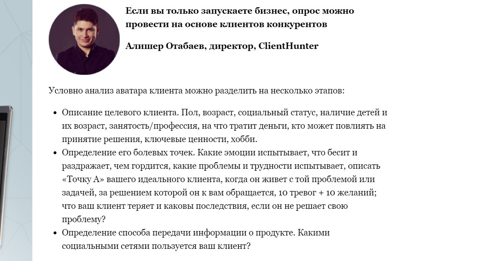
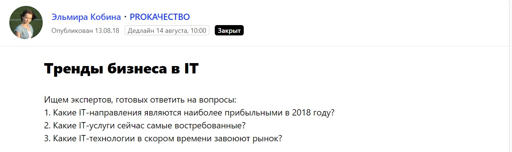
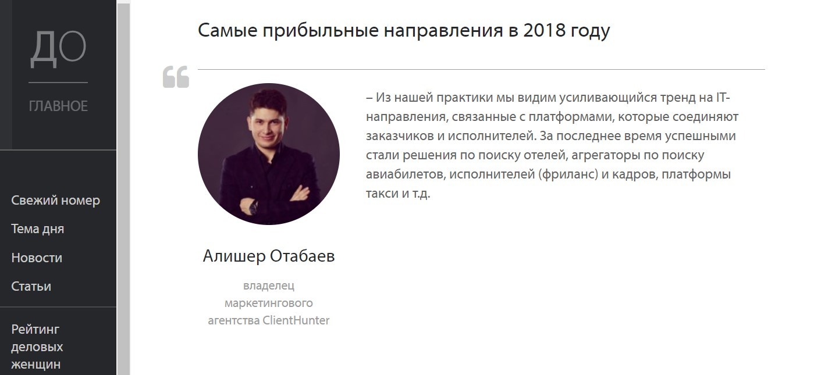
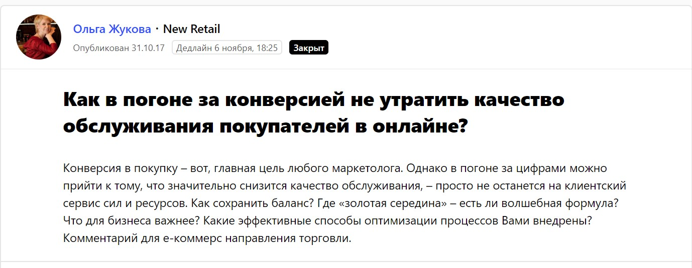
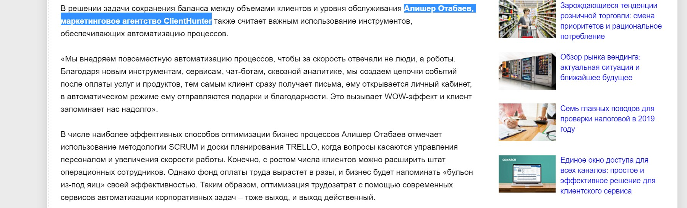
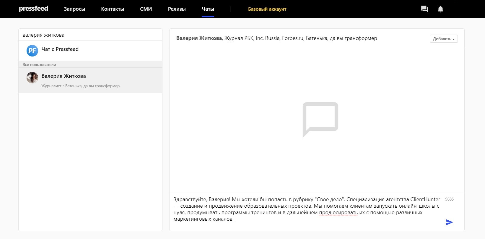
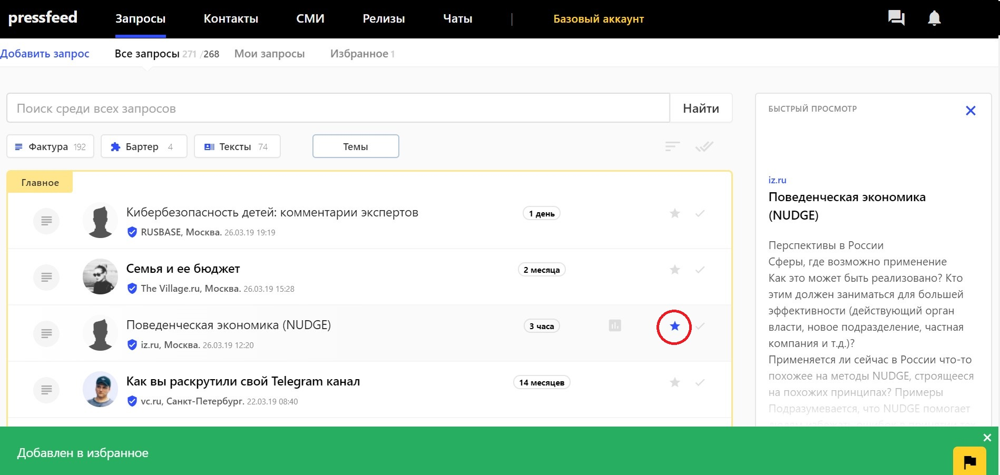

Специализация агентства [ClientHunter](https://clienthunter.pro/) — создание и продвижение образовательных проектов. Мы помогаем клиентам запускать онлайн-школы с нуля, продумывать программы тренингов и в дальнейшем продюсировать их с помощью различных маркетинговых каналов.

Всех клиентов агентства можно условно разделить на **три категории**.

1\. Инвесторы, которые хотят открыть онлайн-школу или тренинговый центр, потому что считают это перспективным и прибыльным направлением бизнеса.

2\. Непосредственно эксперты — психологи, дизайнеры, ИТ-специалисты, которые готовы обучать своему ремеслу других, но не знают, как стартовать и продвигаться.

3\. Крупный бизнес — компании, которые уже хорошо зарабатывают и решают запустить курсы или тренинги под эгидой бренда с целью пиара и маркетинга. Представители таких компаний понимают, что тренинги не станут основной статьей дохода, но будут работать на репутацию бренда.

## Почему мы решили, что контент-маркетинг — это важно

Моим первым бизнесом была веб-студия, именно тогда я изучил максимум маркетинговых инструментов. Понял, как действует SEO и зачем нужна оптимизация сайтов, как работают социальные сети, тогда же я начал погружаться в тему контент-маркетинга, четко осознал для себя, что такое репутация компании и как ей управлять.

Так вот, контент-маркетинг напрямую влияет на две сущности, которые играют большую роль в продвижении и развитии бизнеса (особенно, если речь идет о маркетинговом агентстве).

**Во-первых**, полезные публикации с участием компании значительно повышают позиции сайта компании в поисковой выдаче и способствуют быстрому попаданию в ТОП.

**Во-вторых**, публикации в СМИ формируют доверие к бренду со стороны пользователя и создают репутацию. Репутация не только обеспечивает лояльное отношение к бренду и тем самым привлекает новых клиентов. Чем больше компания выигрывает у конкурентов, тем проще ей повышать ценник на свои услуги. Когда бренд имеет узнаваемое имя, у заказчика не возникает вопросов: «За что я плачу вам», «Почему это столько стоит». С момента появления ClientHunter мы повысили средний чек на наши услуги практически в 10 раз. Я считаю, что это во многом заслуга именно контент-маркетинга и грамотного пиара в СМИ.

> Как только пришло понимание, что контент-маркетинг работает, и с его помощью мы сможем стать круче и зарабатывать больше, сразу начали вкладывать силы и время в этот инструмент и писать полезные тексты от лица компании. Деньги тут не так важны, поверьте. Большинство публикаций мы делаем бесплатно. Требуемые ресурсы — время и силы.

Сейчас с участием ClientHunter выходит 1-2 публикации в месяц. Больше не получается, так как у нас нет выделенного PR-отдела, но при текущих темпах роста компании нам достаточно и этого.

Но сначала я расскажу, как мы окончательно пришли к этому пониманию.

#### **Как контент-маркетинг влияет на SEO**

Первое время после запуска бизнеса мы вкладывали деньги в контекстную рекламу, но быстро поняли, что покупка лидов обходится слишком дорого. Стоимость лида для нашего рынка составляет 2000-2500 рублей. Тогда мы взялись за оптимизацию сайта и настроили правильное описание каждой страницы. Вскоре стали получать в среднем по 50 лидов в месяц по нашему основному запросу «создание онлайн-школы под ключ» уже по более низкой цене.

Однако как работает современное SEO: ключевых запросов для вывода сайта в топ-позиции в поисковиках недостаточно. Нужна большая база ссылок на сайт и хорошие поведенческие характеристики пользователей, чтобы показатель отказов был близок к нулю. Покупка пустых ссылок на сайт давно не работает, так как система следит за каждым шагом пользователя. Чтобы позиции в выдаче росли, необходимо постоянно генерировать материалы с качественными ссылками на сайт.

> С тех пор как мы стали инициировать первые публикации с участием ClientHunter и ссылками на сайт, мы стали гораздо быстрее подниматься в поиске и чаще входить в ТОП.

#### **Как публикации в СМИ влияют на доверие клиентов: наши исследования**

Появление компании в СМИ сразу же обеспечивает ей «плюс в карму». Это факт. Не верьте тому, кто говорит, что PR не работает. То, что для крупных клиентов действительно важно, как часто и в каких изданиях или телеканалах «засветится» компания, подтверждает исследование, проведенное мной в ClientHunter в прошлом году.

Мы выяснили, как клиенты из премиум-сегмента реагируют на коммерческую информацию на сайте. Что они читают на сайте компании в первую очередь, какие сведения о компании подталкивают их к положительному решению в пользу агентства.

В опросе приняли участие 43 человека — владельцы бизнеса с доходом от 1 млн рублей в месяц. Все единогласно сказали, что при покупке услуги или продукта стоимостью от 100 000 рублей необходимо оценить все страницы сайта: контакты, юридические данные, информацию о владельцах бизнеса, подробное описание услуг, философию компании, отзывы и кейсы, публикации в СМИ.

> Короткие сайты-визитки в премиум сегменте не работают. Потенциальные клиенты изучают все материалы, которые есть на сайте, в том числе публикации в разделе «СМИ о нас» (это раздел может иметь разные названия). Необязательно, что они прочитают все тексты, которые вышли в СМИ с вашим участием. Но они определенно посмотрят на названия изданий и на тематики, о которых представители компании говорят в СМИ.

  
Клиенты, которые готовы платить за маркетинг большие деньги, хотят заранее узнать о компании, быть уверенными в ее компетенциях и приходить на встречу уже подготовленными, «теплыми».

Публикации в крупных СМИ — это один из показателей, что компании можно доверять. Поэтому обязательно размещать все ссылки на вышедшие публикации на официальном сайте.

## Как делать публикации в СМИ бесплатно

Все публикации делаем бесплатно, в 90% случаях договариваться и взаимодействовать с журналистами нам помогает сервис [Pressfeed](https://pressfeed.ru/).

Это специальная платформа, на которой сотрудники онлайн и печатных СМИ, продюсеры телеканалов оставляют запросы на поиск экспертов для публикаций или эфиров. Компании нужно лишь выбрать запрос и ответить на него четко и по делу в установленные сроки. Лучше не затягивать с ответами, так как журналист возьмет только несколько первых лучших комментариев.

Мы отбираем запросы, которые касаются бизнеса, маркетинга и образования. В первый год работы с сервисом отвечали на все подряд, но затем стали фильтровать запросы.

Сейчас в приоритете следующие запросы:

1. когда журналист ищет эксперта для полноценного материала от лица компании, а не для краткого комментария;
2. если тема подходит, оцениваем охваты издания с помощью similarweb, не откликаемся на запросы совсем маленьких изданий (должно быть не менее 10 тыс. уников в месяц);
3. отлично, если журналист сразу говорит, что сможет поставить ссылку на наш сайт.

> В некоторые СМИ мы стремимся попасть при любом раскладе, даже если тема не совсем близка ClientHunter, но нам есть что сказать. Это «Первый канал», РБК, Forbes и так далее. Словом, площадки, которые знают все. Ведь как я уже сказал, клиента может зацепить даже не текст с вашим участием, а сам факт, что вы появляетесь в таком СМИ, логотип известного бренда на вашем сайте.

Из последних примеров публикаций — участие в материале бизнес-издания E-xecutive.ru. Вопрос был посвящен созданию «аватаров пользователей».

  
[_Запрос_](https://pressfeed.ru/query/52886) _от E-xecutive.ru_

Я рассказал о нашем подходе к созданию портрета целевой аудитории и показал свой вариант опросника.

  
[_Фрагмент публикации_](https://www.e-xecutive.ru/management/marketing/1990229-kak-sozdavat-avatary-polzovatelei) _в E-xecutive.ru_

Как-то я участвовал в публикации издания «Деловое обозрение» — это журнал для бизнеса и о бизнесе. Я поделился мнением, какие направления в ИТ-отрасли считаются трендовыми и прибыльными.

  
[_Запрос_](https://pressfeed.ru/query/46414) _от журналиста_

  
[_Комментарий_](http://uldelo.ru/user/node/view?id=9859) _для издания «Деловое обозрение»_

В другой раз прокомментировал тему для отраслевого издания New Retail. Журналист спрашивал, как увеличивать конверсию из потенциальных клиентов в покупателей, но при этом не ухудшать качество обслуживания.

  
[_Запрос_](https://pressfeed.ru/query/36843) _от New Retail_

Я высказал свою точку зрения.

[_Фрагмент публикации_](https://new-retail.ru/business/e_commerce/otritsatelnaya_energiya_kogda_konversiya_ne_v_radost9261/) _с участием Алишера Отабаева_

Также через Pressfeed я давал несколько небольших интервью для телевидения — участвовал в эфирах на «Первом канале» и [«ТВ Центр»](https://www.youtube.com/watch?v=H8HV0Ri0DQE).

На Pressfeed мне нравится то, что общаться с журналистом можно прямо внутри сервиса. В чате можно задать любые уточняющие вопросы, прикрепить иллюстрации, дослать информацию о спикере. Если хотите познакомиться с новым журналистом, то найдите его на платформе и предложите собственную тему для публикации.

  
_Можно познакомиться с журналистом «РБК»_

Еще удобно, что запрос можно отметить (нажать на «звездочку» рядом с запросом и добавить в Избранное) и оставить на потом, если нет возможности ответить быстро, но и чтобы точно не забыть про этот запрос.

  
_Функция добавления запроса в Избранное_

Всего за 2018 год мы выпустили около 15 публикаций. Чтобы каждый материал получил наибольший охват, обязательно делитесь им во всех социальных сетях — как в личных, так и на официальных страницах бренда. И, конечно, дублируйте ссылку на сайт компании.

## Контент-маркетинг и рост бизнеса: как это связано

Считаю, что в b2b-сегменте публикации не приводят к прямым продажам. Чтобы клиент подписал договор на услугу, должно сложиться много факторов. Для маркетингового агентства публикации в СМИ — это работа на доверие и удержание клиентов, а также косвенный аргумент для повышения цен на услуги компании.

> Мы занимаемся контент-маркетингом примерно 2 года, и этот инструмент позволил нам полностью отказаться от рекламных бюджетов. За последний год количество премиум-клиентов увеличилось в 2 раза, а средний чек вырос в 10 раз, сейчас средняя сумма сделки — от 500 тыс. рублей. Общая прибыль компании ClientHunter в 2018 году стала в 2 раза больше по сравнению с 2017 годом.

Мы смогли создать положительную репутацию на рынке и стабильно получаем больше 40 «горячих» контактов (не путать с холодными лидами) в месяц на топовые услуги с ценой от 300 тыс. рублей. Если бы мы отказались от контент-маркетинга и снова запустили рекламу, такие результаты стоили бы нам 120-150 тыс. рублей в месяц в виде рекламного бюджета + 50 тыс. за работу по настройке и ведению рекламной кампании.

> Только за последний год мы сэкономили на рекламе более 2 млн. рублей.

Конечно, создание публикаций тоже требует некоторых денежных вложений и большого количества времени, но я считаю, что контент работает эффективнее, чем любая прямая реклама. По крайней мере, в случае с маркетинговым агентством.
