Меня зовут Александр Альхов. В 2016 году я запустил проект [CourseBurg ](https://courseburg.ru/)— это сервис по подбору образовательных курсов. На платформе можно найти более 800 курсов по 70 направлениям, наша главная цель — помочь ученику и хорошему преподавателю, который не умеет продавать свои услуги, либо которому не хватает времени на продвижение, найти друг друга. Пока на Courseburg собраны курсы, проходящие в Санкт-Петербурге и Москве, но недавно мы запустились в Нижнем Новгороде. Постепенно планируем расширять сеть городов.

Сервис работает по концепции маркетплейса: мы получаем комиссию 30% от стоимости курсов только после того, как ученик запишется на занятия через платформу.

## Как продвигаем проект

Целевую аудиторию, на которую направлено продвижение платформы, мы делим на две группы. Первая — ученики, которые выбирают курсы, чаще всего это женщины 24-32 лет, у которых уже есть высшее образование, но которые захотели сменить профессию, заняться чем-то творческим или более прикладным. Вторая — это партнеры, то есть преподаватели, организаторы курсов. Соответственно, все наши маркетинговые и рекламные активности должны охватывать эти две группы.

Основной источник трафика для любых маркетплейсов — это поисковые системы. Courseburg — не исключение, и поисковики приводят нам 80% посетителей. В основном, конечно, это именно ученики, которые находятся на этапе выбора курсов. Поэтому для нас крайне важно прокачивать SEO сайта. Есть специалисты, которые оптимизируют сервис, делают его «предпочтительным» для поисковых систем.

Кроме того, иногда мы запускаем рекламу в социальных сетях, но тратим на это минимальные бюджеты. Она может таргетироваться и на потенциальных учеников, и на потенциальных партнеров.

Наравне с SEO, мы вкладываемся в другое маркетинговое направление, которое, по моему мнению, играет не меньшую роль в продвижении сервиса — это контент-маркетинг. Конкретнее, мы развиваем собственный блог и пишем тексты и даем комментарии для топовых деловых и отраслевых медиа.

## Почему решили, что нужен контент-маркетинг

Представим классическую воронку продаж, где первая стадия — это Awareness, то есть осведомленность. Цель на этом этапе — проинформировать, заинтересовать покупателя своим продуктом.

Если продукт сложный, требующий и денежных, и временных затрат со стороны покупателя, то с помощью короткой рекламы в соцсетях или в поисковике, доказать потенциальному клиенту, что купить / получить услугу нужно именно в вашей компании, не получится. Чтобы повлиять на метрику Awareness и перевести как можно больше покупателей на этап Interest, нужно постоянно и подробно рассказывать о продукте, доносить до целевой аудитории его преимущества.

Поэтому мы продвигаем Courseburg через полезные тексты в СМИ и в блоге: публикации влияют на узнаваемость платформы на рынке, а также формируют доверие учеников и партнеров, подталкивают их к финальному решению стать клиентом сервиса.

## Как стартапу попасть в СМИ

Статьи в СМИ производят впечатление, в первую очередь, на потенциальных партнеров. Когда они заходят на сайт и сразу видят, что о нас писали такие крупные медиа, как Forbes и «Коммерсантъ», то это сразу повышает нашу «ценность» в их глазах. Проще говоря, это еще один аргумент в пользу компании. Некоторые материалы даже могут приводить партнеров напрямую — после прочтения статьи преподаватели обращаются к нам с готовностью сотрудничать. Впрочем, бывают такие публикации в СМИ, которые направлены на будущих учеников.

  
_Фрагмент сайта Courseburg.ru_

Как попасть в СМИ? Я имею в виду бесплатно, без покупки рекламных размещений. По нашему опыту, для любого стартапа существует одна рабочая схема:

1. подключаетесь к [сервису журналистских запросов Pressfeed](https://pressfeed.ru/) — мониторите запросы, отправляете комментарии журналистам по актуальным для компании темам, впервые попадаете в крупные СМИ; там же можно завязать знакомства с журналистами из топовых медиа, рассказать о компании;
2. также пишете статьи для небольших изданий, которые приветствуют UGC-контент (Vc.ru, Spark, Cossa, Rusbase). Можно рассказывать о запуске стартапа, о своих ошибках, об успехе и так далее;
3. начинаете «стучаться» в крупные издания (это тоже можно делать через Pressfeed), предлагаете темы для публикаций, готовите материалы по требованиям редакции (лучше всего «заходят» исследования отрасли).

Мы делаем публикации в СМИ, начиная с 2016 года, и шли мы именно по такому пути.

Свою первую статью [опубликовали на vc.ru](https://vc.ru/tribuna/16769-courseburg) — тогда на сайте была рубрика «Стартапы», где каждый начинающий предприниматель мог рассказать о своем проекте. Затем [для сайта Cossa](https://www.cossa.ru/trends/140840/) написали инструкцию, как провести анализ целевой аудитории бесплатно. Эта статья стала второй по посещаемости в тот квартал и набрала больше 50 тысяч охвата.

В то же мы время активно использовали [сервис Pressfeed](https://pressfeed.ru/). Это платформа, где журналисты и редакторы разных изданий (сайт используют более 5 тыс. редакций) ищут экспертов для будущих публикаций. Журналист выкладывает запрос по определенной теме и указывает, на какие вопросы нужно ответить спикеру до дедлайна. Дальше эксперты пишут свои ответы и высылают комментарии в редакцию. Журналист выбирает те ответы, которые кажутся ему самыми интересными и полезными, и включает мнение спикеров в свою статью. Через некоторое время выходит публикация с участием компании. Все просто, понятно и не нужно тратить время на переговоры с редакциями.

Темы запросов, на которые обычно реагируем мы, всегда связаны с образованием, выбором профессии, карьерным ростом, работой.

Чтобы не пропустить ничего стоящего, лучше сформировать подписки по ключевым словам и темам. Тогда все новые актуальные запросы будут приходить вам в специальной рассылке на почту.

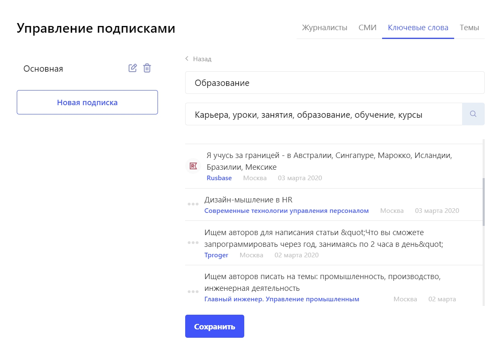  
_Пример подписки по ключевым словам_

Например, легко попали в издание Life.ru, которое готовило материал о переходе из офисных профессий в рабочие специальности.

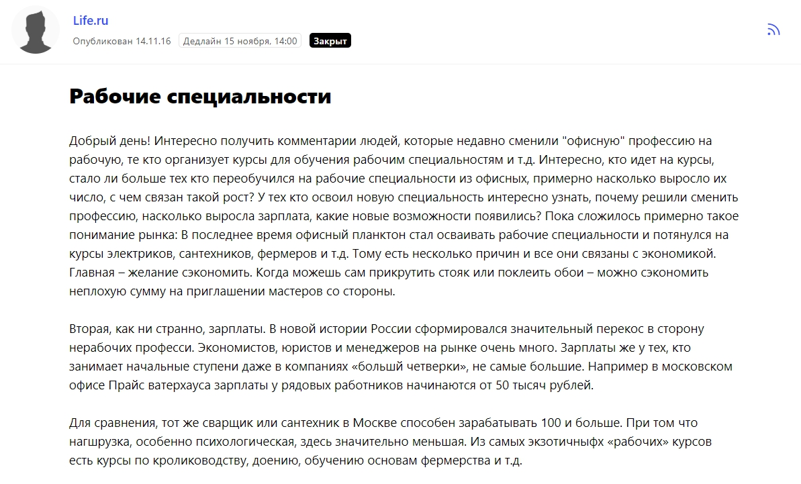

[_Запрос от Life.ru_](https://pressfeed.ru/query/25620)

Мы предоставили редакции статистику о росте спроса на курсы по прикладным направлениям — стали популярны курсы сантехников, кондитеров, электриков и так далее.

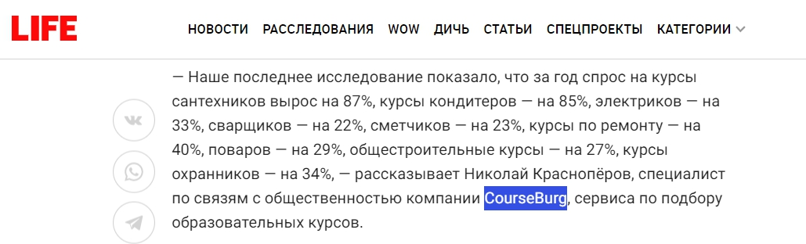  
[_Комментарий в Life.ru_](https://life.ru/p/932450)

Потом участвовали в публикации «Коммерсанта» о важности экономического образования.

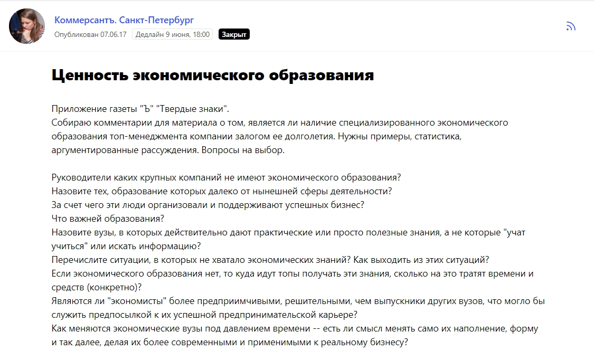[_Запрос от «Коммерсанта»_](https://pressfeed.ru/query/31903)

Приятно было то, что статья сразу начиналась с данных нашего исследования и упоминания Courseburg.ru. Позднее мы работали с журналистами уже на прямую и в итоге с нашим участием вышло 5 различных публикаций в «Коммерсанте».

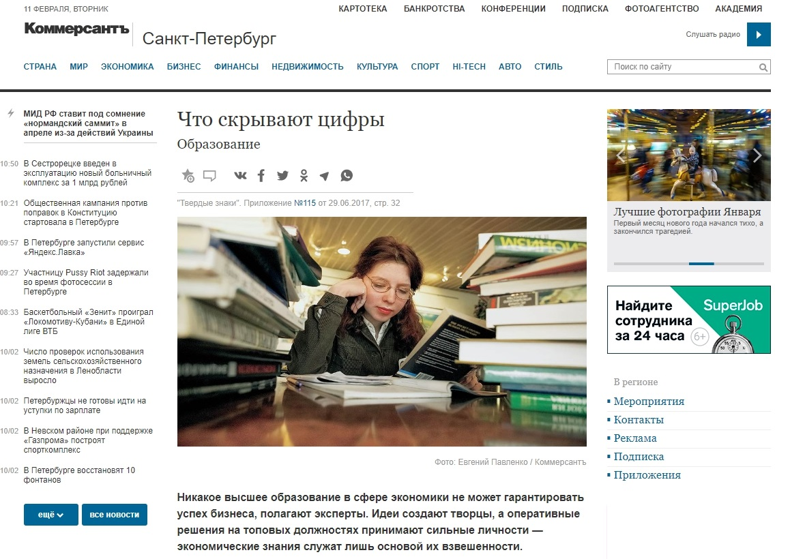  
Также на Pressfeed удобно общаться с редакциями отраслевых изданий — я давал большой комментарий для портала tproger. Эта площадка пишет о работе и жизни программистов и разработчиков. Один из запросов как раз касался курсов программирования.

  
[_Запрос от tproger_](https://pressfeed.ru/query/55250)

Я дал совет начинающим специалистам — как действовать, чтобы после прохождения курсов найти работу по новой специальности.

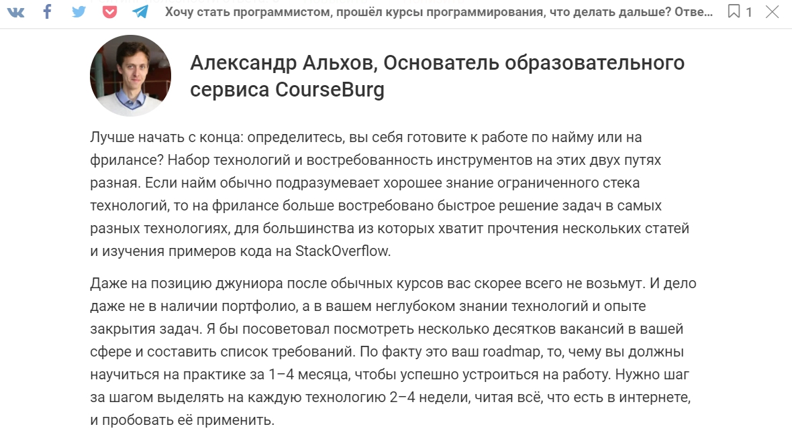  
[_Комментарий на tproger.ru_](https://tproger.ru/experts/life-after-courses/)

Через Pressfeed компания Courseburg появилась на страницах The Village, «Эксперт», «Банки сегодня», «РБК» и других изданий.

Итак, благодаря сервису Pressfeed и сайтам, которые открыто принимают UGC-контент, у нас сформировалось портфолио с публикациями в СМИ. Это важно на том этапе, когда эксперт компании хочет стать колумнистом в больших СМИ — Forbes, «Ведомости», писать для «РБК» не только комментарии, а полноценные статьи.

Когда эксперт впервые обращается к журналисту и предлагает темы для публикаций, можно сразу показать свое портфолио — для каких медиа-площадок уже писал, о чем писал, насколько полезную и интересную информацию привел в статье. Так журналист поймет, что опыт общения с редакцией у вас есть, что можно попробовать написать что-то стоящее. Кроме того, перед тем как писать письмо в новое издание или конкретному человеку, нужно изучить рубрики, формат текстов, подачу, темы. Определить, что нравится читателям этого ресурса.

Обычно небольшим отраслевым площадкам можно предлагать практически готовые тексты — редактор оценит ваш материал, скажет, что нужно поправить, и, скорее всего, после этапа правок заберет на публикацию.

С топовыми СМИ история сложнее: нужно не только изучить темы и форматы, но и найти журналиста, который обычно пишет о том, что близко вашей компании (для нас — образование, карьера), либо можно выйти на редактора определенной рубрики. Затем обговорить тему, согласовать план, накидать тезисы и только тогда приступать к написанию статьи. Как я уже сказал, больше всего большие медиа любят исследования, статистику, анализ данных.

В конце 2019 года мы провели исследование для «РБК Pro» и выпустили объемный материал о том, как жители России выбирают курсы доп. образования. Эта статья будет интересна, конечно же, организаторам курсов.

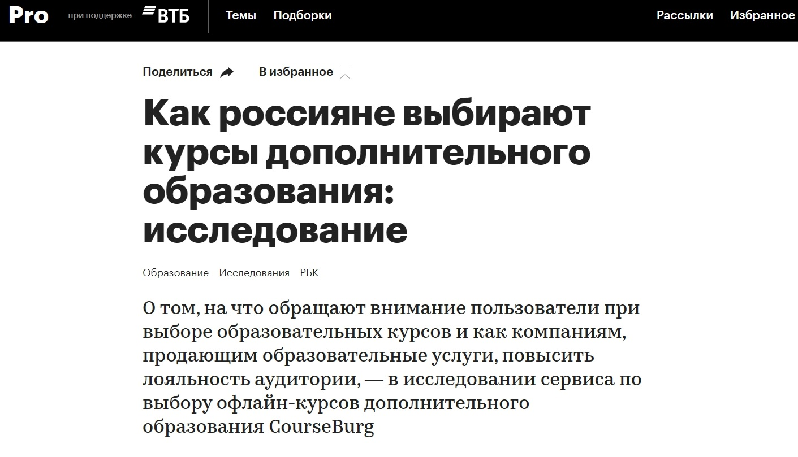  
[_Статья на «РБК Pro»_](https://pro.rbc.ru/demo/5db7f2399a7947c117b30ea7?from=center)

Часто редакторы крупных СМИ ищут колумнистов на сервисе Pressfeed и можно связаться с изданием там. Например, тот же «РБК Pro» приглашает экспертов писать статьи:

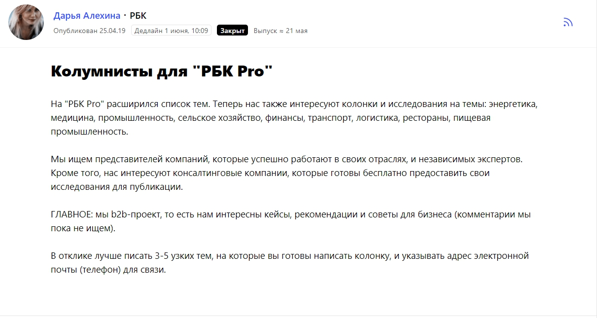  
[_Запрос от «РБК»_](https://pressfeed.ru/query/55050)

Словом, выйти на конкретного журналиста всегда можно через Pressfeed.

Как это сделать:

* заходите во вкладку [«СМИ»](https://pressfeed.ru/smi-catalog);
* вводите в поиске нужное издание, например, [«Секрет фирмы»](https://pressfeed.ru/smi/1);
* изучите всех журналистов, которые пишут для портала, посмотрите на какие темы они писали в последнее время;
* выберите 1-2 журналиста и напишите им со своими предложениями.

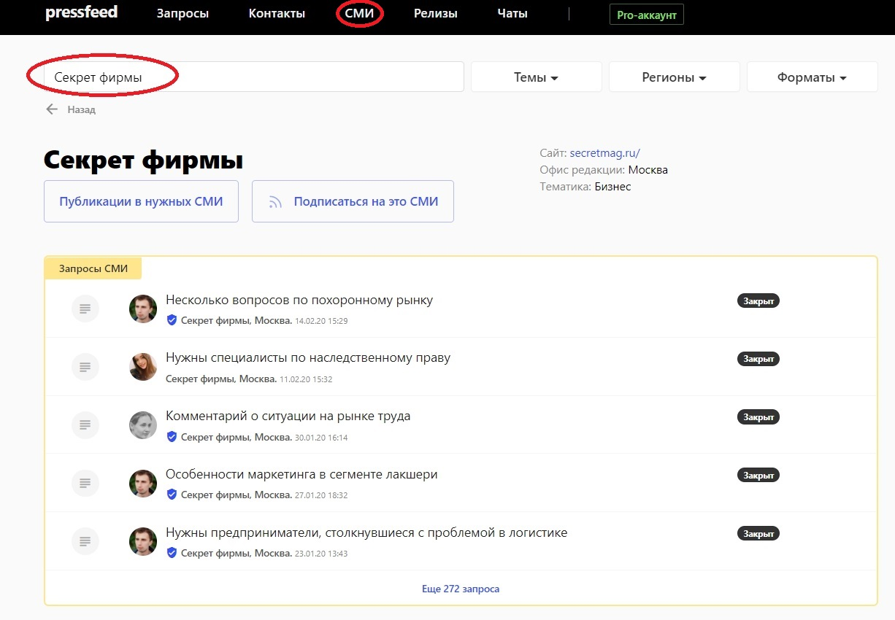

_Поиск нужного СМИ_

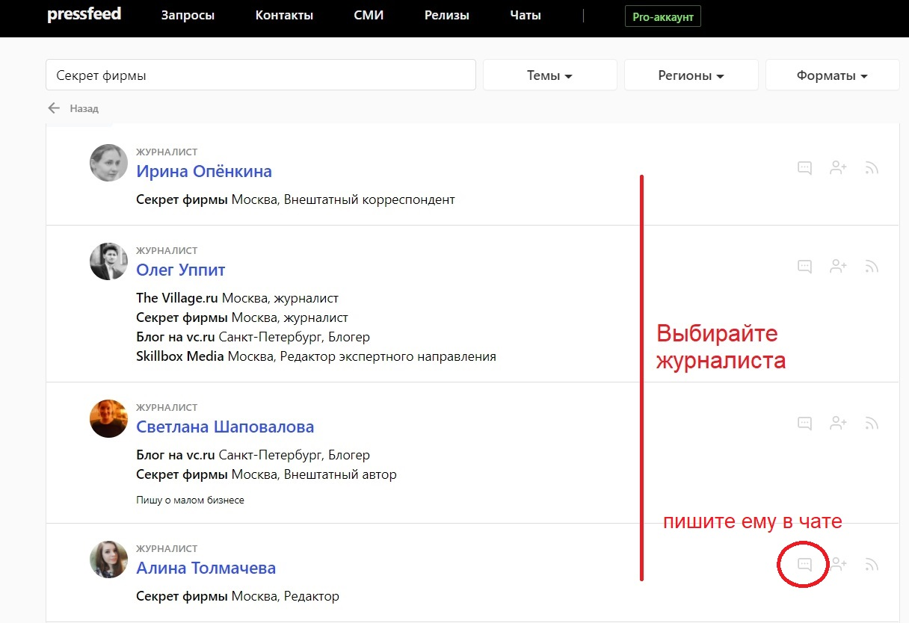

_Выбор журналиста издания_

Кто в компании занимается текстами для СМИ? Первые 2,5 года после запуска платформы я практически все делал сам — общался с редакциями, готовил материалы и комментарии. Это нормальная ситуация для стартапа — вряд ли у начинающего бизнеса есть деньги, чтобы собирать целый пиар-отдел и открывать внутреннюю редакцию. В конце 2019 года мы наняли отдельного человека — пиарщика, который теперь помогает нам развивать направление контент-маркетинга.

Получается, основные затраты на «внешний» контент-маркетинг в СМИ — это зарплата пиарщика + подписка на сервис Pressfeed (аккаунт «Эксперт» стоит около 43 тысяч рублей в год).

Всего с начала работы со СМИ вышло более 70 публикаций с участием Courseburg.

## Блог: как тексты повышают трафик на сервис

У компании Courseburg также есть собственный блог — он направлен на потенциальных учеников, в особенности тех людей, которые хотят сменить профессию, но пока не могут решить, что им делать дальше.

Основные темы — как выбрать конкретные курсы, на что обратить внимание, плюсы и минусы разных профессий (фотографа, визажиста, мастера по маникюру и тому подобное), советы начинающим, рассуждения о том, сколько может зарабатывать тот или иной специалист.

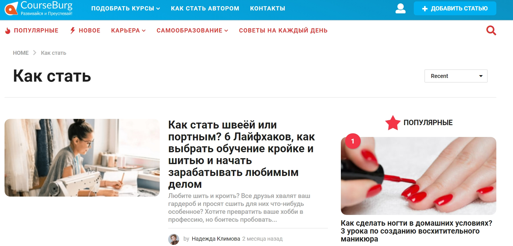Во Во многом цели блога и публикаций в СМИ схожи — влиять на Awareness, привлекать внимание к платформе. Блог работает с несформированным спросом, помогает человеку сделать выбор, а также закрывает большую часть информационных запросов. Трафик на статьи идет из поисковиков по ключевым запросам и из социальных сетей.

Блогом занимается редактор (это не тот же самый человек, что и пиарщик, это две разные должности): он договаривается с авторами о новых текстах, составляет контент-план, проверяет все материалы.

## Зачем это все: как контент-маркетинг влияет на бизнес

За те 3 года, что мы занимаемся контент-маркетингом, этот инструмент продвижения продолжает показывать свою эффективность.

По каким очевидным метрикам мы понимаем это:

* растет количество брендовых запросов по названию сервиса — за последний год их стало на 20-30% больше. Значит, нас узнают, нас запоминают. Отдельно отмечу, что брендовые запросы влияют на позиции сайта в поисковиках, потому что этот параметр очень важен для поисковых систем;
* после выхода отдельной удачной статьи трафик на сайт резко увеличивается, а трафик генерируется в продажи (но не сразу).

В начале статьи я сказал, что публикации в СМИ и в блоге повышают осведомленность аудитории о бренде и вызывают доверие к компании. Однако такие сущности, как узнаваемость, доверие, репутация, сложно выразить в конкретных цифрах. В таком случае следует смотреть на общие показатели по росту бизнеса.

Главные итоги по 2019 году:

1. мы привлекли на 40% больше партнеров, чем в 2018 году, сейчас сотрудники Courseburg ежемесячно подключают 30-50 новых партнеров, но в планах — привлекать гораздо больше;
2. выручка проекта — около 700 тысяч рублей ежемесячно, эту цифру тоже хотим умножить в несколько раз.

Рост компании — это заслуга всей команды: и отдела продаж, и редактора, и руководства. Контент-маркетинг в данном случае — значимая часть большого механизма, без которого все работало бы не так хорошо и не так быстро, как сейчас.