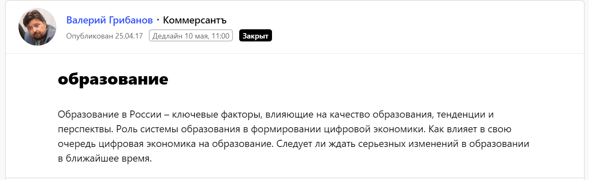
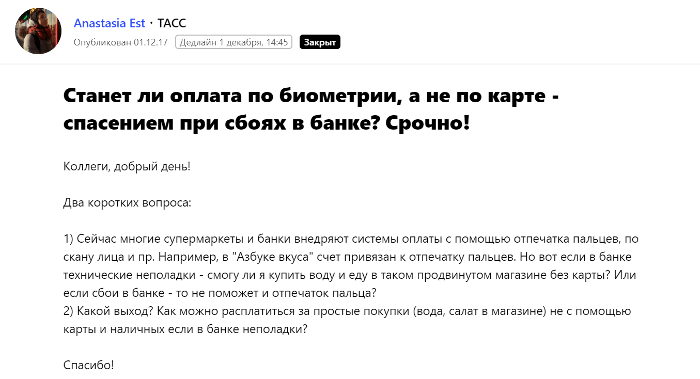
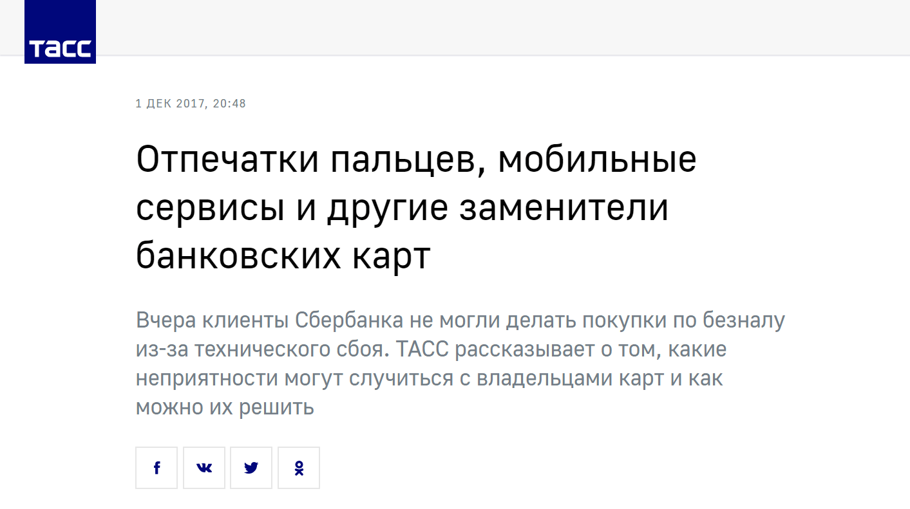
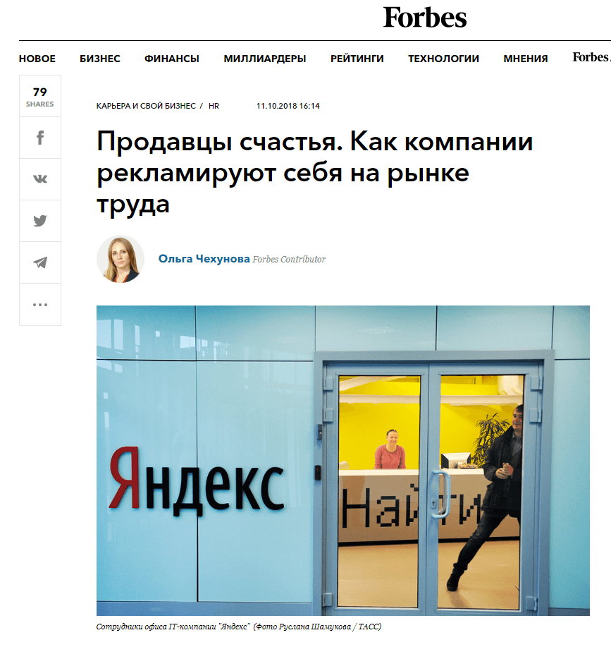
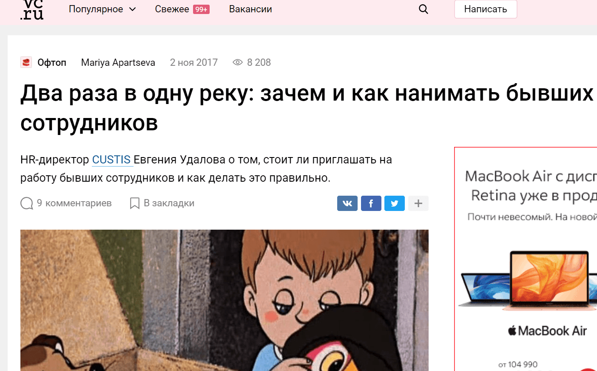
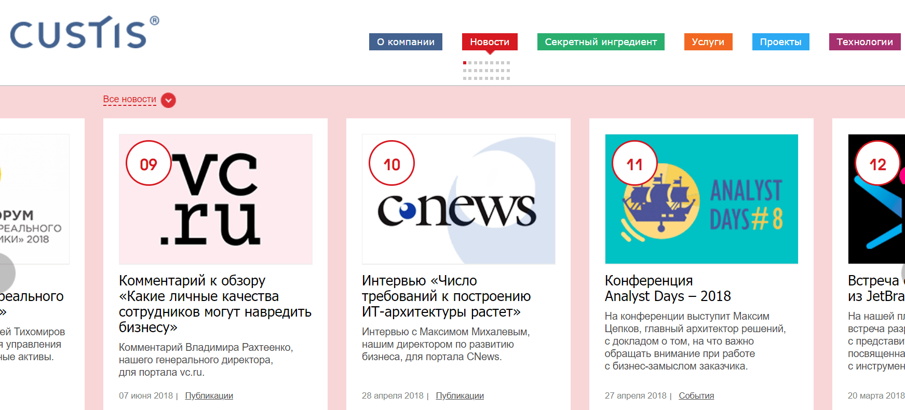

CUSTIS занимается проектированием, разработкой, внедрением и сопровождением ИТ-решений. Мы работаем с крупнейшими отраслевыми лидерами, для развития и оптимизации бизнес-процессов которых не существует готовых решений. Среди постоянных клиентов компании — Банк России, Газпромбанк, «Спортмастер», торговая сеть O'STIN. Кроме того, сейчас CUSTIS развивает продуктовое направление: мы активно работаем над крупными корпоративными решениями в казначейской, инвестиционной и образовательной сферах.

Хорошая репутация CUSTIS связана с положительными референсами клиентов, полученными в течение более чем 20 лет работы, с бизнес-ценностью наших проектов и решений, с профессионализмом наших специалистов. Однако, чтобы компания могла привлекать внимание новых партнеров и не терялась на фоне конкурентов, ей необходимо регулярно делиться рыночной экспертизой, рассказывать о своих проектах, достижениях и ценностях. Именно PR в его классическом понимании отлично решает подобные задачи. Для нас это репутационный инструмент, который не влияет на прямые продажи, но при этом формирует образ компании и делает ее узнаваемой в среде потенциальных клиентов, а также будущих сотрудников.

## Задача PR-стратегии

Основная задача PR-стратегии — выстроить принципы и долгосрочную программу внешних коммуникаций, которые будут не только формировать и поддерживать положительный образ компании на рынке, но и способствовать реализации других ее бизнес-интересов. Для разработки PR-стратегии необходимо понимать маркетинговые цели компании: с какими отраслями она работает, кто целевая аудитория, какие ключевые сообщения транслируются рынку, кто основные конкуренты. Также важно выбрать инструменты и каналы коммуникации, подготовить спикеров и составить список экспертных тем.

## Целевая аудитория CUSTIS: на кого мы работаем

Знать целевую аудиторию компании важно как для маркетинговых, так и для PR-целей. Опыт многих организаций показывает, что представления маркетологов и владельцев бизнеса о том, кого может заинтересовать продукция и деятельность компании, часто расходятся с реальностью. Так что не лишним будет вложиться, в том числе и финансово, в изучение своей ЦА до начала PR-кампании.

Для CUSTIS приоритетными являются две целевые аудитории.

* Потенциальные клиенты компании

Это крупные государственные и частные организации, работающие в сферах ритейла, финансов, образования и других направлениях.С этой аудиторией мы делимся успешными кейсами, рассказываем ей о своих проектах, продуктах и отраслевой экспертизе, инновационных технологиях, методологиях и подходах к разработке.

* ИТ-специалисты

Человеческий капитал — главная ценность нашей компании. В ИТ-сфере идет жесткая борьба за кадры, а мы заинтересованы в лучших профессионалах. Поэтому работа с HR-брендом — важная часть PR-стратегии. Для потенциальных сотрудников мы готовим экспертные материалы на ИТ-тематику, рассказываем о жизни коллег и атмосфере в офисе, о наших ценностях и принципах работы.

## Какие PR-инструменты мы используем

Основные PR-инструменты CUSTIS — публикации в ИТ-, бизнес- и общественно-политических СМИ, а также выступления на профильных конференциях. Не для всех компаний выступления являются важным каналом коммуникации, но в ИТ-индустрии регулярное личное общение экспертов с профессиональным сообществом — обязательное условие для выстраивания хорошей репутации компании.

Если говорить о работе со СМИ, прежде всего, нужно выяснить, где именно «обитает» ваша целевая аудитория. Руководитель корпорации вряд ли интересуется журналом Cosmopolitan — скорее всего, он читает «Ведомости» и РБК. Конечно, этот пример очень утрирован, подобрать каналы коммуникации — непростая задача. Медиакиты изданий решают ее только частично. В случае CUSTIS нас интересуют деловые и общественно-политические СМИ: РБК, «Коммерсант», «Ведомости», Forbes. Также мы работаем с площадками, посвященными ИТ-тематике: порталами «Хабр», CNews, TAdviser, vc.ru и др.

## Как выбрать спикеров в компании и составить список тематик для экспертных текстов и комментариев

При подборе экспертных тем для СМИ важно сразу определиться, есть ли по каждой из них потенциальный спикер. К примеру, компании интересно развивать тему информационной безопасности, но эксперты не готовы к публичной активности. В ИТ-сфере не стоит рассчитывать только на силы PR-специалиста: материалы будут выглядеть посредственно и непрофессионально. Если нет спикера, тему лучше отложить или работать в кооперации с внешними экспертами.

Список, как правило, состоит из профильных (для нас это тенденции развития в ИТ-индустрии, ИТ в различных отраслях, особенности заказной и продуктовой разработки, методологии проектирования ПО и т. д.), бизнес- (стратегия, миссия и цели бизнеса, управление, консалтинг) и HR-брендинговых тем (корпоративная культура, лидерство, работа с персоналом).

Кроме самих тем, которые журналист может взять на заметку, а может и потерять в потоке спама, во время общения с редакциейя часто прикладываю к письму 5–10 уже сформулированных заголовков для статей или авторских колонок. Если издание заинтересовано в подобном материале, можно сразу приступать к подготовке.

## Как начать сотрудничать с нужными СМИ: два проверенных способа

**Сервис Pressfeed**

С появлением Pressfeed, где журналисты самостоятельно публикуют запросы на комментарии, колонки и интервью экспертов, у нас появилась дополнительная возможность для оперативной коммуникации со СМИ. Для CUSTIS сервис удобен при подготовке экспертных комментариев, особенно для деловых и общественно-политических СМИ. С профильными ИТ-изданиями чаще общаемся лично, интервью и колонки также предпочитаем обсуждать с журналистами в частном порядке.

Чтобы начать работу с сервисом, создайте аккаунт компании или PR-специалиста и ищите запросы, которые интересны вам по тематике. Если нужно посмотреть все запросы определенного издания, зайдите в базу СМИ и выберите конкретную площадку. Чтобы ответить на запрос, необходимо написать развернутый ответ по теме и отправить его до дедлайна, который устанавливает журналист.

Один из самых интересных для нас запросов на тему цифровых изменений в системе образования поступил от издания «Коммерсант».

  
[_Запрос от газеты «Коммерсант»_](https://pressfeed.ru/query/30567)

Комментарий для материала [«В погоне за технологиями»](https://www.kommersant.ru/doc/3311070?query=custis) дал Павел Музыка, ведущий бизнес-аналитик CUSTIS. Он рассказал о том, каким должно быть высшее образование в современном мире.

[_Статья в газете«Коммерсант»_](https://www.kommersant.ru/doc/3311070?query=custis)

Также через Pressfeed мы сотрудничали с информационным агентством «ТАСС». Бизнес-аналитик CUSTIS Дмитрий Морозов поделился мнением о том, скоро ли в магазинах можно будет расплачиваться с помощью биометрических данных.

  
  
[_Запрос от ТАСС_](https://pressfeed.ru/query/38067)

Это был срочный запрос с дедлайном через несколько часов. В такой ситуации важна оперативность.

  
[_Публикация с участием CUSTIS на портале ТАСС_](https://tass.ru/ekonomika/4776861)

Для статьи [«Ума вагон»](https://rg.ru/2018/06/06/cifrovye-tehnologii-uluchshat-rabotu-zheleznodorozhnogo-transporta.html) в «Российской газете» руководитель проектов CUSTIS Ольга Цыганова дала комментарий об ИТ-решениях в железнодорожной отрасли.

  
[_Запрос от «Российской газеты»_](https://pressfeed.ru/query/43497)

При подготовке этого материала журналист предложил общаться по почте. Это удобно: в таком случае можно получить прямой контакт сотрудника редакции.

На Pressfeed выкладывают десятки запросов в день, и важно отбирать из них действительно релевантные. Не стоит тратить время спикеров и PR-специалиста на не подходящие по тематике или охвату издания — лучше подождать «своего» запроса и опубликовать материал в крупном СМИ с большой аудиторией. Мы отвечаем на два-три запроса в месяц, в итоге Pressfeed помогает нам выпускать примерно 25% всех материалов с участием CUSTIS.

  
**Личное общение с журналистами**

Лучше всего использовать для связи редакционные электронные почты. У журналистов часто есть аккаунт в Facebook, но, если вы решите кому-то написать, лучше сразу уточнить, удобен ли человеку такой вид коммуникации. Многие разграничивают общение на работе и в социальных сетях.

Запросы на комментарии приходят регулярно, а вот темы колонок необходимо согласовывать отдельно. Не стоит ждать, что журналист сам предложит вам тему: скорее всего, у него очередь из желающих. Придумывайте темы самостоятельно, будущие колонки и интервью должны быть актуальными, экспертными и без воды, а также подходить изданию по профилю. После согласования темы мы обсуждаем подачу, план материала, главные тезисы. Далее пишем текст, редактор вносит правки, статью ставят в план и публикуют.

Из наших последних материалов я могу выделить [колонку Ольги Чехуновой](http://www.forbes.ru/karera-i-svoy-biznes/367803-prodavcy-schastya-kak-kompanii-reklamiruyut-sebya-na-rynke-truda), руководителя дирекции корпоративных коммуникаций, в журнале Forbes. Сегодня многие работодатели хотят привлечь уникальных сотрудников, но при этом продолжают публиковать однотипные вакансии. Ольга рассказывает о том, на какие ценности ориентируются сотрудники при выборе компании и что такое маркетинг персонала.

  
[_Колонка в журнале Forbes_](http://www.forbes.ru/karera-i-svoy-biznes/367803-prodavcy-schastya-kak-kompanii-reklamiruyut-sebya-na-rynke-truda)

Евгения Удалова, HR-директор CUSTIS, в своей [колонке для vc.ru](https://vc.ru/flood/28386-dva-raza-v-odnu-reku-zachem-i-kak-nanimat-byvshih-sotrudnikov) рассказывает о том, стоит ли приглашать на работу бывших сотрудников, как делать это правильно и зачем создавать alumni-клуб.

  
[_Статья на портале vc.ru_](https://vc.ru/flood/28386-dva-raza-v-odnu-reku-zachem-i-kak-nanimat-byvshih-sotrudnikov)

Не важно, как вы общаетесь с журналистами: лично или через Pressfeed. В моем понимании, поиск и подготовка качественного контента для СМИ — совместная работа журналистов и пиарщиков, но при этом заинтересованность вторых в выходе материалов с упоминанием конкретной компании или ее спикеров намного выше. Поэтому важно помнить основные правила взаимодействия со СМИ.

* Будьте адекватны: не пытаетесь предлагать редакции инфоповоды и темы, не соответствующие позиционированию издания, не путайте рекламные и PR-материалы, не истязайте журналистов пресс-релизами и фоллоу-апами.
* Проявляйте вежливость и понимание: у журналиста еще много материалов от других компаний.
* Помните, что сам факт подготовки материала не гарантирует его публикации. Если комментарий не вышел, значит, он недостаточно проработан или были более интересные спикеры.
* Не бойтесь работать с журналистом даже после неудач.
* Кроме общей информации о компании, предлагайте конкретные темы для колонок и интервью.
* Соблюдайте дедлайны.
* Всегда будьте на связи.

## Как публикации в СМИ влияют на решения крупных клиентов

Для нас важно, чтобы экспертиза CUSTIS была представлена в целевых для нас отраслях: ритейл, инвестиции, финансы и банки, образование, госсектор. Это формирует репутацию и имидж компании как эксперта на рынке ИТ. Если клиент заинтересован в ИТ-продукте, в процессе поиска подрядчика он сможет заочно ознакомиться на профильных мероприятиях или в СМИ с подходами и принципами нашей работы, кейсами CUSTIS.

Ссылки на самые значимые материалы выкладываются на официальном сайте компании. Это еще одна точка контакта с потенциальным клиентом: он может увидеть названия популярных СМИ, с которыми мы сотрудничаем, изучить все статьи и убедиться в экспертности компании.

  

После выхода каждого материала мы анализируем вовлеченность читателей: смотрим комментарии, лайки, репосты. Это помогает понять, какие темы интересны аудитории, а какие «не заходят».

На деловых встречах потенциальные клиенты компании часто упоминают, что интересовались информацией в СМИ и изучали уже реализованные проекты CUSTIS. К примеру, после одного из пресс-релизов на логистическую тематику к нам обратились крупные ритейлеры, а техническая статья о системе разграничения прав доступа заинтересовала специалистов нефтедобывающего холдинга.

  
PR — это игра в долгую. Репутация компании создается годами, а разрушить ее может один неуспешный кейс. Конкретно в b2b-сегменте работа пиарщика будет эффективной, если компания максимально точно транслирует ключевые сообщения и делает это на правильных площадках, заточенных под нужную целевую аудиторию.