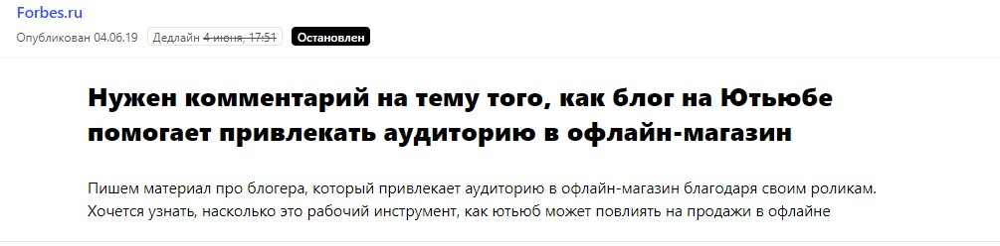
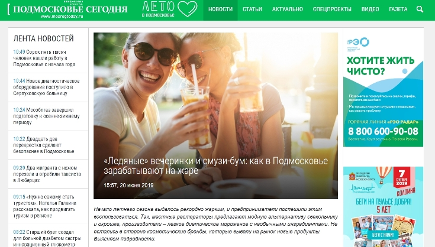
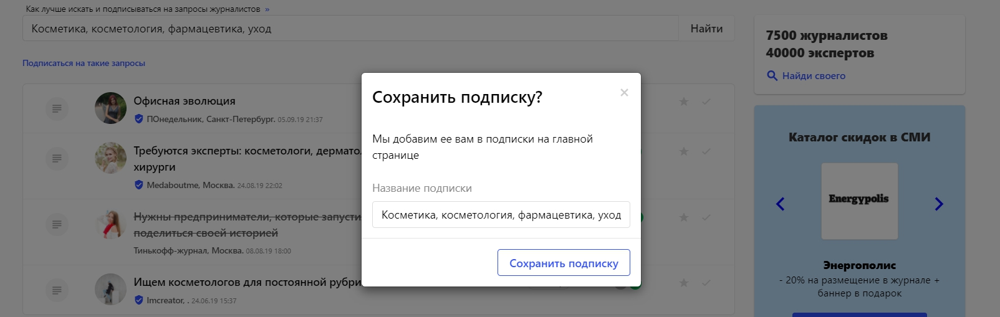

В чем сила личного бренда? Кажется, предприниматели только недавно стали всерьез задаваться этим вопросом. Начали вести блоги, рассказывать о своей жизни в социальных сетях, высказывать свое мнение и делиться мыслями с общественностью в различных СМИ. Вдруг «безликий» бизнес стал проигрывать тем компаниям, у которых есть «лицо», а именно собственник предприятия ㅡ живой, опытный, интересный человек. Находить партнеров, единомышленников, клиентов и взаимодействовать с ними становится легче, когда ты, в первую очередь, открытая, честная и жизнерадостная личность, а уже потом ㅡ серьезный и вечно занятой бизнесмен.

**Алексей Филиппов, генеральный директор GPC Pharmaceuticals**, пришел к пониманию, насколько важен личный бренд в развитии и продвижении бизнеса около 1,5 лет назад. Его компания специализируется на производстве косметики, парфюмерии, продуктов питания и других товаров для красоты и здоровья. GPC Pharmaceuticals работает как с уже утвердившимися на рынке брендами косметики и выпускает большие партии продукции, так и может выполнить заказ на небольшую партию для салонов красоты, знаменитостей или бьюти-блогеров, которые захотели создать лимитированную линейку косметики под своим именем.

Практически все клиенты и партнеры Алексея ㅡ тоже представители бизнеса, то есть это b2b-история. Большая часть заказчиков приходит через личное общение и сарафанное радио. Чтобы бизнес развивался быстрее и успешнее, а заказов становилось все больше, не хватало некого «катализатора», который бы усилил эффект от личного общения, а еще лучше ㅡ формировал образ эксперта и погруженного в свое дело предпринимателя (то есть Алексея), еще до фактического знакомства с самим собственником компании. Личный бренд как маркетинговый инструмент может выполнять роль такого «катализатора».

> Как говорится, сначала ты работаешь на имя, потом имя работает на тебя. Все именно так и происходит. Личный бренд влияет на отношение к эксперту со стороны бизнес-сообщества и автоматически вызывает доверие к профессионалу.

Я являюсь помощником Алексея в области пиара и маркетинга и на его примере хочу показать, как всего за полтора года превратиться из перспективного, но известного только в узких кругах предпринимателя в эксперта федерального уровня, пишущим для «РБК» и Forbes.

Итак, для развития личного бренда Алексей Филиппов использует два канала продвижения: блог в Инстаграме и публикации (сюда относим как полноценные статьи, так и комментарии) на различных медиа-ресурсах.

## Почему соцсетей недостаточно, чтобы построить продающий личный бренд

Изначально решение вести и продвигать блог в Инстаграме было связано с тем самым «эффектом знакомства»: пользователь соцсети подписывается на бизнесмена, следит за ним, проникается его мыслями и идеями, прислушивается к советам, читает о компании, может задать любой вопрос или поспорить с ним в комментариях. Сейчас в [блоге Алексея Филиппова](https://www.instagram.com/avfilippov/) 114 тысяч подписчиков. Активно вкладываться в Инстаграм мы начали весной 2018 года. Блог Алексея держится на трех китах: профессионализм, адекватность и чувство юмора.

Блог ㅡ это, конечно, важный инструмент для формирования личного бренда. Однако для идеальной картины мира (то есть образа эксперта) его необходимо подкреплять «извне». Что имею в виду: все-таки при правильном позиционировании и n-й сумме денег стать хорошим блогером может почти каждый, а одного блога недостаточно, чтобы в вас поверили серьезные люди. Особенно это актуально для сложных бизнесов и b2b-сферы, когда предприниматель нацелен на поиск партнеров и заказчиков, с которыми в дальнейшем будут заключаться многомиллионные сделки.

Алексей Филиппов продает не баночки с косметикой, он владеет большим производством с лабораториями, технологами и собственными разработками.

> Чтобы потенциальный клиент решился подписать с GPC Pharmaceuticals контракт, ему нужна абсолютная уверенность в надежности и экспертизе как компании, так и ее собственника. Публикации в СМИ могут вселить в будущего такую партнера уверенность. Он видит, что Алексей не просто оформляет свои мысли в забавный блог, а его рассуждения и опыт интересны крупным уважаемым изданиям.

И думает: журналисты таких медиа не будут спрашивать мнение у неизвестного и сомнительного эксперта. Раз Алексей пишет для Forbes и «РБК», значит, он знает, о чем говорит, а редакции также относятся к нему как к профессионалу в своей отрасли. В голове срабатывает щелчок: пожалуй, с этим человеком можно иметь дело.

Поэтому с середины 2018 года мы начали активно работать с средствами массовой информации, то есть инициировать как можно больше публикаций с участием Алексея на самых разнообразных медиаресурах.

## Публикации в СМИ: чем их больше, тем лучше эффект

Основные тематики, на которые мы пишем статьи и комментарии, ㅡ все о Health&Beauty, управлении бизнесом и финансами, а также иногда затрагиваем лайфстайл-темы, например, путешествия. Соответственно, площадки для публикаций выбираем по принципам «кто их читает» и «о чем пишут». Это профильные издания о красоте и здоровье, бизнес-порталы, а также развлекательные лайфстайл-ресурсы.

**Как взаимодействовать с журналистами**

Чтобы попасть в желаемое СМИ, нужно общаться и договариваться с журналистами. Можно идти к ним напрямую, то есть писать в редакции, рассказывать о спикере, предлагать темы. Не факт, что вас примут с распростертыми объятиями, но рано или поздно сотрудничество состоится. Предупреждаю, что это более тернистый путь. Существует другой вариант ㅡ заходить в издания через автоматизированный сервис журналистских запросов [Pressfeed](https://pressfeed.ru/). Это платформа, где журналисты ищут героев и экспертов для публикаций. Они выкладывают запросы с указанием: какой эксперт им нужен, на какой вопрос требуется ответить, до какого числа необходимо прислать ответ. Спикеру нужно написать комментарий и выслать журналисту в срок. Если он подходит, то ждите, когда выйдет публикация с мнением эксперта. Этот путь более легкий, но готовьтесь к тому, что желающих попасть в топовое издание будет много.

В любом случае я советую использовать оба способа для коммуникации со СМИ одновременно. Что-то сделаете через прямые контакты, что-то через сервис Pressfeed, в итоге получите больше качественных публикаций, которые повлияют на личный бренд эксперта.

Как наладить контакты с редакциями? ТОП-4 совета, которые помогают мне:

* не бояться предлагать свои темы, услуги;
* время от времени напоминать о себе;
* стараться знакомиться с журналистами лично (актуально не для всех, но все же);
* быстро реагировать на просьбы журналиста, всегда быть на связи.

С таким подходом мы выпускали несколько публикаций на Forbes. Одна из них была посвящена росту НДС, другая ㅡ что выгодно экспортировать в Китай.

[_Статья в Forbes_](https://www.forbes.ru/finansy-i-investicii/363649-nalogovyy-perevorot-kak-rost-nds-povliyaet-na-biznes-i-potrebitelya)

Впрочем, если вы хотите попасть в Forbes, но найти общие темы для публикации пока не получается, начинайте сотрудничество с редакцией через Pressfeed. Познакомитесь с журналистом там, затем перейдете на прямое общение. Несмотря на то, что мы уже знаем, что писать для этого издания, мы никогда не пропускаем запросы от Forbes на сервисе.

  
[_Запрос от Pressfeed_](https://pressfeed.ru/query/56200)

Недавно Алексей дал комментарий на тему продвижения в Youtube.

  
[_Комментарий в Forbes_](https://www.forbes.ru/karera-i-svoy-biznes/377389-babushka-zhivushchaya-v-seti-kak-pensionerka-zarabatyvaet-bolshe)

Кстати, многие журналисты работают не в одном, а в 2-3 крупных изданиях. Бывает, делаешь статью для одной площадки, а затем тот же журналист помогает тебе публиковаться на другом ресурсе.

В другой раз мы писали через Pressfeed комментарий для сайта «Подмосковье сегодня». Корреспондент спрашивал у представителей различных отраслей бизнеса, как они зарабатывают на летней жаре.

  
[_Запрос от «Подмосковье сегодня»_](https://pressfeed.ru/query/56571)

Алексей рассказал, что среди косметических средств летом особую популярность приобретают мисты, то есть спреи для охлаждения и свежести кожи.

  
[_Статья на «Подмосковье сегодня»_](https://mosregtoday.ru/econbiz/ledyanye-vecherinki-i-smuzi-bum-kak-v-podmoskov-e-zarabatyvayut-na-zhare/)

Из деловых изданий мы также выпускали комментарии и статьи в «Российской газете», E-xecutive, Znak.com, «Генеральном директоре» и других подобных медиа.

Если говорить о площадках, пишущим о красоте и здоровье, то можно уже смело называть их друзьями компании GPC Pharmaceuticals. Например, через Pressfeed Алексей 3 раза писал комментарий для медицинского портала MedAboutMe. В последней вышедшей статье говорил о патчах с микроиглами.

  
[_Запрос от MedAboutMe_](https://pressfeed.ru/query/56736)

Это инновационная новинка среди средств для домашнего ухода, и такие патчи действуют более эффективно, чем привычные «наклейки» под глаза.

  
[_Фрагмент публикации на MedAboutMe_](https://medaboutme.ru/obraz-zhizni/publikacii/stati/krasota/patchi_s_mikroiglami_vse_chto_vy_khoteli_znat/)

Замечаю тенденцию, что часть знакомых журналистов переходят на Pressfeed, и порой легче и быстрее отреагировать на запрос сразу на сервисе. Или случается так, что я вижу запрос на платформе, а затем оперативно уточняю детали по нему в почте или в WhatsApp.

Мы создали аккаунт на сервисе в декабре 2018 года и к июлю 2019 ответили на 78 запросов. Приняты были не все, примерно 30%. Изначально регистрация бесплатная, но на базовом аккаунте действуют ограничения по количеству ответов на запросы в месяц. Мы подключили платную версию, чтобы отвечать на любые запросы, которые подходят Алексею по тематике.

Кроме того, на PRO-аккаунте можно сформировать подписку по ключевым словам — таких, которые касаются тематики эксперта. Для нас это «косметика», «косметология» и тому подобное.

_Подписка на запросы_

Что еще нравится на продвинутом аккаунте: мы видим запросы раньше тех, кто использует базовый тариф. Разрыв примерно 3 часа, но это может быть критично, если запрос срочный. А такие срочные запросы чаще всего публикуют журналисты именно больших изданий — «Коммерсанта» и подобных.

**Совет**

Как только вышла публикация, сразу размещайте ссылки на нее везде, где только можете, как минимум рассказывайте о ней во всех социальных сетях эксперта.Как только вышла публикация, сразу размещайте ссылки на нее везде, где только можете, как минимум рассказывайте о ней во всех социальных сетях эксперта.

Так как главное «поле для деятельности» в случае с Алексеем ㅡ Инстаграм, то мы обязательно ставим ссылки на каждую публикацию в сториз.

  
_Публикации в сториз_

За последний год мы выпустили более 50 публикаций во всевозможных СМИ, которые читает целевая аудитория компании. Строгой нормы по количеству опубликованных материалов за месяц нет, так как подготовка разных текстов занимает совершенно разное время. Комментарий можем сделать и утвердить с журналистом за пару часов, а вот на большую статью требуется несколько дней или даже недель.

## Полтора года работы над личным брендом

Алексей Филиппов взялся за развитие личного бренда только полтора года назад. За это время:

* страница в Инстаграм с несколькими тысячами подписчиков превратилась в большой блог, за которым следят 114 тыс. читателей. Блог имеет узнаваемые фишки и отличается от классических аккаунтов бизнесменов;

* Алексей стал колумнистом в десятке крупных СМИ, включая Forbes, «РБК», «Коммерсантъ», также журналисты сами обращаются к нему за комментариями;
* по наблюдениям Алексея узнаваемость в бизнес-среде увеличилась в разы, как онлайн так и оффлайн. Для бизнеса это выразилось в новых b2b-клиентах и партнерах. Оборот компании за 2018 год составил 350 млн рублей;
* пропорционально растет узнаваемость Алексея как эксперта в health&beauty сфере, стало больше запросов на консалтинговые услуги в этой отрасли.

Личный бренд ㅡ это, в первую очередь, пиар-инструмент, а только во вторую инструмент для увеличения продаж. Сложно посчитать его эффективность в конкретных цифрах, но мы смотрим на рост компании, на обороты и можем с уверенностью сказать, что личный бренд отлично работает на предпринимателя.
