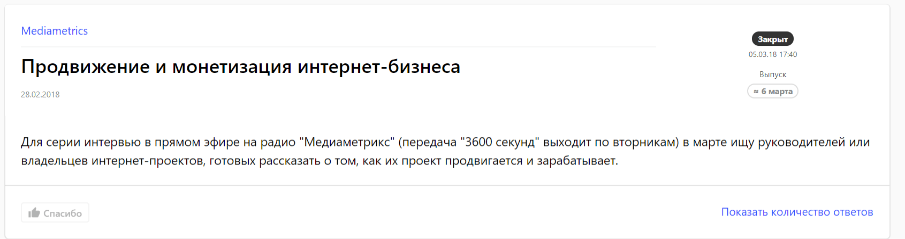
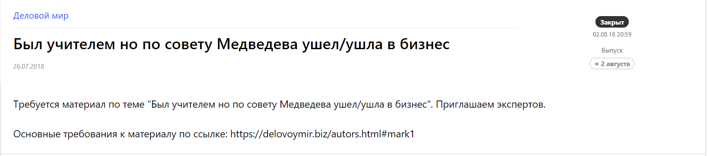
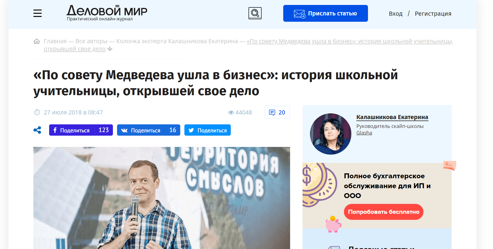
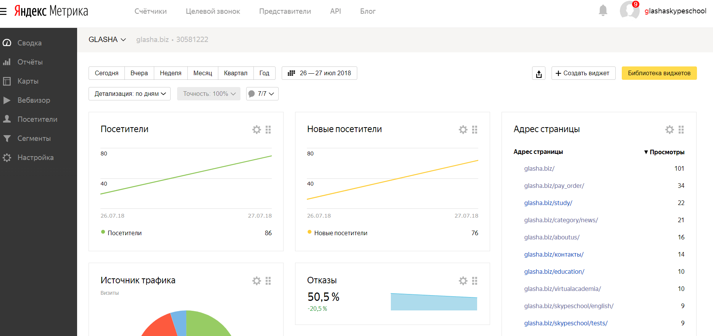
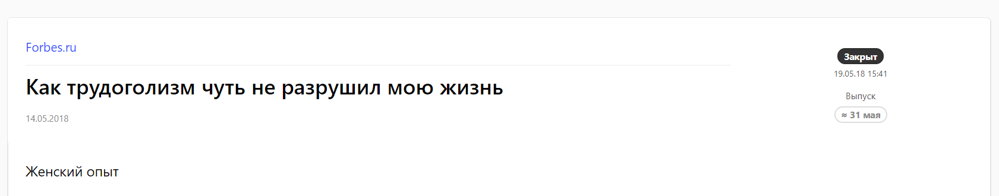
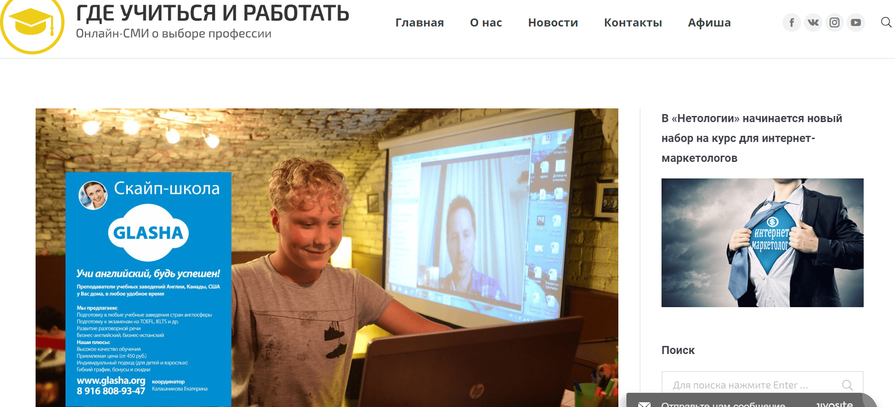
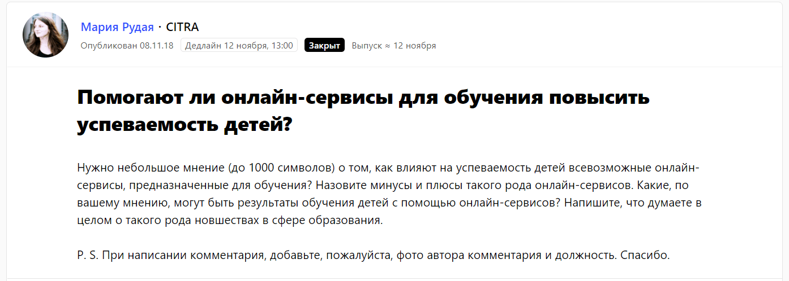
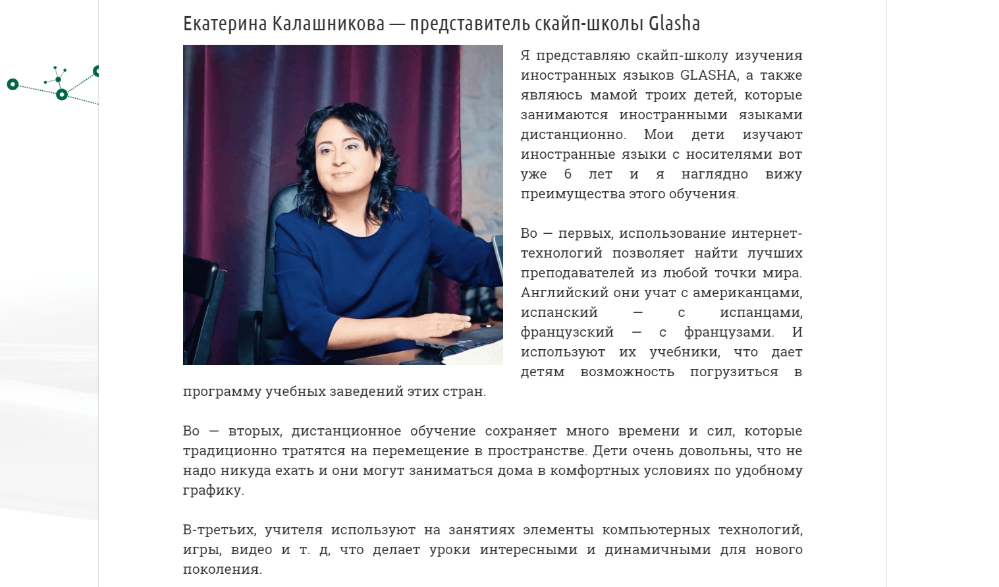
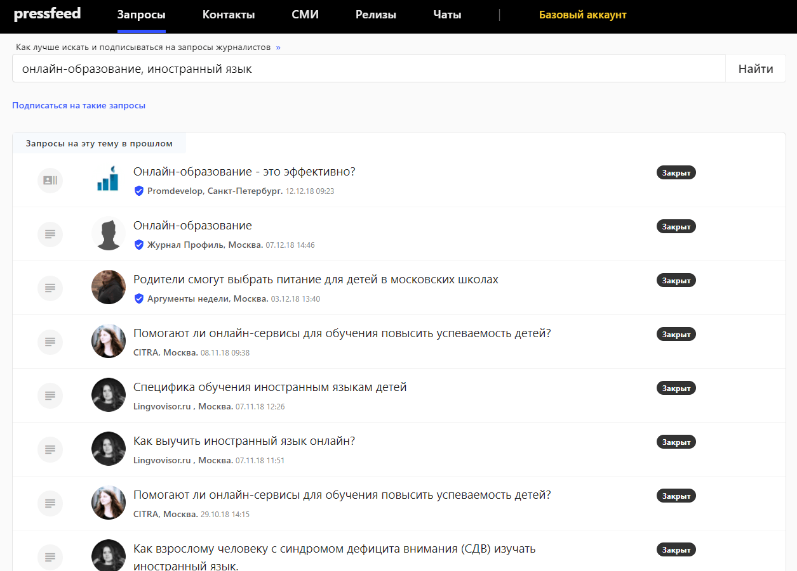

Glasha ㅡ скайп-школа иностранных языков. Работает с 2012 года. Особенность школы в том, что уроки проводят только сертифицированные учителя-носители языка.

В основном в школе занимаются те, кто собирается переезжать за границу жить и работать. Также обучаем детей, которые готовятся поступать в зарубежные вузы. Бывают и интересные случаи: у нас учатся пенсионеры, дети которых уехали за океан, и их внуки уже плохо понимают по-русски, а бабушкам же хочется нормально общаться. Сейчас в в линейке проекта ㅡ 12 иностранных языков.

## Проблема: огромная конкуренция на рынке онлайн-школ

Пожалуй, самая известная в России онлайн-школа иностранных языков ─ SkyEng. Еще на старте проекта в 2012 году создатели школы вложили в разработку сайта и подбор персонала около $13 тыс. А еще через пару лет инвесторы перевели в SkyEng более $300 тыс. (по [данным «РБК»](https://www.rbc.ru/own_business/11/03/2015/54fed5c79a7947851f391e22) в 2015 году), сегодня компания продолжает закладывать на маркетинг и продвижение многомиллионные бюджеты.

Для сравнения: мы вложили в Glasha $10 тысяч суммарно за все время существования проекта. Конкурировать со SkyEng в рекламных digital-форматах (реклама в соцсетях, контекстная реклама) практически нет смысла: они любого задавят бюджетами. Кроме того, в последние 2 года стало модно открывать онлайн-школы ─ слышали о проекте «Акселератор онлайн-школ»? Кажется, что сейчас новые игроки на этом рынке появляются чуть ли не каждый день.

Теперь онлайн-школы на каждом углу и в каждом рекламном объявлении. Все хотят завлечь студентов, дать им скидку, выгодные условия. На рынке с такой конкуренцией становится особенно важно работать на репутацию, узнаваемость, экспертность. Хочется, чтобы студенты понимали, кому они платят деньги, почему экономить на изучении иностранного языка ─ это плохая идея, и в чем преимущества именно нашей школы.

> При этом бюджеты на рекламу и продвижение у нас остаются минимальными, так что в 2018 году мы решили по максимуму задействовать **бесплатные PR-инструменты**. Один из самых эффективных способов заявить о себе и донести философию онлайн-школы Glasha до целевой аудитории ㅡ публикации в СМИ. Мы начали сотрудничать с крупными СМИ, публиковать комментарии и статьи о школе, рассказывать о нашем опыте и истории.

## Цели продвижения в СМИ

В ситуации сумасшедшей конкуренции основная цель PR-продвижения и выходов в СМИ ㅡ сохранить стабильное количество студентов в школе. То есть кто-то уйдет в новые онлайн-школы, например, с более дешевыми услугами, но другие потенциальные клиенты, прочитав о нас в авторитетном издании и доверившись экспертизе Glasha, начнут заниматься именно у нас. Будем реалистами: без больших денежных вложений обогнать гигантов невозможно, но остаться на плаву, продолжать успешно работать, не потерять в доходах ㅡ вполне выполнимая цель.

Но хочется сразу отметить, что у нас нет отделов PR и маркетинга. Если какие-то рекламные задачи мы отдаем на аутсорс (например, запуск таргетированной рекламы и т. д.), то PR-продвижением занимается только собственник компании лично, то есть я (Екатерина Калашникова). Как вы понимаете, времени на написание текстов, на общение с журналистами у руководителя бизнеса нет и не будет: нужно решать множество других управленческих вопросов ежедневно. Откровенно говоря, я могу тратить на PR-активности максимум 2-3 часа в неделю. Поэтому мне необходим был инструмент, который смог бы автоматизировать все взаимодействия со СМИ, а мне не пришлось бы самой звонить/писать в редакции и предлагать темы для публикаций, как это делают классические пиарщики.

Таким инструментом оказался сервис журналистских запросов [Pressfeed](https://pressfeed.ru/). Суть сервиса простая: журналисты из 4 тысяч изданий ищут здесь экспертов для публикаций. Сотрудники редакций оставляют вопросы по интересующим темам и собирают комментарии профильных специалистов. Все, что нужно делать компании, ㅡ оперативно и развернуто реагировать на актуальные запросы. Если вы действовали правильно ㅡ комментарий попадет в материал, а о вашей компании узнают читатели издания.

Я зарегистрировалась на Pressfeed в феврале 2018 года. В рамках базового аккаунта подключение к платформе полностью бесплатное (можно отвечать на 5 запросов в месяц). Я отвечаю на 2-3 запроса в течение месяца, в планах ㅡ чаще, но пока не получается. Если все-таки найму PR-специалиста, то логично будет подключить расширенный платный аккаунт, которые дает возможность отвечать на неограниченное количество запросов.

## О чем говорим от лица компании: темы и примеры публикаций

В СМИ мы говорим обо всем, что связано с образованием, рассказываем о разных аспектах своей деятельности. Бывают узкие темы: как обучать детей-билингвов, с чего начать обучение, если студенту уже за 60 лет, что делать со сложными детьми. Часто рассуждаем о тенденциях в образовании, о плюсах и минусах дистанционного обучения, о новых онлайн-методиках изучения языков.

> Совет: говорите обо всем, что знаете. Не бойтесь делиться опытом. У всех предпринимателей есть интересные истории из бизнеса.

Чтобы не пропустить ни один запрос, связанный с вашей отраслью или который просто кажется интересным, важно внимательно следить за потоком входящих запросов. Можно мониторить раздел [«Запросы»](https://pressfeed.ru/all-queries) на сайте, но проще ㅡ проверять рассылку, которая приходит на почту компании ежедневно в 10.00 и 15.00 по московскому времени.

Приведу примеры работы с Pressfeed из опыта компании Glasha. Сначала хочу вспомнить прямой эфир на радио MediaMetrics в передаче «3600 секунд». Дмитрий Главацкий, ведущий программы, опубликовал запрос:

[_Запрос_](https://pressfeed.ru/query/40895) _от радио MediaMetrics_

Я откликнулась, в ответе кратко рассказала об онлайн-школе, и меня пригласили стать участником программы. Прошел прекрасный эфир, я поделилась опытом создания бизнеса, объяснила плюсы общения с носителями языка. Почти часовой эфир послушали/посмотрели около 7000 человек.

**Что произошло после эфира:** в течение нескольких недель после выпуска количество заявок на обучение в Glasha возросло примерно в 2 раза. Обычно мы получаем 7-8 лидов в неделю, а тогда мы зафиксировали около 14 запросов.

Не все стали студентами, но часть из обратившихся решила учиться у нас. Плюс к нам поступило партнерское предложение о сотрудничестве от агентства, которое занимается зарубежным образованием.

Также было очень приятно познакомиться с Дмитрием Главацким, оказалось, что он работает главным маркетологом сайта Gismeteo. Дмитрий поделился контактами проверенного таргетолога и юриста, которые в дальнейшем помогли нам в развитии бизнеса. Получается, что работа на Pressfeed ㅡ это не только публикации в СМИ, это еще и полезные знакомства как журналистами, так и с экспертами из других областей.

Если говорить об интернет-изданиях, хочется вспомнить две публикации в «Деловом мире» (посещаемость ресурса ㅡ около 700 тысяч визитов в месяц). Первый материал мы сделали с помощью Pressfeed, а второй вышел всего на 2 дня позже, и там мы уже напрямую договорились с главным редактором издания Алексеем Петруниным.

Помните, как премьер-министр Медведев посоветовал всем учителям, кому не хватает зарплаты в школе, идти в предприниматели? Эта история как раз про меня. Я же была учителем биологии до того, как открыла онлайн-школу Glasha.

  
[_Запрос_](https://pressfeed.ru/query/45879) _от «Делового мира»_

Изданию я поведала историю создания своего бизнеса: с чего все началось, как я справлялась с трудностями, как я работаю, сколько у меня ассистентов, к чему это привело, какая у меня зарплата сейчас.

  
[_Материал_](https://delovoymir.biz/po-sovetu-medvedeva-ushla-v-biznes-istoriya-shkolnoy-uchitelnicy-otkryvshey-svoe-delo.html) _с участием компании_

> Статью прочитали более 44 тысяч человек! В день публикации трафик на сайт школы вырос в 2 раза. Мы получили десятки положительных отзывов, комментариев и несколько новых клиентов.

_Рост трафика после выхода публикации (26 июля и 27 июля 2018 года)_

Кстати, если в процессе создания публикации у вас возник срочный вопрос к журналисту, редактору издания или появились дополнения к материалу ㅡ можно написать журналисту во внутренний чат, дослать файлы или обсудить следующий совместный материал.

_Пример страницы журналиста с чатом_

Во второй раз у нас случился серьезный разговор с изданием о том, как я открывала бизнес в Канаде и почему быть предпринимателем в России ㅡ невероятно сложно.

  
[_Публикация_](https://delovoymir.biz/rossiya-ili-kanada-gde-biznesu-zhit-horosho.html) _в «Деловом мире»_

Статья набрала около 2.5 тысяч просмотров, и уже после нее (возможно, оба материала вместе сработали) мы получили три предложения о корпоративном обучении в трех компаниях. Московская компания «Видэкс Сервис», питерская компания «Инфоэнерго» и немецкая компания Mangione Consulting UG теперь обучают своих сотрудников в скайп-школе Glasha по программе Business english.

Также через Pressfeed у нас получилось выйти на такие крупные бизнес-издания, на которые бы мы вряд ли вышли своими силами. Да я бы просто не стала «стучаться» к ним вне сервиса: кажется, в честь чего Forbes с ежемесячной аудиторией в более чем 4 млн уникальных посетителей будет писать о руководителе небольшой скайп-школы? Но редакция Forbes пользуется сервисом Pressfeed.

  
[_Запрос_](https://pressfeed.ru/query/43318) _от Forbes.ru_

Я ответила на запрос о том, как вовремя делегировать полномочия и избавиться от трудоголизма. Это мой реальный опыт: когда мы только запускали скайп-школу, я погрузилась в работу с головой и дошла до такого состояния, что была вынуждена обратиться к психотерапевту.

  
_Статья в_ [_Forbes.ru_](http://www.forbes.ru/forbes-woman/363179-vyyti-iz-sumraka-kak-perestat-kruglosutochno-rabotat-i-vernutsya-v-semyu)

Такой формат публикаций, может быть, и не привлекает новых студентов, но определенно работает на повышение узнаваемости. Необязательно же писать только об образовании. Хотя это наша основная тема, и я стараюсь отвечать на все запросы, посвященные обучению и профориентации.

[_Запрос_](https://pressfeed.ru/query/46412) _от издания «Где учиться и работать»_

Статья в издании «Где учиться и работать» популяризовала идею онлайн-обучения для наших студентов. Честно раскрыла все плюсы и минусы формата.

[_Публикация_](https://guir.ru/onlajn-obuchenie-ili-tradicionnye-kursy-vybiraem-na-konkretnom-primere/) _с участием компании_

В другой раз познакомилась с новой площадкой CITRA: там освещаются темы, связанные с цифровой трансформацией нашего мира.

[_Запрос_](https://pressfeed.ru/query/49528) _от CITRA_

Вышел материал, посвященный онлайн-сервисам для обучения детей.

[_Публикация_](https://citra.press/pomogajut-li-onlajn-servisy-dlja-obuchenija-povysit-uspevaemost-detej.html) _с комментарием компании_

Между тем, если вы нацелены отрабатывать только отраслевые запросы, удобнее всего подписаться на рассылку по ключевым словам. Введите нужные слова в поиске и сформируйте специальную подписку. Для примера возьму наши ключевики «онлайн-образование», «иностранный язык».

  
_Подписка на запросы по ключевым словам_

После выхода любой публикации в любом издании обязательно увеличивайте ее охват с помощью социальных сетей. Мы всегда размещаем ссылки на материалы в официальной [группе школы в Фейсбуке](https://www.facebook.com/schoolGlasha/), просим делать сотрудников, учеников репосты.

## Вывод: влияние публикаций на бизнес

До определенного времени я не думала о публикациях в СМИ как об эффективном инструменте продвижения, но опыт нашей компании показывает обратное.

С февраля 2018 года я ответила на 21 запрос на сервисе Pressfeed, 10 комментариев было принято и опубликовано. По моему мнению, руководитель компании не имеет возможности уделять много времени PR-продвижению, и если у вас нет помощников, Pressfeed ㅡ это вообще единственный способ коммуницировать со СМИ регулярно и эффективно.

Выстреливают не все публикации, но те, что сработали, помогает оставаться бизнесу на плаву. Не стоит гнаться за количеством публикаций, думайте о качестве. Работают те тексты, где вы сможете убедительно и честно рассказать о себе потенциальным клиентам.

> В 2018 году мы потеряли часть студентов, но потом с помощью грамотного пиара смогли привлечь 100 новых и удержать их уровнем профессионализма и сервиса. Более того, мы заключили договоры с несколькими корпоративными клиентами. Стабильное количество студентов на рынке онлайн-школ в текущих реалиях ㅡ это успех.

Сейчас в Glasha учится более 500 студентов и работает 75 преподавателей. В 2019 году будем продолжать сотрудничать со СМИ, и я надеюсь, что мода на бизнес с онлайн-школами пройдет. Эти новые предприниматели наконец-то поймут, что не просто так заставить школу успешно функционировать.
