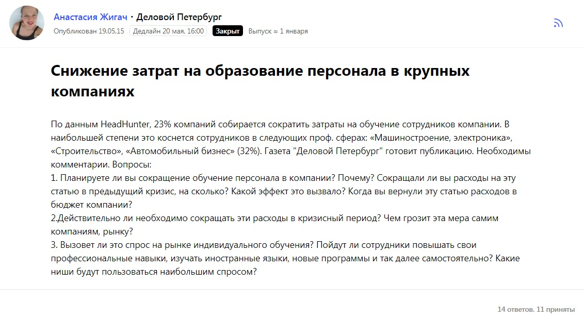
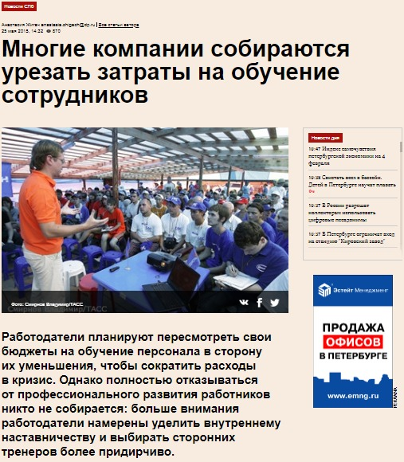
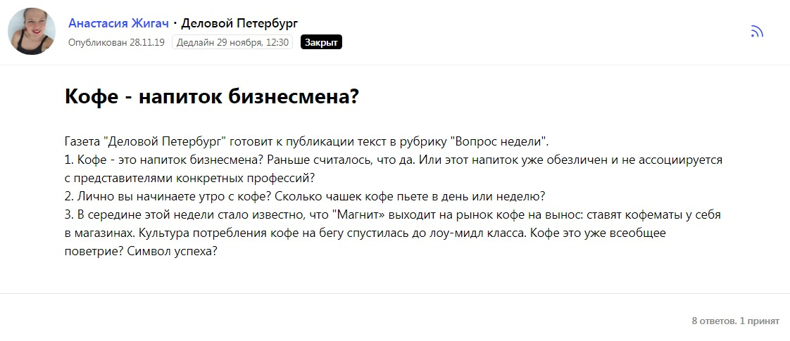
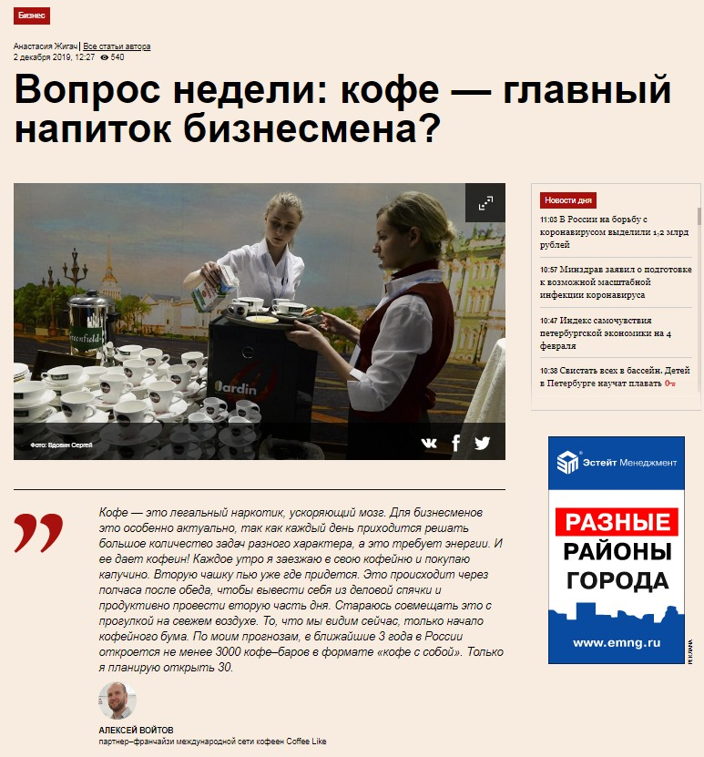

Я работаю в «Деловом Петербурге» уже семь лет. Курирую широкий спектр тем: пишу про стартапы, малый и средний бизнес, управление персоналом, а также рецензии на книги, репортажи с концертов, беру интервью - в общем, много всего. Конечно, я каждый день сталкиваюсь с необходимостью поиска фактуры для темы, подбора комментариев и экспертных мнений.

Практически ни один материал в Деловом Петербурге не обходится без комментарий от экспертов. В 2015 году я познакомилась с сервисом Pressfeed. Нельзя сказать, что маркетплейс журналистских запросов полностью заменил мне классический поиск спикеров и контактов, но сильно облегчил жизнь.

**Расширился пул контактов**

Как я попала на Pressfeed, вспомнить уже сложно: возможно подсказали продвинутые коллеги, возможно просто пиарщики самого сервиса. Реакция у меня была такая: так, я же пишу про стартапы, а это стартап в моей профессиональной сфере. Цель у него благая, может быть действительно полезный для работы инструмент. Надо потестить! Первый запрос публиковала с большим энтузиазмом, но без ожиданий: мне казалось, даже один ответ от никому не известного эксперта уже хороший результат. Скорее всего, его даже в материал взять не получится, но это уже другая история.

В указанный мной срок пришли сразу три ответа. Адекватные, информативные, от реальных участников рынка. Чудо какое-то. Тема звучала так: «Редкие вакансии в Петербурге». Так я познакомилась в компанией Cornerstone в Санкт-Петербурге. Мне ответили три спикера, тогда это казалось шикарным результатом. Сейчас мне может прилететь и 7 и 10 и даже 20 комментариев, зависит, конечно, от специфики темы и дедлайна.

Я тогда только начала вести рубрику «Менеджер» про управление персоналом и HR. Тема была для меня абсолютно нова. Надо было еще найти своих экспертов, кадровиков крупных компаний, CEO, установить контакт, понять кто хорошо говорит, кто нет и так далее. Pressfeed сильно помог освоиться в теме. Когда увидела ответ от Coca Cola, сильно обрадовалась: запрос был срочный, дедлайн горящий, вряд ли я смогла бы в такой сжатый срок классическим способом получить комментарий от компании, с которой раньше никак не взаимодействовала.

В общем, Pressfeed помог быстро сориентироваться в спикерах: без него на поиск экспертов и знакомство с ними пришлось бы потратить значительно больше времени.

_Поиск экспертов для рубрики "Менеджер"_

**Избавилась от волокиты**

Налаженный контакт с крупными игроками – это очень удобно. Есть еще момент: согласование комментариев, уточнение деталей. Мало найти эксперта, откопать его личный контакт, договориться созвониться, записать, расшифровать, нужно его еще проверить! Все ли правильно поняла, проверить цифры.

Вот эта стадия может занять пять минут, а может и несколько дней. Все индивидуально. 

> Мне нравится Pressfeed тем, что я получаю уже согласованные комментарии. Экономия времени и сил. Что-то уточнить, попросить добавить или перепроверить тоже легко с помощью формы ответа под каждым комментарием. 

И, кстати, удобно, что поставить в известность о выходе материала и таким образом поблагодарить всех экспертов тоже можно в один клик.

**Делаю целевые опросы экспертов**

Я веду рубрику «Вопрос недели». В рамках этой рубрики мы берем актуальную тему, собираем самые интересные мнения самых разных людей. Тема эта обычно определяется вечером в четверг, в пятницу материал уходит в печать. Понятно, у меня есть свой пул проверенных спикеров на самые разные темы, но во-первых, эксперты нужны каждый раз новые, во-вторых, темы бывают иногда такие, что свои контакты (и контакты коллег) не спасают. Иногда тема такая, что найти спикера и взять у него коммент к обеду представляется супер сложной задачей.

Здесь снова выручает Pressfeed – на этот раз внутренний сервис поиска экспертов. Жму «Отправить запрос эксперту» и с помощью поиска по ключевым словам подбираю интересных редакции в данном случае спикеров, чтобы отправить свой запрос конкретному адресату. Не все отвечают, но ведь Pressfeed-ом все не ограничивается. Можно найти хорошего эксперта и попробовать найти его обходным путем.

Опять-таки, в моем случае сервис вовсе не исключает обычной истории для журналиста: найти, договориться, позвонить, согласовать. Но, бывает, здорово выручает. Понятно, что не каждую тему напишешь в Pressfeed: коллеги из других СМИ сервисом тоже пользуются, эксклюзив должен остаться эксклюзивом.

_Подбор спикеров для рубрики "Вопрос недели"_

**Ищем эксклюзивных спикеров**

Иногда кажется, что через Pressfeed можно найти что угодно. Экспатов в нужном городе, экспертов по Африке и Арктике, массажиста при барбершопе, поставщика кофе, узнать необычные требования работодателей, как ухаживать за ногтями на ногах и какие клиники в Петербурге предлагают услуги подологии – это, кстати, мои реальные запросы для разных рубрик в ДП.

Мне подсказывают, что в базе сервиса уже 40 000 экспертов. Возможно, среди них нет переворачивателя панд из китайского зоопарка, но встречаются очень редкие и ценные эксперты.

**Нет предела совершенству**

У меня нет точных данных, но по внутренней статистике сервиса, Pressfeed-ом пользуется уже более 8000 журналистов. Приятно, что сервис заметно развивается: с тех пор как я воспользовалась им впервые, появилось немало новых функций, как тот же самый поиск эксперта по ключевым словам и возможность направить ему точечный запрос, показать интерес к именно его комментарию. Но, конечно, всегда есть что улучшать.

Одна из очевидных, на мой взгляд, проблем на Pressfeed это небольшая популярность встроенного мессенджера. То ли он не очень удобно сделан, то ли мало кто из пользователей в курсе, что он есть, но отвечают там не то, что не быстро – далеко не всегда. Если бы представители спикеров и эксперты пользовались этим мессенджером на постоянной основе или хотя бы просто почаще туда смотрели, это позволило бы оперативно уточнять детали, добавлять фактуру, задавать уточняющие вопросы, предупредить, что материал выйдет позже, чем заявлено.

**Когда идем на Pressfeed**

За исключением каких-то особенных тем, которые нельзя «светить» до публикации, вопрос «давать ли запрос на Pressfeed?» у меня не стоит. Появляется тема, для которой у меня мало экспертов в записной книжке, я сразу составляю запрос и публикую его на сервисе. Периодически, даже когда у меня есть собственный богатый список экспертов, могу обратиться с запросом: Pressfeed может помочь найти новых спикеров. Это полезно.

Кроме того, сервис помогает подстраховаться: пока я ищу спикеров среди своих экспертов, звоню и пишу им, на сервисе под моим запросом тоже приходят ответы. Значит, всегда есть запасной вариант и возможность проверить кто сказал лучше, четче, интереснее.