## Контент-маркетинг и пиар в СМИ: зачем мы стали этим заниматься

Компания ICL Services вышла на ИТ-рынок России в 2014 году. Ранее мы работали только с зарубежными заказчиками и под другим брендом, поэтому в России о нас практически никто не слышал. Конкуренция была высокой, и компании нужно было амбициозно заявить о себе.

Работа со СМИ и контент-маркетинг должны были закрыть конкретную коммуникационную задачу — повысить узнаваемость компании и позиционировать ICL Services как нового игрока на российском ИТ-рынке, но при этом игрока с огромным опытом работы за рубежом. Необходимо было говорить в СМИ о наших компетенциях, кейсах, принципах, базирующихся на международных стандартах. Мы были уверены, что контент-маркетинг будет работать, потому что нам было что рассказать и показать рынку.

Сейчас, спустя почти пять лет, мы смогли добиться того, что запланировали на старте работы. Однако всем известно, что пиар и контент-маркетинг — это то, чем нужно заниматься всегда. Сегодня главные задачи для нас — поддержание имиджа инновационной компании и продвижение новых сервисов, таких как внедрение роботизации процессов, интернета вещей, VR и AR.

## Текущий KPI в рамках PR-продвижения

Со временем, исходя из опыта и задач компании, мы установили KPI для эффективного пиар-продвижения. Мы стараемся выпускать более 15 полноценных публикаций в квартал (сюда относятся аналитические статьи, материалы и переводы экспертов). Кроме того, PR-отдел инициирует более 100 упоминаний (комментарии экспертов) в СМИ за 3 месяца. Все материалы с участием компании анализируются системой «Медиалогия», которая выдает итоговый МедиаИндекс за 3 месяца. Примерный ежеквартальный рост — в 10-15%.

## С чего начинать «захват» СМИ

Перед тем, как начинать планирование, в какие СМИ идти и о чем писать, стоит ответить на вопрос: кто должен узнать о компании, кто будет читать эти тексты. У ICL Services две важнейшие целевые группы. Во-первых, топ-менеджмент компаний, лица, принимающие решения — генеральные директоры, руководители департаментов крупных компаний различных сфер бизнеса. Во-вторых, ИТ-специалисты разных уровней, руководители среднего звена, менеджеры по развитию.

Кроме того, необходимо определиться, на какие темы могут говорить эксперты компании. Для нас это — тренды и аналитика рынка ИТ-услуг и ИТ-аутсорсинга, виртуальная и дополненная реальность, облачные технологии, промышленная автоматизация и оптимизация процессов. Руководители направлений HR и маркетинга могут рассказать о тенденциях и новых веяниях в их сферах деятельности.

Далее мы определили основной критерий для отбора изданий: они должны быть отраслевыми. Главные направления — ИТ, бизнес, рекрутинг, маркетинг. Это четыре темы, с которыми так или иначе связаны все тексты, в создании которых участвует ICL Services.

Собственно, тематики выделили те издания, для которых мы будем писать:

1. **ИТ-издания** в приоритете. Их читают как руководители ИТ-департаментов, так и ИТ-специалисты всех уровней: от разработчиков до системных администраторов. Ключевые ИТ-площадки это — Habr, «БИТ», Cnews, TAdviser, Comnews, ICT-Online, Tadviser, TProger;
2. **бизнес-медиа**: «Ведомости», РБК, «Эксперт», VC.ru, Rubase, «Бизнес Online» и другие;
3. профильные **площадки для HR-специалистов и маркетологов**. «HR по-русски», HR-tv, Rjob.

## Как попасть в желаемое издание: советы и схемы работы

Рассмотрим подходы, которые мы используем при сотрудничестве с каждым форматом издания.

**ИТ-издания**

Так как ИТ-площадки в приоритете, то с ними мы работаем чаще и активнее всего. С некоторыми редакциями мы наладили хорошие отношения и вместе планируем совместные материалы, либо они обращаются к нам за экспертным мнением. В общении с другими нам сильно помогает сервис [Pressfeed](https://pressfeed.ru/) (платформа, на которой журналисты и редакторы ищут героев и экспертов для своих публикаций. Компании нужно только лишь отвечать на актуальные для нее запросы, а если ответ подойдет, то комментарий появится в публикации).

Начну с «Хабра», так как это, пожалуй, один из самых популярных медиаресурсов в сфере ИТ. Его ежемесячная посещаемость — 8 млн уникальных пользователей в месяц (по данным сайта). ICL Services завела блог на «Хабр» 4 года назад, с тех пор мы опубликовали уже 86 материалов. В среднем у нас выходит 1-2 материала ежемесячно. В среднем статью читает 5-7 тыс. человек. Мы делимся знаниями, кейсами, экспертизой, тем, как мы решаем те или иные задачи.

Несмотря на то, что блог на «Хабре» — прежде всего, репутационный инструмент, были случаи, когда опубликованные там материалы сразу приводили к нам заказчиков.

Именно так произошло после выхода статьи «Кому из клиентов Microsoft пора переходить на версию Dynamics 365». К нам обратился представитель компании, которая одна из первых (или даже первая) в России внедряет самую современную версию ERP-системы Microsoft Dynamics.

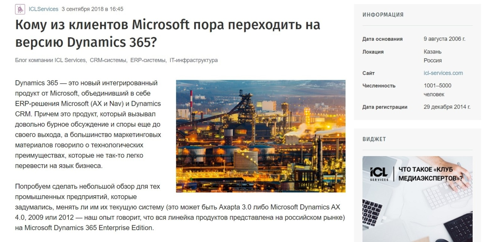

[_Публикация на Habr_](https://habr.com/ru/company/icl_services/blog/422165/)

> Наш будущий клиент позвонил в ICL Services со словами: «Если ваш специалист так рассказывает о решении, значит у нас нет сомнений в том, что ваша компания сможет грамотно внедрить его у нас». В настоящий момент мы находимся на стадии подписания договора.

Для ИТ-компаний, которые еще не работают с Habr, не знают, с чем его едят, или не готовы разбираться во всех правилах блогинга, советуем начать с комментариев в редакционных материалах. Для этого смотрите запросы от издания на сервисе журналистских запросов Pressfeed. Когда мы только развивали блог, то никогда не упускали возможность ответить на запрос «Хабра» и дополнительно «засветить» нашего эксперта в редакционной статье.

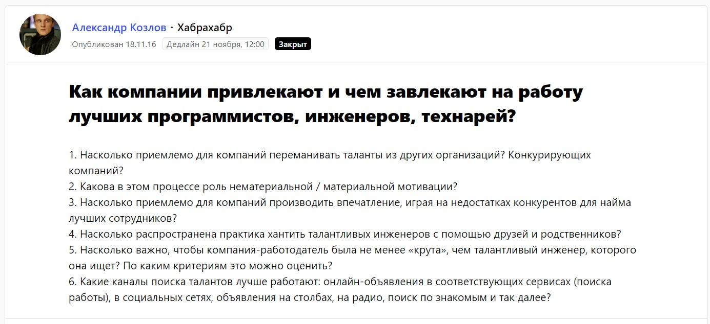  
[_Запрос от Habr_](https://pressfeed.ru/query/25815)

Тогда комментарий директора по персоналу появился в публикации [«Как компании привлекают на работу лучших ИТ-специалистов — ответы экспертов»](https://habr.com/ru/post/315872/).

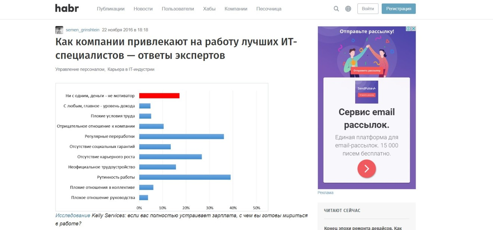  
_Публикация на Habr, сделанная с помощью Pressfeed_

Есть издания, с которыми мы уже несколько лет сотрудничаем только через Pressfeed, потому что так удобнее и быстрее отвечать на запросы, чем отдельно держать связь с редакцией. Например, отраслевое издание «БИТ. Бизнес и информационные технологии». Наши PR-специалисты давали комментарии для этого издания 17 раз, и все ответы были приняты. Например, один из запросов был посвящен теме, как продвигать ИТ-продукты.

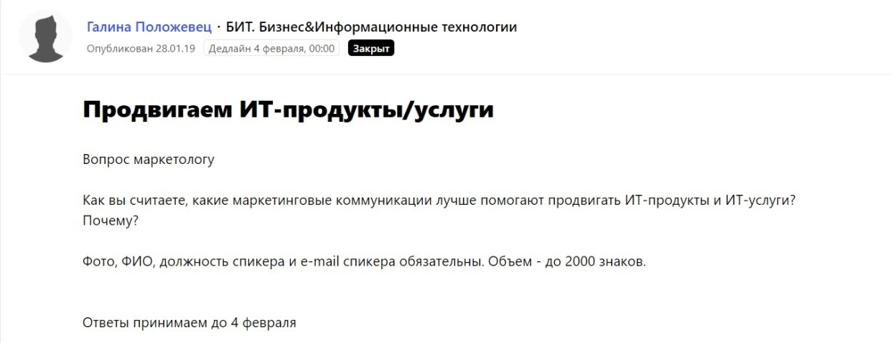  
[_Запрос от «БИТ»_](https://pressfeed.ru/query/52053)

Директор по маркетингу ICL Services Лилия Алеева рассказала об актуальных методах продвижения.

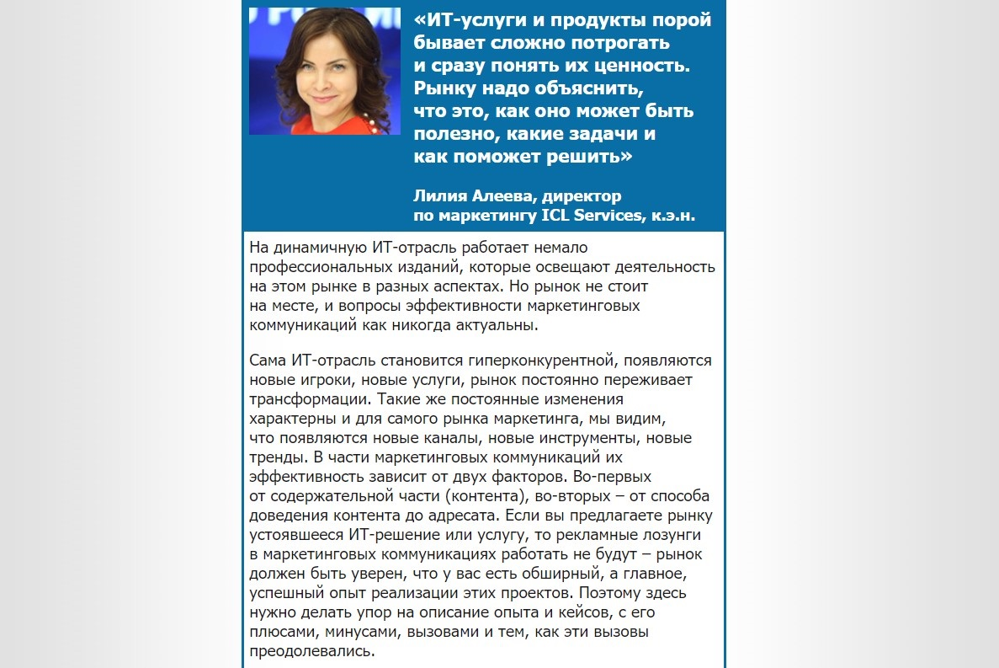  
[_Фрагмент публикации_](http://bit.samag.ru/archive/article/2107) _с участием компании_

Также с помощью сервиса мы работали с площадками Tproger, Securenews, блогом образовательного портала GeekBrains.

Так как мы в первую очередь смотрим на заявки, связанные с ИТ-сферой, то на Pressfeed отфильтровываем все запросы по темам «ИТ, телеком, хайтек» и «Инновации и стартапы». Это удобно, когда новых запросов много, а посмотреть и оценить релевантные нужно оперативно.

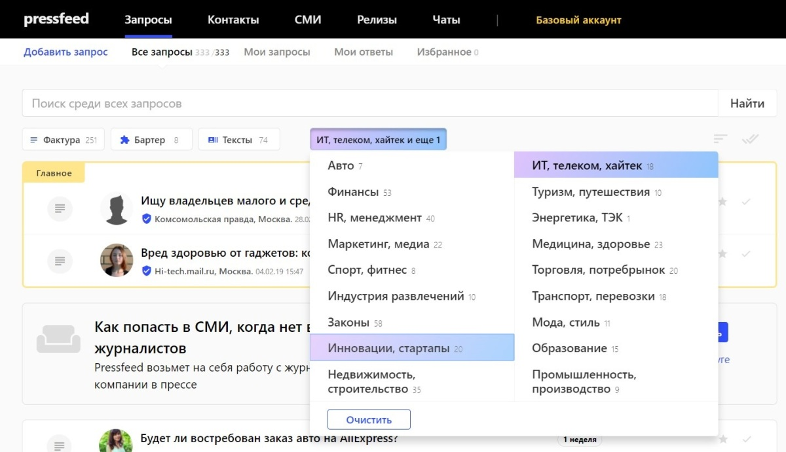  
_Поиск запросов_

Более того, можно оформить подписку на отраслевые запросы, и тогда они сразу будут приходить на почту.

**Бизнес-медиа**

Публикации в деловых издания нацелены, прежде всего, на собственников бизнеса, топ-менеджеров, руководителей госпредприятий. В этом случае мы идем в «Ведомости», РБК, «Эксперт». Но также компании интересны и региональные бизнес-медиа.

Например, мы сотрудничаем с «РБК Татарстан», в конце 2018 года делали для издания большой обзор по трендам ИТ-рынка.

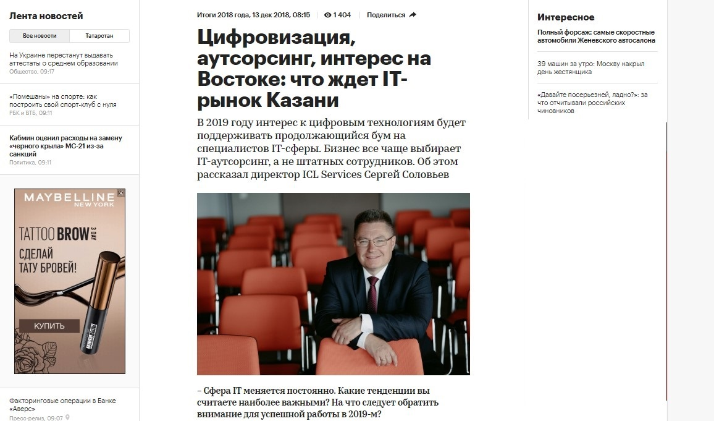  
[_Публикация на «РБК»_](https://rt.rbc.ru/tatarstan/13/12/2018/5c1103f59a794707481ae780)

> Если хотите попасть на страницы медиа-гигантов, то лучше начать заходить к ним со стороны региональных редакций, а затем уже прощупывать почву на федеральном уровне.

Ну и мониторить запросы от деловых ресурсов на Pressfeed: например, с помощью сервиса мы публиковали колонку в бизнес-издании «Деловой мир».

  
[_Запрос от издания_](https://pressfeed.ru/query/47812) _«Деловой мир»_

[Директор по маркетингу Лилия Алеева дала советы](https://delovoymir.biz/kak-kompanii-ne-propustit-ni-odnogo-zvonka-ot-klientov.html) на тему, как выстроить эффективную систему приема входящих звонков в компании: кто должен этим заниматься, по каким алгоритмам и как не пропустить ни одного входящего сообщения. Публикация набрала более 2 тыс. просмотров.

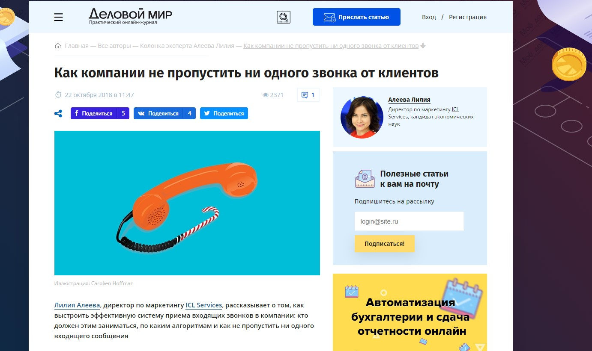

**Остальные издания (HR, маркетинг и т. д.)**

В последние годы мы стали активно сотрудничать с порталами по HR-тематике. Рекрутеры, менеджеры по персоналу, найму и адаптации, внутренние тренеры стали вести блоги в различных медиа.

Через Pressfeed мы несколько раз (а именно 12) давали комментарий для профильного издания HR-tv. Как-то был [интересный вопрос](https://pressfeed.ru/query/33441) от редакции: какие 5 шагов позволят компании стать желанным работодателем для молодых соискателей.

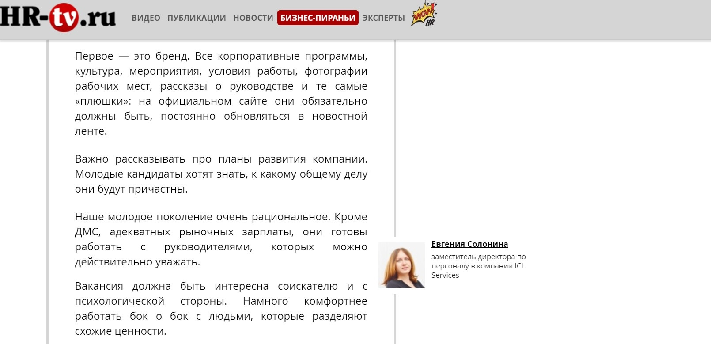  
[_Публикация_](https://hr-tv.ru/piranhas/5-shagov-k-rabotodatelju-dlja-molodyh/) _с участием компании_

Заместитель директора по персоналу высказала свое мнение, как привлекать в компанию молодых талантливых специалистов.

Кстати, на сервисе есть удобная функция: в личном профиле пиарщика отображаются все эксперты, от лица которых он дает комментарии. Логично, что за каждую тематику в компании отвечает определенный руководитель. Когда журналист получает ответ, он сразу видит, кто именно будет спикером от компании. Это значительно сокращает время на заполнение однотипной информации (ФИО эксперта, его должность, краткая биография и область интересов).

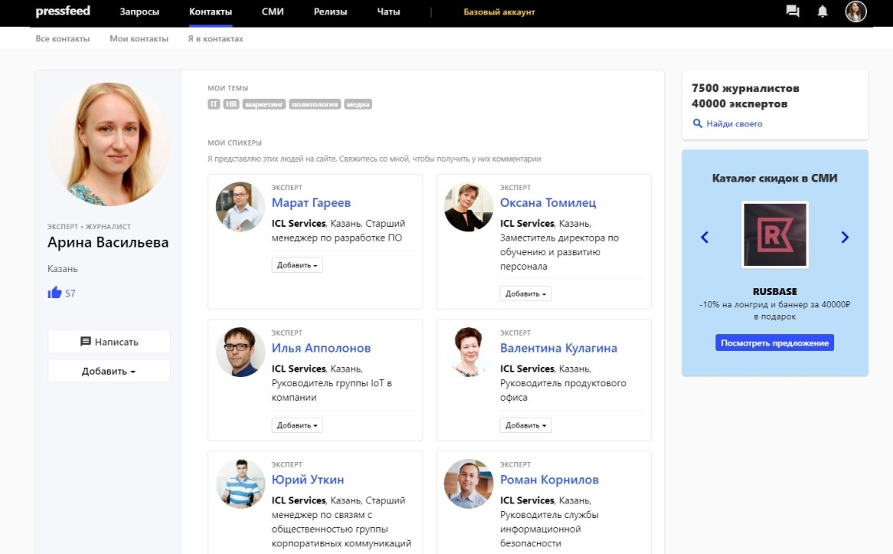  
[_Личный профиль_](https://pressfeed.ru/people/512) _pr-специалиста ICL Services_

## Как публикации в СМИ помогают бизнесу развиваться

Несмотря на то, что некоторые публикации «выстреливают» и приводят в компанию новых клиентов, все же пиар и контент-маркетинг только косвенно влияют на бизнес-результаты. После выхода очередного текста не стоит ждать роста продаж, ведь в b2b-сфере нет места для спонтанных покупок. Основная задача контента — демонстрировать экспертизу компании, влиять на тот образ компании, который складывается в голове у будущего заказчика. Публикации в СМИ — это инструмент, прежде всего, для формирования репутации и узнаваемости.

> Чем больше упоминаний о компании появляется в СМИ, тем больше людей и потенциальных клиентов узнает о ней, тем сильнее репутация бренда в медиапространстве. В 2018 году компания увеличила объемы сервисов на 30%, такой результат был получен благодаря слаженной работе команды маркетинга и продаж, в том числе благодаря выстроенной контент-стратегии.

Конечно, существуют метрики, которые помогают нам оценить эффективность пиар-продвижения и посмотреть, как меняется уровень медиадавления компании. Мы следим за МедиаИндексом — он анализирует индекс цитируемости материала, «ценность» публикации и тональность. Только за первый квартал 2019 года МедиаИндекс вырос на 20% (хотя мы планировали ежеквартальный рост в пределах 10%).

Кроме того, мы анализируем успех текстов в блогах по таким параметрам, как количество просмотров, социальная вовлеченность — лайки и репосты, отдельно следим за комментариями, чтобы вовремя ответить на вопросы читателей.

## Как мы мотивируем наших сотрудников писать тексты

За комплексную работу со СМИ и выход публикаций отвечает PR-подразделение. Однако сами тексты, в особенности если говорить о полноценных колонках или материалах для блога на Habr, пишут сотрудники, а PR-специалист лишь помогает им с доработкой. Как нам удается мотивировать сотрудников рассказывать о выполненных проектах, своем опыте и реальных кейсах?

В 2018 мы внедрили внутренний проект по поддержке авторов – «Клуб медиаэкспертов». Мы обучаем сотрудников техникам написания статей, а также ввели материальные бонусы для штатных «авторов», на это мы закладываем деньги в бюджет.

В итоге, к примеру, одна статья скоро станет главой в HR-книге. Запрос на статью мы получили тоже через сервис Pressfeed.

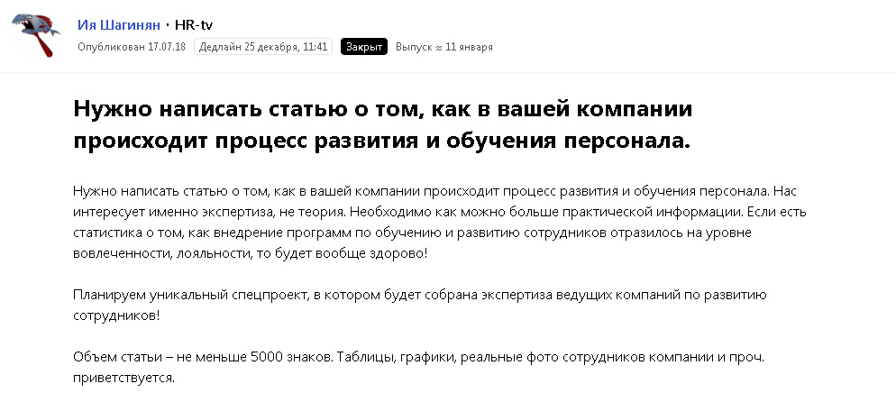

Директор по обучению и развитию персонала ICL Services заинтересовалась этим вопросом, так как является опытным экспертом в этом направлении. Сейчас этот большой [практико-ориетированный материал](https://hr-tv.ru/articles/razvitie-i-obuchenie-personala-v-it-kompanii.html) опубликован на сайте HR-tv, но также запланирован выпуск целой книги о том, как в российских компаниях обучают и развивают сотрудников.
