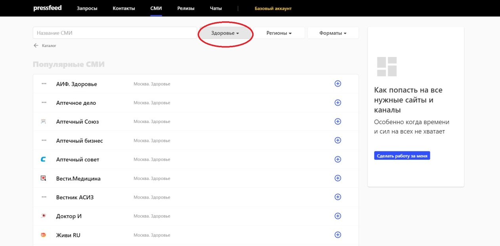

Коммуникационное агентство [Key2market](http://keytomarket.ru/) специализируется на PR, рекламе, маркетинге, event-менеджменте и стратегическом планировании. Прежде всего, мы работаем с проектами в области медицины и фармацевтики, хотя у нас есть клиенты и из других сегментов бизнеса ― образования, недвижимости, авиации, телекоммуникаций, E-commerce и т. д.

В этом тексте мы расскажем, как сервис Pressfeed помогает нам продвигать наши ключевые проекты.

## 1. Пиар-стратегия для «Лаборатории Гемотест»

«Лаборатория Гемотест» ― это один из лидеров лабораторной диагностики в России, компания выполняет более 55 млн тестов в год: от стандартных исследований до диагностики редких видов заболеваний. Лабораторные отделения «Гемотест» работают в 270 городах РФ, сейчас их число достигло 650. До 2016 года «Гемотест» практически не занимался PR-продвижением. Публикации появлялись, но довольно редко. Однако в середине 2016 года позиция руководства компании поменялась, и Key2market стали работать над реализацией пиар-стратегии.

**Старт работы и задачи**

Основная задача формулировалась так: мы должны были в разы увеличить количество и качество публикаций с участием «Гемотест», обеспечив активное присутствие бренда в медиапространстве. Для того чтобы отслеживать изменения, мы использовали систему «Медиалогия» и показатель медиа активности ― МедиаИндекс.

Нам нужно было выстраивать взаимоотношения с журналистами практически с нуля. На первом этапе мы определили целевые аудитории, а после этого обозначили каналы коммуникации и релевантные СМИ.

Совместно с руководством компании мы выбрали 8 тематических направлений, которые необходимо освещать в СМИ. Примеры направлений: «Успехи бизнеса», «Франшиза», «Лабораторные услуги», «Онкологическая экспертиза» и другие.

Таким образом, сложилось понимание, в каких СМИ мы хотим публиковать тексты:

* бизнес-издания;
* лайфстайл-порталы;
* отраслевые медицинские СМИ;
* региональные площадки;
* общественно-политические издания.

План работы был готов, и мы приступили к выполнению основной задачи ― написанию текстов и публикации их в медиа.

**Общение с журналистами через Pressfeed**

Классический способ, как попасть в СМИ, ― познакомиться с журналистами, выяснить редакционные планы, предложить темы для статей, оперативно предоставить спикеров. Такой подход отнимает много времени. От начала общения до выхода совместного материала может пройти несколько месяцев. Поэтому параллельно мы использовали сервис журналистских запросов Pressfeed ― с его помощью договариваться с изданиями и инициировать публикации получается просто и оперативно. При удачном раскладе текст с экспертом компании может появиться в СМИ уже через неделю после первого общения.

Сервис Pressfeed стал одним из основных PR-инструментов для налаживания отношений со СМИ только в 2017 году (именно с «Гемотестом», агентство использовало сервис до этого по другим проектам). На тот момент мы уже наладили поток пиар-публикаций, однако новые темы и запросы были нужны постоянно, поэтому было принято решение подключить платный аккаунт ― он дает возможность первыми видеть и отвечать на неограниченное количество запросов от журналистов. Цена тарифа «Эксперт» ― около 3,5 тыс. рублей за месяц.

Два раза в день (в 10 и 15 часов по московскому времени) сервис присылает рассылку с запросами. Мы выбираем актуальные запросы по нашей теме, оперативно списываемся с журналистом в чате, так же быстро получаем ответ и берем материал в работу. На Pressfeed мы сотрудничаем с различными форматами изданий и по разным тематикам, которые входят в интересы наших клиентов.

Например, мы познакомились и наладили связи с популярным лайфстайл-изданием Wonderzine. С тех пор регулярно отвечаем на их запросы именно с помощью Pressfeed. Один из запросов от редакции был посвящен сложной теме ― железодефицитной анемии.

[_Запрос_](https://pressfeed.ru/query/37289) _от издания Wonderzine_

Главный врач компании подробно ответил на все вопросы издания, и мы отправили журналисту ответы строго до дедлайна. Получился большой, полезный и важный материал с участием эксперта «Гемотест». Текст прочитали более 15 тысяч раз.

[_Публикация с участием компании_](https://www.wonderzine.com/wonderzine/health/wellness/230656-anemia)

> Через Pressfeed мы выпустили на площадке Wonderzine 5 совместных публикаций. Самым удачным получился текст о том, [как не заболеть от сквозняка или ветра](https://www.wonderzine.com/wonderzine/health/wellness/230072-draught). Его прочитали более 36 тысяч человек.

Кроме того, на сервисе мы подружились с изданием Letidor, пишущим на детско-родительские темы. Мы начинали общаться самостоятельно, напрямую, но по-настоящему хороший контакт удалось установить благодаря Pressfeed. К тому же, там было удобнее отслеживать их запросы по поиску врачей ― редактор издания Дарья Несета постоянно публикует там свои вопросы к экспертам.

_Страница издания Letidor на сервисе_

За время сотрудничества мы выпустили более 15 совместных публикаций.

  
[_Фрагмент публикации_](https://letidor.ru/zdorove/ne-tak-strashna-prostuda-kak-vozmozhnye-ot-nee-oslozhneniya.htm) _с участием эксперта компании_

Через Pressfeed мы время от времени работаем с отраслевыми изданиями по медицине. На сервисе зарегистрировано более 60 профильных изданий по тематике «Здоровье».

_СМИ в категории «Здоровье»_

Одно из самых известных изданий в отрасли ― «Фармацевтический вестник». Мы также чаще всего общались напрямую, но при этом никогда не пропускали запросы от издания на Pressfeed. Например, был материал о прививках.

  
[_Запрос_](https://pressfeed.ru/query/34660) _от издания «Фармацевтический вестник»_

Публикация вышла как в печатной, так и в электронной версии газеты.

[_Публикация_](https://pharmvestnik.ru/articles/osennee-obostrenie-konspirologii-prnt-17-m9-899.html#.Wje4N9K6-Uk) _с экспертом компании в «Фармацевтическом вестнике»_

И еще одна ценная история ― именно Pressfeed помог нам зайти в печатный глянец. Эксперт «Гемотеста» дал объемный комментарий для журнала №1 в категории Active Life Style ― журнала SHAPE. [Вопросы от журналиста](https://pressfeed.ru/query/33011) касались нормы уровня сахара в крови.

> Некоторые эксперты попадают в такие журналы за большие деньги, а мы попали бесплатно (если не считать цены подписки на сервис). Тем более, нужно понимать, что в статье появятся далеко не все ответы экспертов, а лишь лучшие. И если вы пользуетесь платным аккаунтом на сервисе, то получаете приоритет ― запросы приходят к вам на несколько часов раньше, чем к остальным подписчикам. Это дает возможность подготовить качественный комментарий и при этом отправить его в числе первых. Это удобно.

**Как измерить эффективность пиар: рост МедиаИндекса в 10 раз**

В работе с «Гемотест» мы делали примерно 80% публикаций своими силами через прямые контакты с журналистами, а 20% стабильно обеспечивала работа через Pressfeed. В совокупности это давало отличный результат.

Для того чтобы понять, достигнут ли результат и KPI, мы предоставляем клиенту отчеты, где обозначены:

* количество публикаций (по отраслям, по ЦА, по конкретному инфоповоду);
* качество публикаций (издания, их вес, формат публикации).

Например, в случае с «Гемотест», в 2017 году мы выпустили 150 публикаций, за 2018 ― уже 350 публикаций с упоминанием компании. Прирост за второй год работы составил 137%.

Оценить пиар в цифрах позволяет «Медиалогия» и такой показатель, как [МедиаИндекс](http://www.mlg.ru/about/technologies/#mediaindex), который складывается из трех показателей: индекс цитируемости, характер упоминания, заметность сообщения. Чем выше суммарный индекс компании, тем сильнее ее медиавлияние на целевую аудиторию. Нам удалось повысить данный показатель в 10 раз.

## 2. Продвижение фармацевтического колледжа «Новые знания»

Фармацевтический колледж «Новые знания» был основан в 2012 году и сегодня является единственным в Москве колледжем, готовящим специалистов-фармацевтов.

На старте совместной работы клиент поставил перед нами задачу ― увеличение числа платных студентов.

**Что мы решили делать:**

* генерировать информационные поводы и выпускать публикаций в профильных изданиях и СМИ для абитуриентов,
* запустить канал колледжа на Youtube,
* позиционировать колледж как современное и перспективное учебное заведение в социальных сетях.

Итак, подробнее о первом пункте ― как мы работали с медиа-площадками. Нам были интересны СМИ трех форматов:

* отраслевые СМИ о медицине и фармацевтике («Фармацевтический вестник», «Московские аптеки», «ЛекОбоз»);
* нишевые площадки для абитуриентов или сайты по поиску работы (блог HeadHunter, Где учиться и работать»);
* лайфстайл-издания, сайты с семейными темами (7ya.ru).

При продвижении Фармацевтического колледжа мы также обращались к помощи Pressfeed, чтобы получать публикации в целевых изданиях. Например, вышли на блог сайта HeadHunter. Мы рассказали им, как стать директором аптеки.

  
[_Публикация_](https://hh.ru/article/21558) _с упоминанием фармацевтического колледжа_

Затем мы делали статью для «Фармацевтического вестника». Смогли без проблем договориться, потому что когда-то ранее работали с изданием через Pressfeed.

Кстати, на сервисе удобно быстро искать запросы по конкретным отраслям. Например, в случае с Фармацевтическим колледжем можно обозначить запросы по темам «Медицина» и «Образование». Выбираете нужные фильтры и смотрите актуальные объявления от журналистов.

  
_Поиск запросов по тематикам_

Всего в течение трех лет работы с Фармацевтическим колледжем вышло более 150 публикаций (инициировали как через Pressfeed, так и по прямым связям). В итоге мы обеспечили семикратный рост числа платных студентов за два года. Конечно, публикации в СМИ ― это был лишь одним из задействованных инструментов продвижения, но они сыграли большую роль в итоговых результатах.

## 3. Пиар для центра лечебной педагогики «Особое детство»

С июля 2018 года наша команда работает с Центром лечебной педагогики «Особое детство». ЦЛП «Особое детство» был создан в 1989 году по инициативе родителей и педагогов для помощи детям с различными особенностями развития. Здесь занимаются дети с расстройствами аутистического спектра, эпилепсией, генетическими синдромами, трудностями обучения и другими проблемами.

Мы занимаемся комплексным PR для данного Центра. За время работы уже было опубликовано более 700 публикаций, в том числе при помощи Pressfeed.

Одна из самых ценных публикаций, которую мы сделали через сервис, была в газете «Известия».

[_Запрос на Pressfeed_](https://pressfeed.ru/query/54043)

В ней мы осветили проблему вокруг психоневрологических интернатов для людей с психическими расстройствами, в том числе детских интернатов. Как они изменятся за ближайшее время, какие реформы в них проходят и с чем сталкиваются их жители каждый день. 

  
[_Публикация на iz.ru_](https://iz.ru/864499/mariia-rubnikovich/po-reforme-pravilno-kak-izmeniatsia-psikhonevrologicheskie-internaty-v-rossii)

Через 1,5 месяца мы выпустили еще один материал в «Известиях» уже по своим связям. Он был посвящен [печальным условиям в российских детских домах-интернатах](https://iz.ru/881831/valeriia-nodelman/doma-ogranichennykh-vozmozhnostei-kak-kalechat-detei-v-internatakh). Факт остается фактом: если у вас получилось организовать несколько публикаций сначала через Pressfeed, то потом общаться с редакцией напрямую будет гораздо легче, они будут адекватнее вас воспринимать.

Три этих кейса доказывают, что сервис Pressfeed давно стал обязательным инструментом в «портфеле» пиар-специалиста. Не используя эту платформу, компания лишается возможности получить десятки качественных публикаций в лучших российских СМИ.
