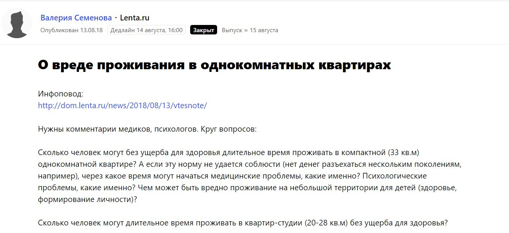
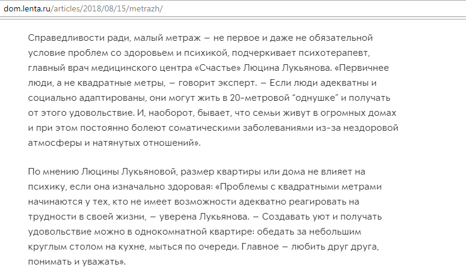
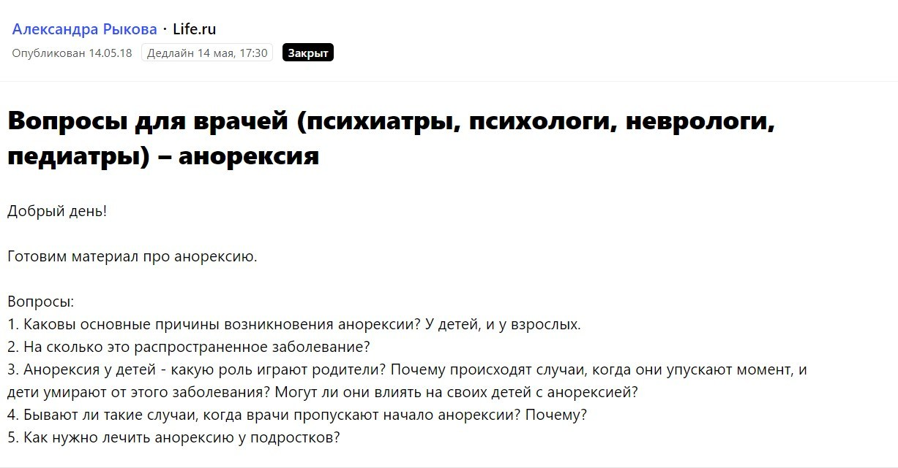
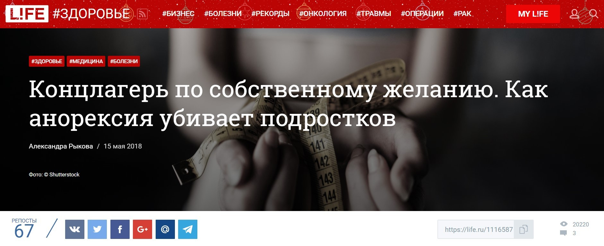
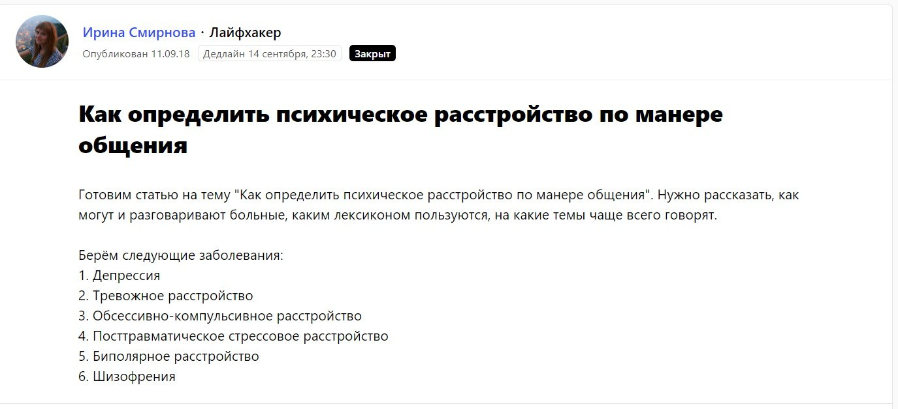
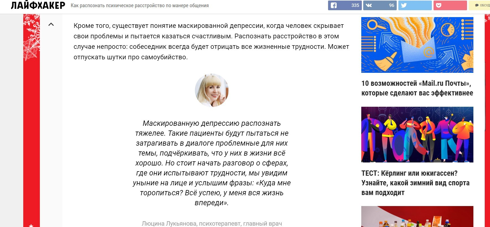
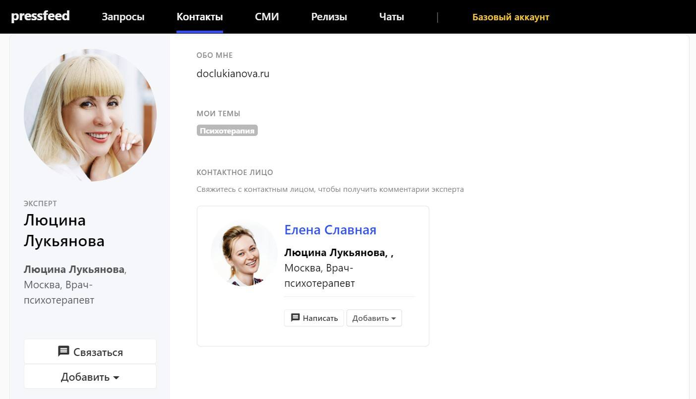
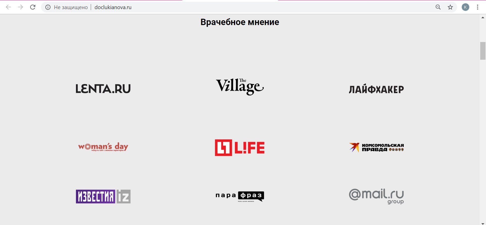

## Зачем психотерапевту-эксперту нужны публикации в популярных СМИ

Люцина Лукьянова — опытный психотерапевт, основатель и главный врач медицинского центра «Счастье» в городе Йошкар-Ола. Летом 2018 года Люцина приступила к написанию собственной книги о счастливой жизни.

Книга — это мощный PR-инструмент, который может вывести эксперта на всероссийский уровень, привлечь новых клиентов, продвигать тренинги психотерапевта на широкую аудиторию. PR-агентство SCHUKA активно помогает Люцине писать книгу, а затем будет комплексно продвигать издание.

Однако еще до выхода книги в свет агентству было необходимо провести большую подготовительную работу: в том числе создать пресс-кит и [посадочную страницу](http://doclukianova.ru/). Основная функция сайта и пресс-кита — рассказать об авторе как об эксперте, профессионале в своем деле, о его заслугах и выдающемся опыте в психотерапии. На сайте нужно было разместить биографию эксперта, отзывы о работе от пациентов и, что очень важно, публикации в крупных СМИ с участием врача.

Публикации в СМИ демонстрируют статусность и профессионализм психотерапевта. Другими словами, хорошее портфолио доказывает, что эксперту доверяют не только его клиенты и какие-то абстрактные люди, а уважаемые и известные издания готовы поручиться за знания и опыт этого эксперта. Потенциальный пациент, который только выбирает психотерапевта, обратит внимание на портфолио и, наверняка, сделает выбор в пользу эксперта или, как минимум, захочет прочитать его книгу.

## Задача агентства: собрать портфолио за максимально короткий срок

Составить биографию и собрать отзывы клиентов — дело простое, а вот быстро создать портфолио с публикациями в федеральных СМИ — задача более трудоемкая и серьезная. На момент начала работы SCHUKA с Люциной Лукьяновой в портфолио психотерапевта были лишь статьи в печатных местных СМИ, распространяемых в регионе, — эта тактика была правильной для продвижения клиники, но не для врача, задумавшего написать и опубликовать книгу для читателей России. Тогда у нас появилась конкретная задача — за минимальный срок (3-4 месяца) «вывести» Люцину в федеральные СМИ и собрать портфолио с ее экспертными публикациями. К осени 2018 года мы хотели получить на сайте эксперта около 8-10 публикаций.

С учетом 14-часовой занятости клиента в клинике, мы понимали, что вариант со статьями, которые бы готовил врач, а мы редактировали и отправляли в СМИ, нам не подойдет. Мы выбрали схему «журналист просит комментарий — мы оперативно предоставляем». Чтобы не знакомиться с журналистами напрямую и не терять время на выстраивание отношений, мы зарегистрировали эксперта на сервисе журналистских запросов [Pressfeed](https://pressfeed.ru/). С его помощью мы сразу видели картину происходящего в медиа: какое СМИ просит комментарий — тема будущего материала — срок сдачи комментария.

## На какие запросы мы отвечали

Среди запросов нас, прежде всего, интересовали темы: девиантное поведение, психосоматические заболевания, любовные перипетии, зависимости 21 века, харрасмент и т. д. С учетом этих тем мы составили план работы. Он отвечал на вопросы: куда мы хотим попасть и на какие запросы следует реагировать.

В первую очередь, мы хотели давать комментарии только для высоко аудиторных, популярных СМИ с «громкими именем». Это Lenta.ru, Life.ru, «Лайфхакер» и так далее.

> Если вам необходимо сформировать действительно экспертное портфолио, не гонитесь за количеством СМИ, думайте о качестве, но прежде всего, об аудитории — есть ли среди читателей медиа ваши будущие клиенты.

На Pressfeed работают журналисты из более чем 4 тысяч изданий, и там есть все площадки, которые могли быть нам интересны. То есть при отборе запросов мы смотрели на два фактора: 1) подходящая тема; 2) популярность издания. Работали на качество и «показательность» публикаций, а не на их количество.

## Процесс работы со СМИ через Pressfeed

Так как нужные нам тематики являются довольно узкими и специфичными, мы в ежедневном режиме вручную отслеживали все запросы, появляющиеся на сервисе. В этом сильно помогает рассылка — она приходит каждый день в 10 и 15 часов по московскому времени.

По нашему опыту, залог попадания вашего комментария в статью — быть первым или хотя бы в первой тройке тех, кто прислал ответ. Так было и с комментарием для Lenta.ru. Это был срочный запрос. Мы отработали его оперативно и конструктивно, чтобы попасть «в эфир».

  
[_Запрос_](https://pressfeed.ru/query/46444) _журналиста Lenta.ru на сервисе Pressfeed_

В итоге комментарий Люцины появился в статье одного из крупнейших изданий России.

  
_Публикация с участием врача на_ [_Lenta.ru_](http://dom.lenta.ru/articles/2018/08/15/metrazh/)

Таким же образом несколько комментариев Люцины вышли на популярном сайте Life.ru (около 13 миллионов уникальных посетителей в месяц).

  
[_Запрос_](https://pressfeed.ru/query/43290) _от журналиста Life.ru_

В одном из них врач говорила о [проблеме анорексии среди подростков](https://life.ru/t/%D0%B7%D0%B4%D0%BE%D1%80%D0%BE%D0%B2%D1%8C%D0%B5/1116587/kontslaghier_po_sobstviennomu_zhielaniiu_kak_anorieksiia_ubivaiet_podrostkov). Материал набрал более 20 тысяч просмотров.

_Публикация с участием эксперта_

Несрочные запросы (когда журналисты готовы ждать более недели) мы отрабатывали в течение 1-2 дней. Несмотря на далекий дедлайн, тянуть кота за хвост не стоит — помните, первая тройка! Так в портфолио попала публикация на сайте «Лайфхакер».

  
[_Запрос_](https://pressfeed.ru/query/47412) _на Pressfeed_

> Материал с участием Люцины на «Лайфхакере» собрал почти 225 тысяч прочтений! И наш эксперт стоял на первом месте среди всех участников публикации. Это успех. При условии, что у нас не было предварительных договоренностей с изданием, и мы работали только через Pressfeed.

[_Комментарий Люцины Лукьяновой_](https://lifehacker.ru/psixicheskoe-rasstrojstvo/) _для «Лайфхакера»_

Хотим дать один совет тем пиарщикам, которые отвечают на запросы не от своего имени, а от имени своего эксперта. Заполните в своем профиле раздел «Мои эксперты»: добавьте в него человека, которого представляете. Тогда профиль эксперта будет виден пользователям, как профиль любого другого юзера. Его можно найти в поиске, но при попытке связаться с ним, например, через чат, пользователю будет сообщаться, что его представитель — вы, и все вопросы нужно адресовать вам. Таким образом, вы можете сделать свою компанию на сервисе более «видимой» для журналиста.

  
[_Карточка Люцины Лукьяновой_](https://pressfeed.ru/people/34399) _на Pressfeed_

Например, в нашем случае все журналисты, которым потребовалось мнение квалифицированного психотерапевта, легко находят Люцину на сервисе, но связываются и общаются сразу напрямую с PR-специалистом через внутренний чат Pressfeed.

## Результат работы на Pressfeed

За 3 месяца мы выпустили 9 публикаций в крупных СМИ с участием Люцины Лукьяновой. Все комментарии были сделаны через сервис Pressfeed. Без платформы мы бы не собрали качественное портфолио настолько оперативно. Каждое издание имеет имя и узнаваемость, каждая публикация имеет значение для формирования статуса эксперта.

_Портфолио на сайте эксперта (на декабрь 2018)_

Задача по первичному сбору публикаций для сайта Люцины Лукьяновой выполнена, однако сейчас мы не перестали пополнять портфолио и хотим, чтобы к выходу книги нашего эксперта знали, как одного из самых опытных и лучших психотерапевтов в стране.
