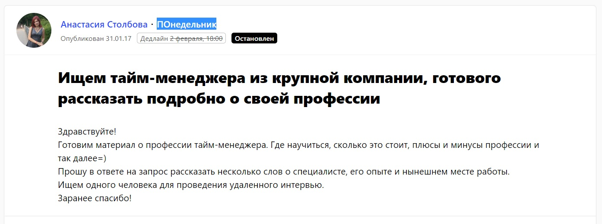

## Чем занимается компания, и на кого направлен PR

У компаний ㅡ [«Международная Академии исследования лжи»](http://studylie.ru/) (МАИЛ) и [«Международный центр детекции лжи и профайлинга»](https://icds-group.com/) (ICDS) ㅡ редкая и крайне интересная специализация: обучение специалистов разных профессий навыкам в области социальной психологии, профайлинга и безинструментальной детекции лжи.

Постараюсь объяснить кратко. Профайлинг ㅡ это методика «чтения людей», позволяющая оценить психологические особенности человека. Буквально за две минуты вы сможете «прочитать» человека: его качества и ценности, привычки и особенности, убеждения, мотивацию и многое другое. А также спрогнозировать его поведение.

Основная аудитория, на которую направлены услуги обеих компаний, ㅡ думающие, развивающиеся люди в возрасте от 25 до 55 лет. МАИЛ и ICDS будут одинаково интересны сотрудникам кадровых служб и служб безопасности, предпринимателям и руководителям, психологам и юристам, а также всем, кто хочет научиться «видеть людей насквозь».

## Цели PR-продвижения: зачем компании нужны упоминания в СМИ

Как я уже отметила, тема у компании необычная, сложная, но полезная для тех, кто постоянно работает с людьми. Чтобы убедить потенциальных клиентов МАИЛ и ICDS, насколько ценными могут быть знания в области профайлинга и верификации лжи, необходимо постоянно повышать узнаваемость брендов среди целевой аудитории, рассказывать о сути своих услуг, быть на слуху, популяризировать систему профайлинга.

Формирование общественного мнения и интереса к услуге через публикации в печатных изданиях, выступления на радио и ТВ ㅡ это один из главных методов продвижения компаний. И если придерживаться этого подхода, то не эксперт/производитель бегает за клиентом, а сам человек проявляет искренний интерес к компании, продукту или услуге.

Политика компаний ㅡ продвижение через инструменты маркетинга и PR: публикации в СМИ, статьи на сайте, бесплатные вебинары, видео на Youtube, прямые эфиры в соцсетях и издание книг по данной тематике. В этих компаниях никогда не было стандартного подхода к продажам: клиенты приходят сами, а менеджеры принимают только входящие звонки.

> Когда вы научитесь доносить информацию о своем продукте до большого числа потенциальных покупателей через хорошие и понятные материалы, то вопрос привлечения клиентов будет закрыт. Отдел продаж и холодные звонки ㅡ это атавизм. Однако важно помнить, что все это работает при условии, если предлагаемый продукт ㅡ нестандартный и уникальный.

Какие задачи стоят перед публикациями в СМИ? Я выделяю 3 задачи:

1. познакомить людей с экспертом или экспертами (формирование имиджа) и сферой его/их деятельности;
2. заинтересовать услугами компании;
3. упомянуть название компании (работа на узнаваемость бренда).

Главное, что эти действия обязательно отразятся на продажах.

## Как общаться со СМИ и делать публикации регулярно

Налаживать связи с журналистами ㅡ долгая и упорная работа. Сформировать рабочую базу СМИ за неделю, даже за месяц, невозможно: обычно контакты собираются годами. Этот процесс можно значительно ускорить с помощью специальных автоматизированных сервисов. Я пользуюсь сервисом журналистских запросов [Pressfeed](https://pressfeed.ru/) с момента его создания, то есть с начала 2015 года.

> Большой плюс сервиса в том, что эксперт не предлагает, не навязывает свое «компетентное мнение», а откликается на запрос журналиста. И тем самым помогает редакции подготовить материал и заявляет о себе как о специалисте, которому есть чем поделиться с читателями, зрителями или слушателями.

При работе с запросами по тематике МАИЛ и ICDS, это любые темы, касающиеся всего, в чем может пригодиться теория профайлинга. Психология и отношения между людьми, атмосфера в коллективе, устройство на работу, информационная безопасность, личная безопасность и так далее. Удобнее всего искать подходящие запросы с помощью поиска по ключевым словам и обязательно проверять ежедневную рассылку от сервиса (приходит в 10 и 15 часов по Москве).

_Пример поиска запросов по ключевым словам_

Хотя в целом я не ограничиваю тематики и издания и отталкиваюсь, прежде всего, от интересов целевой аудитории.

Приведу примеры, с какими изданиями и телеканалами получилось наладить отношения с помощью сервиса. Начну с телевидения, так как, несмотря на всемогущество интернета, оно остается одним из самых мощных и «охватных» каналов продвижения.

Благодаря Pressfeed легко выйти на продюсеров «Первого канала». Запрос, через который и произошло наше знакомство с продюсером, касался эмоционального выгорания.

[_Запрос_](https://pressfeed.ru/query/10659) _от «Первого канала»_

> В ходе работы с сервисом мы ответили на 12 запросов от канала, у меня появились контакты 3 продюсеров, и у нас вышло 10 телесюжетов с экспертами МАИЛ.

С телеканалом «НТВ» мы также подружились через Pressfeed, но с ними я действовала по-другому: не отвечала на запросы, а написала нескольким журналистам напрямую в личные сообщения.

Схема такая: заходите в [раздел «СМИ»](https://pressfeed.ru/smi-catalog), ищите по поиску [«НТВ»](https://pressfeed.ru/smi/4593), смотрите список журналистов, продюсеров, выбирайте понравившихся (или оценивайте по своим критериям), пишите в личные сообщения, рассказывайте о компании, об экспертах. Ответят не все и не сразу, но добыть нужные контакты получится. Это факт.

_Продюсеры «НТВ», которых можно найти на Pressfeed_

После общения с продюсерами я смогла организовать участие в передаче [«Двойные стандарты»](https://www.youtube.com/watch?v=919p8twLMNU) сразу двоих профайлеров-полиграфологов ㅡ Сабины Пантус и Александра Лукина.

Более того, с помощью Pressfeed эксперты МАИЛ и ICDS давали комментарии для нескольких десятков материалов в интернет-СМИ (за время использования Pressfeed я ответила на 256 запросов, так что посчитать сейчас точное количество вышедших материалов затруднительно).

Например, мы писали комментарий для Lady.Mail.ru на тревожную тему, как террористы вербуют российских женщин.

[_Запрос_](https://pressfeed.ru/query/13495) _от Lady.Mail.ru_

Эксперт МАИЛ раскрыл способы, как именно манипулируют женщинами.

[_Публикация_](https://lady.mail.ru/article/488295-kak-terroristy-iz-igil-verbujut-zhenshhin-v-internete/) _с участием компании_

У меня сложились отличные отношения с интернет-журналом «ПОнедельник» ㅡ это журнал о бизнесе, карьере и образовании. Первый раз я связалась с журналистом Анастасией Столбовой через Pressfeed еще в августе 2015, но совместная работа случилась в 2017 году, и мы сделали два материала.

Так, в одной публикации эксперт, бизнес-психолог, тайм-менеджер, руководитель направления HR в ICDS рассказала [об управлении временем](https://ponedelnikmag.com/post/nadezhda-povolockaya-upravlyaya-vremenem-upravlyaesh-zhiznyu).

  
[_Запрос_](https://pressfeed.ru/query/27946) _от журнала «ПОнедельник»_

Другой материал был посвящен [бизнес-вербовке и ее специфике](https://ponedelnikmag.com/post/zaverbovan-i-ochen-opasen), в нем интервью давал руководитель ICDS Евгений Спирица.

Так как HR-специалисты ㅡ это одна из приоритетных целевых аудиторий компании, я всегда с радостью отвечаю на запросы профильных HR-площадок. Например, запрос от редакции блога портала по поиску работы «Зарплата.ру» превратился в занимательную статью о том, как рабочий стол сотрудника характеризует его как специалиста и личность.

[_Запрос_](https://pressfeed.ru/query/18533) _от «Зарплата.ру»_

> В этом материале эксперт МАИЛ Александр Лукин был единственным выступающим, и за 2,5 года публикация «Эксперимент: гадание по столам» собрала 160 тысяч прочтений и 154 комментария! Напомню, что за публикацию мы ничего не платили, только дали развернутый комментарий.

[_Публикация_](https://www.zarplata.ru/articles/2435303) _в блоге «Зарплата.ру»_

Кроме того, однажды компания МАИЛ специально для журналистов устраивала бесплатное обучение и эксклюзивный эксперимент «Обмани детектор лжи». Многих журналистов, которые стали участниками этого действия, я нашла именно через Pressfeed.

## Советы: как эффективно работать с журналистами и продвигать экспертов

Как я уже сказала, вы всегда можете найти нужного продюсера или журналиста на Pressfeed, а затем написать ему свое предложение, рассказать о компании, предложить сотрудничество.

Вот что я советую сделать перед тем, как писать журналисту или продюсеру:

* заранее обдумать, как выделить вашего эксперта, подчеркнуть его уникальность (эксклюзивность ㅡ наше все!);
* подготовить «доказательную базу» статусности и известности эксперта ㅡ как минимум, дать ссылки на другие материалы в авторитетных СМИ;
* не ограничиваться узкой темой, помнить о гибкости и вариативности (как пиарщика, так и самого эксперта). Иногда запрос бывает не по рабочей теме: например, рассказать о становлении бизнеса, о кадровых стратегиях, об устройстве офиса. И пусть это не конкретный спич о психологии, но возможность рассказать о спикере и его мировоззрении;
* сразу перечислить темы, в которых компетентен ваш эксперт, чтобы поработать в будущем, если не получилось найти точки пересечений с редакцией с первого раза;
* всегда помнить, что сотрудничество должно приносить пользу обеим сторонам, как СМИ, так и эксперту;
* быть готовым отвечать быстро. Это играет важную роль, если у журналиста горят сроки (а такое бывает часто!).

## Текущие результаты работы со СМИ

Работа со СМИ имеет пролонгированный эффект. Не стоит расстраиваться, если вам удаются публикации только на новоиспеченных интернет-площадках. Обычно после большого количества статей следующим шагом идет телевидение, радио, а затем эксперта приглашают выступить на отраслевых конференциях, крупных мероприятиях.

Каждый месяц мы организовываем 3-5 публикаций/эфиров в медиа (онлайн-площадки, радио, телевидение) с участием экспертов МАИЛ и ICDS. Из них около 40% делаем непосредственно или косвенно через Pressfeed. Под косвенной помощью я имею в виду такую ситуацию: с журналистом познакомились на Pressfeed, а он уже потом обращался лично или рекомендовал коллегам. Так или иначе сегодня сервис Pressfeed ㅡ один из главных помощников пиарщика.

Сейчас я могу с уверенностью сказать, что наше взаимодействие со СМИ в десятки раз повысило узнаваемость МАИЛ и ICDS. Если раньше журналисты приезжали в компании один-два раза за полгода, то после подключения PR-инструментов интервью и съемки проходили в офисе еженедельно. В некоторые дни коллективу приходилось принимать до трех съемочных групп в день.

> Что касается бизнес-процессов, то количество посещений сайтов и тренингов увеличилось на 20% уже в первые полгода активной работы в PR-направлении. 

В целом можно сказать, что политика Евгения Спирицы оказалась верна. В своих интервью СМИ он часто упоминает, что бизнес «Международной Академии исследования лжи» начинался с уставного капитала в размере 15 тысяч рублей, а сейчас обороты компании увеличились в 100 раз.
