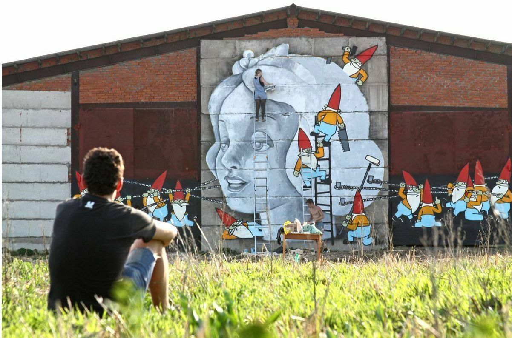
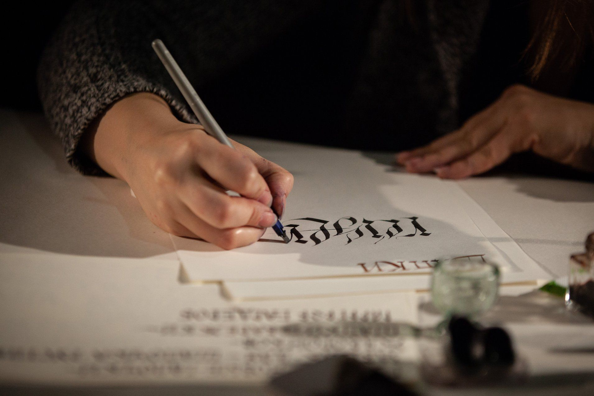
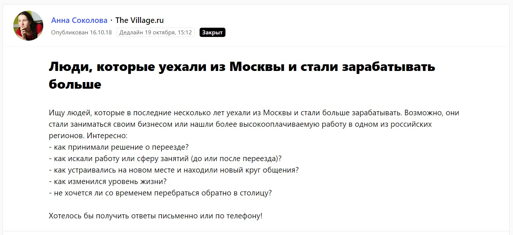
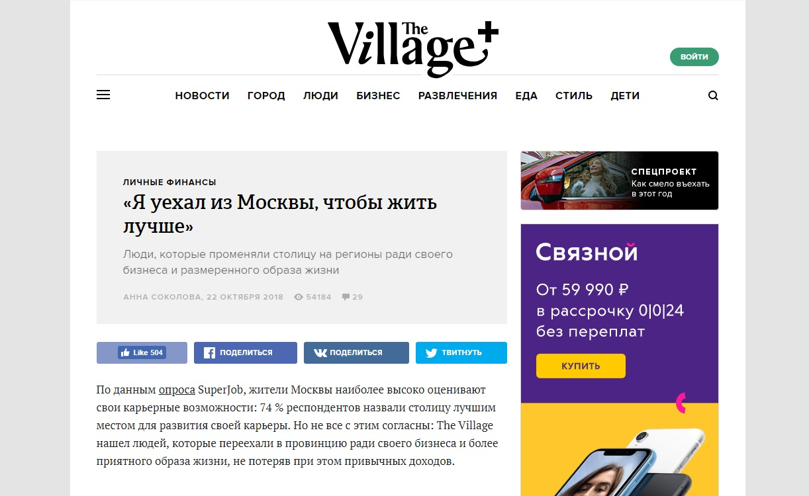
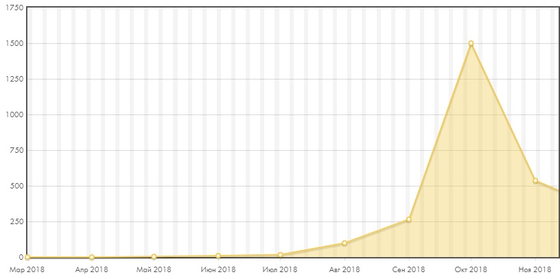
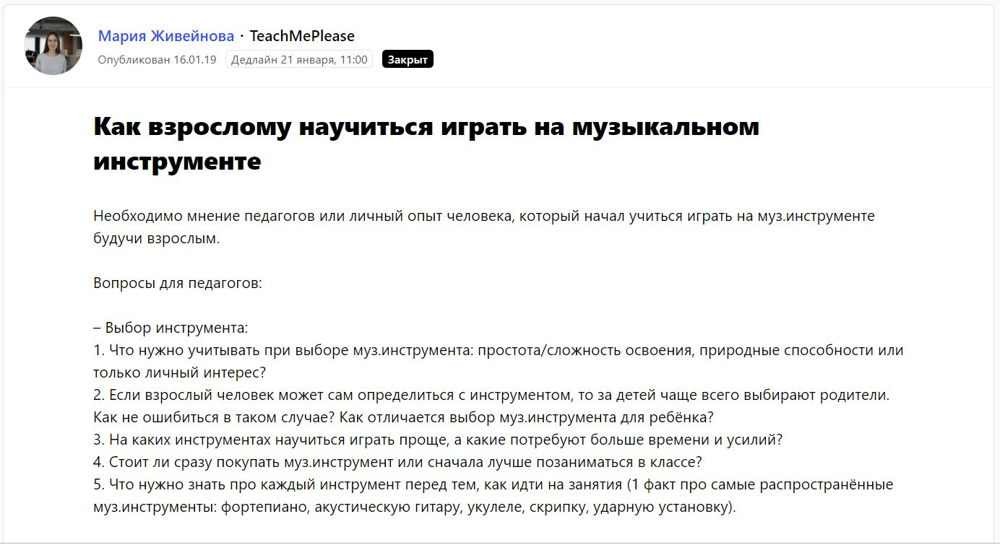
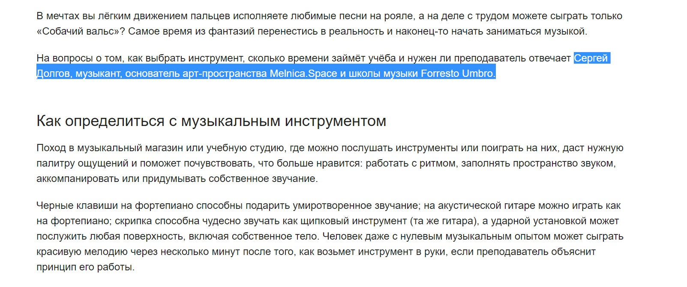
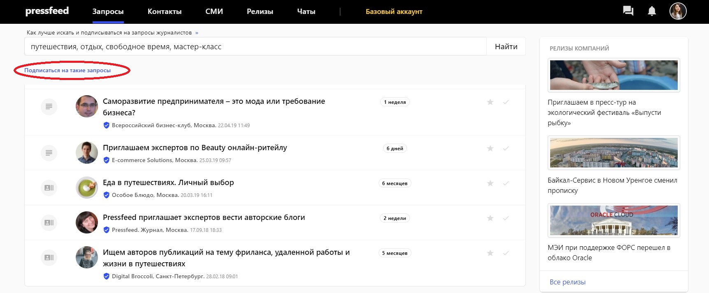
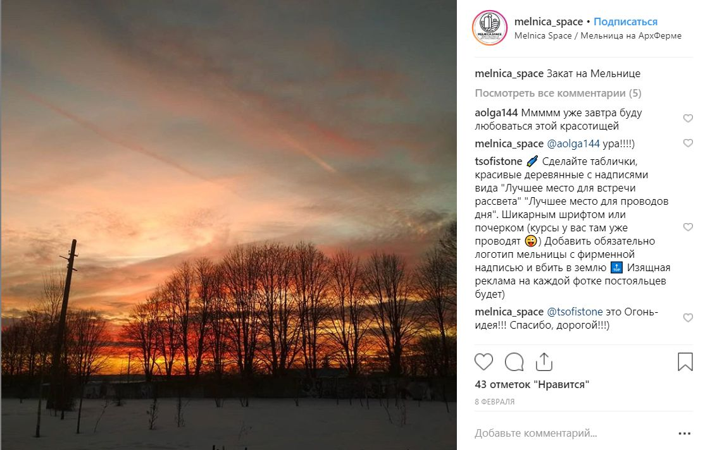

## Как мы решили открыть свой отель

Я и моя жена Ольга строили карьеру в сфере рекламы и пиара. Много лет мы продвигали чужие идеи и обычно общались с людьми в рамках строгих корпоративных норм. Со временем нам перестал нравиться такой подход к работе, поэтому мы начали искать занятие, которое позволило бы совместить то, что мы любим делать, с тем, как нам нравится жить. Так в сентябре 2018 года мы открыли Melnica Space ― лофт-пансион и арт-пространство в Тульской области на территории бывшей советской фермы. Получился семейный дом отдыха в современном творческом формате. Семейный в данном случае означает, что мы управляем отелем как семья и принимаем гостей не как гостиница, а как большой дружеский дом.

Почему именно Тульская область? Мы объездили Подмосковье и прилегающие регионы в поисках «своего» места, просмотрели множество объектов и территорий. В итоге остановились на пространстве, которое несколько лет назад уже было популярным местом у московской креативной тусовки. Проект «АрхФерма» был открыт 10 лет назад и до 2013 года существовал как арт-кластер уровня «Флакона» в Москве или «Николы-Ленивца» в Калужской области. Изначально все здания на территории были частью обычной советской фермы, но команда времен «АрхФермы» придала им современный вид, создала уютную атмосферу, построила арт-объекты.

_Пространство Melnica Space_

Однако в 2014-м проект был заморожен, и «АрхФерма» начала медленно разрушаться. Почти 4 года на ее территории ничего не происходило, туда никто не приезжал, а арт-объекты либо разбирались местными жителями, либо просто портились от времени. Когда мы увидели территорию и дома, нам понравилась энергетика места, и мы решили, что хотим вдохнуть в эту ферму новую жизнь.

У территории есть собственники, которые в свое время тоже вкладывались в развитие «АрхФермы». Когда мы пришли к ним с нашей идеей создать здесь Melnica Space, сначала они восприняли это с некоторым удивлением, но затем оценили нашу концепцию. Мы взяли в аренду несколько зданий (сумму и условия аренды разглашать не можем) и приступили к ремонту. На ремонт и сопутствующие приготовления потратили около полумиллиона рублей, кредитов не брали, а использовали большую часть личных накоплений.

## Почему у нас получилось

До открытия Melnica Space в путешествиях мы посещали старинные усадьбы и современные домашние гостиницы, творческие и фермерские резиденции. И быстро поняли, что самые интересные площадки отличаются не столько дизайном интерьера или окрестностями, а людьми, которые нас встречают. Те места, где сами хозяева являются центром притяжения, будут всегда привлекать гостей.

Мы относимся к «Мельнице» как к своему дому (которым она и является), это и нравится нашим посетителям. Для нас важно оказать радушный прием каждому человеку. Мы все делаем «от души» и развиваем то, что притягивает нас самих. Каждые выходные мы организуем мастер-классы и тренинги, у нас можно познакомиться с редкими винами и фермерскими продуктами, пообщаться с интересными людьми, научиться играть на музыкальных инструментах или брать уроки танцев. Люди хотят приезжать еще и рассказывают о нас своим друзьям. Многие гости были на «Мельнице» не менее 4 раз за последние 6 месяцев.

_Мастер-класс по каллиграфии_

Обычно у нас гостят жители Москвы (80%), Московской области (10%) и Тулы (10%). Чаще всего это большие компании по выходным, бывают те, кто выбирается на несколько дней поработать вдали от города или переключиться во время отпуска. По будням у нас живут мамы с детьми.

Пока основная доля дохода от проекта ― это небольшие корпоративы и тренинги выходного дня. Хотя важно отметить, что даже организаторы мероприятий обычно сначала приезжают к нам как обычные гости, а только потом делают заказ на конкретное событие.

## С чего начали продвижение проекта

В течение весны и лета 2018 года мы готовились к открытию и на наших друзьях проверяли разные гипотезы: как встречать гостей, как их развлекать, чего не хватает для комфортного проживания, какие фишки еще стоит добавить.

Когда продумывали стратегию продвижения, прежде всего, руководствовались принципом «content is the king». С самого начала мы решили не вкладываться в прямую рекламу, а сосредоточиться на трансляции в медиа того образа жизни, который ведем мы сами и предлагаем нашим гостям. Наша основная задача в рамках маркетинга и PR ― с помощью хорошего контента привлечь внимание к пространству, пригласить погостить у нас, оставить у людей хорошие впечатления, а дальше ― начнет работать сарафанное радио и рекомендации.

Продвижение начали задолго до запуска проекта: сделали сайт и страницы в социальных сетях, сразу стали выкладывать новости, красивые фотографии пространства и окрестностей. Так мы смогли подогреть интерес к новому месту, поэтому сразу после открытия к нам приехали первые гости, которые уже знали о «Мельнице». Уже после открытия Melnica Space мы подключили контент-маркетинг и стали делать публикации в СМИ. Так что сейчас мы используем два основных канала продвижения ― статьи в медиа и социальные сети.

## Контент-маркетинг и публикации в СМИ

Еще до официального открытия Мельницы осенью 2018 года мы стали заниматься контент-маркетингом и PR-продвижением в СМИ. Публикации делаем на интеллектуальных, образовательных, развлекательных lifestyle-ресурсах. Пишем тексты и даем комментарии на наши магистральные темы, которые связаны с деятельностью Melnica Space: путешествия, досуг, отдых. Также интересны близкие темы: дизайн, маркетинг, образование, телесные практики, музыка, танец, кухня народов мира.

Со СМИ работаем через сервис журналистских запросов Pressfeed ― это платформа, где журналисты ищут героев и экспертов для публикаций. Ежедневно смотрим запросы, которые приходят на почту, и оперативно реагируем. Если запрос срочный, то нам удобнее написать журналисту на Facebook и уточнить какие-то моменты по будущей публикации через мессенджер. Бывает, что проще ответить через сервис и ждать решения журналиста ― подойдет ему наш комментарий или нет.

> Публикации в крупных известных площадках отлично работают на привлечение внимания к нашему проекту. Самая первая публикация, которая вышла в The Village в октябре, в моменте увеличила посещаемость сайта в 4 раза, статью прочитали более 54 тысяч человек.

Этот материал был посвящен людям, которые оставили свою успешную работу в Москве и переехали жить в провинцию.

[_Запрос на Pressfeed_](https://pressfeed.ru/query/48721)

Мы связались с журналистом и предложили свою историю, рассказали о Melnica Space, как вообще возникла такая идея, как мы запускали проект. 

[_Публикация_](https://www.the-village.ru/village/business/personal-finance/329233-uehali-iz-moskvy?fbclid=IwAR1AMMydXBH2LnfIvrw-z9B5ooMvGCb1UC7E5D95OoiEQ9g2UL7HTwD3o7s) _на The Village_

Следом за этой публикацией о Мельнице сразу же написало нашумевшее издание «Батенька, да вы трансформер», то есть они сделали [репост в свою группу Facebook](https://www.facebook.com/batenka.ru/posts/1449601398507808) той статьи на The Village.

Еще через некоторое время нам уже напрямую позвонили с телеканала «НТВ» и предложили сняться в программе «Деловое утро». Съемочная группа канала приехала к нам, сделали [крутой репортаж](https://youtu.be/gxpnOZIY-lU), вместо отведенных на съемку и интервью 40 минут ребята провели у нас 5 часов.

> Так в октябре после публикации о Melnica Space на The Village, упоминания в группе «Батенька, да вы трансформер» и сюжета на «НТВ» посещаемость сайта выросла в 6 раз! Тогда же выросло количество обращений и желающих приехать к нам.

_Рост посещаемости сайта в октябре 2018_

Недавно через Pressfeed сделали материал об обучении музыкальной импровизации в блоге сервиса по подбору курсов TeachMePlease.

[_Запрос на Pressfeed_](https://pressfeed.ru/query/51626)

> В итоге получился не комментарий, а полноценный материал от нас, как научиться играть на музыкальных инструментах. После выхода этой публикации трафик на сайт вырос примерно в 2 раза.

[_Фрагмент публикации_](https://blog.teachmeplease.ru/posts/instruktsiya-kak-nachat-igrat-na-musikalnom-instrumente)

Кроме Pressfeed ничего не используем, время на исходящее взаимодействие с журналистами очень ограничено, так как в команде проекта нет отдельного пиарщика, все делаем своими силами. Сейчас мы реагируем только на те запросы, которые четко связаны с нашей деятельностью, и стараемся не распыляться. Для занятых людей, которые хотят при этом продвигаться в СМИ, сервис Pressfeed ― самый оптимальный инструмент.

Для более удобной работы с сервисом советую подписаться на все рассылки, также можно сформировать подписку по ключевым словам с тематиками, релевантными для вашего бизнеса.

_Пример подписки на запросы_

Пока в ближайших планах выпускать хотя бы по 2-3 публикации в месяц.

## Социальные сети

Страница Melnica Space в Facebook и аккаунт в Instagram ― главные площадки, на которых мы рассказываем о проекте. В ближайшее время планируем пойти во «ВКонтакте», там есть целевая аудитория, с которой мы еще никак не работали.

Мы часто публикуем фото и видео о том, как проводим время, чаще всего весело, легко и творчески. Например, на днях выложили в сториз Instagram спонтанную музыкальную импровизацию с нашими гостями под композицию маэстро джаза-мануш Джанго Рейнхардта и тут же получили в директ 4 запроса на заезд. Выкладываем фотографии наших красивых закатов.

_Страница в Instagram_

Публикуем посты практически каждый день, иногда даже по 2-3 фотографии в день. Пока на нашей странице не так много подписчиков ― чуть более 1,5 тысяч, зато мы знакомы практически с каждым, пусть и удаленно. Один из важных принципов smm-маркетинга ― работа с ядром подписчиков, когда каждого, кто подписался или лайкнул, ты включаешь в коммуникацию, знакомишься, делишься информацией, задаешь вопросы, рекомендуешь, то есть работаешь с ним, как с будущим гостем.

Что касается Facebook, в этой соцсети мы делаем упор на пиар мероприятий. Сначала делаем лендинг с описанием тренинга и формой регистрации, затем создаем мероприятие на Facebook и планируем контент-план публикаций на 5-15 постов в течение 4-6 недель до самого ивента. Публикуем анонсы, информацию о ведущих, раскрываем нюансы, знакомим с программой, делимся фотографиями с прошлых аналогичных событий, отвечаем на вопросы.

Деньги на платное продвижение в социальных сетях мы не закладываем: пробовали несколько раз запустить рекламу и суммарно потратили 5 тыс. рублей, но значимого результата не увидели. Эффективными оказались посты блогеров, которые сами (без нашей просьбы) писали о нашем пространстве и этим привлекали новых гостей из числа своих подписчиков. Мы стараемся создать такие условия, чтобы людям не надо было напоминать оставить отзыв или сделать фото. По нашим оценкам, не менее 30% продающего контента делают наши гости.

## Каких результатов мы добились за полгода работы проекта

У нас настроена сквозная аналитика и управление коммуникациями с помощью специальной связки сервисов Google, Trello, Tilda и нескольких собственных микро-сервисов, так что мы можем с большой вероятностью сказать, откуда приходит человек и что повлияло на его решение посетить «Мельницу».

> Примерно 20% наших клиентов мы получили из СМИ благодаря Pressfeed, не менее 50% принесли нам соцсети и еще 30% пришли по рекомендации от друзей, уже побывавших на «Мельнице». Причем со временем доля рекомендаций растет.

За 6 месяцев с небольшим бюджетом нам удалось сделать так, что место, о котором никто не знал, попало в перечень достопримечательностей Тульской области и стало любимым местом для многих. Сейчас поток гостей и мероприятий расписан на несколько месяцев вперед, у нас уже выкупают места на лето и осень.
