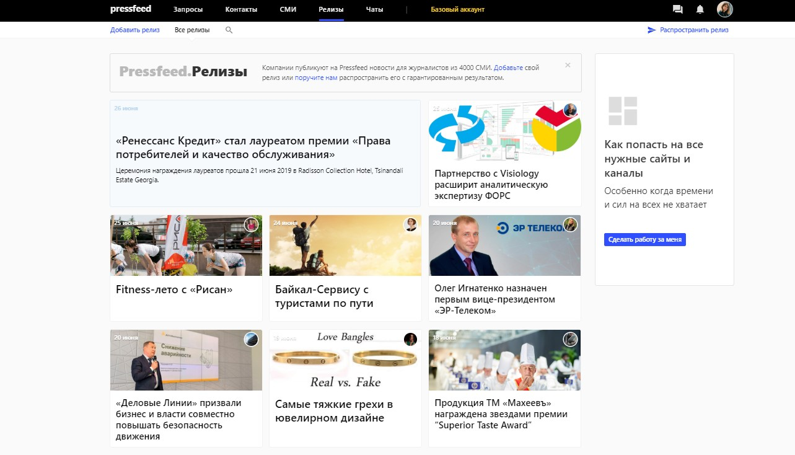

## Агентству тоже нужен пиар

Поговорка «сапожник без сапог» не относится к нашей компании. Считаем, что пиар нужен любому бренду, а коммуникационному агентству — тем более. Думаю, мы, как никто другой, понимаем важность этого направления в рамках продвижения бизнеса. Другое дело, что некоторые агентства так поглощены работой с текущими клиентами, что не находят времени на себя. Это неправильно. Кто, если не мы, расскажет о нашем агентстве целевой аудитории?

Наша первостепенная задача, которую решает пиар-продвижение, — повышение уровня доверия к PR Partner как к эксперту и забота о репутации. Работать на репутацию особенно важно для тех брендов, которые продвигают свои услуги на рынках с высокой конкуренцией. Публикации, эфиры, выступления на конференциях помогают клиенту выбрать именно ваш продукт из числа однотипных. Получается, что пиар влияет на продажи не так очевидно, как традиционные инструменты маркетинга, а он делает это постепенно и опосредованно. Пиар является важным связующим звеном в схеме: репутация — доверие — покупка.

Кроме того, когда вы выстраиваете концепцию по продвижению, важно заранее понимать, на кого будут направлены все действия. С помощью пиар и маркетинговых каналов мы хотим зацепить, прежде всего, директоров по развитию, по маркетингу, по пиар, а также самих собственников бизнеса. Это именно те лица, кто принимает решение — с каким агентством стоит начать сотрудничество.

Справка о компании:

Коммуникационное агентство PR Partner оказывает услуги в области связей с общественностью и маркетинга с 2006 года. Входит в десятку лучших коммуникационных агентств России (TOP-COMM, 2019). 40% заказчиков — это зарубежные компании, среди них TABASCO, Avast, Lenovo, Riverbed, VMware, Schneider Electric и многие другие.

Для продвижения мы используем, наверное, все существующие каналы: как классические, так и нестандартные. Чтобы вас запомнили, нужно быть везде. Однако публикации в СМИ — «старейший» способ коммуникации с целевой аудиторией, и он остается максимально эффективным и актуальным и в наши дни. 

## Публикации в СМИ: работали, работают и будут работать

Можно не верить в силу публикаций в СМИ, но от этого она не станет меньше. Это самый классический из всех классических пиар-инструментов, который показывает свою эффективность с того момента, как вообще появился термин «пиар».

Публикации в СМИ не нравятся тем, кто ждет только моментального результата. Сегодня вложили деньги — завтра видим результат. С пиаром такой подход не работает.

Сейчас почти все материалы читаются онлайн, а значит, потенциальный покупатель может наткнуться на публикацию в любое время. Еще долгое время после выхода статьи могут появляться в поисковых выдачах и мотивировать клиентов на покупку. К тому же, обычно поводом для конкретных действий является сумма материалов, а не какой-то один. Это долгосрочная история.

> В моменте можно посчитать охват, оценивать реакцию людей, количество перепостов. Смотреть, как растет трафик на сайт компании в день выхода публикации, растет ли количество брендовых запросов. Сервисы бизнес-аналитики сейчас позволяют отслеживать, из каких конкретно медиа пришел потенциальный и уже «теплый» клиент, если в статье стояла ссылка.

Согласно сервису «Медиалогия», с начала 2019 года в СМИ вышло около 300 публикаций, в которых так или иначе упоминается агентство PR Partner. В это число входят не только оригинальные материалы, но и перепечатки на других ресурсах. Мы инициируем их по-разному: это и прямое общение с редакциями, входящие запросы от журналистов, запросы от изданий на сервисе Pressfeed, а также помогает рассылка пресс-релизов.

**О чем говорим в СМИ и в какие издания идем**

Говорить нужно о том, в чем вы профессионал. Основные наши темы — пиар и маркетинг. Помимо этого, с радостью участвую в обсуждении HR-тематик. Все-таки я управляю PR Partner уже 13 лет, много историй накопилось. Могу также прокомментировать практически любой вопрос: экономический как предприниматель, родительский как мама троих детей.

В выборе изданий на первом месте деловые, затем отраслевые. Бывает, что клиенты стремятся попасть исключительно в 4-5 СМИ, которые у всех на слуху. Это ошибка, ведь статья в отраслевом СМИ будет прочитана тысячами уникальных, мотивированных целевых пользователей.

**Как выстраивать успешное сотрудничество с журналистами СМИ**

По долгу службы мы годами поддерживаем отношения с разными редакциями. Большинство журналистов уже знают нас и сами обращаются к нам за комментариями. Кроме того, мы научены опытом и понимаем, что нужно изданиям, как подать ту или иную тему.

Из недавних примеров: я дала интересный комментарий для «Независимой газеты» по просьбе журналиста. Рассказала о том, в чем вижу причину безработицы в России и каковы должны быть пути ее разрешения.

_Фрагмент_ [_публикации в «Независимой газете»_](http://www.ng.ru/economics/2019-06-05/1_7591_job.html)

Приятно видеть интерес СМИ к таким важным вещам и поделиться своим мнением.

> Для тех, кто пытается попасть в новое для компании издание, дам такой совет: большую роль играет первое обращение в СМИ. Нужно как можно более кратко описать тему обращения, не забыть представиться и обратиться к журналисту по имени. Полезно заранее изучить его публикации, сразу адаптировать свою тему с учетом персонального стиля.

Помимо комментариев я пишу полноценные статьи для профильных СМИ. Например, сразу вспоминаю «горячую» публикацию о клиентах для Rusbase. В ней я рассказала о самых шокирующих выходках и просьбах клиентов.

Несмотря на то, что некоторые из этих случаев звучат странно, вспоминать эти неизбежные в работе моменты было весело. Статью потом активно обсуждали на моей странице в Facebook.

[_Публикация на Rusbase_](https://rb.ru/opinion/istorii-o-klientah/)

> Если же вы по каким-то причинам еще не готовы предложить редакции полноценный материал, либо желаемое издание раз за разом отвергает ваши идеи, то попробуйте начать работу с ним через сервис [Pressfeed](https://pressfeed.ru/).

Автоматизированный сервис журналистских запросов — еще один проверенный способ выпускать публикации с участием компании в крупных медиа. Все просто: журналист пишет тему, по которой ему нужны комментарии экспертов для новой статьи. Указывает требования, ставит дедлайн, до которого он будет ждать ответы. Напишете нормальный развернутый ответ по делу — журналист возьмет его в материал. Регистрация на сервисе для всех бесплатная, но расширенные функции доступны только на платных тарифах. У нас подключен максимальный тариф «Агентство», так как мы используем Pressfeed не только для своих задач, но и для задач клиентов.

  
_Тарифы Pressfeed_

С тем же Rusbase мы много раз сотрудничали как напрямую, так и стараемся не пропускать запросы от издания на Pressfeed. Лучше пользоваться всеми доступными ресурсами, так у вас будет больше возможностей получить дополнительные упоминания. Как-то я давала комментарий по теме социальных проектов и инвесторов в России, в итоге редактор [взял его в материал](https://rb.ru/story/everland/).

  
[_Запрос от Rusbase_](https://pressfeed.ru/query/38913)

Также с помощью Pressfeed можно попасть в топ-издания, куда стремятся, пожалуй, все пиарщики нашей страны. Это такие деловые издания как «Коммерсантъ», Forbes, «РБК». Например, мы не один раз работали с «Коммерсантъ. Санкт-Петербург», из свежего — мой комментарий о влиянии цифровой экономики на образование.

  
[_Запрос от «Коммерсантъ. Санкт-Петербург»_](https://pressfeed.ru/query/55418)

Я перечислила вузы, которые я считаю самыми современными и качественными на данный момент.

  
[_Публикация в «Коммерсантъ. Санкт-Петербург»_](https://www.kommersant.ru/doc/3990010)

Не упускаем из виду и более скромные деловые ресурсы, например, бизнес-площадку из Казани «Реальное время». Редакция задавала вопрос по нашей теме: есть ли у пиарщика право на ошибку в его личных соцсетях?

  
[_Запрос от издания «Реальное время»_](https://pressfeed.ru/query/45859)

Я считаю, что сотрудник должен фильтровать информацию, которую они публикуют у себя на страницах. Как минимум, не вступать в сомнительные споры и не выкладывать компрометирующие фотографии. Своим мнением [поделилась в материале](https://realnoevremya.ru/articles/107393-imeet-li-piarschik-pravo-na-oshibku).

Если вам нужно продвигать HR-бренд, обратите внимание на профильную площадку HR-tv, блог Rjob и «Зарплата.ру». Мы активно комментируем их запросы.

Один из примеров:

  
[_Запрос от HR-tv_](https://pressfeed.ru/query/30434)

Я поделилась опытом, как в агентстве следят за тем, чтобы важная информация оставалась в пределах компании.

  
[_Комментарий в HR-tv_](https://hr-tv.ru/piranhas/kommercheskaja-tajna/)

> Через сервис мы делали комментарии для изданий «Деловой Петербург», «Реальное время», «БОСС», Dailymoneyexperts, E-xecutive и других. Чтобы не пропустить запросы по основным для компании тематикам, советую создать подписку на запросы по ключевым словам (например, MBA, маркетинг, продажи). Это удобно, так как нужные запросы будут моментально приходить вам на почту.

_Пример записки по ключевым запросам_

Еще пару слов хочу сказать про пресс-релизы. Не стоит думать, что они умерли для пиара. В начале года мы получили исследование международной сети IPRN, в которую входит и наша компания, и выяснилось, что представители большинства пиар-агентств во всем мире до сих пор считают пресс-релиз эффективным инструментом. Дело в том, что он карману любой компании, а в итоге может принести не меньше публикаций, чем инфлюенсеры и пресс-туры, но только в случае если написан правильно. В хорошем пресс-релизе есть цифры, факты и нет места лирике и новостям, актуальным только для одной конкретной компании. Лучше выбрать одно СМИ, наиболее релевантное вашему продукту, и предложить им релиз сначала как эксклюзив, а потом уже рассылать по другим ресурсам. Еще можно дополнительно загрузить в специальный раздел Pressfeed.

  
_Pressfeed. Релизы_

## На что конкретно влияет пиар-продвижение

На все: и на рост компании, и на репутацию, и на итоговую прибыль. В начале 2019 года мы поставили перед собой задачу увеличить оборот, и на данный момент уже можно сказать, что у нас это получается. В прошлом году оборот был 141 млн рублей, вместе с франчайзи. С начала года на начало июня рост составил 10%. Для того чтобы добиться результатов, мы многое поменяли. В том числе больше работаем с пиар-инструментами, меняем концепцию продвижения, экспериментируем с форматами.

Кроме того, для нас важен рейтинг коммуникационных агентств, который составляет «Медиалогия» для АКОС (Ассоциация компаний-консультантов в области связей с общественностью). Место в рейтинге зависит от МедиаИндекса ([МедиаИндекс](http://www.mlg.ru/about/technologies/#mediaindex) — показатель системы «Медиалогия», позволяющий проанализировать эффективность PR. Складывается из трех показателей: индекс цитируемости, характер упоминания, заметность сообщения). Чем больше индекс, тем выше место в рейтинге. Следовательно, без качественных упоминаний в СМИ мы просто потеряем позиции. Поэтому для нас важно постоянно инициировать публикации как напрямую, так и через сервис Pressfeed.

> Любые рейтинги — это чисто репутационная история. Классно говорить, что компания входит в такой-то рейтинг. Кто-то не придает им значения, однако наш опыт показывает, что клиенты обращают внимание на данный рейтинг и эти показатели многое для них значат.

На рейтинги также смотрят пиар-профессионалы при переходе из одного агентства в другое. Поэтому цель — перманентное присутствие в топ-10. В апреле 2019 года [PR Partner занимал 6 место](https://www.mlg.ru/ratings/research/6660/).
