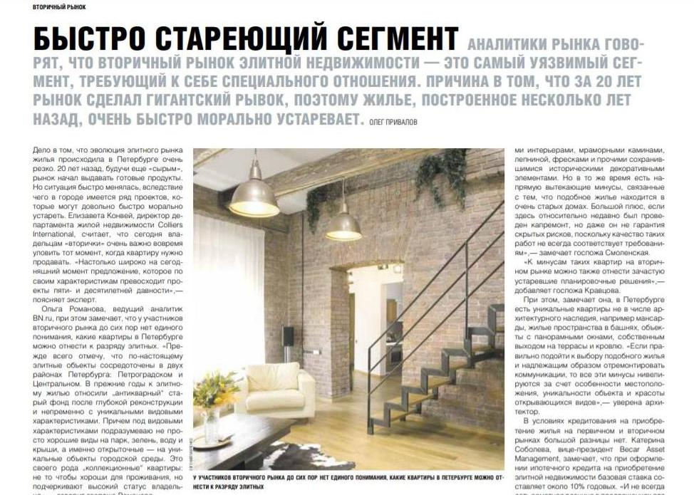
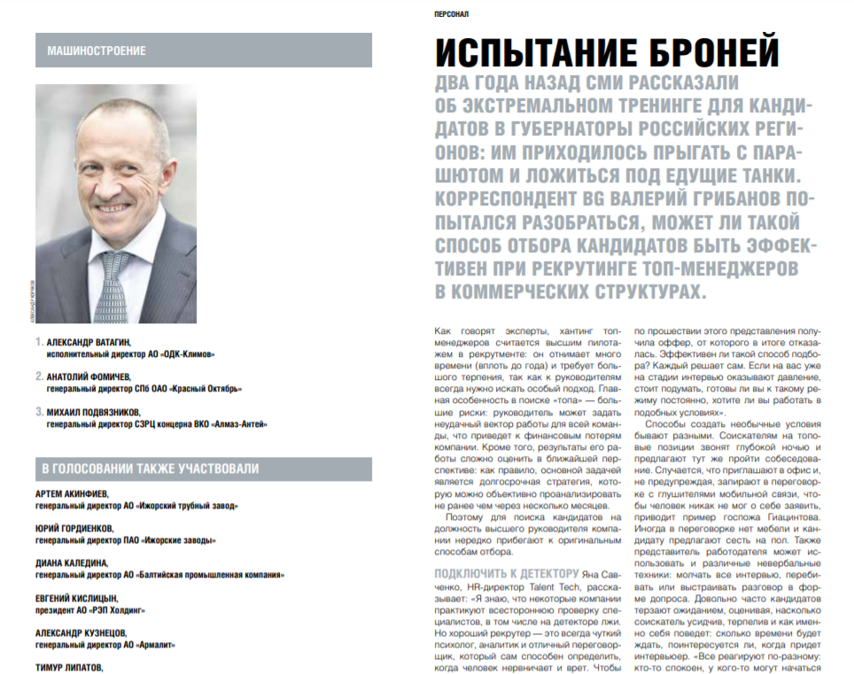

Редакция «Ъ» в Петербурге, по сравнению с московской небольшая. Работает у нас всего десяток человек, каждый журналист курирует определенное направление: транспорт, связь, девелопмент, потребительский рынок, политику, криминал и так далее — в целом все как в любых других СМИ. Некоторые коллеги, из-за небольшого штата, курируют по две-три темы.

Я с начала карьеры журналиста – последние 24 года – пишу про недвижимость. В «Ъ» вопросы недвижимости и строительства так же на мне, если не считать выпуска ежедневной газеты, петербургских полос — там мне, разумеется, приходится вникать во все области. В ежедневной газете я занимаюсь редакторской работой, новостные тексты не пишу, на это просто нет времени.

Но кроме того, в тематические приложения я иногда пишу и аналитические обзоры на темы страхования, банковской сферы, промышленности. В месяц в среднем получается около десятка материалов. И вот здесь мне приходится обращаться за помощью к сервису Pressfeed.

_Сервис Pressfeed помогает опытному редактору в поиске спикеров_

### Зачем опытному редактору Pressfeed

За годы работы у меня скопилась достаточно обширная база ньюсмейкеров. Ею я активно пользуюсь, но как было сказано выше — в основном это рынок недвижимости. По другим отраслям база меньше, поэтому Pressfeed помогает мне именно в этом.

Как узнал о существовании сервиса уже и не помню, наверное, кто-то из коллег подсказал, но вот уже три года регулярно обращаюсь к экспертам на портале с тем или иным запросом.

> Бывают тексты, в которых до 70% мнений — комментарии из Pressfeed. Без стороннего сервиса с широкой – и, главное, пополняющейся – базой экспертов, не обойтись. Меньше было бы интересных точек зрения, каких-то живых рассказов из практики.

### В работу идут все толковые комментарии

Подбор ответов происходит как правило непосредственно перед написанием заметки. Оптимальное количество ответов к одному материалу вывести очень сложно – заметка статистике не поддается. Я стараюсь использовать все толковые комментарии — понимаю, что люди старались, писали, тратили время и силы. Тут все зависит от полезности мнения, но и формат материала, конечно, вносит свои коррективы.

Иногда бывает очень много ответов, просто несколько десятков. Просто физически все не использовать, объем материала не может превышать определенное количество знаков. Тут ничего не поделаешь, только остается попросить прощения за потраченное время. Бывает присылают 70 тысяч знаков комментариев — и от мысли, что все это надо прочесть и отсортировать иногда становится дурно.

На подготовку ответов стараюсь давать не меньше недели. Обычно если меньше, то и ответов будет крайне мало, особенно если тема сложная. Заголовок составляю по первому вопросу запроса, не парюсь на этот счет сильно. Зависимость «отвечаемости» от формулировки не отслеживал, если честно. Мне кажется, если специалист в теме, ему есть что сказать, независимо от заголовка запроса.

Пару раз приходилось продлевать срок запроса, но это редко бывает эффективно — если нет ответов, то это, скорее, просто сложная тема, бывает, что просто нет экспертов в какой-то области. Не очень охотно отвечают по узким сегментам – элитной недвижимости, загородному жилому строительству. Это достаточно нишевые вопросы, мало ими кто занимается. Желающих высказаться на более популярные темы – всегда хоть отбавляй!

Например, буквально в начале декабря я размещал запрос о вторичном жилье на рынке элитной недвижимости в Петербурге. Пытался выяснить объем рынка, цены, качество предложения. Просил рассказать о плюсах и минусах такого жилья, отличаются ли условия покупки от условий покупки жилья на первичке и другие интересные детали, возможно инсайты…

Но рынок элитного, а тем более вторичного элитного, жилья, настолько узок, что ответ пришел всего один. Хорошо, что ответил погруженный в вопрос эксперт и, вкупе с моими собственными источниками, этот комментарий существенно «разбавил» текст.

_Поиск спикера по узкому рынку вторичного элитного жилья на Pressfeed_

### Ничто так не портит PR, как неопытные пиарщики

Главное, я считаю, в запросе надо максимально четко сформулировать что требуется от спикера, объяснить условия и формат предстоящего материала. Максимально простым и понятным языком. Но даже в этом случае, мы не застрахованы от неопытных пиарщиков.

Этот народ является основной трудностью, как всегда. Эти ребята, не очень понимая сути своей работы, начинают бомбить журналиста вопросами: а вот у нас Вася Пупкин из компании «Рога и копыта» — подошел бы для вас его ответ? Откуда я знаю, подошел бы или нет — пока не прочту? Как правило 90% таких пиарщиков после предложения прислать ответ, чтоб с ним ознакомиться, с радаров исчезают.

Причем, журналист, размещающий четкий запрос, с обозначенной проблематикой, расшифрованными условиями и указанным дедлайном и сроком выпуска готового материала, чаще всего предполагает, что «на том конце» работают как минимум не менее адекватные люди. Следовательно, второй раз ты в свой запрос заходишь, когда вышел срок приема ответов, и настала пора собрать их и внести в материал. А там: «Возьмете ли вы ответ нашего Петра Иваныча?». Конечно, такие вещи просто игнорируются.

Другая история, когда PR-специалист, ведущий аккаунт своего босса или клиента на Pressfeed, присылает по сути не ответ на вопрос, не фактуру, а просто кусок рекламного проспекта. Конечно, использовать это в тексте нельзя. И получается, что такие вот «специалисты» и у журналиста время отнимают, и спикеру своему «портят карму»: одному журналисту прислали выдержку из рекламной листовки вместо толкового комментария, второму, третьему… В итоге спикер приобретает «широкую популярность в узких кругах».

Не знаю, как справляются с этой проблемой сами спикеры, и знают ли они о ней, но журналисту нужно быть к этому готовым, и просто уметь спокойно отделить зерна от плевел. Это часть работы, а учитывая поток живых комментариев на Pressfeed, процент «брака» вполне допустимый.

В остальном все просто — есть вопросы, на них присылается ответ. Он либо подходит, либо нет. Не могу вспомнить материал, с подготовкой которого возникли большие сложности в плане подбора экспертов или комментариев на сервисе. Бывает, просто нет ответов — вообще ни одного. Тогда тему просто откладываем, продлеваем срок приема комментариев.

Последний материал не из сферы недвижимости я писал для приложения «Топ-менеджеры года». Тему я придумал сам: про то как отбирают топ-менеджеров для российских компаний. Известно, что губернаторов у нас сейчас подбирают довольно необычным способом – заставляют ложиться под танки, прыгать с парашютом, создают экстремальные ситуации какие-то. Вот было интересно - применима ли такая практика для отбора руководителей компаний и насколько она эффективна.

_Коммерсантъ подбирает спикеров для формирования разностороннего взгляда на проблему на Pressfeed_

Pressfeed я использовал в данном случае потому, что здесь достаточно большой выбор экспертов из совершенно разных областей. Для полосы как раз и был нужен свежий и разносторонний взгляд на проблему. Комментариев было очень много – как раз в районе 70 тысяч знаков набралось. Я постарался использовать все полезные, которые были по делу.

### Требуются эксперты из нишевых рынков

По сути, Pressfeed закрывает одну большую потребность: подбор экспертов, которые бы говорили по делу, не лили воду, отвечали на поставленный вопрос. В большинстве случаев такие ответы находятся и довольно быстро.

> Есть очевидная особенность, которая связана, скорее со спецификой российского бизнеса в целом и нишевых рынков в частности. Не многие компании в некоторых из них, как например, мой сектор загородного строительства, имеют в штате хоть каких-то пиарщиков. Многие вообще не понимают необходимости своего присутствия в СМИ в роли экспертов.

Поэтому и зачастую трудно собрать экспертные ответы на узкоспециализированные запросы. Кейс выше это подтверждает, да и другие мои запросы на темы, связанные с элитным жильем, загородным или городским.

Летом я создавал запрос про ключевые параметры элитного загородного поселка. Хотели выяснить сколько в нем может быть коттеджей, чтобы не понизить класс и какие элементы обязательны. Пришло два ответа, один из которых как раз из разряда «мы строим лучшие загородные поселки». Хорошо, что второй был более-менее с фактурой, и его я использовал в итоге в материале.

Возможно, эта проблема временная, а может быть характерна только для исследуемого мной рынка. Может быть поможет новая функция ручной рассылки запроса экспертам, пока не пробовал, как раз планирую. Может быть некоторые эксперты просто зрительно пропускают запросы, на которые могли бы дать исчерпывающий ответ.

Мне кажется Pressfeed – отличная бизнес-идея. Он определенно помогает работе журналиста, просто надо понимать, что есть формат обзоров, есть формат новостей – и для новостных заметок сервис вряд ли подойдет. Во-первых потому, что оперативно тут мало кто может ответить. Во-вторых, часто новости бывают эксклюзивными и никто не захочет их «палить». Зато для аналитики как раз нужно большое количество мнений и точек зрения.