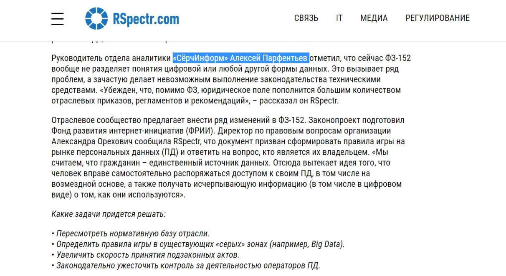

«СёрчИнформ» занимается разработкой программ для защиты бизнеса от утечек информации и корпоративного мошенничества. Сфера информационной безопасности предельно закрытая, поэтому в нашем случае продвигать продукты с помощью «сарафанного радио» или отзывов заказчиков не получается.

> Мы не можем говорить про большую часть наших клиентов, нас редко открыто рекомендуют, и совсем редко кто-то из заказчиков готов на публику рассказывать об опыте использования нашего ПО. Раз мы не имеем возможности рассказывать об экспертизе компании через отзывы клиентов, PR-служба «СёрчИнформ» регулярно инициирует экспертные колонки, комментарии в целевых СМИ.

Компании, которые покупают такие серьезные продукты, хотят быть уверены в нас на 100 процентов. Чтобы нам доверяли, потенциальные клиенты должны хорошо представлять, кто стоит у руля компании, какие ценности мы разделяем, кто составляет костяк команды, какой экспертизой мы обладаем. Именно поэтому публикации в крупных изданиях ― это один из основных инструментов, которые помогают завоевать доверие и лояльность клиентов и других представителей целевой аудитории.

В среднем в месяц мы стараемся выпускать минимум 15 публикаций. Это достаточное количество, чтобы оставаться «на слуху». В эту цифру входят как полноценные тексты от лица компании, так и небольшие комментарии. Каждый материал влияет на нашу репутацию, вызывают доверие заказчиков, подталкивают к еще одному шагу на пути между возникновением потребности и принятием решения о покупке.

## Какие СМИ в приоритете

Нам интересны два формата СМИ:

* **крупные общественно-политические и деловые федеральные СМИ**. С редакциями работаем по всем темам, касающимся информационной безопасности. Эти издания читают наши потенциальные клиенты: собственники и руководители, чей бизнес мы и помогаем защищать. Главное, что нам нужно донести до них ― экспертное мнение, отраслевые кейсы, аналитику;
* **специализированные СМИ об ИТ-технологиях и информационной безопасности.** Здесь рассказываем о новинках в нашем ПО, говорим на более узкие и специализированные темы. В IT-изданиях публикуем статьи, направленные на продвижение HR-бренда, ведь мы конкурируем за лучшие кадры по всей стране и СНГ.

## Как быстро выходить на нужные СМИ: сервис Pressfeed

Еще несколько лет назад у PR-специалистов был только один способ коммуникации с изданиями ― личное общение с профильными журналистами. А потом Константин Бочарский придумал сервис журналистских запросов Pressfeed. Сегодня мы работаем по двум фронтам.

Думаю, мало кому из пиарщиков уже нужно объяснять, в чем суть Pressfeed. Именно из-за его удобства сервисом пользуются не только профессионалы, но и эксперты, руководители небольших компаний. Мы используем платный пакет, который дает возможность оперативнее отвечать на неограниченное количество запросов и видеть, сколько комментариев уже дано. Так у нас больше шансов попасть в материал. Но, пожалуй, главный плюс Pressfeed ― это удобный агрегатор, который дает актуальный срез того, что интересует редакции в режиме реального времени.

  
_Запросы на Pressfeed_

PR-служба взаимодействует с определенными редакциями с помощью сервиса, потому что так просто удобнее.

Например, ТАСС ― агентство новостей. Мы редко выпускаем новости такого уровня, чтобы попасть на эту площадку. А вот на запрос журналиста на тему информационной безопасности нам всегда есть, что ответить.

  
[_Запрос_](https://pressfeed.ru/query/48956) _от ТАСС на Pressfeed_

Начальник юридического департамента «СёрчИнформ» дал комментарий о наказании за кражу персональных данных.

_Публикация в_ [_ТАСС_](https://tass.ru/obschestvo/5709052)

После общения на Pressfeed можно сохранить контакт журналиста и предложить ему варианты сотрудничества ― рассказать о компании, спикерах и т. д.

Через сервис мы работали с изданием «Известия». Мы знакомы напрямую с профильными журналистами из издания, но Pressfeed дает дополнительную возможность поработать с ними. Нельзя упускать любую возможность получить упоминание в таком крупном высокоаудиторном издании.

В ответе на запрос об искусственном интеллекте в сфере HR мы рассказали изданию о нашей технологии автоматического анализа поведения сотрудников.

  
[_Запрос_](https://pressfeed.ru/query/43050) _от iz.ru_

Программный модуль «КИБ СёрчИнформ ProfileCenter» анализирует, что и как пишут сотрудники в течение рабочего дня. Учитывается стилистика и особенности построения текста, частота употребления отдельных слов и выражений, использование сленга. С помощью 70-ти критериев программа формирует психологический профиль личности каждого специалиста.

  
_Публикация в онлайн-версии_ [_«Известий»_](https://iz.ru/750717/mariia-rubnikovich/gde-zhe-u-nego-knopka)

В другой раз давали комментарий для бизнес-площадки E-xecutive о «робинзонах» современного мира.

  
[_Запрос_](https://pressfeed.ru/query/53037) _на Pressfeed_

Руководитель отдела аналитики «СёрчИнформ» высказал свое мнение по этому вопросу. Эту публикацию с участием компании прочитали более 14 тысяч раз.

  
[_Публикация_](https://www.e-xecutive.ru/finance/novosti-ekonomiki/1990183-vam-uzhe-ne-spryatatsya-vse-dannye-o-vas-budut-sobrany-na-odnoi-platforme) _на E-xecutive_

Pressfeed дает возможность выйти не только на деловые издания, но и на узкопрофильные. Например, через сервис мы давно и плодотворно сотрудничаем с площадкой Rspectr.com ― это портал по вопросам связи, информационных технологий и массовых коммуникаций. Мы отвечали минимум на 5 запросов от редакции издания, и все наши ответы были приняты и попали в материал.

  
[_Запрос_](https://pressfeed.ru/query/52557) _от Rspectr.com_

Одна из совместных статей была посвящена введению «цифрового профиля» для каждого гражданина РФ. Говорили о защите персональных данных и о том, как такой профиль будет работать в нашей стране.

[_Фрагмент публикации_](https://www.rspectr.com/articles/487/grazhdane-rf-smogut-rasporyazhatsya-informaciej-o-sebe) _в издании Rspectr.com_

Если вас интересуют отраслевые издания, пишущие на тему технологий, заходите в раздел «СМИ» и выбирайте фильтр «Технологии». Ищите то, что понравится, и связывайтесь с журналистами редакции прямо через сервис с помощью внутренних чатов. Предложите темы для публикаций, спикеров компании, расскажите, чем можете быть полезны для издания.

_Выбор СМИ с фильтром «Технологии»_

## Работать с журналистами напрямую: долго, но эффективно

**Выстраивать отношения с журналистами** ― долгий проект, но мы работаем на рынке более 20 лет, и большинство редакторов ведущих российских изданий уже давно знают нас. Мы поддерживаем связь, и они сами обращаются к нам, если появляется вопрос по теме информационной безопасности.

Когда у эксперта появляется идея для материала ― мы обсуждаем ее с изданием, которому по нашему мнению идея может быть интересна. Если редактор заинтересован, вместе с экспертом пишем колонку, ориентируясь на требования и стилистику конкретного СМИ.

По такой схеме мы предложили в Republic колонку от руководителя о махинациях с медицинскими данными. Материал взяли, проблема показалась острой.

  
_Публикация в_ [_Republic_](https://republic.ru/posts/77316)

А вот эффект был для нас неожиданным. Публикация вызвала цепную реакцию: за комментариями и предложениями раскрыть тему в колонках обратилось несколько СМИ, и мы поучаствовали в прямом эфире телеканала «Дождь».

> Прежде всего, мы работаем на доверие и узнаваемость, но есть статьи, которые доказывают, что PR-публикации могут привести к решению выбрать именно наш продукт.

Для издания «Ведомости» мы делали прикладной текст-инструкцию для руководителей по контролю сотрудников.

[_Публикация_](https://www.vedomosti.ru/management/blogs/2018/07/19/775915-kontrolirovat-kompyuteri) _с участием «СёрчИнформ»_

Текст прочел руководитель компании, который долгое время откладывал решение о покупке нашего продукта. Публикация стала для него последним аргументом, он сам позвонил и предложил продолжить переговоры.

> Удачные публикации ― это как минимум рост трафика на сайт компании. Журналисты неохотно ставят прямые ссылки на сайты вендоров или конкретных экспертов, потому такую связь бывает сложно отследить. Однако если ссылка все же есть, число посетителей легко подсчитать, вплоть до тех, кто оставил заявку на триал.

У нас регулярны такие истории с публикациями на Habr. Пример ― публикация о начальнике отдела разработки «СёрчИнформ» Дмитрие Гацуре в тематическом Хабе «Как работают ИТ-специалисты».

[_Публикация_](https://habr.com/post/321020/) _о сотруднике «СёрчИнформ»_

В день выхода статьи число переходов на сайт компании с внешних ресурсов составило 55% от всего трафика. За неделю до этого трафик со сторонних площадок составлял всего 4,4%. Через некоторое время после публикации трафик снова падает, но все равно кто-то постоянно заходит на сайт по ссылкам со старых публикаций.

## Какой эффект дают публикации в СМИ

Все усилия бизнеса направлены на продажу, так что и PR-усилия тоже должны вести именно к этому. Можно продавать прямой рекламой ― и это вотчина сейлзов и маркетинга (разумеется, такие отделы у нас тоже есть). А можно показывать ценность продукта иным образом, так что потребитель полюбит бренд, поверит ему и захочет совершить покупку. PR усиливает эффект от маркетинговых активностей, это факт.

Мне пришлось поработать и в ИТ-стартапе, и в глобальной компании. Могу сказать, что в небольшой компании от PR-отдела ждут именно продающих активностей, сколько бы сами пиарщики не говорили об обратном и не убеждали руководство, что «пиар ― это не про продажи, а про впечатление». При этом в стартапе как раз отлично видна прямая отдача от PR: с одной PR-статьи в «Ведомостях» или «Форбс» мы получали по 20-40 заявок в день на сложный корпоративный продукт. Это была недельная норма заявок с сайта.

В компаниях уровня«СёрчИнформ», PR-отдел может себе позволить заниматься именно связями с общественностью, потому что рядом с нами работают маркетологи и штат менеджеров по продажам. У нас есть кому продавать, а мы можем сосредоточиться на «игре вдолгую». Мы делаем от 15 до 30 публикаций в месяц, и каждая из них влияет на репутацию и узнаваемость нашей компании.