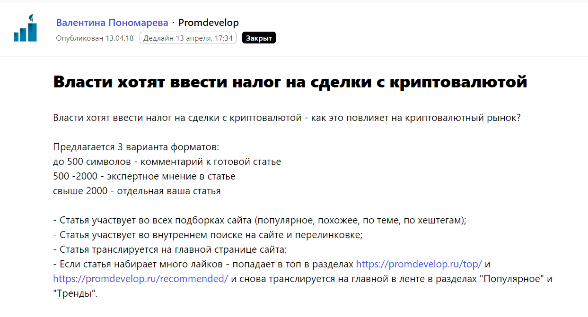
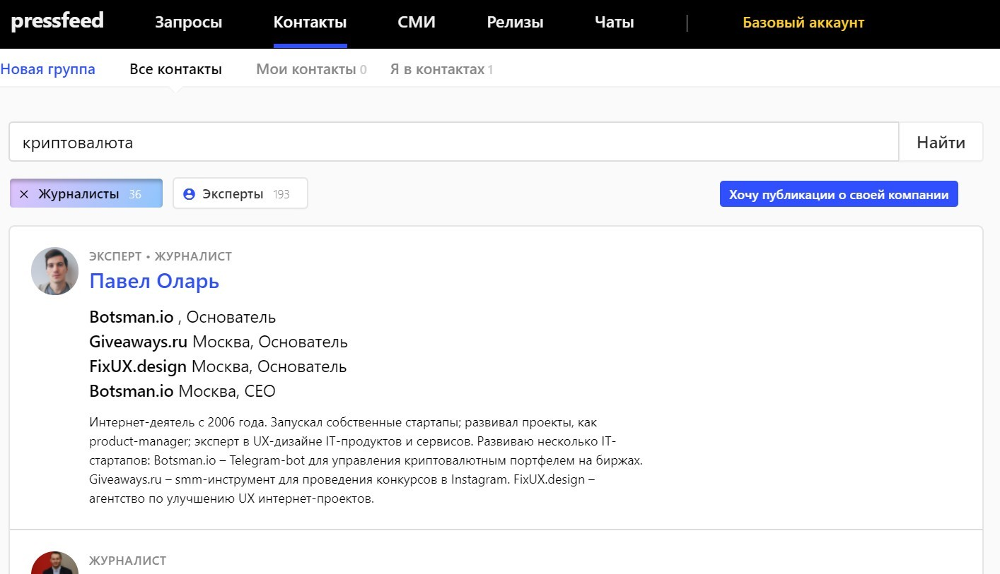

Фонд доверительного управления Smart Crypto — инвестиционный проект, связанный с криптовалютой. Это сложный бизнес с узкой целевой аудиторией: по большей части мы работаем только с теми, кто так или иначе разбирается в криптовалютных инвестициях. Понимает сущность такой валюты, понимает, как ей распорядиться, знает о рисках и возможностях дохода. Наш потенциальный клиент — не обязательно уже инвестор, скорее всего, он уже пробовал трейдить самостоятельно, но теперь думает, как увеличить свой капитал без потери времени и сил.

## Проблемы в продвижении: узкая аудитория и запрет на рекламу ICO и криптовалют

Криптовалюта — «хайповая» тема, в последний год рост или понижение курса биткоина обсуждали все, кому не лень. Все новостные СМИ, телевидение… Однако это не значит, что широкие массы стали разбираться в криптосферах и планируют закупать биткоины на всю зарплату. Криптоинвесторы — это до сих пор предельно узкая аудитория.

Если говорить о продвижении в интернете, то основных инструментов у нас было три: 1) **таргетированная реклама** в социальных сетях и контексте; 2) продвижение и **реклама в Телеграм**; 3) пиар-публикации в **узкоотраслевых СМИ**, посвященных криптовалюте и ICO.

Увы, инструменты таргетинга и контекста постепенно стали недоступны для нас. Летом 2018 года компания Google (а Facebook еще раньше) [ввела полный запрет на рекламу криптовалют](https://www.vedomosti.ru/technology/articles/2018/03/14/753477-google-zapretit-reklamu-kriptovalyut) и всех связанных с ними производных — ICO, криптокошельков, криптовалютных бирж.

Пришлось усиливать работу оставшимися инструментами. Публикациями в СМИ мы занимались и до запрета Google, но потом решили сделать на них основной акцент. Почему? Конкуренция на рынке инвестиционных фондов просто огромна, и завоевать доверие клиента непросто. При этом множество фондов не раскрывают информацию о себе: не объясняют, что происходит с деньгами после заключения сделки, не предоставляют прозрачные условия.

> Так мы и нашли свое конкурентное преимущество: быть открытым фондом, рассказывать о себе, о собственнике, выступать экспертами в профильных СМИ, быть на слуху. Такой подход завоевывает доверие и лояльность со стороны потенциальных вкладчиков. Поэтому главным инструментом для продвижения в интернете стали профильные площадки, пишущие о криптовалютах.

В планах было делать как минимум по 2-3 публикации в месяц с участием или от имени SmartCrypto.

## Продвижение в СМИ с помощью Pressfeed: как действовать поэтапно

На старте работы нам было непонятно, как начать сотрудничество с редакциями изданий, которые пишут о блокчейне и криптопроектах. Нам были интересны как узкоспециализированные площадки, так и «около-инвестиционные». Мы решили выходить на такие издания через сервис журналистских запросов [Pressfeed](https://pressfeed.ru/) и зарегистрировали аккаунт компании в феврале 2018 года.

Pressfeed — платформа для общения СМИ и экспертов компаний. С помощью сервиса журналисты ищут фактуру, героев, собирают мнения экспертов по различным темам для публикаций или эфиров на телевидении и радио. Схема работы проста: журналисты оставляют на Pressfeed запросы, а эксперты отвечают на них в установленный дедлайн.

Рассказываем, как мы действовали и как получали публикации в СМИ, поэтапно.

**Шаг 1.** Провели первичный мониторинг сервиса по запросам на темы «блокчейн», «ICO», «криптовалюта». Искали по ключевым словам: их нужно было ввести в строку поиска через запятую.

  
_Пример поиска запросов по ключевым словам_

Сразу же увидели площадки, которые постоянно ищут колумнистов, посмотрели текущие запросы, изучили архивные запросы — так мы поняли, что вообще интересно журналистам в этой сфере.

**Шаг 2.** Подписались на запросы по нужным темам, чтобы они отдельно приходили на почту, а мы ничего не пропустили.

  
_Можно подписаться на запросы по интересующим темам_

**Шаг 3.** Собственно, начали отвечать на запросы. В первую очередь делали ставку на отраслевые площадки. Таким образом, быстро вышли на одно из крупнейших изданий о блокчейне BitCryptoNews с охватом 140 тысяч уникальных посетителей в месяц. За полгода мы ответили на 6 запросов издания, в итоге вышли 5 публикаций с нашим участием.

Например, один раз рассказывали об индикаторах для трейдинга.

  
[_Запрос_](https://pressfeed.ru/query/46025) _от BitCryptoNews_

Результатом сотрудничества стала статья [«Индикатор Аллигатор. Как рептилия попала в мир трейдинга»](https://bitcryptonews.ru/analytics/cryptocurrency/indikator-alligator-kak-reptiliya-popala-v-mir-trejdinga). Комментарий в данном случае — это не 3 строчки, которые вряд ли повлияют на репутацию компании. Наша компания была единственным экспертом в тексте, и наше мнение стало полноценной частью статьи. Материал получил более 3 тысяч лайков от читателей сайта (на ресурсе действует специальная система оценки статей).

  
_Публикация на BitCryptoNews_

В другой раз говорили о [торговле альткоинами](https://bitcryptonews.ru/analytics/cryptocurrency/kak-torgovat-redkimi-kriptovalyutnyimi-parami).

  
[_Запрос_](https://pressfeed.ru/query/45367) _от BitCryptoNews_

Хочется отметить, что разные запросы шли от разных журналистов издания, так что через Pressfeed мы наладили контакты с 4 журналистами BitCryptoNews.

Кроме того, мы 3 раза работали с изданием RusCryptoNews (ответили на 4 запроса, но вышло 3 публикации с комментариями Smart Crypto).

Например, был интересный вопрос о звездных криптовалютах. Нужно было оценить, зачем знаменитости ввязываются в PR-акции, связанные с ICO, можно ли вкладываться в такие спорные новинки.

_Запрос от_ [_RusCryptoNews_](https://pressfeed.ru/query/42102)

_Публикация_ [_«Звездные криптовалюты: пустой хайп или выгодное предложение?»_](http://ruscryptonews.ru/stat-i/zvezdnye-kriptovalyuty-pustoj-khajp-ili-vygodnoe-predlozhenie) _на ресурсе RusCryptoNews_

Материал собрал более 1,5 тысяч просмотров. Издание небольшое, так что этот показатель считается достойным.

В другой раз издание спрашивало о том, какую угрозу криптовалюты представляют для банков, смогут ли они найти точки соприкосновения.

  
[_Запрос_](https://pressfeed.ru/query/45012) _от RusCryptoNews_

_Публикация_ [_«Смогут ли криптоиндустрия и банки жить дружно?»_](http://ruscryptonews.ru/stat-i/smogut-li-kriptoindustriya-i-banki-zhit-druzhno)

Были и другие профильные площадки, которые мы нашли на Pressfeed. К примеру, cryptorussia.ru.

**Шаг 4.** Время от времени отвечали на запросы не отраслевых изданий, но по нашей тематике. Так мы познакомились с крупным деловым изданием Promdevelop с охватом в 1,3 миллиона посетителей в месяц.

Журналиста интересовал вопрос о налоге на сделки с криптовалютой.

  
[_Запрос_](https://pressfeed.ru/query/42457) _от Promdevelop_

Мы ответили быстро и развернуто и вновь оказались единственным экспертом в публикации [«Закон о криптовалютах в России принят»](https://promdevelop.ru/news/zakon-o-kriptovalyutah-v-rossii-nalogooblozhenie-kriptovalyut/).

**Шаг 5.** Параллельно с мониторингом Pressfeed мы прорабатывали базу СМИ своими силами: связывались с редакциями, общались с журналистами, предлагали темы для обсуждений. Кстати, журналистов тоже удобно искать через Pressfeed, особенно, если вы работаете в узком сегменте и на вашу тему пишут только избранные специалисты.

Заходите в раздел «Контакты», вводите ключевые слова. Отметьте, что вам нужны только журналисты, а не эксперты.

  
Дальше можно изучить профайл каждого журналиста и написать ему сообщение прямо через сервис, познакомиться, найти точки пересечений. Только не нужно делать массовую рассылку с одинаковым текстом: все журналисты ценят индивидуальный подход.

## Что дает активное взаимодействие со СМИ криптопроекту

Повторюсь, что фонды доверительного управления — закрытые системы, где собственники даже не раскрывают свои личности. Smart Crypto пошел другим путем.

Мы уверены, что доверие к проекту формируют публикации в СМИ. Более того, когда эксперт Smart Crypto дает лайфхаки по стратегиям торговли, советы по поведению на падающем рынке и другой полезный контент, трафик на сайт заметно увеличивается. Хотя трафик — не тот эффект, который мы ждем от публикаций. Наша задача: всегда быть на виду, поддерживать коммуникацию, предоставлять объективную информацию о работе фонда. Люди должны видеть, кому доверяют свои деньги.

С февраля по сентябрь 2018 года мы ответили на 16 запросов журналистов в Pressfeed и получили 13 публикаций с участием Smart Crypto. Пока мы пользуемся базовым аккаунтом, так что все публикации были для нас абсолютно бесплатными.

Посещаемость сайта постоянно и планомерно растет в среднем на 20-30% в месяц. Несмотря на то, что Google запретил рекламу всего, что связано с криптовалютами (сейчас ситуация немного смягчилась), сайт smcrypto.io имеет хорошие позиции в выдаче. Роль играют ссылки на сайт, которые время от времени появляются в материалах с нами (если журналист дает добро на внешние ссылки в тексте, это случается примерно в 50% случаев).

> С момента выхода из формата закрытого клуба на общий рынок, количество инвесторов с 12 человек увеличилось до 49. Это немало, поверьте. Даже на падающем рынке криптовалют из Smart Crypto не ушел ни один инвестор, хотя у нас самый короткий локап-период. Это говорит о правильно выбранной стратегии управления и о высокой степени доверия к проекту. Сейчас в управлении фонда находится $ 1 660 000 (данные на октябрь 2018).