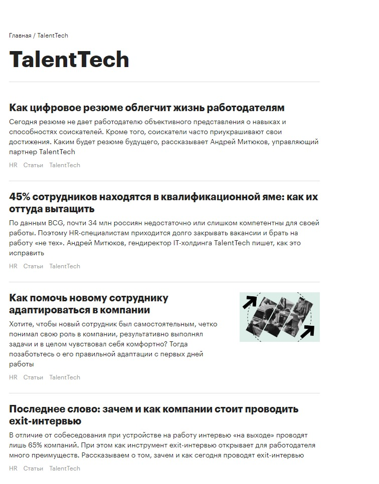
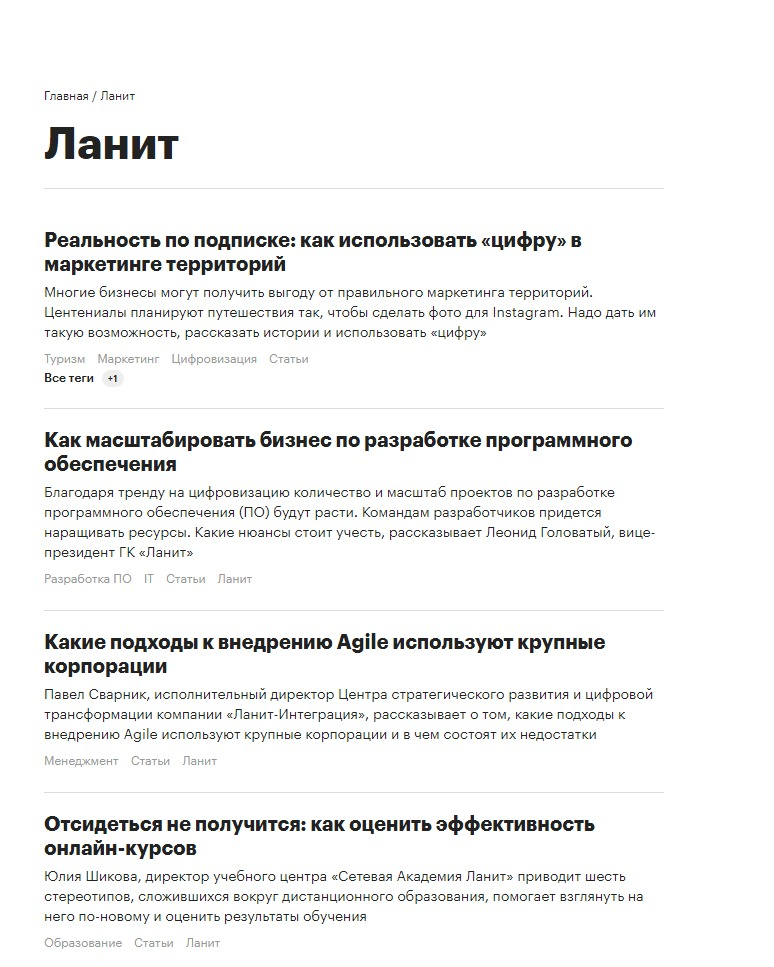

Я работаю в проекте РБК – «РБК Pro». Это платный сервис медиахолдинга, который задуман как гид по отраслям российского бизнеса. У нас есть несколько направлений работы и форматов контента, но на Pressfeed я ищу колумнистов и авторов исследований.

**Как устроен «РБК Pro»**

В проекте над контентом работает около десяти человек. Из них часть работают с ключевыми партнерами проекта – среди них крупные консалтинговые компании вроде BBCG, PwC, Bain&Company, BCG, BDO и прочие, а также юридические компании, интеграторы и другие.

С колонками работают четыре редактора. Разделения, кто и сколько колумнистов ведет, нет. У каждого редактора свой пул экспертов – несколько десятков. Как правило, если эксперт начинает работать с одним редактором, он продолжает работать с ним и в дальнейшем. Хотя есть эксперты, которые «скачут» от редактора к редактору. Это не очень удобно, особенно в случаях, когда спикер, которому один редактор сказал «нет», идет с той же темой к другому редактору. Чаще всего такая схема не работает, хотя из правил есть исключения.

У нас есть три способа представления материалов – мнение, статья и статья с виджетом. Если компания присылает масштабное и интересное исследование в формате pdf, то мы оформляем его как статью с виджетом (то есть публикуем подводку и само исследование полностью). Если эксперт присылает колонку, то можем оформить ее как «Мнение» или «Статью».

В формате «Мнение» вверху указывается имя эксперта, внизу – должность и фото с пометкой о том, что редакция может не разделять его позицию. Этот формат подходит для материалов с ярко выраженной авторской позицией, которые содержат оценочные суждения. Конкурентов в своих колонках эксперты, конечно, критиковать не могут. Потому что в суд мы не хотим.

В формате «Статья» имя автора и должность компании указывается дважды. Его мы выбираем для материалов, написанных более сухо и четко. К примеру, для how to-контента.

Сейчас у нас много колумнистов, поэтому довольно сложно кого-то выделить. В последнее время регулярно присылают колонки эксперты из группы компаний «Ланит», из IT-холдинга TalentTech, из TTISI Россия.

_Колонка IT-холдинга TalentTech в РБК Pro_

_Колонка компании «Ланит» в РБК Pro_

Эксперты, которые остаются с нами надолго, понимают отличие маркетинга от PR. Они пишут материалы не о себе, а для бизнеса. Давая качественные советы и инструкции коллегам, помогая им перенастроить свои бизнес-процессы, найти какие-то ноу-хау для увеличения прибыли, они одновременно заявляют о себе.

> Эксперты, с которыми нам приходится расстаться, пытаются в каждой строчке колонки «продать себя подороже». Однако реклама многих раздражает. Если текст полезен, бизнесмен запомнит, кто его написал, и будет знать, к кому обращаться в случае необходимости. Если же эксперт просто нахваливает себя, это вызывает раздражение даже у редактора и тем более у читателя, который заплатил за качественный контент.

Хороший колумнист:

* Имеет авторский стиль.
* Оперирует информацией, не найденной в интернете, а полученной на практике.
* Умеет последовательно и структурировано излагать свои мысли.
* Понимает, что любые общие фразы в тексте должны быть подтверждены статистическими данными.

Бывает так, что эксперт берет тему в работу, а потом понимает, что у него недостаточно фактуры и мыслей. Тогда он может связаться с редактором и предложить другую тему. Это намного лучше, чем выдавливать из себя что-то невразумительное.

Бывает, что эксперт берет тему и пропадает с радаров на полгода, а когда возвращается с колонкой, тема уже написана кем-то другим. Всегда лучше присылать материал заявленной тематики в течение 2-3 недель.

**Как автору работать с «РБК Pro»**

Обычно эксперт сам предлагает 3-5 тем, на которые готов написать колонки. Редактор выбирает, какие из них подходят. Мы отталкиваемся от того, что эксперты бывают на отраслевых конференциях, общаются с коллегами по цеху, преодолевают трудности в работе. В общем, знают, какие проблемы беспокоят участников их рынков.

Однако нам важно, чтобы темы не были рекламным. Если одна компания, к примеру, предоставляет другим услуги ведения бухгалтерии, она не может рассказать о том, почему ведение финансовой отчетности выгоднее всего отдавать на аутсорсинг.

После того как редактор одобрит одну из тем, эксперт присылает план материала. Редактор помогает скорректировать его. Часто эксперты, к примеру, забывают, что у нас b2b-проект и начинают предлагать b2c-темы. Например, хотят написать, почему каршеринг выгоднее, чем покупка автомобиля. Тогда как нам, образно говоря, интереснее тренды на рынке каршеринга в 2020 году.

Дедлайнов у нас нет. Мы назначаем дату выхода материала, когда текст уже полностью готов к публикации. Очень немногим экспертам удается сразу написать материал, который не требует доработки. Обычно, когда материал приходит в первоначальном варианте, редактор просит прояснить непонятные моменты, может запросить какую-то статистику или задать дополнительные вопросы.

Например, эксперты часто забывают указывать в текстах, откуда берут те или иные цитаты или цифры. Редактор может подсказать, какую информацию добавить, чтобы текст стал полезным и интересным.

Объем материалов обычно составляет 5-8 тысяч знаков. Мы просим спикеров не присылать материалы более 10 тысяч, потому как такие материалы готовы осилить отнюдь не все читатели.

**Как попасть в пул «РБК Pro»**

Авторы, как раньше, так и сейчас, приходят к нам тремя путями:

* Редакторы сами связываются с представителями компаний-лидеров рынка, а также с известными экспертами в своих отраслях и просят их присылать колонки.
* Работает «сарафанное» радио, PR-специалисты или сами эксперты пишут нам напрямую, предлагая колонки.
* Редакторы оставляют запросы на Pressfeed.

О последнем – подробнее. Сервисом Pressfeed я пользуюсь около года. Узнала о нем от коллег-журналистов.

Первый раз попробовала, когда пришла в «РБК Pro» на должность редактора. Передо мной тогда поставили задачу сдавать две экспертные колонки в день. Я переехала в Москву из Петербурга, и у меня не было пула колумнистов. Поэтому сначала я отправила запросы в крупные компании в своих отраслях с просьбой писать нам материалы, потом связалась с экспертами, которых знала по прошлой работе и теми, информацию о которых нашла в открытых источниках. Параллельно написала запрос на Pressfeed.

На меня сразу посыпались отклики. Многие были нерелевантны, их пришлось отсеять, но еще больше через платформу пришло, действительно, хороших экспертов. Благодаря именно Pressfeed ко мне пришли крупные PR-агентства, например PR Partner.

Со многими я работаю до сих пор. Одни присылают колонки регулярно, другие разово. Например, пишут материал на волнующую проблему – допустим, про то, как на том или ином рынке отразится новый закон, – и уходят. Мы, конечно, заинтересованы в долгосрочном сотрудничестве с экспертами.

> Нам важно, чтобы колонки писали настоящие профессионалы в своих отраслях. Мы стараемся оградить читателей от статей, представляющих собой нарезки цитат мыслителей из интернета. Поэтому каждого эксперта тщательно проверяем.

Нам подходят:

* руководители отделов и топ-менеджеры крупных компаний, названия которых у всех на слуху;
* эксперты, имеющие обширный опыт работы в своей сфере, желательно на руководящих должностях крупных, в том числе консалтинговых компаний;
* представители пока не слишком известных, но уже зарекомендовавших себя на рынке компаний. Возможно, компания молодая и работает в такой узкой нише, как телематика, допустим, но в нее вложился Сбербанк. Тогда спикер от этой компании, конечно, может написать нам колонку.

Обычно перед согласованием темы эксперт присылает нам информацию о себе. Первым делом мы изучаем сайт компании, которую он представляет. Смотрим, когда он создан. Сайт, написанный в 2019 году, вряд ли вызовет доверие. И у нас, и у наших читателей.

Потом заходим в разделы – «О компании» и «Партнеры». Выясняем, сколько компания существует на рынке, чем занимается, какие у нее есть заказчики. Ищем упоминания о ней в деловых СМИ.

Какие нюансы возникают при работе с Pressfeed

Если брать в целом, сервис помогает мне:

* Делать так, чтобы о нашем проекте знали как можно больше экспертов, которые потенциально могут быть и нашими читателями.
* Получать качественные материалы от специалистов по темам, которые волнуют участников рынка.
* Выстраивать долгосрочное сотрудничество с экспертами и PR-агентствами, каждое из которых имеет пул экспертов в разных отраслях.

Некоторая трудность и, конечно, одновременно радость – в нашей собственной репутации. Очень многие хотят стать нашими авторами. Если посмотреть на мои запросы о поиске новых авторов часто приходит по несколько сотен ответов, но принимаю я буквально несколько десятков, максимум.

_РБК Pro ищет колумнистов на Pressfeed_

В первую очередь я отвечаю экспертам, которые дают подробную информацию об опыте работы и темы на рассмотрение или сразу колонки. Если человек в ответе на запрос просто пишет «готов писать про франчайзинг», отвечаю в последнюю очередь. Почему? Ответов на запрос много. Экспертов, информацию о которых нужно искать в интернете, рассматриваю по остаточному принципу. Просто, чтобы сэкономить свое время.

Мне бы хотелось иметь возможность сразу оставлять в запросе свою почту, а не писать ее каждому эксперту отдельно. Я понимаю необходимость этого фильтра – многим журналистам не нужен спам в рабочем почтовом ящике. Но мне было бы удобнее удалять спам, чем писать на почтовый ящик каждому эксперту лично.