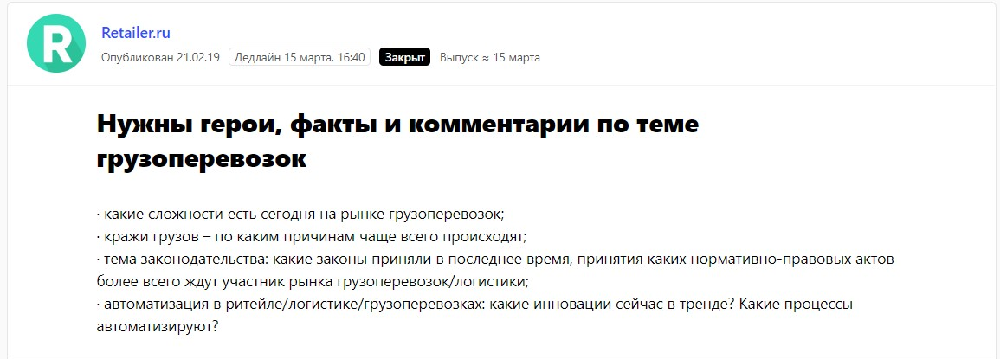
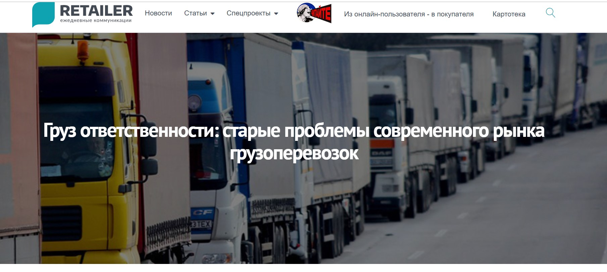
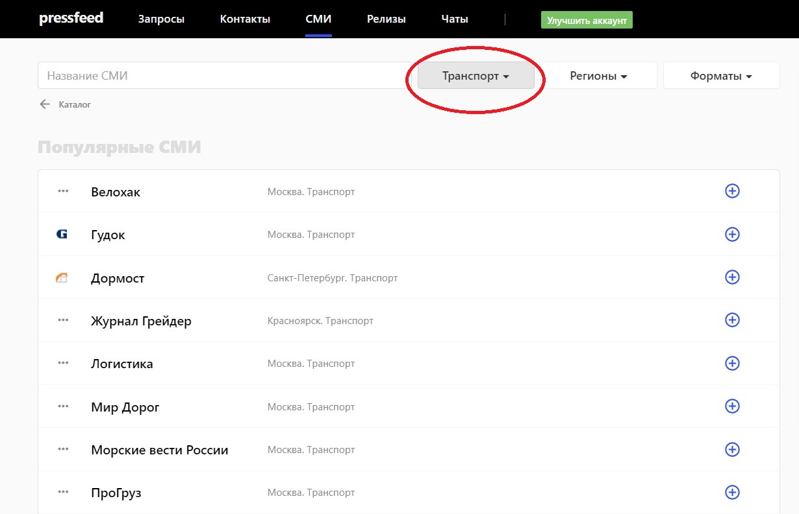
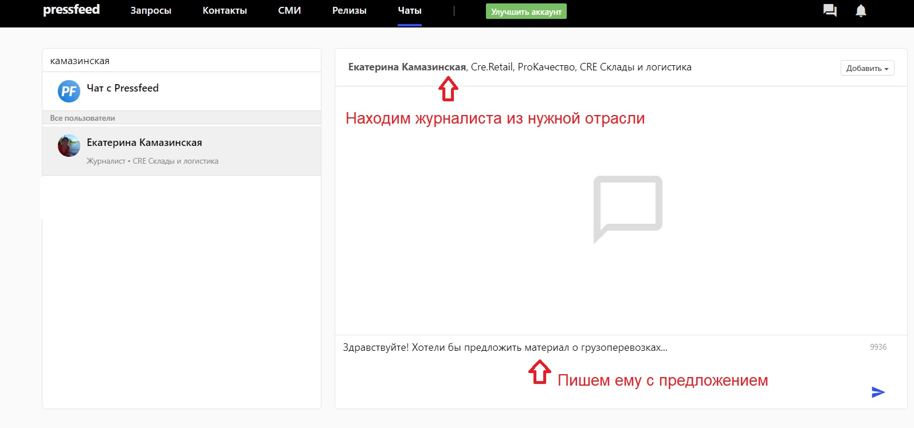
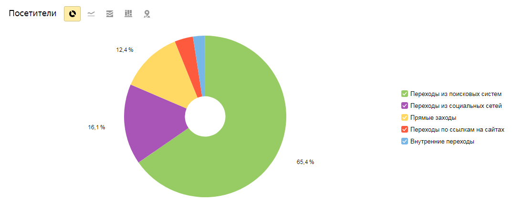

_Рассказывает Евгения Маврина, советник по внешним коммуникациям ОТК «ЮниТранс»_

## Почему решили использовать контент-маркетинг

Наша компания ОТК «ЮниТранс» работает на B2B-рынке и занимается организацией грузоперевозок и логистики. В основном обслуживаем промышленные предприятия и торговые сети.

Изначально идея использовать полезный контент для привлечения клиентов появилась в процессе разработки нового сайта компании ― мы сразу запланировали запустить на сайте блог и регулярно пополнять его новыми постами.

Было несколько задач, которые должен быть решать контент-маркетинг (в блоге и на внешних площадках):

**во-первых**, было необходимо, чтобы потенциальные клиенты поверили в наши экспертность и профессионализм. Однообразная реклама вызывает у людей меньше доверия, чем качественные материалы ― тексты в блоге или публикации в СМИ с участием спикеров компании. Решения в В2В ведь тоже принимают люди;

**во-вторых**, было важно привлечь к бренду внимание со стороны профессионального сообщества, то есть игроков транспортно-логистического рынка в целом ― конкурентов, партнеров, представителей госструктур;

**в-третьих**, контент должен был обеспечить новому сайту органический трафик, а также повлиять на естественную ссылочную массу и позиции в поисковых системах.

Таким образом мы хотели убить сразу двух зайцев: и пиарить компанию как эксперта в своей отрасли, и работать на SEO-продвижение.

> Кстати, была еще одна причина, почему мы не были готовы вкладывать деньги в рекламу: рынок грузоперевозок давно перегрет, стоимость лида обходится слишком дорого. А полезный контент может принести бесплатные лиды.

## Что включает контент на сайте

Сайт [multirail.ru](https://www.multirail.ru/) был запущен 1 июня 2017 года, и за два года его жизни в блоге накопилось более сотни статей. Полезный контент на сайте ОТК «ЮниТранс» делится на две категории: это «База знаний», где собраны нормативные документы, регулирующие деятельность отрасли, и «Новости», где мы пишем о значимых событиях транспортного рынка, обсуждаем тренды, комментируем актуальные вопросы из нашей сферы.

Часто говорим о таких новостях из мира транспорта и логистики, которые связаны с IT-решениями и новыми технологиями, о роботизации и автоматизации логистических процессов, а также делаем обзоры новых тенденций в логистике и цепях поставок. Это крайне важная тематика для отрасли: сейчас каждая транспортная компания задумывается о своем будущем на рынке в связи с глобальной цифровизацией. Эти же вопросы волнуют и наших клиентов на производстве и в ритейле.

_Пример статьи о технологиях_

Часть материалов можно отнести к ситуативному маркетингу, то есть мы реагируем на повестку дня, но есть и вечнозеленые статьи на популярные темы: логистические риски, большие данные в логистике, применение блокчейна в цепях поставок. Они работают лид-магнитами на протяжении долгого времени и постоянно ведут новый трафик на сайт.

> Платные каналы продвижения пока не использовали, так что наш сайт на текущий момент ― пример чистого PR и SEO продвижения без примеси рекламы, платного трафика и закупок ссылок. 

50% посетителей блога приходят из социальных сетей, далее идут прямые переходы и переходы из поисковиков.

## Как на трафик влияет контент на внешних площадках

Мы считаем блог центром контент-стратегии, однако в то же время понимаем, что не вся наша целевая аудитория зарегистрирована в соцсетях и состоит в тематических группах и отраслевых сообществах, в которых мы также размещаем ссылки на наши материалы. Значит, статьи из блога не дойдут до этих людей, а нам хочется охватить как можно больше представителей ЦА. Для этого необходимо подключать внешние площадки и вести коммуникацию с редакциями тех отраслевых изданий, которые читают интересные для нас (с точки зрения продаж) люди.

Опять же на общение с журналистами нужно тратить довольно много времени, а у нас его нет. Мы пошли технологичным путем и в начале 2019 года зарегистрировались на [сервисе журналистских запросов Pressfeed](https://pressfeed.ru/). Теперь мы мониторим там запросы по теме и оперативно отвечаем на них, а также знакомимся с новыми изданиями. Сервис работает так: редактор или журналист размещает «клич», какие эксперты ему нужны для новой статьи. Какой вопрос, до какого срока он принимает ответы, какого объема должен быть комментарий. Наша задача ответить по делу и вовремя, вот и все. Если ответ подходит, то мнение эксперта компании появится в материале.

Мы используем базовый аккаунт, так что сервис и его основные функции для нас полностью бесплатны. Возможно, в будущем подумаем над платным тарифом ― там больше возможностей, например, можно отвечать на неограниченное количество запросов и формировать подписки по ключевым словам. Чтобы не пропустить важные запросы следим за рассылкой, она приходит два раза в день ― в 10 и 15 часов.

Так, в феврале 2019 года через Pressfeed мы познакомились с отраслевой площадкой Retailer.ru. Редакция писала серию материалов о грузоперевозках в ритейле. Для нас это 100% попадание, так крупные торговые сети являются основными заказчиками услуг ОТК «ЮниТранс», то есть этот сайт читают те, кто работает в торговле.

  
[_Запрос от Retailer.ru_](https://pressfeed.ru/query/52831)

В итоге уже в марте вышло сразу три публикации подряд, где директор по логистике ОТК «ЮниТранс» выступил одним из экспертов.

В материале [«Груз ответственности: старые проблемы современного рынка грузоперевозок»](https://retailer.ru/gruz-otvetstvennosti-starye-problemy-sovremennogo-rynka-gruzoperevozok/) мы говорили о том, какие жесткие условия сейчас ставят заказчики компаниям-грузоперевозчикам.

  
_Публикация на Retailer.ru_

Об обострившейся проблеме хищений грузов рассказали в материале [«Как украсть миллион: преступные схемы в грузоперевозках»](https://retailer.ru/kak-ukrast-million-prestupnye-shemy-v-gruzoperevozkah/), а в третьей публикации [«Зачет автоматом: как модернизация меняет рынок грузоперевозок»](https://retailer.ru/zachet-avtomatom-kak-modernizacija-menjaet-rynok-gruzoperevozok/) рассуждали о новых технологиях в отрасли.

> Можем ли мы отследить эффективность от таких размещений? Косвенно можем. Три публикации на Retailer.ru вышли в середине марта 2019 года. В аналитике мы видим всплеск посещаемости сайта в марте в среднем на +30%. Такой показатель держался в течение месяца, а дальше был небольшой спад ― на 15%. В 2018 году такого пика в этот период не было, значит, можно сделать вывод, что на этот рост повлияли упоминания компании в издании.

Между тем, был опыт, когда мы давали комментарий не совсем целевому изданию.

Это был блог, посвященный развитию личного бренда с небольшим охватом, но хорошими показателями качества сайта. Журналист спрашивал, зачем создавать собственное медиа.

  
[_Запрос на Pressfeed_](https://pressfeed.ru/query/55664)

Мы рассказали о блоге, его специфике, целях. Итогом сотрудничества стала статья с двумя активными гиперссылками на сайт компании.

Вероятнее всего, этот материал не будет интересен ЦА, но зато ссылки положительно повлияют на SEO сайта. За комментарий мы ничего не платим, написать ― его дело 20 минут, так что лучше сделать, чем не сделать.

> В целом главный плюс сервиса журналистских запросов в том, что редакция сама определяет тему и круг вопросов ― не надо ломать голову над концепцией статьи, что-то предлагать, работа сразу идет четко по требованиям издания.

Напрямую в издания пока не обращаемся, так как столкнулись с тем, что вход в большинство отраслевых изданий гласно или негласно может быть только через рекламный отдел. Была ситуация, когда известный транспортный журнал сам обратился к нам с предложением развить тему одной из статей блога и написать подобный материал, но сотрудничество не сложилось по той причине, что мы не захотели покупать какие-то дополнительные рекламные размещения.

Возможно, в будущем будем пытаться выйти на отраслевые площадки через Pressfeed, сейчас там зарегистрировано 17 изданий с тематикой «Транспорт».

По крайней мере, там можно сразу оценить, какие повестки волнуют редакции, и предлагать темы, связанные с этими повестками. Далее находить редакторов, журналистов изданий на сервисе и связываться с ними через внутренние чаты. 

## Как контент влияет на трафик на сайте

Для нас самое главное, что после выхода удачного текста растет количество обращений в компанию. Примерно 10-15% посетителей нашего блога после прочтения какого-либо материала переходят во вкладки «Услуги» или «Контакты», а порой сразу направляют запросы через форму обратной связи на сайте.

Разумеется, текст с упоминанием компании, ― это хороший знак для поисковиков. Сайт стал лучше ранжироваться при выдаче по ключевым запросам (связанными с нашими услугами), а по брендовым запросам наша компания стабильно выходит на первую позицию среди фирм с похожими названиями. Для справки: по данным сайта Зачестныйбизнес.рф только на территории России на сегодня зарегистрировано 48 юридических лиц, в названии которых есть слово «юнитранс».

Если говорить об основном источнике трафика на сайт в целом, а не только на раздел «Новости», то все же большинство пользователей к нам приходит из поисковых систем, но есть и процент переходов с внешних сайтов. 

  
_Источник трафика на сайт_

Кроме того, контент-маркетинг косвенно воздействует на HR-бренд, хотя мы и не ожидали от него такого эффекта. Соискатели стали обращаться в компанию даже в то время, когда мы не публиковали ни одной вакансии.

## Влияет ли контент-маркетинг на рост клиентов

  
Все взаимосвязано: на сайт приходит больше пользователей ― увеличивается число тех посетителей, кто оставляет заявку на обсуждение условий сотрудничества.

> С момента внедрения контент-маркетинга общее число заявок на услуги компании выросло примерно на 20%.

Цикл сделки в нашем бизнесе долгий, а на окончательное решение большое влияние оказывает «сарафанное радио»: транспортный мир тесен, и репутация компании играет важную роль. Так или иначе каждая новая публикация ― это новая точка касания с нашим потенциальным клиентом, а любая такая точка влияет на деловую репутацию компании в глазах целевой аудитории.

## Вывод: пишите о важном и вас заметят

Часто собственники малого бизнеса не верят в эффективность контент-маркетинга и считают, что мнение небольшой компании никому не интересно. Что аудитория, скорее, будет читать экспертов от «РЖД», «Трансконтейнера» или Fesco, а на статьи маленькой компании даже никто не посмотрит. Наш пример доказывает, что это миф.

> Если вам есть, что сказать по актуальным вопросам отрасли, если вы готовы делиться экспертизой или высказывать аргументированное мнение по темам, которые обсуждает профессиональное сообщество, то контент-маркетинг принесет вам реальную пользу.

Продвижение бренда с помощью контент-маркетинга похоже на нетворкинг: при деловом знакомстве необходимо четко обозначить, чем вы можете быть полезны другому человеку, ― тогда завязываются живые, работающие связи. Так же и в контент-маркетинге: если ваши материалы интересны, показывают уникальный опыт, свежую идею или дают возможность посмотреть на знакомые явления под другим углом ― их обязательно будут читать и ассоциировать ваш бренд с экспертизой, пользой, качеством.

Процесс этот медленный и трудозатратный, это «игра вдолгую», но стоит помнить о том, что реклама с красивой картинкой привлекает аудиторию лишь в короткий период действия рекламной кампании, контент же работает непрерывно, и даже спустя 10 лет после выхода.