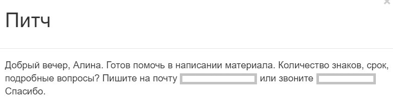
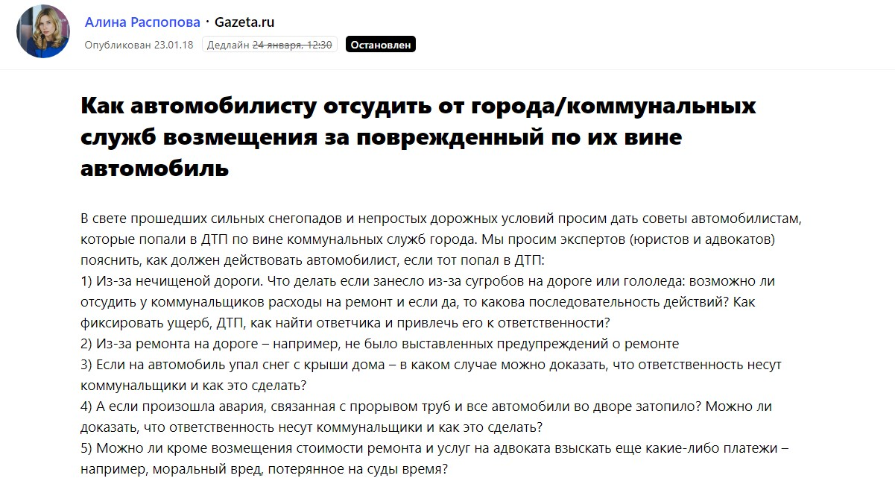
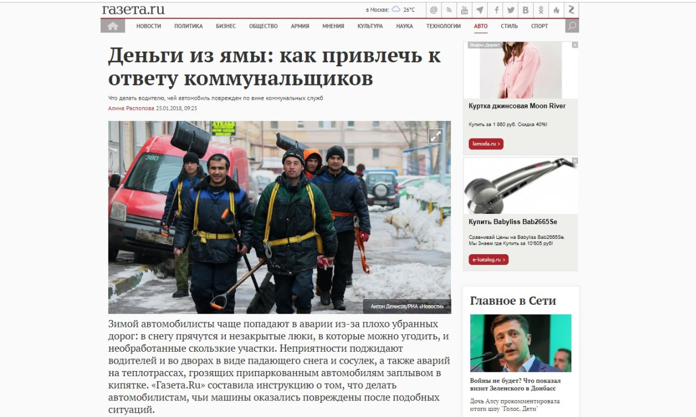
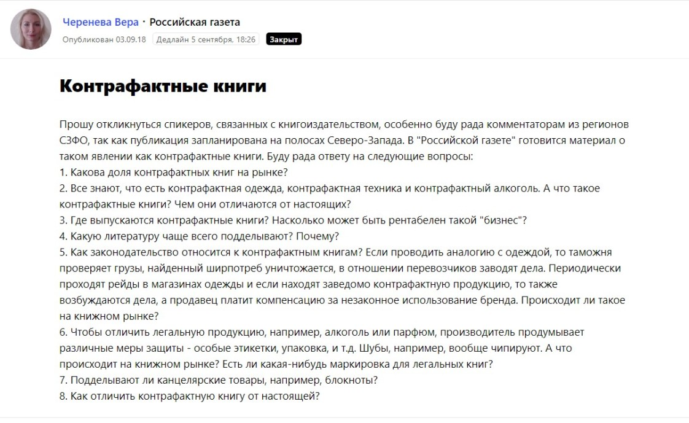
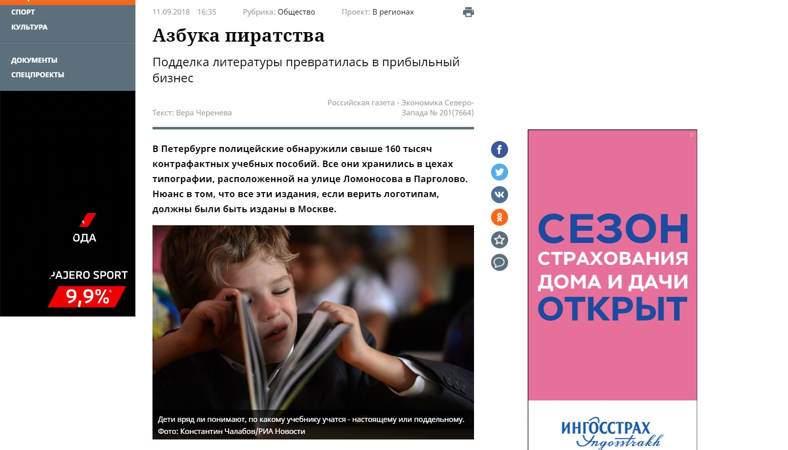
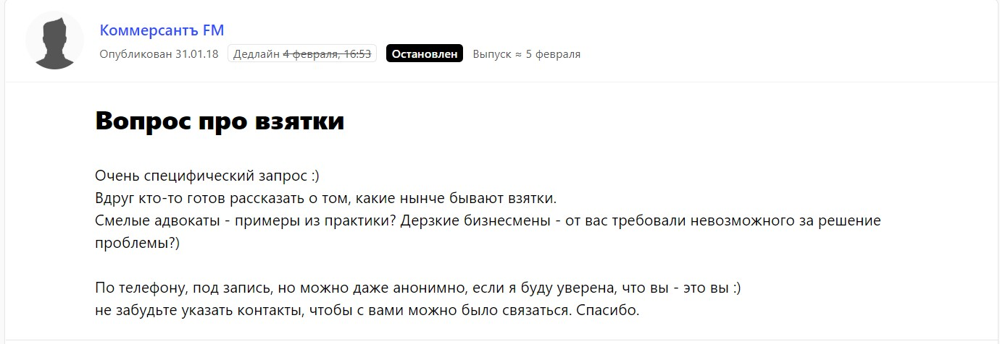
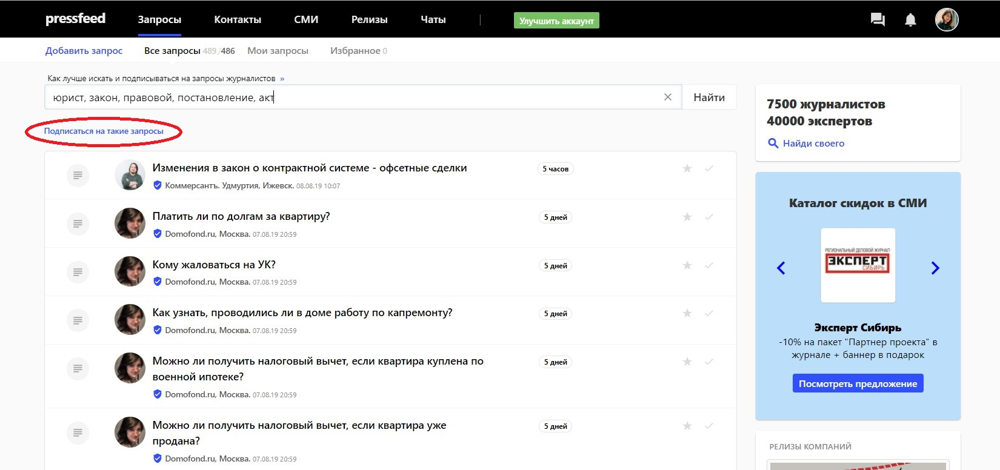
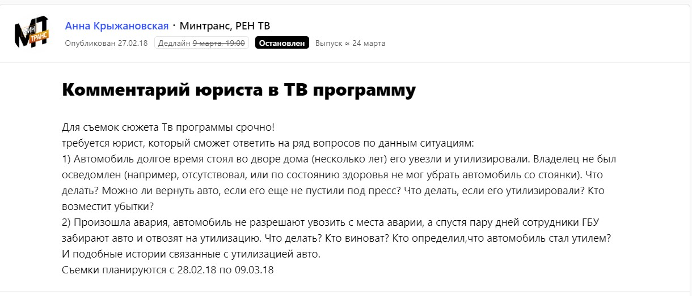

28 лет я изучаю тонкости российского законодательства, а 19 лет из них работаю адвокатом. Занимаюсь гражданскими и уголовными делами, арбитражными спорами и многими другими правовыми вопросами. Живу в Москве, но работаю на территории всей России.

Признаюсь, что я начал развивать личный бренд только чуть более года назад. Раньше как-то не думал об том, клиенты были, дела шли, в плане работы кризисов не наблюдалось. Однако наступил день, когда захотелось чего-то большего, возможно, признания, узнаваемости, более громких дел. Много читал о личном бренде в интернете, и в большинстве статей говорилось о том, что развивать личный бренд в первую очередь необходимо тем, кто работает на себя. То есть это важно для независимых специалистов: психологов, тренеров, юристов, художников и т. д.

Таким образом, я решил заняться личным брендингом. Более года назад я написал первую статью для издания «Деловой Петербург». А уже в начале 2019 года появился в эфире телеканала CNN. Но обо всем по порядку.

## Зачем вообще развивать личный бренд

Если рассуждать логически: как может расти доход специалиста, который работает один? Он просто физически не сможет взять 50 клиентов вместо 5, например. Значит, самое рациональное решение ㅡ увеличивать цену на свои услуги. Конечно, на расценки профессионала больше всего влияют его кейсы (выигранные дела, в случае адвоката). У меня с этим проблем не было и нет. Но ведь новая аудитория и потенциальные клиенты должны как-то узнавать о том, что вы умеете, что делаете, какие проблемы решаете. Выделять вас среди сотни конкурентов, в конце концов. Можете представить, сколько всего в Москве адвокатов.

Развитие личного бренда =

* продвижение себя как эксперта;
* узнаваемость и востребованность среди ЦА;
* доверие со стороны общества;
* непрерывный поток клиентов;
* знакомства с нужными людьми;
* многократное умножение дохода.

И, вместо того, чтобы долго себя расхваливать при встрече с потенциальным клиентом, можно просто спокойно и с улыбкой сказать: «Прочитайте обо мне в интернете».

> Личный бренд ㅡ тот самый образ, который делает вас известным, неповторимым и уникальным. То, что убеждает людей доверять вам, и как следствие, дает им обоснованную причину платить вам больше.

## Один из основных инструментов для построения личного бренда ㅡ публикации и эфиры в СМИ

Всего два инструмента, в которые нужно вкладывать время и силы. Отмечу, вкладывать не деньги, потому что личный бренд можно построить практически бесплатно. Вы должны быть готовы тратить на это время, ресурсы и знания. Вот и все.

Я использую два инструмента для коммуникации с ЦА ㅡ выступления в медиа и социальные сети. Под выступлениями в медиа я имею в виду и печатные, и онлайн, и телевизионные средства массовой информации. Мои комментарии для федеральных изданий («Коммерсантъ», «Новая газета»), полноценные тексты для отраслевых площадок («Гарант», «Право.ru»), сюжеты на крупных российских и зарубежных телеканалах («Первый канал», «Россия 1», CNN).

По факту инструментов для развития личного бренда больше, но не обязательно распыляться на все сразу. Возможно, для кого-то эффективнее часто выступать на конференциях, но я выбрал такой путь ㅡ как можно чаще давать комментарии для интернет и ТВ площадок. Плюс подкреплять это все полезными постами в социальных сетях.

## Появления в медиа: как подружиться с журналистами и продюсерами

Сначала скажу истину, которой следует придерживаться всем, кто хочет успешно публиковаться в СМИ и участвовать в эфирах телеканалов. Журналисты, продюсеры, редакторы ㅡ это ваши главные друзья на этом поприще и их нужно ценить. Идти им на помощь, быть оперативным и отзывчивым.

Для большинства медиа вообще предельно важна оперативность. У меня есть помощница, которая готовит основную фактуру ответа для печатных и онлайн СМИ: я даю ей указания, надиктовываю ответы в мессенджере, она формирует текст, я вношу некоторые коррективы, убираю лишнее, что-то добавляю, и вот текст уже готов.

> Журналисты сразу замечают, что я готов работать быстро и ответственно. И если им понравилось сотрудничать с мной в первый раз, то они продолжат общение и обратятся во второй раз.

Знакомиться с журналистами можно на каких-то тематических встречах или в группах, писать в редакции напрямую, а также обязательно использовать «социальную сеть» для журналистов и экспертов ㅡ сервис журналистских запросов [Pressfeed](https://pressfeed.ru/). На этой платформе издания ищут героев для своих публикаций и телесюжетов. Много запросов по любым тематикам, в том числе по юриспруденции.

## О чем говорю в СМИ: примеры публикаций в изданиях и эфиров на ТВ

99% моих комментариев касаются закона и разрешения юридических разногласий. Я говорю лишь о том, в чем разбираюсь идеально. Крайне негативно отношусь к экспертам, которые экспертами и не являются, а лишь обманывают читателей и зрителей. Увы, среди юристов таких много.

**Публикации в онлайн-СМИ**

Приведу примеры. Я знаком с журналистами большого издания «Газета.ru» и не один раз давал комментарий для их сайта. Как-то обсуждали вопросы амнистии для виновников в смертельных ДТП.

.jpg)  
[_Публикация в «Газета.ru»_](https://www.gazeta.ru/auto/2018/02/14_a_11649325.shtml)

На самом деле, попасть в такие крупные федеральные СМИ могут даже «новички» в общении с журналистами. В этом случае помогает сервис Pressfeed. Просто мониторьте на сервисе актуальные по тематикам запросы и старайтесь отвечать оперативно и по делу. Выигрывают те, у кого подключен платный аккаунт «Эксперт» (у меня подключен). Цена ㅡ около 3,5 руб. в месяц, зато эксперт может реагировать на неограниченное количество запросов и видеть все запросы раньше тех, кто использует бесплатный аккаунт.

Я смотрю на тематику запроса, на издание, если все устраивает, то формирую свой ответ и высылаю его журналисту. Можно даже не писать полный комментарий сразу, а просто быстро обозначить, что вы на связи и готовы ответить.

_Пример ответа для журналиста_

Снова приведу пример с «Газета.ru». Я могу контактировать с редакцией и напрямую, и точно так же через Pressfeed. Тема была вновь автомобильной, только журналист интересовался, что делать человеку, если его автомобиль повредили по вине коммунальных служб.

[_Запрос от «Газета.ru»_](https://pressfeed.ru/query/39604)

Я дал некую инструкцию для читателей, как себя вести, если с водителем случилась такая неприятная история.

  
[_Фрагмент публикации в «Газета.ru»_](https://www.gazeta.ru/auto/2018/01/23_a_11623171.shtml?updated)

Также через сервис неоднократно работал с «Российской газетой» (на данный момент я ответил на 23 запроса от редакции!). Например, высказывал свое мнение по поводу пиратского книгоиздания и авторских прав.

[_Запрос от «Российской газеты»_](https://pressfeed.ru/query/47158)

Продажа поддельных книг преследуется законом, но, к сожалению, этот бизнес только продолжает процветать.

[_Публикация в «Российской газете»_](https://rg.ru/2018/09/11/reg-szfo/poddelka-literatury-prevratilas-v-pribylnyj-biznes.html)

Можно попасть и в «Коммерсантъ». Помню интересный [запрос о взятках](https://pressfeed.ru/query/39889).

  
[_Запрос от издания Коммерсантъ FM_](https://pressfeed.ru/query/39889)

Редакция искала «смелого адвоката», а я не испугался и ответил. Получился материал [«Взятка в России переживает эволюцию»](https://www.kommersant.ru/doc/3536188).

Я отвечаю на запросы не только деловых или общественно-политических медиа. Иногда помогаю журналистам из изданий другого формата ㅡ давал комментарий «Лайфхакеру», «Аргументам и фактам», Life.ru, профильному Banki.ru и другим площадкам.

На Pressfeed помогает подписка по тематикам: можно ввести ключевые слова для вашей отрасли, а затем получать рассылку только с теми запросами, которые подходят вам по теме. Это очень удобно.

_Пример подписки по ключевым словам_

**Эфиры на ТВ**

Кто бы ни говорил, что телевидение умирает, пока это не так. Оно работает, люди его смотрят. В целом, чтобы попасть на ТВ, нужно действовать по таким же схемам, как с любыми другими медиа. Только вместо журналистов там обычно продюсеры и редакторы программ.

Работа с телеканалами имеет накопительный эффект: сначала снимаетесь изредка, но чем больше появляетесь на ТВ, знакомитесь с продюсерами, тем чаще вас начинают приглашать. Опять же люди, работающие на федеральных каналах, должны увидеть, как вы держитесь перед камерой, умеете ли нормально говорить, как подаете информацию и так далее. С текстами попроще в этом плане.

Начать, кстати, можно тоже через сервис Pressfeed, телеканалы тоже оставляют там свои запросы, можно познакомиться с разными продюсерами ключевых российских телеканалов.

[_Запрос от «РЕН ТВ»_](https://pressfeed.ru/query/40853)

Личный бренд ведь не строится за один день, и каждый эксперт накапливает некое «портфолио». Приходите в одну программу, затем ㅡ в другую, вас запоминают, узнают, оценивают, а потом уже ценят. Так я оказался в программе «На самом деле» с Дмитрием Шепелевым и в «Прямом эфире» с Андреем Малаховым.

> Волшебной таблетки «как попасть на ТВ» не существует, это просто результат хорошей работы над личным брендом. Нужно достигать такого уровня экспертности и доверия к вам, чтобы ваше мнение было интересно миллионам зрителей.

Так, в конце января 2019 года в связи с моей успешной работой по защите и освобождению из-под стражи Анастасии Вашукевич (настоящее имя подзащитной ㅡ Настя Рыбка, не буду углубляться в ее историю, проще найти и прочитать в интернете) был показан новостной сюжет обо мне на телеканале CNN. Для меня это большое достижение и гордость.

## Что все это дает: еще раз о значении личного бренда

Финально еще раз проговорю, что дает мне развитие личного бренда. Мои клиенты ㅡ образованные, думающие, обеспеченные люди. Они не будут доверять решение своих проблем неизвестному и «непроверенному» адвокату. Они обратятся ко мне, только если будут уверены в моих компетенциях и опыте. Выступления в СМИ, новости обо мне, социальные сети ㅡ то, что демонстрирует мою экспертность, формирует репутацию.

За май 2019 года по словосочетанию «Дмитрий Зацаринский» (и близких по тематике) Wordstat.yandex показывает 160 поисковых запросов. Это мои потенциальные клиенты, значит, люди интересовались мной и искали информацию о моих навыках. Наверняка, затем они прочитали несколько публикаций с комментариями и посмотрели страницы в соцсетях. Именно поэтому в СМИ выходят десятки публикаций в месяц с моим участием, которые я инициирую как напрямую с помощью знакомых журналистов, так и через сервис Pressfeed.

Кстати, я спрашиваю у доверителей, как они узнали обо мне, и теперь часто слышу ответы: «Увидели по телевизору», «Прочитали в X издании». Обязательно собирайте обратную связь у клиентов, чтобы точно понимать, что вы не тратите усилия впустую.

Также желательно отслеживать трафик на личный сайт «в моменте»: когда вышло несколько хороших публикаций или прошла пресс-конференция. Обычно посещаемость сайта увеличивается в десятки раз в течение нескольких дней, затем снова возвращается к привычным показателям.

> Считаю, что репутация и бренд эксперта напрямую влияют на стоимость услуг специалиста. Я как адвокат не буду брать больше клиентов, потому что не могу работать плохо, но могу постепенно увеличивать цены и в итоге зарабатывать больше.

В конце концов, все мы работаем, чтобы обеспечить себе достойный уровень жизни.
