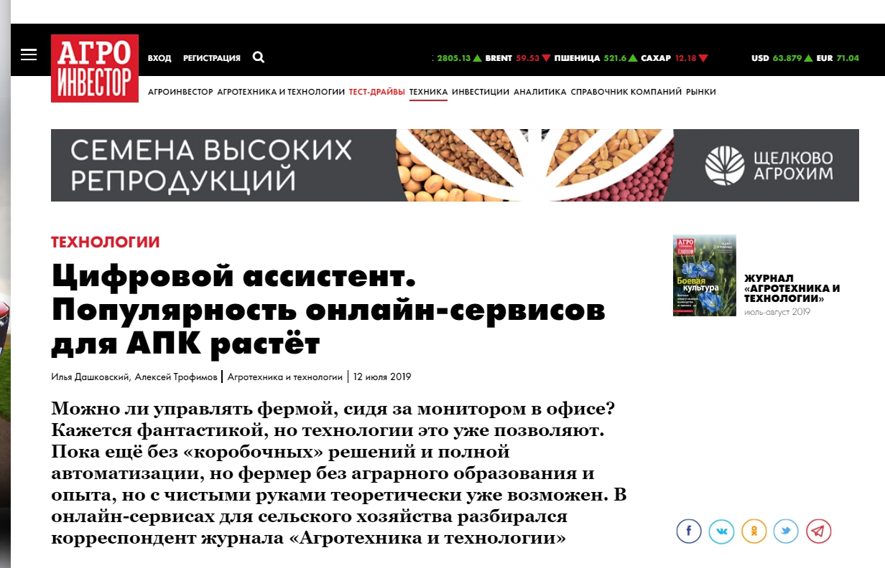
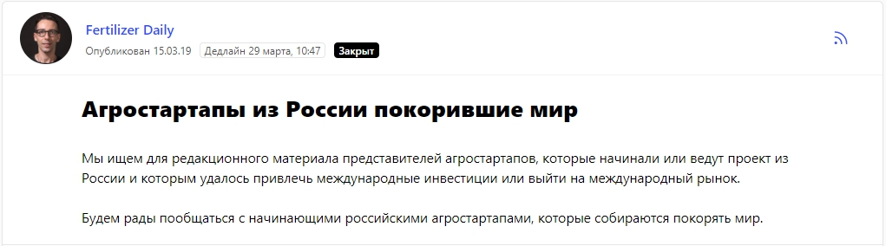
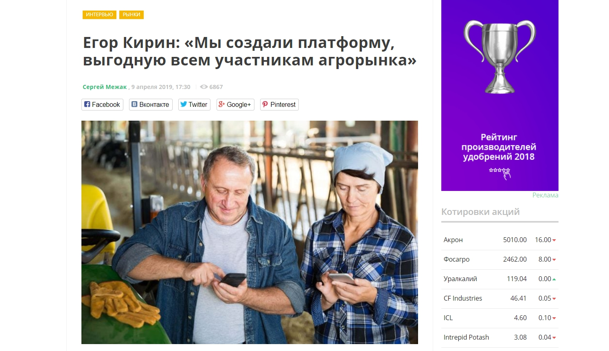
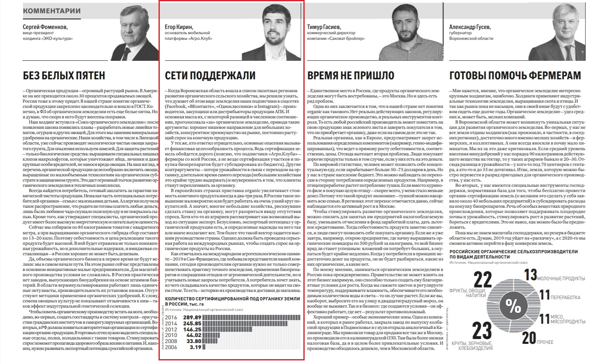
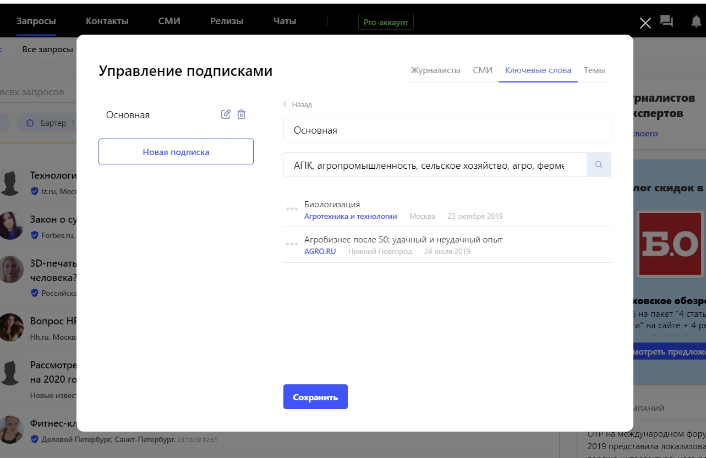

Наш продукт называется [Agro.Club](https://agro.club/). Это цифровая платформа и мобильное приложение, которые объединяют всех игроков агрорынка в единую экосистему.

Проект был запущен в августе 2018 года. Создатель Agro.Club Егор Кирин работал во многих международных компаниях, связанных с агросферой, и знал не понаслышке проблемы, боли и ожидания фермеров, дистрибьюторов, производителей и закупщиков сельскохозяйственной продукции. На рынке не хватало единого технологического решения, которое соберет в одном месте всех участников агросообщества и поможет вести бизнес более эффективно. Так и возникла идея, которая реализовалась в цифровой платформе Agro.Club.

Основные пользователи продукта — это сельхозпроизводители, закупщики, дистрибьюторы и производители семян, удобрений, средств защиты растений. С помощью Agro.Club они могут вести коммерческую деятельность по покупке-продаже через смартфон или компьютер/планшет, общаться с коллегами и делиться опытом, читать новости в АПК и многое другое. Функционал широкий и доступный, при желании, можно даже проверить, не контрафакт ли реализуют новый магазинчик или малознакомый дистрибьютор.

## Какие инструменты продвижения используем в целом

После того как мы изучили потенциальных пользователей Agro.Club, стало понятно, что наиболее эффективными методами продвижения будут: телемаркетинг, контекстная и таргетированная реклама (недолго, но комплексно), посещение отраслевых мероприятий (выставок, конференций, форумов). Также сделали ставку на развитие аккаунтов в социальных сетях и подключение инфлюэнсеров.

> Важно отметить: регистрация на платформе бесплатная. Пользователи ничего не теряют, когда присоединяются к сервису. И наша задача в процессе продвижения была не продать аудитории новый продукт, а рассказать всем участникам отрасли об Agro.Club, предложить им попробовать наше решение и самим для себя определить его ценность.

И, конечно, помимо участия в профильных мероприятиях, развития социальных сетей и телемаркетинга, мы подключили еще один эффективный инструмент пиара — публикации в различных отраслевых (и не только) СМИ.

## Почему стартапу не обойтись без поддержки со стороны СМИ

Стартапам публикации в СМИ нужны, чтобы донести до потенциальных клиентов идею проекта, его цели, преимущества и перспективы. К тому же упоминания в крупных и уважаемых изданиях могут привлечь инвесторов, обратить внимание чиновников на проект. А внимание такой аудитории для новых и развивающихся компаний значимо.

В будущем, когда стартап превратится в зрелую и хорошо известную компанию, дружественные СМИ могут поддерживать репутацию бренда, рассказывать о нововведениях и изменениях.

> Если говорить об Agro.Club, то сейчас наша коммуникационная цель — рассказать участникам агросообщества о компании и о той практической и моментальной пользе, что она создаёт.

## Где писать и о чем писать

Писать нужно о том, с чем связан продукт, в чем вы эксперт и какими наработками можете поделиться. Мы делаем публикации по темам: агротехнологии, сельское хозяйство, цифровизация. При запросах на бизнес-кейсы, пишем непосредственно о платформе Agro.Club, рассказываем, что она собой представляет.

Что касается того, с какими изданиями дружить, то это опять же зависит от целевой аудитории. Наша ЦА хоть и узкая, но весьма разнообразная. То есть наши пользователи могут читать и небольшие отраслевые медиа-порталы, которые нацелены исключительно на игроков агрорынка, и всевозможные издания о бизнесе, которые читают предприниматели из разных сфер и представители госструктур.

## Как общаться с медиа, чтобы они захотели рассказать о новом продукте

Можно работать по классике: напрямую обращаться в целевые издания и к сотрудникам, освещающим темы, релевантные вашей. Искать с ними точки для взаимодействия, понимать актуальность предлагаемого материала, потенциальный интерес для аудитории читателей.

При первом контакте представьтесь, постарайтесь удивить журналиста нетривиальным вступлением, коротко опишите суть сотрудничества и выгоду от нее, приведите какое-то социальное доказательство ваших слов и закончите вопросом или просьбой ответить. Например, нормально задать вопросы: «Какого рода материалы вам интересны на данный момент?», «Чем мы можем быть полезны?» и тому подобное.

**Совет.** Если мечтаете попасть в «Ведомости» или какое-то очень крупное издание в вашей отрасли, то, пожалуйста, объективно оцените степень своей экспертности и подаваемой информации. Текст должен содержать: профессиональную лексику, цифры, факты, не банальные истины. И, да, готовьтесь, что в процессе материал будет жестко отредактирован, а ваше имя (или бренд) будут упомянуты единожды. Это нормально.

Ещё один действенный способ для выхода на целевые СМИ — сервис [журналистских запросов Pressfeed](https://pressfeed.ru/), где сотрудники редакций публикуют запросы с указанием темы и дедлайна. Эксперту компании нужно оперативно отреагировать на запрос, дать уместный ответ и, в случае одобрения журналистом, упоминание эксперта и компании появится на страницах конкретного издания. Регистрация на сервисе бесплатная и доступны разные PRO-аккаунты, предоставляющие больше возможностей.

Например, раздел [«Контакты»](https://pressfeed.ru/people) на Pressfeed позволяет найти по фамилии нужного вам представителя СМИ и напрямую к нему обратиться (на сервисе зарегистрировано более 8,5 тысяч журналистов и редакторов).

Пример — редактор раздела «Свой бизнес» Forbes.ru и корреспондент РБК [Валерия Житкова](https://pressfeed.ru/people/17017). Если мы хотим связаться с ней через Pressfeed, то можно найти её в «Контактах» по поиску.

_Поиск редактора издания по поиску_

Затем можно написать журналисту / редактору во внутреннем чате, предложить темы для публикаций, спикеров и в целом обсудить возможности для сотрудничества.

  
[_Аккаунт журналиста_](https://pressfeed.ru/people/17017)

И, конечно, отлично знакомиться с редакторами значимых изданий отрасли лично. Посещать мероприятия, на которых они бывают. Например, редактор из AFN (AgFunderNews) познакомился с Егором Кириным на «Международном саммите по агротехнологиям» в Сан-Франциско. AgFunderNews — это ведущий международный портал, который рассказывает о сельском хозяйстве, технологиях и инвестициях в отрасли.

[_Публикация на портале AgFunderNews_](https://agfundernews.com/startup-spotlight-how-agro-club-is-cultivating-a-digital-ecosystem-for-russian-farmers.html)

Учитывая, что мы собираемся выводить Agro.Club на зарубежный рынок, это была полезная для нас публикация.

## Как работаем через Pressfeed

Прежде всего, мы делаем ставку на отраслевые издания и внимательно следим за запросами, которые касаются темы АПК. Таких запросов не так много (как и самих медиа-ресурсов), но зато это всегда 100% попадание в нашу целевую аудиторию.

Например, ответили на запрос журналиста по онлайн-сервисам для агроиндустрии и через некоторое время увидели упоминание Agro.Club в «Агротехнике и агротехнологиях» (журнал читаемого нами «Агроинвестора»).

[_Запрос от издания_](https://pressfeed.ru/query/55755)

Текст вышел и на сайте «Агроинвестора».

  
[_Статья на сайте_](https://www.agroinvestor.ru/technologies/article/32052-tsifrovoy-assistent/)

Также было интересное интервью с рассказом о нашем стартапе для Fertilizer Daily. Это популярное в отрасли интернет-издание, посвященное рынку минеральных удобрений и агропромышленности.

  
[_Запрос от Fertilizer Daily_](https://pressfeed.ru/query/53530)

> Статья была полностью посвящена проекту Agro.Club. Ее прочитали около 7 тысяч пользователей, а это тысячи потенциальных подписчиков на нашей платформе.

  
[_Интервью в Fertilizer Daily_](https://www.fertilizerdaily.ru/20190409-egor-kirin-my-sozdali-platformu-vygodnuyu-vsem-uchastnikam-agrorynka/)

Через Pressfeed мы сотрудничаем не только с отраслевыми, но с общепризнанными деловыми изданиями и медиа-порталами. Делали публикации и упоминались в «Российской газете», на ресурсах «Инвест-Форсайт», «ПОнедельник», Promdevelop, etc.

Журналист воронежского филиала «Российской газеты» искал экспертов в области аграрного хозяйства.

  
[_Запрос от «Российской газеты»_](https://pressfeed.ru/query/54702)

Вот так в итоге выглядела полоса от 4 июня 2019 года:

  
_Фрагмент публикации_

На сервисе можно сформировать удобные подписки по ключевым словам. Для нас это: «агромпромышленность», «АПК», «сельское хозяйство», «цифровизация» и тому подобное.

  
К тому же с нами на связи всегда остается менеджер сервиса, который помогает по возникающим вопросам и даже отслеживает запросы по нашим темам.

> **Совет по использованию Pressfeed.** Внимательно читайте запрос журналиста. Кратко расскажите о себе, а потом четко ответьте на конкретный вопрос редакции. Чтобы большая часть ваших ответов была принята, минимизируйте «воду» в комментарии и не рассуждайте на отвлеченные темы.

## Как посчитать эффект от публикаций СМИ

На октябрь 2019 года вышло 35 публикаций с упоминанием бренда Agro.Club (с начала 2019-го). Можно ли однозначно сказать, как публикации в СМИ повлияли на прирост клиентов? Непростой вопрос. Силу пиара вряд ли можно отразить точными цифрами, но можно следить за реакцией после публикаций в виде дополнительного трафика на сайт, резкого прироста числа пользователей, изменением показателя вовлеченности к постам, отзывами в блогосфере и прочее. Сейчас есть масса технологических сервисов и метрик, которые помогают хотя бы косвенно оценить эффективность от публикаций.

На данный момент мы пользуемся «Яндекс.Метрикой» и Google Analytics и знаем, после каких публикаций был, например, резкий рост трафика на сайт. А трафик превратился в регистрации или звонки в колл-центр.

> Каждая публикация в большей или меньшей степени влияет на узнаваемость бренда. Вспомним слова Марка Твена, который говорил: «Любое упоминание в прессе, кроме некролога, это реклама».

Спустя 14 месяцев работы на платформе Agro.Club зарегистрировано 13 тысяч пользователей. К такому результату нас привел и комплекс проводимых маркетинговых мероприятий, описанный выше, и слаженная работа комнаты, и практическая ценность от использования этого технологического решения.