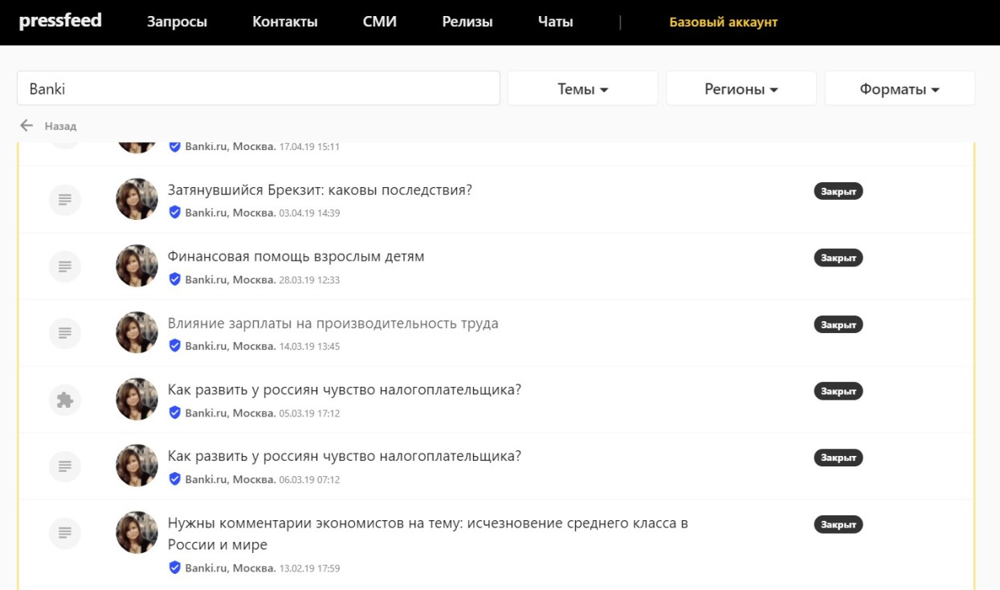
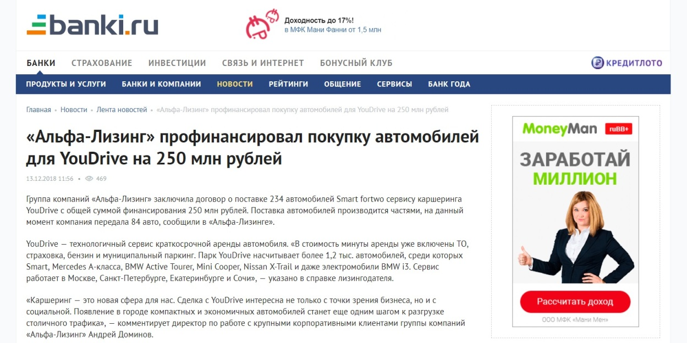
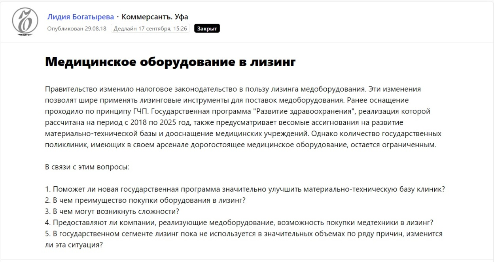
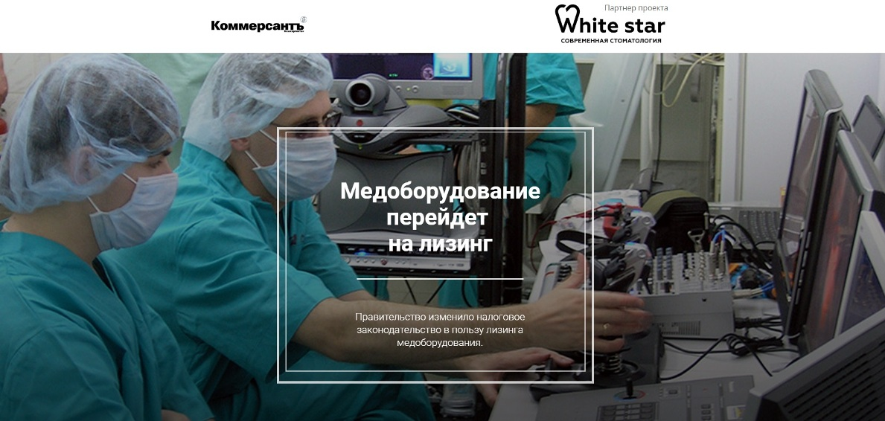
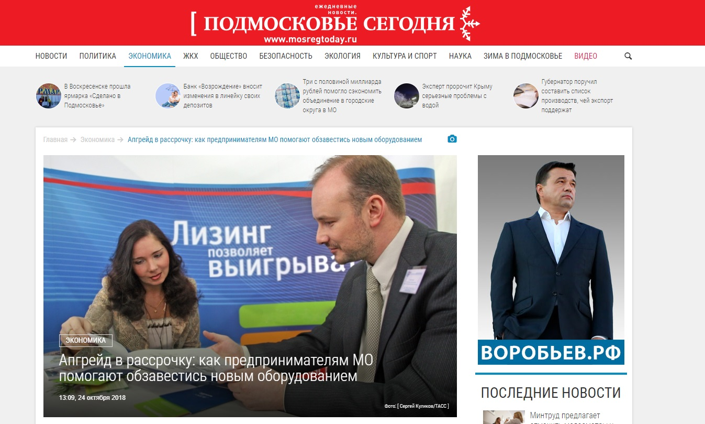
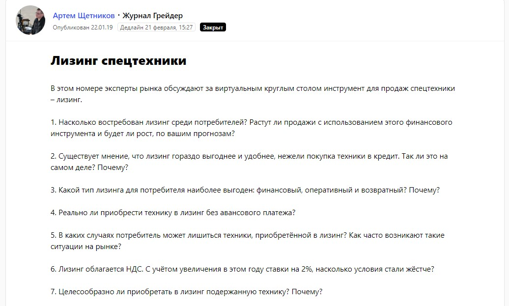
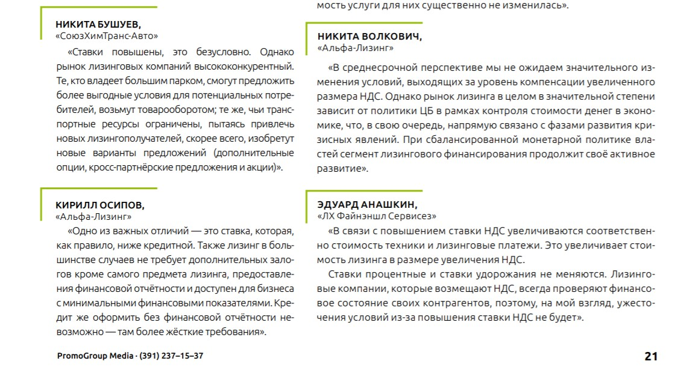
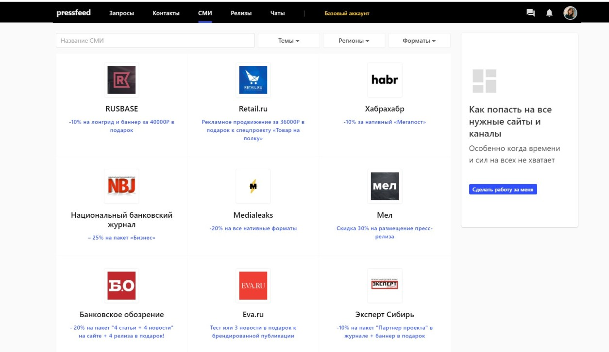

## Чем занимается компания

Компания «Альфа-Лизинг» помогает бизнесу любого масштаба приобрести промышленную и специальную технику, медицинское оборудование, грузовые и легковые автомобили. До недавнего времени «Альфа-Лизинг» развивал только одно направление – по работе с корпоративным бизнесом, то есть исключительно с крупными заказчиками, государственными корпорациями, огромными предприятиями. Это многомиллионные сделки, тендеры и госзаказы. А вот в 2016 году компания запустила еще одно направление – «массовый продукт», обслуживающий малый и средний бизнес. Чаще всего это финансирование небольших проектов (относительно корпоративного бизнеса) на покупку строительной техники, нескольких грузовиков или парка легковых автомобилей.

## Почему после долгих лет работы компании потребовался отдельный PR-департамент

Пока «Альфа-Лизинг» работал с крупным бизнесом, необходимости использовать классические маркетинговые и PR-инструменты у компании не было. Во-первых, количество клиентов такого уровня весьма ограничено, во-вторых, основные конкуренты были известны и самой компании, и клиентам. Это узкая сфера, и поэтому о проведенных сделках и так знал весь рынок.

> Однако когда «Альфа-Лизинг» вывел на рынок продукт «лизинг для юридических лиц и ИП» и начал привлекать средний и малый бизнес, стало понятно, что без дополнительного продвижения и рекламы привлечь клиентов не получится. Большая конкуренция, новый игрок. Даже несмотря на то, что «Альфа-Лизинг» – дочернее предприятие «Альфа-Банка», на b2b-рынке компанию не знали, у целевой аудитории не было представления об услугах, условиях, репутации бренда.

Было решено, что пора формировать эту репутацию и вкладываться в узнаваемость компании на рынке финансовых услуг.

Проще говоря, подключать PR-инструменты: прежде всего, выпускать публикации в СМИ с участием экспертов «Альфа-Лизинг». При этом была задача – начать работу над продвижением компании в короткие сроки и постараться максимально быстро повысить лояльность и доверие потенциальных заказчиков к компании. В 2017 году вся работа по PR-продвижению была отдана на аутсорс, в PR-агентство.

Однако через несколько месяцев пришло осознание: PR должен быть в штате, чтобы оперативно находить нужных спикеров и быстро обрабатывать входящие запросы. К концу 2017 года компания отказалась от услуг агентства и решила начать вести продвижение самостоятельно.

## Отдел PR с нуля: первые шаги

**Шаг 1.** С чего начинать? Первые месяцы PR-отдел потратил на то, что налаживал отношения внутри компании. Необходимо было убедить спикеров компании, что PR – это важно, а пиарщику нужно помогать, а не отмахиваться от него.

Важно было сразу донести до руководителей, что пиарщик берет большую часть работы на себя: приходит с диктофоном, расшифровывает и собирает текст. Спикеру нужно только выделить минут 10-15 на беседу, а потом 5-10 на согласование комментария. Всего 20 минут их времени могут помочь компании развиваться дальше.

**Шаг 2.** Затем важно определиться с темами, по которым компания будет выражать свою позицию в СМИ. В случае с «Альфа-Лизингом» – это финансы, лизинг, страхование, автомобили, промышленная и железнодорожная техника, изменения в законодательстве.

**Шаг 3.** Далее следует составить список изданий, которые освещают выбранные темы и которые читает целевая аудитория компании. ЦА «Альфа-Лизинг» – владельцы среднего и малого бизнеса, значит, компании интересны деловые издания и финансовые издания, а также профильные площадки (железнодорожный транспорт, промышленность и так далее).

**Шаг 4.** Достучаться до СМИ. Этому посвящен следующий раздел статьи.

## Как сотрудничать с журналистами: подключаем сервис-помощник Pressfeed

На первых этапах, когда PR-продвижение «Альфа-Лизинг» только набирало обороты, «прощупать», как живут, о чем пишут различные СМИ, помогал сервис журналистских запросов [Pressfeed](https://pressfeed.ru/). Сначала был зарегистрирован базовый аккаунт для компании (он бесплатный, и в нем действуют некоторые ограничения), а PR-отдел стал изучать, на какие темы журналисты из интересных для компании изданий чаще всего публикуют запросы. Затем пиарщики стали обращать внимание на конкретных журналистов, которые всегда пишут на определенные темы (финансы, например).

**Схема работы:** заходите во вкладку [«СМИ»](https://pressfeed.ru/smi-catalog) – ищите издание по поиску или по рубрикам – смотрите архивные запросы и актуальные запросы издания – изучайте профили журналистов, которые делали запросы на близкие компании темы. Затем журналисту можно написать в чат внутри сервиса, а можно пойти на Facebook и познакомиться там.

_Поиск журналистов в целевом издании_

Следующий этап – «продать» свою компанию журналисту. Объяснить, кто вы, чем можете быть полезными, какую эксклюзивную информацию можете предоставить, какие данные есть у вас, но нет у ваших конкурентов. Впрочем, это нормально, если журналист не примет ваши новости/аналитику/исследование с первого раза.

Так было с изданием Banki.ru, которое на данный момент является ключевым партнером «Альфа-Лизинга» в СМИ. PR-специалист компании связался с журналистом. Предложил ему несколько текстов, но их не принимали. После пары попыток стало понятно, какие материалы и какого формата принимает редакция, и пиарщик сделал так, чтобы журналисту пришлось минимально обрабатывать и переделывать текст. Все получилось, и теперь практически все новости компании появляются на страницах Banki.ru (посещаемость сайта – около 16 млн визитов в месяц).

  
[_Новость_](https://www.banki.ru/news/lenta/?id=10785094) _от «Альфа-Лизинга»_

К осени 2018 года PR-отдел уже наладил прочные контакты с некоторыми отраслевыми и финансовыми СМИ, стал выпускать все больше публикаций, но специалисты компании решили наращивать темпы и подключили аккаунт «Эксперт» на Pressfeed. Он дает право отвечать на любое количество запросов в месяц, и для пользователя открывается доступ к другим полезным функциям.

> Каждый день ответственный PR-специалист выбирает на сервисе запросы по теме и оценивает дедлайн. Обычно крупным федеральным изданиям по типу РБК или «Известий» ответ нужен в тот же день, а желающих попасть на страницы этих площадок – сотни. Поэтому отвечать нужно быстро и давать выжимку, только важное.

Из ценных примеров – запрос от издания «Коммерсантъ.Уфа».

  

[_Запрос_](https://pressfeed.ru/query/47011) _от издания «Коммерсантъ.Уфа»_

Журналист взял комментарий «Альфа-Лизинг» в большой спецпроект по медоборудованию. Несмотря на то, что это региональное приложение, компания получила отличные отклики от клиентов после этой публикации.

[_Материал_](http://ufaprojects.kommersant.ru/medlizing) _с участием компании_

В целом компания старается отвечать на все запросы, которые касаются темы кредитования или лизинга. В приоритете – тема, а не формат издания. Например, через сервис был установлен контакт с журналистом издания «Подмосковье сегодня».

  
[_Запрос_](https://pressfeed.ru/query/48626) _от издания «Подмосковье сегодня»_

Материал был посвящен основной сфере деятельности: в чем преимущества лизинга для предпринимателей, на каких условиях выдают займы.

  
[_Публикация_](https://mosregtoday.ru/econbiz/apgreyd-v-rassrochku-kak-predprinimatelyam-mo-pomogayut-obzavestis-novym-oborudovaniem/) _в «Подмосковье сегодня»_

В другой раз через Pressfeed мнение экспертов «Альфа-Лизинг» попало в узкопрофильный журнал «Грейдер». Журналист приглашал специалистов поучаствовать в виртуальном круглом столе и поговорить о лизинге спецтехники.

  
[_Запрос_](https://pressfeed.ru/query/51803) _от журнала_ _«Грейдер»_

> В создании материала поучаствовал не один эксперт компании, а сразу два. Вообще это важно выпускать публикации вот в таких отраслевых изданиях, ведь их читают только представители целевой аудитории компании.

  
  
_Фрагмент публикации с участием спикеров компании_

Всего сервис Pressfeed обеспечил компании «Альфа-Лизинг» около 25 % публикаций за 2018 год.

Большинство выходов в СМИ легко инициировать практически бесплатно, однако время от времени желательно делать партнерские материалы на таких площадках, куда сложно попасть бесплатно или которые предлагают действительно что-то интересное. Например, «Альфа-Лизинг» выпускал [партнерский материал с «Медузой»](https://meduza.io/short/2019/01/30/vy-predprinimatel-chem-dlya-vas-lizing-mashiny-otlichaetsya-ot-pokupki-ob-yasnyaem-v-odnoy-kartinke). Редакция сама пишет текст, но на берегу следует обсудить мысль, которую нужно донести до читателя.

Результат от платных публикаций может быть непредсказуем. Не стоит думать, что после размещения на той же «Медузе» компания увидит всплеск обращений или заметит особенное внимание к бренду.

Лучше заранее заложить определенный бюджет на PR-продвижение, но не разбрасываться деньгами, а хорошо подумать, куда идти и как распределять средства по каналам размещения.

Кстати, Pressfeed предлагает специальные условия на платные размещения в сотне изданий. Можно купить баннеры или нативный материал по хорошей цене.

  
_Скидки на платное размещение в СМИ_

## Как понять, что это работает: результаты работы через год

На 2018 год в PR-планах компании «Альфа-Лизинг» главная цель была «встать на ноги». Необходимо было зайти на рынок СМИ, выстроить отношения с журналистами, основательно закрепиться в информационном поле. Все удалось, но компании в плане PR еще есть куда расти.

> Основной инструмент, по которому PR-отдел отслеживает медиавлияние компании, – это система «Медиалогия». За год усердной PR-работы общее количество упоминаний об «Альфа-Лизинге» в СМИ выросло в 2 раза, а МедиаИндекс – в 2,5 раза. Рост качества публикаций и качества площадок налицо.

Что касается роста уровня продаж после подключения PR-инструментов. Пока руководство компании не рассчитывает на PR как на инструмент продаж. Финансовая сделка по лизингу может длиться от 2 месяцев до полугода, поэтому увидеть прямую связь «публикация в СМИ – новый клиент» сложно. Сейчас важно смотреть за ростом МедиаИндекса и внимательно следить за отзывами и откликами клиентов. Между тем в 2018 году компания «Альфа-Лизинг» увеличила объем нового бизнеса в 2 раза по сравнению с 2017 годом. Эти показатели можно считать косвенным доказательством, что PR начал работать на бизнес.
