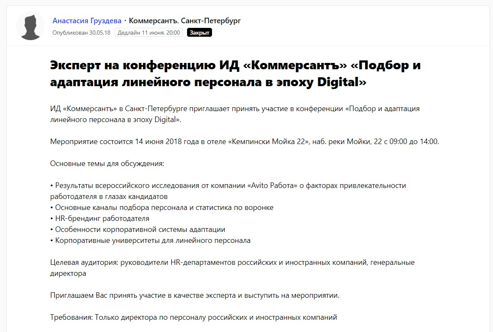
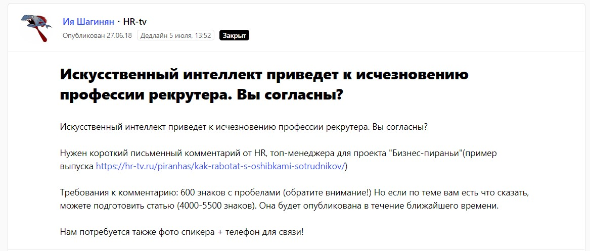
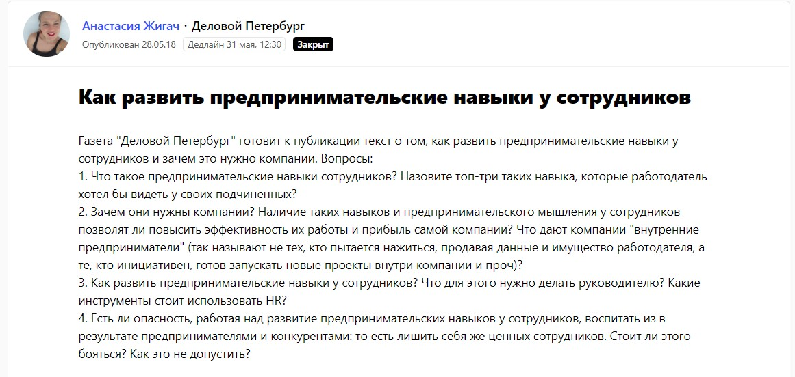

AltSuite — платформа для повышения продуктивности сотрудников и развития корпоративной культуры. Простыми словами, сервис для общения команды и руководителя. Инструмент определяет, как сотрудник вовлечен в рабочую задачу, какие трудности у него возникают, что стимулирует, а что мешает добиться результата. Основа платформы — бот, который автоматически задает вопросы членам команды. Сотрудники отвечают, а сервис собирает данные и выдает аналитику. С помощью статистики руководитель может выявить «точки роста» подчиненных, настроить систему KPI, предотвратить кризисы и найти решения для увеличения эффективности команды.

Продукт AltSuite — новый для российского рынка. Целевая аудитория: владельцы среднего и малого бизнеса, HR-специалисты и коучи. Несмотря на то, что прямых конкурентов в России у AltSuite нет, сложность продукта обусловливает сложность его продвижения.

> Как выйти на HR-специалистов или руководителей компаний? Оказаться там, где обитает ЦА. Сделать это решили, воспользовавшись сервисом Pressfeed.

Как говорят в AltSuite, сейчас для них важно не столько продвигать сами услуги компании, сколько нести «просветительскую миссию».

«Мы хотим объяснить руководителям и HR-специалистам, насколько важно улучшать корпоративную культуру, быть заинтересованными в сотрудниках, мотивировать их, поощрять, развивать»,— говорит Сергей Моровщик, генеральный директор компании «СкайТрейд», инвестор HR-проекта AltSuite.

Более того, на данном этапе роста компании вместе с «пропагандой» ценностей продукта критически важно получать обратную связь от своей ЦА. Нужен ли такой продукт бизнесу? Готовы ли HR-специалисты к работе с ним? Платформа экономит их время или, наоборот, добавляет новых проблем? Какие функции внедрить, а что никому не нужно?

Сбор обратной связи от потенциальных клиентов — одна из главных составляющих PR-деятельности AltSuite. Без мнения рынка создатели AltSuite не смогут развивать платформу в правильном направлении. Впрочем, знать, что думают о твоем продукте потенциальные клиенты, полезно для любого бизнеса.

#### Как получить обратную связь от ЦА

Возникает следующий вопрос: с помощью каких инструментов получать обратную связь? Конечно, можно провести опрос, сделать рассылку, но эффективнее всего спросить лично. Задать вопросы, узнать подробности.

Отлично, но как выйти на HR-специалистов или руководителей компаний, которых, действительно, интересуют вопросы управления командой? Самый простой способ — оказаться там, где обитает ваша ЦА. Сделать это в компании решили, воспользовавшись сервисом журналистских запросов [Pressfeed](http://pressfeed.ru/).

С помощью Pressfeed можно не только получать бесплатные публикации в 4000 различных СМИ, зарегистрированных на сервисе. Время от времени издания размещают на Pressfeed информацию о будущих мероприятиях и приглашают экспертов на отраслевые конференции. В начале июня 2018 года «Коммерсантъ» [опубликовал запрос](https://pressfeed.ru/query/43970): издание находилось в поисках эксперта на конференцию «Подбор и адаптация линейного персонала в эпоху Digital». Эта тема на 100% соответствовала продукту AltSuite.

###### [_Запрос от ИД «Коммерсантъ»_](https://pressfeed.ru/query/43970)

Компания ответила на запрос «Коммерсанта», познакомилась с заместителем руководителя службы информационных проектов издания и попала на конференцию.

На мероприятии Сергей Моровщик рассказал о продукте AltSuite, а после него представители сервиса смогли пообщаться с 15 HR-специалистами ведущих компаний, таких, например, как Сбербанк. Да, пока AltSuite нацеливается на малый и средний бизнес, но проекту было важно заявить о себе и среди таких гигантов. И получить обратную связь.

> Pressfeed оказался удобным инструментом для проверки гипотез: интересен ли рынку твой продукт

Гипотеза, что бизнес заинтересован в такой HR-платформе, подтвердилась. В эпоху digital HR-специалистам и руководителям стоит отдать часть своих функций искусственному интеллекту. Кроме того, владельцам бизнеса пора, наконец, осознать важность создания корпоративной культуры, необходимость вкладываться в сотрудников, мотивировать и развивать их. Не все предприятия готовы внедрять подобные IT-системы прямо сейчас, но они понимают, что им придется задуматься об этом в ближайшем будущем.

«Pressfeed оказался удобным инструментом для проверки гипотез: интересен ли рынку твой продукт», - говорит Сергей Моровщик.

###### [_Фотоотчет_](https://www.kommersant.ru/gallery/3661703#id=1610138) _с конференции на сайте kommersant.ru_

AltSuite получила обратную связь именно от той аудитории, которая ее интересует, и даже, опираясь на мнение участников конференции, внесла в работу платформы ряд изменений:

* сделали более легким процесс регистрации и настройки опросов. Теперь это происходит непосредственно через бота, а не через сайт;
* решили создать дополнительные инструменты для улучшения корпоративной культуры (сейчас в стадии разработки);
* изменили формат рассылок.

#### Кого еще спросить

Чтобы постоянно говорить со своей целевой аудиторией, вы должны поддерживать связь с теми, кто «варится» в вашей тематике. «Каждый день мы получаем как минимум по одному контакту c журналистами через Pressfeed, - говорит Сергей Моровщик. - Мы рассказываем о наших идеях, а они делятся мнением, какие темы кажутся им интересными и востребованными».

Через Pressfeed представители AltSuite вышли на отраслевые издания, с которыми не были знакомы раньше. Например, hr-tv.ru — узкопрофильный портал для специалистов по персоналу. На hr-tv.ru часто обсуждают digital-технологии в сфере HR, так что у создателей AltSuite есть возможность часто давать комментарии для публикаций.

###### [_Запрос от hr-tv.ru_](https://pressfeed.ru/query/44867)

###### _Комментарий представителя AltSuit — результат ответа на запрос от hr-tv.ru_

Другой пример — знакомство с изданием «Деловой Петербург», в публикации которого на тему, могут ли новые инструменты в будущем вовсе заменить HR-отдел, AltSuite также приняли участие.

###### [_Запрос от «Делового Петербурга»_](https://pressfeed.ru/query/43855)

###### _Фрагмент_ [_материала_](https://www.dp.ru/a/2018/07/15/Robot_popal_v_kadri) _на dp.ru_

> «Любое общение с журналистами профильных изданий — это большой плюс для развития бизнеса, - делает вывод из своего опыта работы со СМИ Сергей Моровщик. - Не всегда получается опубликовать совместный материал, но всегда есть возможность поговорить, заинтересовать, выстроить фундамент для будущих отношений».
