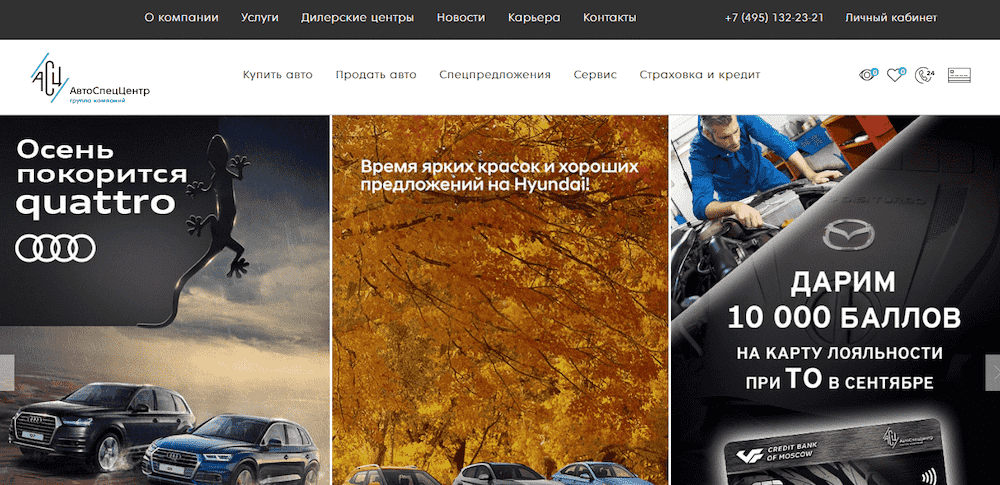
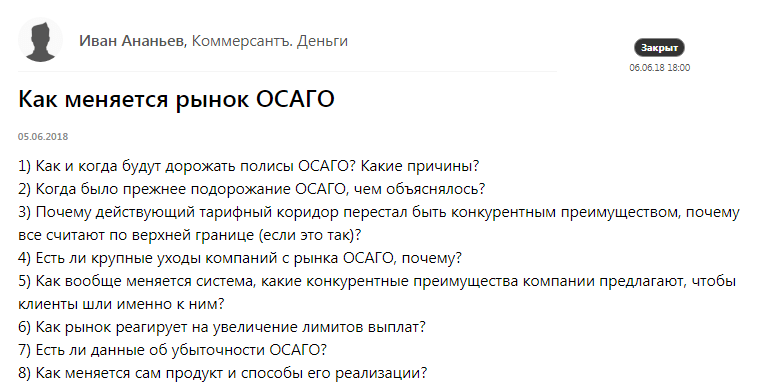
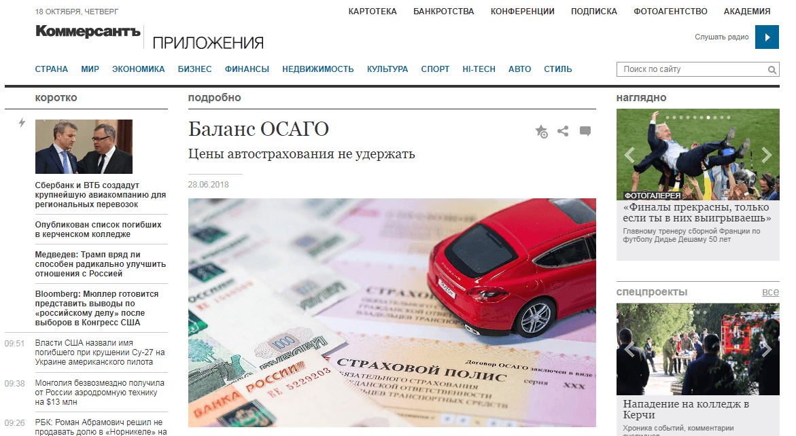
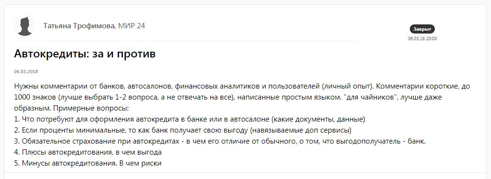
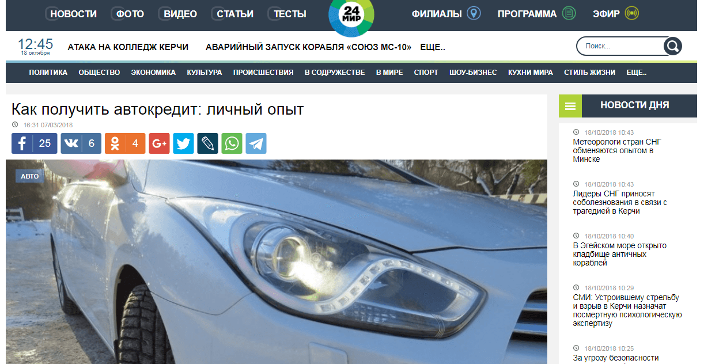
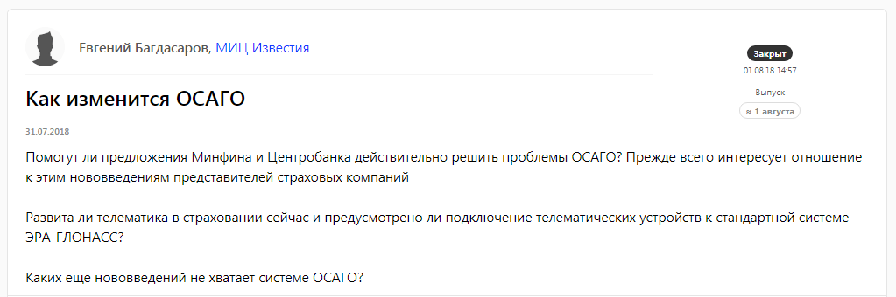
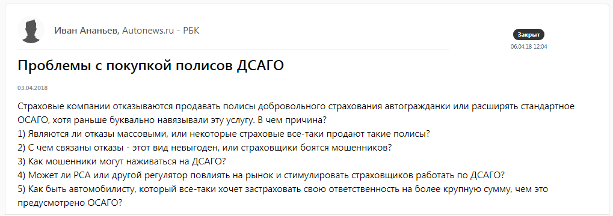
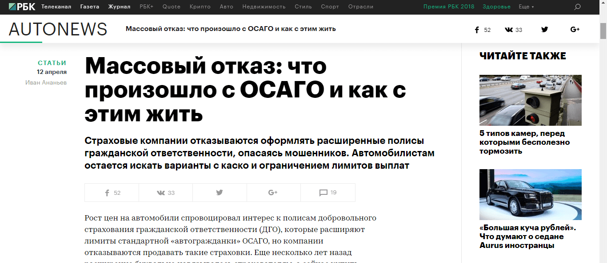

## Кому компания продает автомобили: всем, кто умеет водить

Группа компаний «АвтоСпецЦентр» — один из крупнейших игроков российского авторынка. Группа владеет 27 дилерскими центрами в Москве и ближайшем Подмосковье. В портфеле АСЦ бренды: Porsche, Audi, BMW/MINI, INFINITI, Volkswagen, SKODA, Nissan, Datsun, Hyundai, KIA, Mazda, Citroen. Кроме того, компания занимается продажей грузовых автомобилей и авто с пробегом, предлагает сервис и гарантийное обслуживание, автостраховки и кредиты. Компания находится на 139 строчке в списке Forbes в рейтинге самых прибыльных частных компаний. По итогам 2017 года АСЦ реализовала более 37 тысяч автомобилей.

Целевая аудитория «АвтоСпецЦентра» — это покупатель автомобиля, сервиса или страховки. По [результатам опроса](https://www.autostat.ru/infographics/33422/), проведенного специалистами аналитического агентства «Автостат» и портала портала Авто Mail.Ru, 24% автовладельцев планируют покупку автомобиля в 2018 году. И даже если остальные 76% не собираются менять автомобиль, они могут придти в АСЦ за страховым полисом или сервисом.

Всего по данным [«Автостата»](https://www.autostat.ru/news/32958/), за последние 10 лет количество легковых автомобилей на дорогах увеличилось на 50%. В 2017 году автопарк России превысил 42 млн, а парк Москвы насчитывает 3,65 млн легковых автомобилей.

## Почему компании с широкой целевой аудиторией важно публиковаться в крупных СМИ

Когда речь идет о PR-продвижении автодилера, нужно помнить, что автомобиль — дорогая покупка. Среднестатистический человек подходит к выбору машины ответственно, копит деньги или ищет самые выгодные условия по кредиту, сравнивает цены, изучает условия продажи, обращает внимание на дополнительные бонусы от автосалонов. Когда будущий покупатель почти определился с маркой, моделью, дилером, он начинает искать информацию, отзывы, статьи, упоминания об автосалоне и о холдинге, которому принадлежит этот салон. Куда идет потенциальный клиент? В поисковик, на автомобильные сайты, на сайты с отзывами. Он читает отклики, новости, попадает на публикации с участием компании. В конечном итоге это формирует образ компании.

> «Автомобили не продают в онлайне. Потенциальный покупатель может несколько месяцев выбирать марку и дилера. Вряд ли получится так, что человек прочитал наш экспертный комментарий в газете и в тот же день поехал к нам в салон покупать машину. Самое правильное, что мы можем сделать с помощью СМИ, — повлиять на его финальное решение, помочь сделать выбор в нашу пользу. Чем больше публикаций о нас он увидит, тем легче нам завоевать доверие потребителя. Доказать, что мы лучше других компаний», — говорит PR-менеджер ГК «АвтоСпецЦентра» Анна Уткина.

## Публикации в СМИ: чем больше крупных изданий, тем лучше

Таким образом, PR-продвижение должно **охватывать максимальное число водителей**. И чтобы охватить эту аудиторию, нужно постоянно «попадать» во все крупные российские СМИ.

Если поделить издания, интересные компании «АвтоСпецЦентра», по категориям, то получится такая градация:

1) массовые издания  с большой аудиторией («Коммерсантъ», «Известия», «Ведомости»,  «РБК» и подобные);

2) отраслевые автомобильные медиа (autonews.ru, Авто Mail.ru, automobili.ru, zr.ru и другие);

3) глянцевые и лайфстайл СМИ.

Первая и вторая категории в приоритете: автомобильные сайты и журналы читают те, кто действительно интересуется автомобилями или планирует покупку авто в ближайшее время. Популярные издания по типу «Коммерсантъ» привлекают компанию с точки зрения посещаемости.

> PR-служба «АвтоСпецЦентра» начала активно взаимодействовать с журналистами через Pressfeed, так как на сервисе работают представители всех целевых изданий: как массовых, так и узких автомобильных. Всего на Pressfeed зарегистрировано более 4000 медиа, у ⅔ редакция находится в Москве.  Более 40 изданий на автомобильную тематику. То есть запросы, на которые «АвтоСпецЦентр» компетентен дать ответы, есть практически каждый день.

## Как компания работает с массовыми медиа

Любую публикацию в крупных российских изданиях (общественно-политических, деловых) обязательно прочитают тысячи жителей страны. Из них половина будут автовладельцы.

Например, сайт rbc.ru за август 2018 зафиксировал около 25 млн посещений (по данным liveinternet.ru). Кроме того, такие издания читают преимущественно предприниматели, руководители, топ-менеджеры. Принято считать, что это платежеспособная аудитория, которая интересна АСЦ с точки зрения и b2c, и b2b продаж. Владельца бизнеса может привлечь корпоративное обслуживание автомобилей, но он одновременно может думать о покупке нового автомобиля для себя или членов своей семьи. Еще деловые издания имеют высокий индекс цитируемости. Опубликовались там — и ваш комментарий наверняка перепечатают более маленькие ресурсы.

На страницы таких изданий мечтают попасть 99% российских компаний. Их журналисты нарасхват, а редакционная почта завалена пресс-релизами.

На Pressfeed эти же самые журналисты сами говорят, о чем хотят написать, и приглашают компании помочь им. Экспертам нужно просто написать ответ и отправить его журналисту прямо через сервис.

Например, через Pressfeed «АвтоСпецЦентр» дал комментарий журналисту издания «Коммерсантъ. Деньги».

[_Запрос_](https://pressfeed.ru/query/44138) _журналиста «Коммерсантъ. Деньги»_

У АвтоСпецЦентра было что рассказать по теме ОСАГО, компания ответила на все вопросы журналиста, в итоге с ними вышел материал [«Баланс ОСАГО»](https://www.kommersant.ru/doc/3669138).

_Материал с участием «АвтоСпецЦентр» на_ [_kommersant.ru_](https://www.kommersant.ru/doc/3669138)

С комментариями нужно вписываться в актуальные рыночные статьи, и важно предугадывать, о чем журналисты напишут завтра, а не ориентироваться на то, о чем они пишут сегодня. В автосегменте это динамика авторынка, продажи, автокредиты, самые популярные модели авто, хайтек, ГИБДД, ОСАГО и каско.

Например, эксперт компании отвечал на вопросы об автокредите для «МИР 24».

[_Запрос_](https://pressfeed.ru/query/41080) _от издания «МИР 24»_

  
_Материал с участием «АвтоСпецЦентр» на_ [_mir24.tv_](https://mir24.tv/articles/16294959/kak-poluchit-avtokredit-lichnyi-opyt)

Если вышел новый закон или ввели новые правила, касающейся вашей тематики, обязательно подготовьте развернутый комментарий — это один из вариантов появиться в крупном СМИ.

_Запрос от_ [_«МИЦ Известия»_](https://pressfeed.ru/query/46045)

  
_Публикация на_ [_iz.ru_](https://iz.ru/773542/evgenii-bagdasarov/dorogoe-osago-skoro-vse-budet-inache)

## Как компания работает с отраслевыми СМИ

Наладить отношения с отраслевыми СМИ обычно проще, чем с общественно-политическими или деловыми. Это правило действует для любого бизнеса: если вы производите лекарства, то давать комментарии профессиональным фармацевтическим журналам легче, чем «Ведомостям».

Тоже самое и с автомобилями. Качественные автомобильные издания можно пересчитать по пальцам, и в них стремятся попасть только те компании, которые непосредственно связаны с автомобилями. «АвтоСпецЦентр» считается одним из лучших автодилеров и занимает 10 место по объему продаж новых а/м среди всех российских компаний. Журналисты отраслевых изданий знают АСЦ, давно знакомы с пресс-службой компании и часто сами запрашивают у холдинга экспертные комментарии. Однако журналисты этих изданий тоже публикуют запросы на Pressfeed, например, Autonews.ru.

> Часть журналистов перестала отправлять нам персональные запросы по почте, как это было раньше, но при этом предложения от них появлялись на Pressfeed. Тогда нам проще и быстрее ответить через сервис.

  
[_Запрос_](https://pressfeed.ru/query/42058) _от Autonews.ru_

_Публикация на_ [_autonews.ru_](https://www.autonews.ru/news/5acddded9a79472ae4b65512)_, сделанная с помощью Pressfeed_

## Что дают компании публикации в СМИ: узнаваемость, рост продаж

Группа компаний «АвтоСпецЦентр» уверена, что любой комментарий работает на повышение доверия, лояльности клиентов, формирует образ компании в голове потребителя, и в конечном итоге, косвенно влияет на продажи их продукции.

> Всего в месяц выходит около 300 упоминаний с компанией «АвтоСпецЦентра» (с учетом перепечаток). 80% делается через личные контакты с журналистами, 20% обеспечивает Pressfeed. Из них около 30% — публикации в крупных СМИ.

Именно Pressfeed дает возможность видеть развернутую картину происходящего в СМИ, понимать, что интересно журналистам, как еще можно вписать автомобильную тему в запросы изданий.
