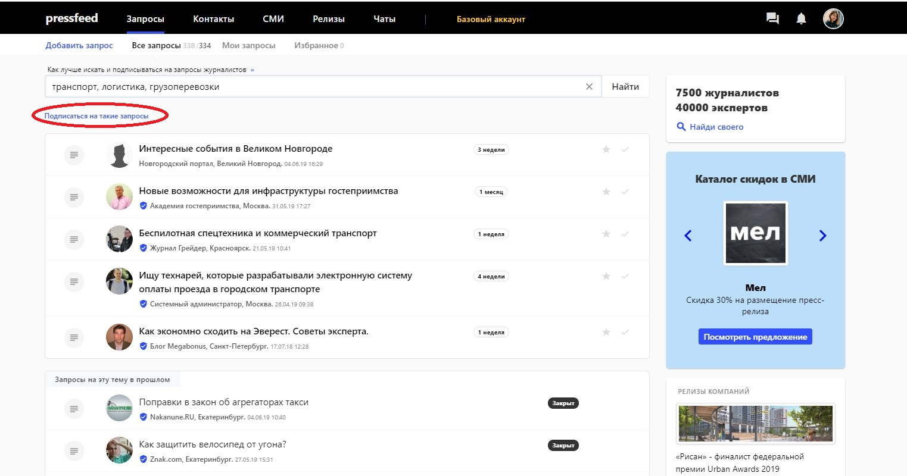
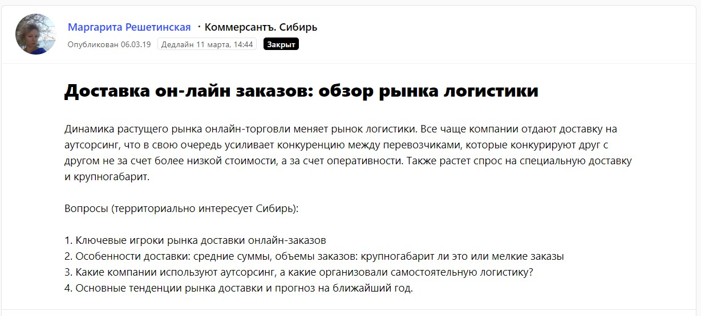
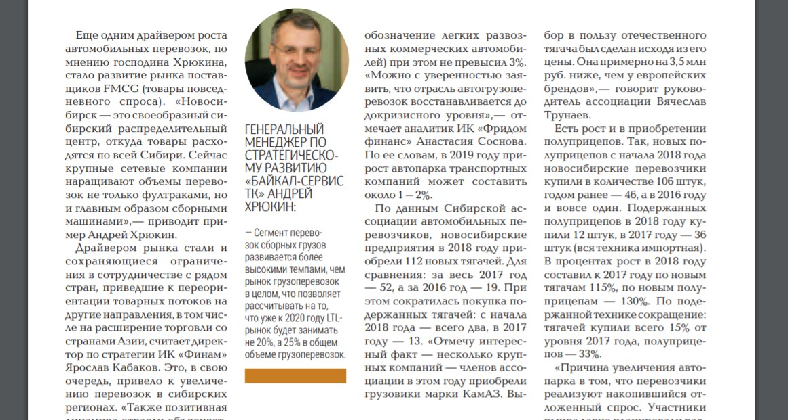
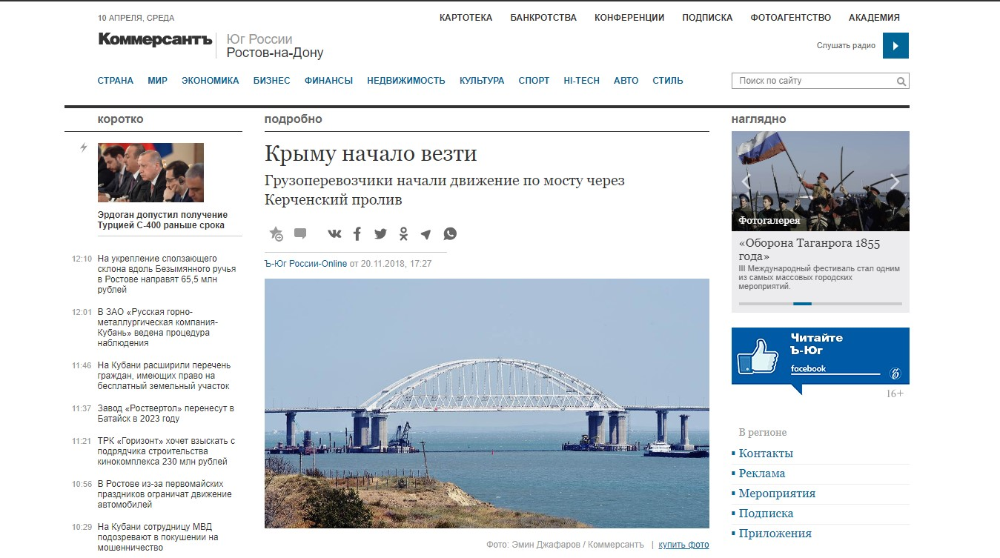
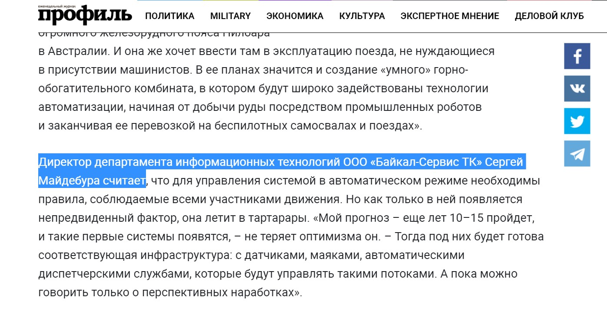
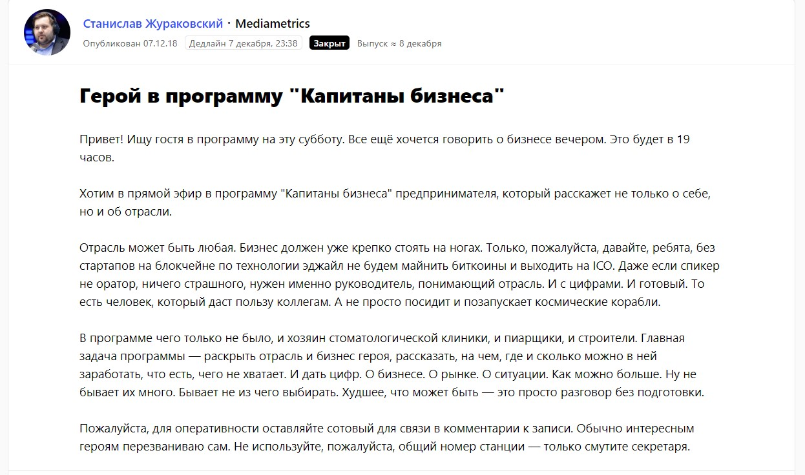
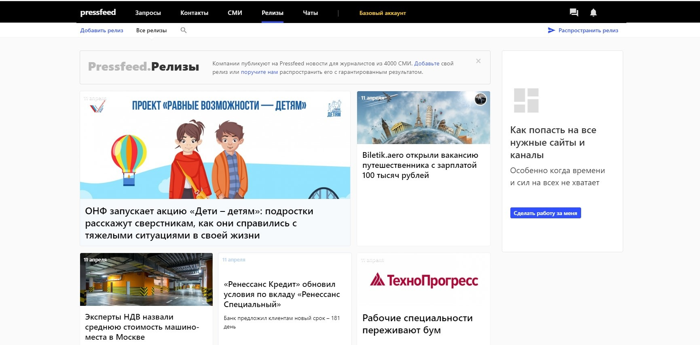

## О компании

[«Байкал-Сервис»](https://www.baikalsr.ru/) занимается перевозками сборных грузов (это значит, что одна машина везет грузы от разных клиентов ― такая доставка получается более удобной и выгодной в случае отправки сравнительно небольшой партии груза, посылок и т.д.). Компания имеет 87 филиалов по стране и доставляет грузы в 50 тыс. населенных пунктов по всей России. Основная часть наших клиентов ― предприятия малого, среднего и крупного бизнеса, индивидуальные предприниматели. Также мы работаем с физическими лицами, вводим для них новые услуги, одна из последних ― «#Тариф Посылка».

## Зачем транспортной компании заниматься продвижением в медиа

«Байкал-Сервис» существует уже 25 лет и динамично развивается от года в год, у нас есть база постоянных заказчиков, мы входим в тройку ведущих компаний России по сборным перевозкам. Но, несмотря на все заслуги, узнаваемость бренда на рынке пока невысокая. Я имею в виду, что многие потенциальные клиенты прежде никогда не слышали о нас. Предположим, менеджеры по продажам делают «холодный звонок» директору по логистике новой компании и в ответ на предложение слышат: «А кто вы?». Тогда менеджерам необходимо доказывать, что мы крупная транспортная компания, которая давно на рынке, у нее большой опыт.

> PR-инструменты, а именно публикации в СМИ, ― это доказательная база, которая может влиять на потенциального клиента до того, как к нему обратиться наш менеджер. Другими словами, пиар способен «прогревать» клиентов в режиме ожидания, даже тогда, когда условный начальник отдела логистики не ищет новую компанию для перевозок.

Если у него возникнет такая потребность, при прочих равных условиях он выберет ту транспортную службу, которую он уже знает, о которой неоднократно он читал. Задача публикаций сделать так, чтобы потенциальный клиент уже имел представление о бренде и понимал, что «Байкал Сервис» ― компания с хорошим сервисом и адекватными ценами.

О компетенциях, опыте, даже ошибках нужно рассказывать открыто и честно, тогда завоевать целевую аудиторию будет гораздо проще. Чтобы вас выбрали, нужно быть известными и понятными. Кроме того, мы активно продвигаем услуги компании с помощью таргетированной рекламы. Опять же, заинтересованный человек скорее кликнет на объявление той компании, которую он знает. То есть публикации в медиа влияют, в том числе, и на конверсию других рекламных инструментов.

## Проблема в рамках продвижения в СМИ: дружили с отраслевыми изданиями, но не имели выхода на крупные медиа

PR-служба в течение трех последних лет работает с различными изданиями и имеет хорошие отношения с журналистами, но дело в том, что до 2018 года мы инициировали публикации, как правило, на профильных ресурсах, посвященных транспортным перевозкам, и в региональных изданиях.

> Нельзя занижать ценность отраслевых площадок, с ними нужно дружить обязательно, ведь их читает бОльшая часть целевой аудитории компании. Ключевая фраза ― «бОльшая». Не вся. Работая только с узкопрофильными площадками, компания оставляет за бортом часть аудитории, а она не менее ценная. Мы пришли к этому выводу осенью 2018 года и решили, что пора выходить на федеральные, деловые СМИ, популярные медиа, которые читают предприниматели и менеджеры высшего звена.

Времени на выстраивание отношений с журналистами крупных СМИ особенно не было, ведь мы и так упустили много лет, пока никак не взаимодействовали с ними. Плюс ко всему, журналисты именно бизнес-изданий считаются самыми востребованными и «желанными» друзьями пиарщиков, ведь на страницы бизнесовых площадок стремятся попасть все компании из b2b-сектора. Журналисты получают по сотне пресс-релизов в день, им постоянно пишут PR-специалисты, которые напористо предлагают спикеров / темы / тексты. Словом, пробиться к ним непросто.

Мы решили пойти технологичным путем, не тратить ценное время на долгие переговоры с редакциями и зарегистрировались на сервисе журналистских запросов Pressfeed. Это платформа, где журналисты сами оставляют свои заявки с описанием ― на какую тему они пишут текст, какие эксперты им нужны, на какие вопросы требуется ответить.

Сразу оформили платный аккаунт, который дает возможность отвечать на неограниченное количество запросов и видеть все новые заявки раньше тех, кто пользуется базовым бесплатным аккаунтом. Так, с сентября 2018 года мы начали целенаправленно работать со СМИ через сервис.

## Схема работы с Pressfeed: попасть в «Коммерсантъ» и на «Первый канал» намного проще, чем кажется

Мы просматриваем обновления на сервисе пару раз в день, кроме того, сформировали подписку по ключевым для нас темам ― транспорт, грузоперевозки, инновации в перевозках и т. п.

_Пример подписки на запросы по ключевым словам_

На самом деле мы не ограничиваемся темами, которые касаются транспорта, и можем прокомментировать любой вопрос, на который готовы дать развернутый экспертный ответ. Например, управление бизнесом, развитие HR-бренда, темы, касающиеся инноваций, e-commerce и так далее. Хотя, конечно, темы по логистике всегда в приоритете ― их мы никогда не пропускаем.

Через Pressfeed мы стали сотрудничать с «Коммерсантом»: давали комментарии и для онлайн-версии, а также попали в специальное печатное приложение [«Инструменты для бизнеса. Логистика»](https://www.kommersant.ru/region/novosibirsk/files/novosibirsk/PDF/LOGISTIKA.pdf).

  
[_Запрос от «Коммерсанта»_](https://pressfeed.ru/query/53258)

Приложение включало 24 страницы, посвященных транспортному рынку России. Генеральный менеджер по стратегическому развитию дал комментарий для темы номера ― как растут объемы грузоперевозок в стране. Этот спецвыпуск идеально попал в нашу целевую аудиторию ― очевидно, что его читали те, кто так или иначе связан с логистикой.

  
_Фрагмент публикации с участием компании_

Также мы комментировали тему грузоперевозок в Крыму. В [запросе журналист хотел знать](https://pressfeed.ru/query/48257), как открытие моста через Керченский пролив скажется на развитии грузоперевозок на этом направлении и экономике полуострова.

В итоге директор краснодарского филиала «Байкал-Сервис» подробно осветил этот вопрос.

  
[_Публикация с участием компании_](https://www.kommersant.ru/doc/3805612)

Также на Pressfeed мы познакомились с деловым журналом «Профиль», когда ответили на запрос редакции о беспилотном транспорте.

  
[_Запрос_](https://pressfeed.ru/query/50927) _от журнала «Профиль»_

Увы, пока беспилотный транспорт ― это лишь мечты российской логистики, но через лет 15 первые беспилотные системы начнут функционировать. Так считает эксперт «Байкал Сервис» Сергей Майдебура. Его мнение журналист опубликовал в статье.

  
[_Фрагмент публикации_](https://profile.ru/scitech/vse-bolshe-lyudej-opasaetsya-polzovatsya-bespilotnym-transportom-64114/) _с участием компании_

Более того, с Pressfeed мы попали на радио Mediametrics в программу «Капитаны бизнеса». Я предложила спикера от компании, журналист взял паузу, затем я снова напомнила о нас. Через некоторое время один из руководителей «Байкал-Сервис» пришел на радио, чтобы поговорить с ведущим передачи о том, как заработать на грузоперевозках.

  
[_Запрос_](https://pressfeed.ru/query/50574) _от Pressfeed_

[Программа была в эфире]( "https://www.youtube.com/watch?v=qVWXkViFESw") в прайм-тайм ― в пятницу вечером, затем ее еще раз повторили в субботу. Только в прямом эфире к передаче подключились, ее смотрели, слушали более 5 тыс. человек.

> Для меня было неожиданно, что Pressfeed может помочь зайти не только в онлайн-издания, на радио, но и на телевидение. И насколько просто оказалось попасть в эфир «Первого канала».

Накануне 8 марта увидела запрос от программы «Доброе утро». Продюсер искал эксперта, который может рассказать о переезде и всех его тонкостях. Быстро отреагировала и написала продюсеру, что мы можем дать комментарий и поучаствовать в съемках. Сотрудник канала сразу предупредила меня, что съемка будет в праздники, именно 8 марта.

  
[_Запрос_](https://pressfeed.ru/query/53304) _от «Первого канала»_

В итоге операционный директор дал небольшое интервью, в котором ответил на вопросы о переезде. 14 марта в программе вышел сюжет [«Переезд без проблем»]( "https://www.1tv.ru/shows/dobroe-utro/vsyakie-hitrosti/pereezd-bez-problem-dobroe-utro-fragment-vypuska-ot-14-03-2019").

Как я уже сказала, мы отвечаем на запросы и о транспорте, и о бизнесе в целом. Интересную историю мы рассказали журналу «Генеральный директор». Журналист искал руководителя компании, который в интересах бизнесах на время менял сферу деятельности и работал не по специальности, как в свое время Петр I трудился плотником на верфи. Такой прием называется «погружение в глубину». Для того, чтобы понять, как лучше трансформировать какое-либо направление в рамках компании, директору порой нужно стать частью команды и поработать внутри подразделения. Генеральный менеджер по стратегическому развитию компании «Байкал Сервис» время от времени практикует такой подход к ведению бизнеса: однажды он несколько месяцев работал в ИТ-департаменте, в другой раз занял должность заместителя руководителя департамента продаж.

  
[_Запрос_](https://pressfeed.ru/query/51883) _от журнала «Генеральный директор»_

После выхода [публикации с опытом руководителя](https://e.gd.ru/article.aspx?aid=712037) «Байкал Сервис» мы получили несколько положительных откликов от партнеров ― они прочитали статью и открыли для себя топ-менеджера компании с новой стороны. Материал однозначно привлек внимание.

> Благодаря запросам на Pressfeed публикации с экспертами компании также выходили в изданиях «Эксперт», «Секрет фирмы», «Деловой Петербург», «Русская планета», которые зачастую перепечатываются другими изданиями. За полгода работы на сервисе мы выпустили около 35 материалов только в крупных СМИ.

Обычно если один раз показать журналисту, что вы отвечаете оперативно, даете развернутую информацию, быстро реагируйте на дополнительные вопросы, то во второй раз он уже сам с радостью обратиться к вам и возьмет комментарий. Иногда общение переходит в мессенджеры, например, в Facebook, и дальше можно писать сотруднику редакции напрямую, возможно, еще о каких-то совместных текстах договариваться.

Кстати, еще на Pressfeed удобно размещать пресс-релизы в разделе «Релизы», где их сразу могут увидеть все журналисты, работающие на сервисе (всего на сервисе зарегистрировано более 4 тыс. СМИ).

  
_Раздел «Релизы» на Pressfeed_

## На что влияют публикации в СМИ: рост брендовых запросов и переходов на сайт с внешних ресурсов

Ежемесячно в различных медиа выходит до 160 публикаций с упоминанием «Байкал Сервис». У нас много новостей внутри компании (расширили доставку next day, открыли новые филиалы и т. п.) ― их распространяют отраслевые площадки-партнеры, пишущие о транспорте и логистике. С одной новости мы можем получить до 20 выходов в СМИ. Как правило, публикации с большим «индексом заметности» в крупных деловых изданиях нам обеспечивает сервис Pressfeed.

> Нужно понимать, что ценность не в количестве, а в качестве. Еще раз повторюсь, что профильные медиа с узкой целевой аудиторией играют большую роль в пиаре, но упоминания и комментарии в популярных бизнес-СМИ, таких как «Коммерсантъ» или «РБК», дают возможность получить более значимые охваты.

Продвижение с помощью публикаций в СМИ влияет на узнаваемость компании на рынке. Нет прямых метрик, чтобы ее измерить, однако существуют косвенные показатели, которые отображают результаты такого формата маркетинга, ― увеличение брендовых запросов или рост переходов на сайт с внешних ресурсов.

> Если сравнивать март 2018 года и март 2019 года, то число брендовых запросов по словосочетанию «Байкал-Сервис» увеличилось на 33 %. Количество переходов на официальный сайт компании со сторонних площадок за год выросло на 50 %.

Эти цифры показывают, что публикации в крупных СМИ постепенно и планомерно увеличивают интерес целевой аудитории к бренду, который затем конвертируется в продажи.
