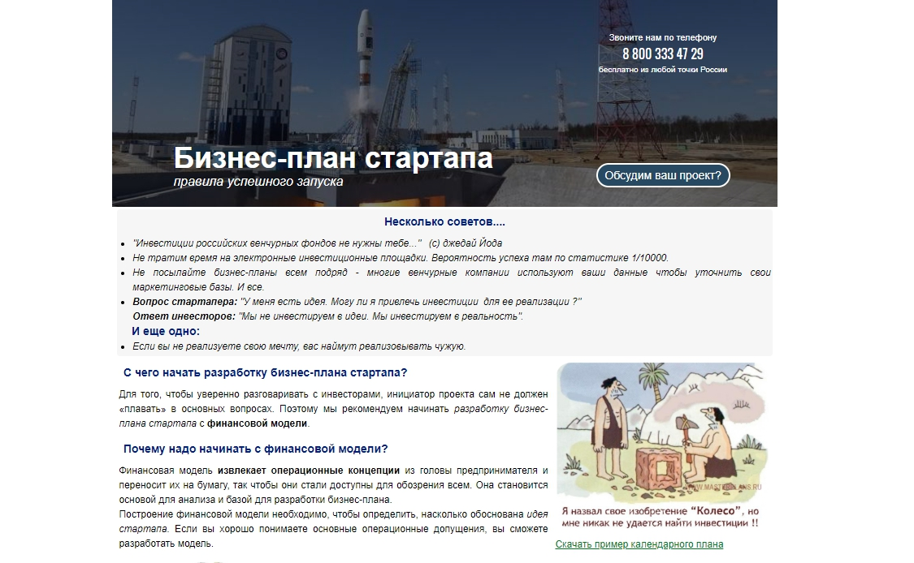

Меня зовут Николай Журавлев. Я руковожу компанией «Эксперты бизнес-планирования» — мы разрабатываем бизнес-планы для промышленных предприятий, а также сотрудничаем со стартаперами и делаем для них презентации для инвесторов. Так сложилось, что в рамках нашей работы мы ежедневно проводим исследования совершенно разных отраслей, собираем статистику, анализируем тонны информации, а затем наши выводы и какие-то ключевые данные становятся основой для бизнес-планов и больших презентаций для наших клиентов. И после каждого завершенного проекта у нас остается десятки, даже сотни страниц интересного для бизнес-сообщества контента — аналитика, описание ситуации на рынке, разбор методов и подходов, результаты исследований и опросов.

Конечно, среди них есть данные, которые мы не можем публиковать в открытом доступе, — это всё, что касается самого заказчика и его компании. Но другая любопытная информация находится в нашем распоряжении, и мы подумали, что странно не использовать ее в своих целях — писать на нейтральные (в смысле без упоминания конкретного клиента) статьи, заметки, комментарии, инструкции, затем что-то выкладывать на наш сайт, а что-то размещать в деловых СМИ.

Например, в рамках разработки бизнес-плана мы выявили какую-то проблему на определенном рынке и подтвердили этот вывод статистикой — это наверняка заинтересует и журналистов, и предпринимателей из этой сферы.

Так или иначе у нас нестандартная ситуация: изначально мы не внедряли контент-маркетинг, чтобы продвигать компанию, мы делали контент для заказчиков. Но потом поняли, что его можно переупаковывать и использовать для привлечения внимания уже к нам.

## Как контент помогает нам привлекать новых клиентов

  
50% всех клиентов приходят к нам или по рекомендациям, или же они заказывают у нас бизнес-план не в первый раз (промышленные предприятия нуждаются в обновленном плане примерно раз в 2 года).

Чтобы повлиять на остальных и убедить тех, кто еще не знает, кто такие «Эксперты бизнес планирования», обратиться к нам, мы развиваем два направления в рамках продвижения:

1) делаем публикации на внешних площадках — они влияют на нашу репутацию в глазах потенциальных клиентов, которые в итоге решаются заключить с нами договор, а порой статьи и комментарии в СМИ приводят новых заказчиков напрямую;

2) основательно работаем над SEO официального сайта: наполняем страницы сайта полезным контентом, которые в дальнейшем отлично индексируются в поисковых системах.

## Публикации в СМИ влияют на имидж бренда и приводят клиентов напрямую

Мы регулярно делаем публикации на внешних площадках, а именно в известных бизнес-изданиях.

Отдельно хочу сказать, что у нас в штате нет пиарщика, который бы занимался общением с редакциями и договаривался о публикациях. Я все всегда делаю сам через [сервис журналистских запросов Pressfeed](https://pressfeed.ru/), и только тогда, когда у меня есть свободное время. Несколько раз в неделю смотрю там запросы, если что-то подходит по теме, то оперативно пишу ответ и высылаю в редакцию прямо через сервис. Если вы не знаете, как работает сервис, объясняю: журналисты выкладывают там запросы — своего рода «объявления», в которых они указывают тему будущей статьи, какой эксперт им требуется, на какие вопросы необходимо ответить, в какие сроки принимаются ответы. Эксперт от компании должен написать комментарий и отправить его до дедлайна. Если ответ дан по делу, то мнение спикера появится в публикации конкретного издания.

> Для меня важно, что на Pressfeed работают журналисты из самых топовых, ключевых бизнес-медиа, которые читают наши непосредственные заказчики, — это «Коммерсантъ», «Секрет фирмы», «Эксперт», «Босс» и так далее. В то же время мне не обязательно дружить с этими журналистами (как это обычно бывает у пиарщиков), общение на сервисе построено на чистой пользе для обеих сторон — журналисту нужен качественный контент от эксперта, а я заинтересован в том, чтобы получить упоминание на уважаемой площадке. В итоге каждый получает то, что ему нужно.

Регистрация на сервисе бесплатная для любого пользователя, но на базовом тарифе есть ограничения — можно отвечать всего на 3 запроса в месяц. Откровенно говоря, это мало, и для продуктивной работы лучше подключить pro-аккаунт.

Итак, почему я считаю, что необходимо генерировать контент для внешних площадок? В рамках нашей компании статьи в СМИ решают четыре важные задачи.

**Во-первых, создают классический пиар-эффект** — о компании «Эксперты бизнес-планирования» говорят в крупных медиа, я неоднократно давал комментарии журналистам из ключевых деловых СМИ. Это влияет на доверие к нам.

Напомню, что большинство клиентов внимательно изучают наш сайт перед тем, как заключить договор. Не только читают тот полезный контент, который уже выложен на сайте, но и всегда заходят в раздел «Мы в СМИ». Видят в нем ссылки на «Коммерсантъ», «Эксперт» и прочих, а эти издания пользуются авторитетом у наших заказчиков.

> Когда потенциальный клиент узнает, что мы сотрудничаем с такими СМИ, то они как бы переносят их авторитет и на нашу компанию.

  
_Раздел «Мы в СМИ»_

Через Pressfeed сделать публикацию в том же «Коммерсанте» очень просто, главное правило — четко и конкретно отвечать на вопросы журналиста, по возможности дать какую-то статистику, интересные факты. И, конечно же, не пытаться выдать себя за эксперта в том, в чем вы экспертом не являетесь.

Как-то я отвечал на запрос о развитии сельскохозяйственной отрасли. Сначала проанализировал, какие направления в с/х сейчас являются более выигрышными для инвестирования, сделал выводы и выслал их корреспонденту. Мои данные были использованы в публикации.

  
[_Запрос от издания «Коммерсантъ. Санкт-Петербург»_](https://pressfeed.ru/query/10812)

  
  
[_Комментарий в «Коммерсанте»_](https://www.kommersant.ru/doc/2809484)

Если вы не хотите пропустить запросы от топовых изданий, удобнее всего сформировать специальную подписку по СМИ. Для этого нужно зайти в «Управление подписками» на сервисе:

  
_Настройка подписок_

Выбрать вкладку «СМИ», по поиску найти те издания, которые вам интересны, и добавить их в подписки.

  
Теперь все запросы, которые публикуют журналисты из этих площадок, будут приходить к вам в отдельной рассылке.

**Во-вторых, публикации в СМИ могут приводить новых клиентов напрямую.** И я могу поделиться такими примерами из нашей практики.

Из самых показательных — я давал комментарий для издания «Секрет фирмы» о том, как вести бизнес в Калужской области.

  
[_Запрос от «Секрет фирмы»_](https://pressfeed.ru/query/11634)

Мне не понаслышке известны плюсы и минусы работы в Калужской области, и я рассказал о своем опыте журналисту.

  
[_Комментарий в «Секрете фирмы»_](https://secretmag.ru/trends/players/biznes-v-kaluge.htm)

> Что произошло после выхода публикации — мне начали звонить бизнесмены, топ-менеджеры из Калужской области, с которыми я не был знаком. Сначала мы обсуждали статью, мой комментарий и потом вместе думали, как мы можем посотрудничать, будет ли наша компания делать бизнес-план для них. Впоследствии эти люди действительно стали нашими клиентами.

  
**В-третьих, публикации в СМИ генерируют дополнительный трафик на сайт компании.** Вновь пример из практики. Сайт Rusbase собирал на Pressfeed информацию об интересных онлайн-сервисах для стартаперов. А команда компании «Эксперты бизнес-планирования» разработала [несколько специальных сервисов](https://www.masterplans.ru/online_services.html) для начинающих предпринимателей.

  
[_Запрос от Rusbase_](https://pressfeed.ru/query/11936)

Я отправил редактору Rusbase ссылки на два наших сервиса — «Кристаллизатор идей» и ProblemAnalyst. Вышла статья «100+ полезных российских сервисов для стартапов», и в списке среди прочих были сервисы, созданные нами.

> На некоторое время трафик на сайт взлетел, потом он снизился, но до сих пор с этих ссылок приходят некоторые новые посетители, которые узнали о сервисах на Rusbase.

Кстати, это еще один весомый плюс контента в интернете — он живет, возможно, не вечно, но заинтересованные люди могу прочитать ваши статьи и комментарии и через 5 лет после выхода статьи.

**В-четвертых, если на внешних ресурсах появляются ссылки на ваш сайт, то это позитивно влияет на SEO и поисковую выдачу.** Увы, большие деловые издания,

которые возьмут комментарий эксперта, никогда не поставят ссылку на компанию, которую представляет этот человек. Если такое случается, то в редких случаях. Но зато сайты поменьше могут поставить ссылку, и это сыграет роль для поисковых систем.

Кстати, можно заранее уточнить у журналиста — будет ли у него возможность поставить ссылку на сайт компании. Удобнее всего задать ему вопрос во внутреннем чате сервиса Pressfeed:

_Чаты на сервисе Pressfeed_

Если удалось получить публикацию с ссылкой, то получаете двойной профит — и плюс к доверию и узнаваемости, и плюс к оптимизации сайта.

## Контент на сайте приводит клиентов из поисковиков

Как я сказал, мы активно работаем с SEO сайта. На официальном сайте компании создан специальный раздел «Статьи». Там мы публикуем большинство полезных материалов, которые в подробностях описывают наши услуги. Даем советы, как составлять резюме для инвестора, как продать свою идею, что входит в бизнес-план и так далее.

Кроме этого, на каждой странице сайта (и не только в рубрике «Статьи») у нас опубликован лонгрид на определенную тему. Благодаря этому разные страницы сайта всегда выбиваются на топовые позиции по определенным поисковым запросам.

Например, страница, посвященная бизнес-плану для стартапа. На ней мы рассуждаем о том, какие страхи мешают запустить стартап, какое значение имеют доменное имя и выбор хостинга для продукта, как составить маркетинг-план и так далее.

  
_Пример статьи на сайте_

Выбиваем в Яндекс популярный в нашей сфере поисковый запрос «бизнес-план для стартапа». И на третьем месте в выдаче показывается наш сайт и наша статья.