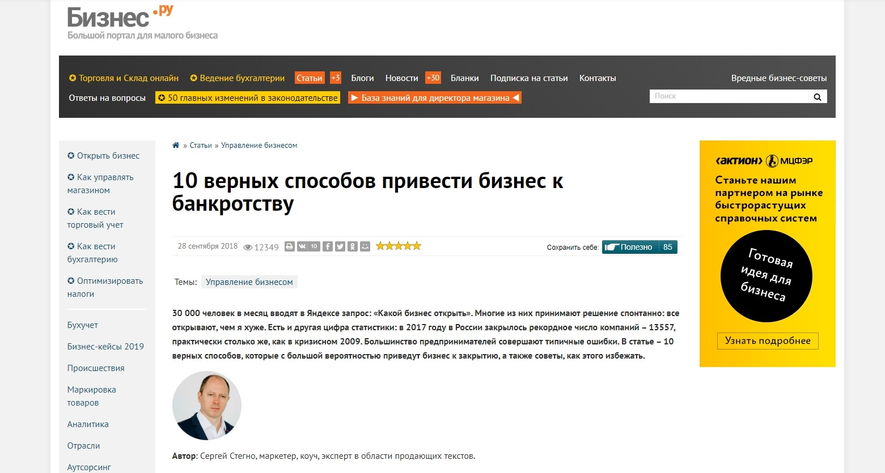
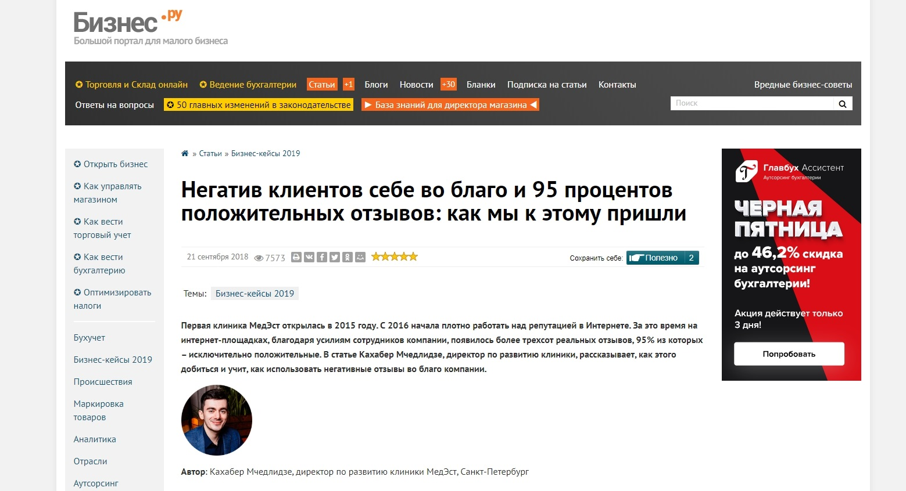
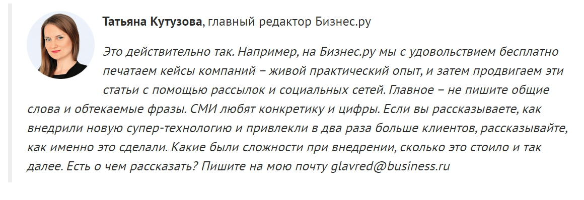
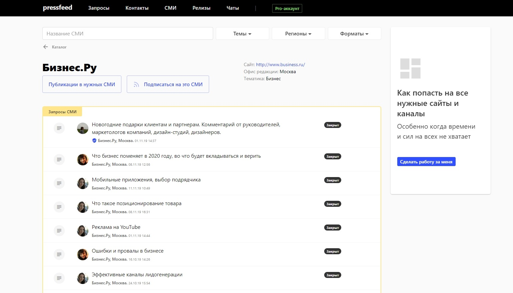
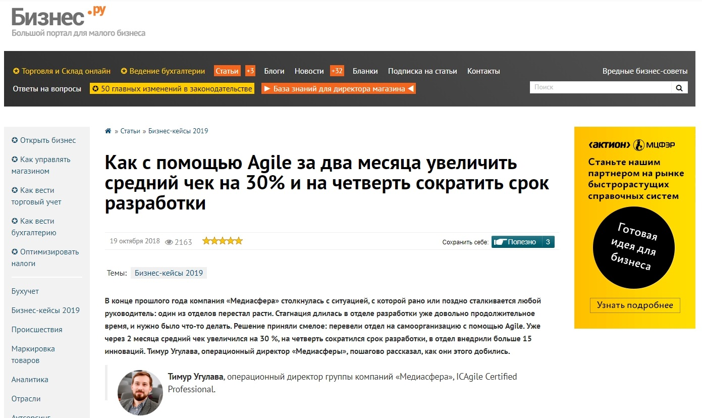
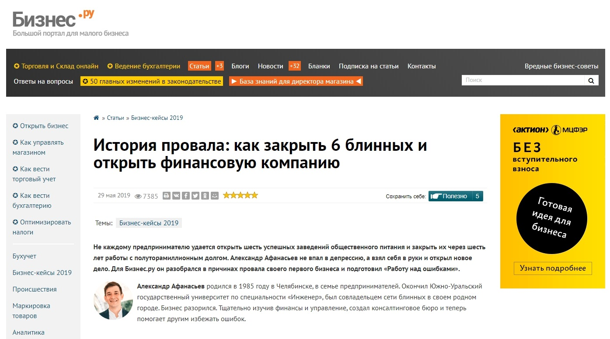
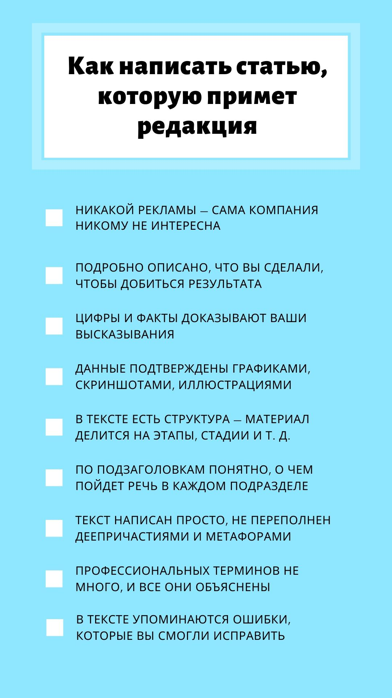

«Бизнес.ру» — это большой портал для малого бизнеса. Посещаемость портала — 2 млн посетителей в месяц. Входит в медиагруппу «Актион-МЦФЭР». В редакции издания работает около 30 человек — главный редактор и два редактора в штате, а остальные журналисты, авторы и редакторы — внештатно на удаленке. Всего на портале публикуется примерно 50-60 текстов ежедневно, включая новости и другие небольшие форматы.

Задача портала «Бизнес.ру» — дать максимум полезной, практической информации собственникам малого и среднего бизнеса. Конечно, нас читают и руководители подразделений, и топ-менеджеры, но все же когда мы говорим о своем читателе, то представляем владельца компании.

Мы пишем о том, как вести бизнес в России, как избежать рисков, как вести учет, как управлять сотрудниками, как готовиться к проверкам — при этом все рекомендации, истории, советы должны быть интересны и понятны руководителю компании, а не узкопрофильному специалисту. Если говорим на тему бухгалтерии, то пытаемся объяснить сложные специализированные моменты простым языком, но с комментариями экспертов-бухгалтеров.

## Почему решили публиковать тексты от экспертов

Изначально у нас не было цели публиковать на портале статьи от сторонних экспертов, вообще как-то использовать UGC-контент. Мы полностью сами планировали темы, собирали комментарии экспертов, брали интервью у интересных персон, внештатные авторы писали кейсы, общались с представителями компаний. Конечно, когда портал стал более известным, посещаемость сайта выросла, мне на почту стали приходить письма от пиарщиков или экспертов, которые хотели что-то написать для нас, предлагали темы для статей.

В общем-то это обычная ситуация для любого СМИ. Мы могли взять у этих экспертов/пиарщиков комментарий на какую-то тему, но полноценные тексты все же писали наши авторы, а пиарщиков с откровенной рекламой мы перенаправляли в отдел продаж. В то же время попадались письма с действительно интересными идеями, ценными с практической точки зрения, полезными для бизнес-сообщества.

Тогда мы подумали: кто, если не сами представители компаний, лучше всего знают о том, что их волнует, с какими сложностями они сталкиваются. Кто еще сможет в деталях описать свои действия, поделиться решениями распространенных для бизнеса проблем?

Наши корреспонденты продолжали проводить интервью и писать кейсы со слов собственников бизнеса, но мы решили, что стоит дать компаниями возможность рассказать о своем опыте самим. У многих были классные истории, и если они действительно могут круто написать об этом — отлично. Мы хотели посмотреть, как пойдет, много ли времени придется тратить на общение, на правки и так далее.

> В итоге UGC-контент не стал основным источником контента для портала, сейчас в день у нас выходит не более 2-3% материалов, полностью подготовленных сторонними экспертами. Но мы все равно сделали это регулярной практикой, и теперь активно призываем экспертов готовить статьи для Бизнес.ру.

Я понимаю, что некоторые бизнес-издания не хотят работать в таком формате, потому что считают, что с экспертами и пиарщиками нужно «возиться», направлять их, объяснять элементарные для опытного журналиста вещи, жестко контролировать рекламность и так далее. Да, это так, сложности есть, но они не такие глобальные, просто здесь нужен другой подход и четкие требования.

## Проблемы, с которыми мы сталкиваемся при общении с экспертами и пиарщиками

Предложения и темы для текстов обычно присылают или пиарщики компаний или сами эксперты — юристы, аналитики, маркетологи. У каждой из этих групп есть свои плюсы и свои минусы, так что работать с ними приходится по-разному.

**Пиарщики.** В большей степени (но не всегда) понимают, как устроен текст, как подавать материал в бизнес-издании, как структурировать статью. Но часто у них проблемы с фактами: они не могут добавить подробностей, не могут что-то согласовать с руководством, недостаточно глубоко разбираются в продукте, говорят «этого мы написать не можем» и так далее.

Некоторые пиарщики грешат рекламными текстами: присылают статьи, где две первые страницы — это описание компании или продукта, затем интересная мысль на два предложения и заключение. Им нужно объяснять, что такой текст мы не возьмем, говорить, что точно убрать, а чего не хватает, какие детали, цифры хотелось бы увидеть в будущей статье, указать на места, где вместо дельных советов написаны общие фразы и «вода».

> Пиар-специалистов, которые действительно отлично знают свой продукт, хорошо пишут и не пытаются отдать нам рекламный текст под видом экспертного, мало. Зато когда они к нам приходят, мы работаем с ними долго и плодотворно.

**Эксперты.** Предлагают хорошую фактуру, имеют личный опыт, идеально знают свою тему, не присылают откровенно рекламные статьи. С другой стороны, многие не понимают, как должен выглядеть текст в СМИ. Пишут официальным языком, сложными фразами, без структуры, материал получается нечитабельным. Здесь главное, чтобы эксперт адекватно реагировал на правки — канцеляризмы мы можем убрать и сами, если по смыслу все грамотно. Ну а если эксперт дает подходящую фактуру и еще умеет писать — то опять же он попадает в группу наших постоянных авторов.

Глобальных проблем в таком сотрудничестве нет — как правило, эксперты и пиарщики понимают, что мы от них хотим пользы без банальщины и воды, спокойно вносят правки, дорабатывают текст, добавляют детали. А те, кто не готов подстраиваться под требования, выбирают платное рекламное размещение, где всю работу за них сделает наш редактор, или просто отсеиваются. Это такой постоянный рабочий процесс: к нам регулярно обращаются новые эксперты, с которыми мы либо быстро находим, либо не находим общий язык.

## Как редактор понимает, получится статья с новым экспертом или нет

Зацепить в предложении эксперта может что угодно: необычный совет или факт, крутой результат, любопытная деталь. В этот момент включается редакторское чутье — обычно сразу понимаешь, сможем ли мы вывернуть это в полезный материал или нет.

Если что-то цепляет, я даю рекомендации, что стоит поправить, пишу краткую инструкцию, какая должна быть подача, привожу примеры удачных публикаций такого формата (советы, кейс, аналитическая статья, мнение эксперта). Сразу предупреждаю, что с моей стороны будут правки.

> Сделать статью с экспертом — это длительный процесс, он нисколько не экономит время редакции. Иногда доработки затягиваются на несколько недель. Но я на своем опыте знаю, что если в изначальной задумке прослеживалась ценность, то на выходе обязательно получится полезный текст, который наберет много просмотров, репостов, комментариев. Так что усилия того стоят.

Был случай, когда мы очень долго готовили статью с экспертом, перевернули все с ног на голову, и, честно говоря, я даже пожалела, что мы затеяли этот материал. Но в итоге выпустили «конфетку». Это было именно то, что я планировала, а текст получил отличный отклик — статью читали, добавляли в избранное. Статья называлась «10 верных способов привести бизнес к банкротству», в ней эксперт рассказывал о распространенных ошибках начинающих предпринимателей.

Бывают и случаи, когда сразу присылают почти идеальный текст, который требует минимальной доработки. Помню, был такой кейс — медицинская компания предложила историю о том, как они добились, чтобы их клиенты оставляли положительные отзывы в интернете. Автор сразу расписал, как и что они делали, какие правила для себя выявили, к каким выводам пришли — со скриншотами, примерами, видео.

Текст был написан грамотно, интересно, но главное — там было много подробностей, это самое ценное. Кстати, у этой компании даже не было пиарщика, это полностью экспертный материал.

Иногда еще на уровне идеи или предварительного текста понятно, что на выходе не получится ничего стоящего. В этом случае я честно говорю, что текст не подходит, и указываю на явные недостатки. Иногда эксперты переделывают материал полностью, кто-то на это соглашается, другие уже не возвращаются.

Если автор не готов адаптировать текст под требования редакции, он может опубликовать его в «Блогах». В этом разделе на «Бизнес.ру» каждая компания или эксперт могут завести свой профиль и выкладывать тексты практически без правок со стороны редакции. Материалы проходят модерацию, но, скорее, на наличие совсем неприкрытой рекламы. Это тоже бесплатно, а удачные полезные материалы мы так же, как и редакционные тексты, выводим на главную страницу, распространяем в социальных сетях, рассылке. Если увидим, что в блоге компании появилась действительно интересная статья, но в ней чего-то не хватает, то можем предложить доработать ее вместе и потом выложить уже в отдельной рубрике.

Ситуации бывают разные, но в центре всего находится польза. Если я вижу пользу для наших читателей, то, скорее всего, материал на «Бизнес.ру » появится.

## Чем отличается экспертная статья и рекламный материал

Мне кажется, что все бизнес-издания заинтересованы в кейсах и полезных экспертных статьях, а компании заинтересованы в пиаре с помощью СМИ. Не вижу ничего плохого в том, что компания пропиарит себя через наше издание, а наши читатели узнают о ней. Эта компания дает читателям хороший контент, мы же даем ей возможность продемонстрировать свою экспертность. Это взаимовыгодное сотрудничество.

Другое дело, что нельзя переходить границу между рекламой и пиаром. Если компания хочет повысить свою узнаваемость, усилить экспертность в глазах своей целевой аудитории, получить упоминание в медиа, — отлично. Но прямой рекламы в редакционном контенте не будет: мы публикуем только то, что пригодится нашим читателям с практической точки зрения.

> Экспертные статьи — это, прежде всего, опыт компании и польза для бизнес-сообщества. В таком материале будет указано название бренда, но скорее всего не будет ссылок на официальный сайт и не будет перечисления услуг компании или, тем более, ее УТП. Экспертная статья и кейсы не нацелены на продажу, компания получает только внимание со стороны наших пользователей.

При этом статьи от сторонних авторов мы также продвигаем во всех группах «Бизнес.ру» в социальных сетях, что-то ставим на «Яндекс.Дзен», лучшее берем в рассылку.

Реклама — это то, что хочет клиент, рекламные статьи должны продавать. В них есть ссылки, контакты компании, подробное описание услуг и преимуществ. В рекламных материалах тоже есть польза для читателя, но больший акцент сделан на то, почему нужно обратиться именно в эту компанию. Плюс мы занимаемся дополнительным продвижением этих статей.

Компаниям следует понимать эту разницу между пиаром и рекламой, и если эксперты или пиарщики приходят к нам с целью, чтобы мы рассказали о том, какая у них классная компания, то мы спокойно перенаправим их в отдел рекламы. Если они готовы просто делиться опытом с другими участниками рынка и тем самым подтверждать свою экспертность — мы будем только рады опубликовать текст от лица бренда.

## Желающих написать тексты много, но мы всегда ждем новых экспертов

Чтобы стать нашим экспертом и выпустить статью на портале «Бизнес.ру», достаточно написать мне на почту. Я открыто говорю об этом, а затем сама просматриваю все предложения и решаю — будем доводить идею до полноценного материала или нет.

_Приглашение экспертов в статье, которая была подготовлена клиентом Pressfeed и посвящена продвижению с помощью СМИ_

Также время от времени мы публикуем запросы на Pressfeed — там всегда находится много желающих, через сервис можно договориться сразу с десятками экспертов и с каждым постепенно готовить статью.

Например, вот на этот запрос откликнулись 43 эксперта, но мы приняли только 20 предложений.

[_Запрос на Pressfeed_](https://pressfeed.ru/query/55973)

В первую очередь я принимаю заявки тех компаний, кто сразу же кратко обозначает — кто они, чем занимаются, почему интересны, каких результатов достигли на текущий момент. Проще говоря, с ходу дают мне какую-то «зацепку».

> Если просто пишут «Готов рассказать о себе», «Вот готовый кейс, можем прислать справку о компании», «Можем пообщаться на эту тему», «Все подробности в документе» или присылают нечитаемое полотно текста, то, возможно, очередь до них так и не дойдет. Чем больше конкретики, тем больше шансов, что мы сделаем вместе материал.

В целом намного удобнее, и это касается любых запросов на Pressfeed, даже когда мы просто собираем разные мнения экспертов для одной большой публикации, если пиарщик сначала согласовывает со мной суть ответа. То есть говорит: «У нас есть такой спикер, у него такой-то опыт, он может рассказать об этом с такими-то примерами». При таком подходе никто не тратит время зря — ни я, ни эксперт.

Бывает и такое, когда один и тот же эксперт отвечает на несколько наших запросов — то есть дает комментарии для нескольких статей, а затем мы договоримся о том, чтобы сделать полноценный текст от его имени. Каждый месяц редакция «Бизнес.ру» размещает около 5-6 крупных запросов на Pressfeed, плюс мы ищем комментарии для редакционных статей. Кстати, регулярно публикуем комментарии даже к уже опубликованным материалам, если эксперту есть что дополнить по теме.Так что у всех есть возможность попасть на портал — возможно, сначала с комментарием, а затем уже со статьей.

[_Профиль портала «Бизнес.ру» на Pressfeed_](https://pressfeed.ru/smi/1611)

Хочу дать совет для всех экспертов, которые используют Pressfeed: внимательно читайте текст запроса. Отвечайте по делу и по сути. Не пишите о том, что не относится к теме запроса. Наши журналисты получают десятки ответов, но в публикацию попадают только те, кто правильно понял запрос и развернуто ответил на вопросы.

## Рекомендации для экспертов и пиарщиков: как написать хороший текст

Какой должен быть текст, чтобы мы точно опубликовали его на портале? Перечислю основные моменты:

**1. Реклама — точно и сразу нет.** Увы, но сама по себе компания никому не интересна. В статье будет минимальная информация о компании, и авторам нужно просто принять это — особенно пиарщикам.

**2. Читатели не хотят знать о том, какие вы классные**, им хочется понять, как именно вы стали классными. Что вы для этого делали — когда начали, какие проблемы были, как нашли решения, к чему привели все действия. Максимум подробностей.

**3. Цифры и факты — это всегда хорошо.** Чем их больше, тем лучше. Цифры доказывают то, о чем вы говорите. Обязательно нужны цифры в результатах.

Вот пример хорошего кейса с цифрами:

  

**4. Аргументы, цифры, примеры желательно подтверждать графиками**, скриншотами, иллюстрациями, фотографиями производства. Так читателю будет проще поверить вам, да и вообще история станет более наглядной.

**5. В тексте важна структура** — материал может делиться на этапы, стадии, отдельные советы, разные направления работы. Не забывайте про подзаголовки, по которым читатель понимает, о чем пойдет речь в подразделе.

**6. Не нужно пытаться писать красиво** (это обращение в первую очередь к экспертам) — деепричастные обороты в каждом предложении, метафоры и сложные сравнения только ухудшают восприятие текста. Пишите просто и понятно, в инфостиле.

**7. В то же время некоторых экспертов уводит в другую сторону — они пишут очень сухо**, официозно и включают в текст массу профессиональных терминов. Не стоит объяснять самые очевидные вещи, но с терминами лучше не перебарщивать — особенно, когда вы пишете на широкую аудиторию бизнесменов из совершенно разных отраслей.

**8. Не бойтесь рассказывать о своих ошибках!** Истории провалов всегда пользуются популярностью, как и реальный опыт по преодолению трудностей.

Пример такой истории:

  

Чек-лист: «Как написать статью, которую примет редакция»

Этот чек-лист можно использовать при написании гостевых постов не только для «Бизнес.ру», но и для любого другого делового издания, включая, к примеру, «Pressfeed.Журнал».

