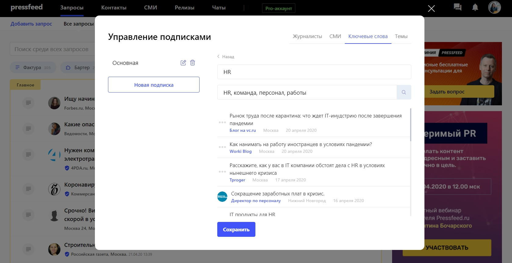
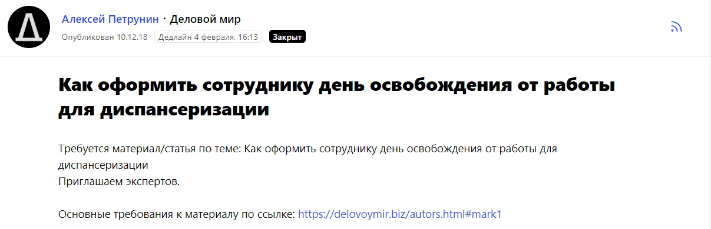
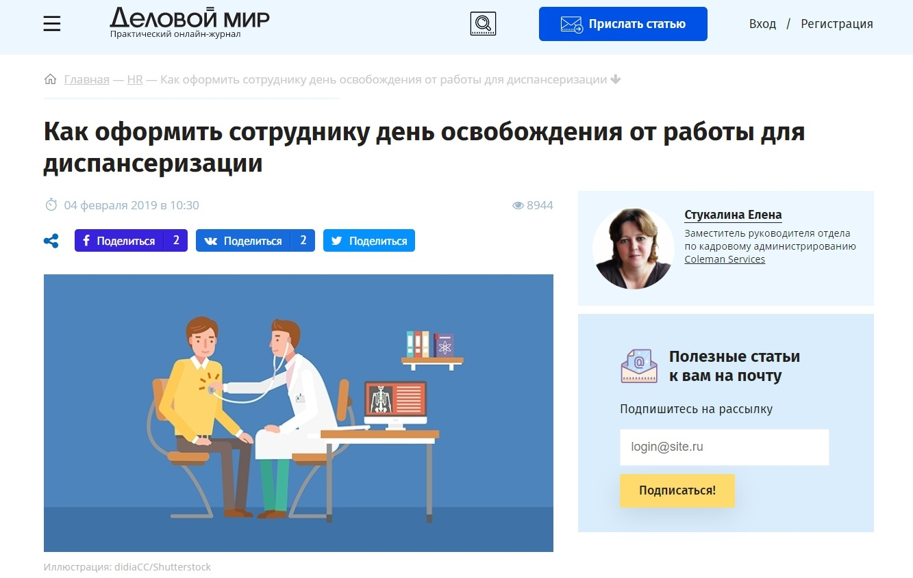

Coleman Services — консалтинговая компания, которая предоставляет комплексные кадровые решения, а именно может подобрать постоянный или временный персонал для больших предприятий, провести кадровый аудит, забрать все кадровые вопросы организаций на аутсорс и так далее.

Наши клиенты — это компании, которые хотели бы высвободить время и ресурсы на решение ключевых задач для своего бизнеса, поэтому они решают,

что лучше будет найти партнёра, который имеет опыт и компетенции в HR-направлении, и передать ему все или некоторые задачи по управлению персоналом в компании. Чаще всего это HR-директора или руководители бизнесов.

## Почему пиар нужен и важен

Для продвижения компании на рынке и привлечения новых клиентов мы используем разные инструменты — запускаем контекстную рекламу, развиваем социальные сети, а также активно вкладываемся в пиар бренда Coleman Services.

Если с классической интернет-рекламой и соцсетями все примерно понятно — зачем они нужны и как оценивать их эффективность в рамках роста компании, то смысл и ценность пиар-продвижения бывают не очевидны. Для чего делать десятки публикаций в СМИ, участвовать в отраслевых форумах, то есть постоянно находиться среди профильной «тусовки»? Что это даст бизнесу?

> Для нас ответ на вопрос «зачем нужен пиар» довольно простой: для того, потенциальный клиент знал об опыте и компетенциях экспертов Coleman Services еще до того, как он подпишет с нами договор.

Дело в том, что компания работает в b2b-секторе и оказывает сложные услуги. Например, в некоторых случаях клиент передает нам в управление свои HR-процессы, в том числе кадровое делопроизводство, расчет заработной платы, бухгалтерский учет и многое другое. Как думаете, насколько клиент должен доверять компании и каждому специалисту Coleman Services в отдельности, чтобы без опасений передать такой функционал в наши руки?

На нас лежит действительно большая ответственность — и мы должны постоянно доказывать партнерам, что Coleman Services справится с такой ответственностью. Можно ли доказать это с помощью рекламы в Директе или в соцсетях? Вряд ли. Зато такими доказательствами являются выступления экспертов компании на конференциях и в профильных медиа. Многие из наших сотрудников проработали в HR-сфере более 10 лет, у них есть своя позиция по многим вопросам, они знают отрасль от А до Я, и им есть, о чем рассказать.

Это правда, что пиар не влияет на продажи напрямую. Не всегда можно сказать, какая именно публикация привела нового клиента. Но пиар формирует узнаваемость, которая конвертируется в доверие, а доверие — уже в продажи.

> Плюс мы знаем, что перед тем как принять решение о сотрудничестве, потенциальный клиент обязательно будет искать информацию о компании, в том числе посмотрит экспертные мнения, статьи, комментарии в СМИ. И если ему понравится увиденное, то это станет дополнительным аргументом в пользу Coleman Services.

Я бы хотел отдельно рассказать о публикациях в СМИ, потому что отраслевые мероприятия работают только на участников мероприятий и охватывают далеко не всю аудиторию, на которую мы стремимся выйти. Охваты статей в профильных медиа не только значительно превышают количество участников конференций, они еще и живут практически вечно — ведь клиент сможет прочитать интересный для него материал в СМИ и через месяц, и через год после его выхода.

## С какими СМИ работаем и о чем говорим

Каждый месяц в различных СМИ появляется 5-6 публикаций с участием экспертов Coleman Services. Всего около 60 материалов в год. Этого достаточно, чтобы быть на слуху в HR-сообществе (если параллельно участвовать в отраслевых мероприятиях).

В СМИ мы говорим о трудовом законодательстве, например, как подготовиться к проверке Государственной инспекции труда, отвечаем на кадровые вопросы — как уволить сотрудника за прогул, как оформить дубликат трудовой книжки. Даем комментарии на тему подбора персонала, публикуем наши исследования HR-отрасли и мониторинги заработных плат.

Что касается изданий, то в приоритете две типа площадок — во-первых, бизнес-медиа («РБК», «Деловой мир», E-xecutive и т. п.), во-вторых, все кадровые порталы и журналы («HR по-русски», «Трудовые споры», «PRO-Персонал», Журнал «Директор по персоналу», Zarplata.ru и т. д.)

## Как делать бесплатные публикации в медиа

Связываться с редакциями целевых изданий, чтобы договориться о совместной публикации, можно по-разному: как вариант, найти конкретного журналиста или редактора в Facebook и написать ему с предложениями по темам напрямую. Другой проверенный способ (который чаще всего используем мы) — сначала отвечать на какой-нибудь интересный запрос от хорошего СМИ на [сервисе Pressfeed](https://pressfeed.ru/?utm_source=hr-learning&utm_medium=content&utm_campaign=case&utm_content=coleman), а затем, если первое сотрудничество будет удачным, продолжить продуктивное общение уже вне платформы.

Сервис журналистских запросов Pressfeed — это платформа, на которой сотрудники редакций (всего там работает более 5 тысяч СМИ) размещают своего рода объявления с информацией, какие эксперты им необходимы для будущей публикации, на какие вопросы нужно ответить и в какой срок. На запрос отвечает пиарщик или сам эксперт — пишет комментарий либо отправляет тезисы для полноценной статьи. Журналист оценивает ответ, и если его все устраивает, берет комментарий в свой текст или дает добро на создание авторской колонки от лица спикера.

Чтобы не пропустить актуальные запросы, лучше сформировать подписки по ключевым темам, словам и изданиям: как только появится подходящий запрос, он сразу придет к вам на почту в рассылке от сервиса.

_Пример подписки по ключевым словам_

Именно через Pressfeed мы выстроили хорошие отношения с такими изданиями как «РБК Pro», «Деловой мир», Zarplata.ru — общение началось с ответа на запрос, а потом эксперты Coleman Services написали для этих площадок несколько полноценных статей.

Как было с бизнес-порталом «Деловой мир» (посещаемость — более 700 тыс. читателей ежемесячно): в конце 2018 года ответили на запрос о диспансеризации для сотрудников — можно ли оформить выходной для прохождения медобследования. Редактор издания сразу обозначил, что хотел бы получить не комментарий, а нормальную статью.

  
[_Запрос от «Делового мира»_](https://pressfeed.ru/query/50663)

Месяц переговоров, редактуры — и в феврале вышла первая статья от эксперта Coleman Services. Материал прочитали почти 9 тысяч пользователей сайта. Вполне вероятно, что среди читателей были и собственники бизнеса, и руководители HR-департаментов.

  
[_Статья в «Деловом мире»_](https://delovoymir.biz/kak-oformit-sotrudniku-den-osvobozhdeniya-ot-raboty-dlya-dispanserizacii.html)

Мы продолжили сотрудничать с редактором портала Алексеем Петруниным и в итоге за 2019 год выпустили на площадке 5 статей.

Один из материалов назывался [«Как подготовиться к проверке ГИТ по новым правилам: что нужно знать и на что обратить внимание»](https://delovoymir.biz/kak-podgotovitsya-k-proverke-git-po-novym-pravilam-chto-nuzhno-znat-na-chto-obratit-vnimanie.html).

> Статью прочитали 3,5 тысячи человек, а 100 из них — перешли на сайт Coleman Services. Это хороший показатель для нас, ведь тема довольно специфическая и может заинтересовать только узких специалистов. При этом важно следить не только за количеством переходов, так как пользователь может перейти на сайт и закрыть его через 5 секунд, но и за временем, которое читатель проводит на вашем сайте после перехода.

Некоторые пользователи изучили эту статью, затем зашли на сайт и провели на нем от 5 до 15 минут. В таком случае мы можем быть уверены, что читатель действительно запомнил компанию.

Сотрудничество с сайтом Zarplata.ru также сложилось благодаря небольшему комментарию, а уже потом мы сделали целый цикл статей с одним из экспертов компании. Тот комментарий был посвящен вопросу, как интроверту успешно пройти собеседование.