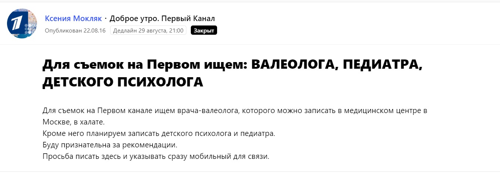
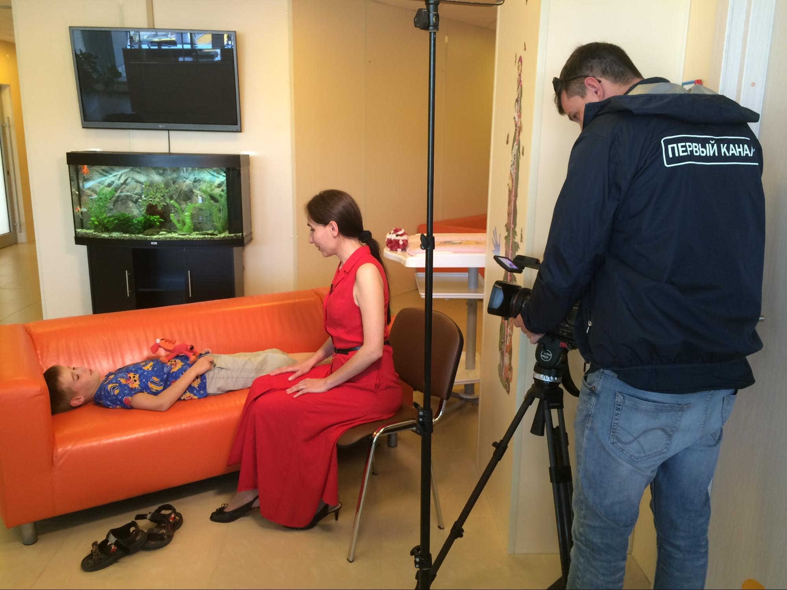
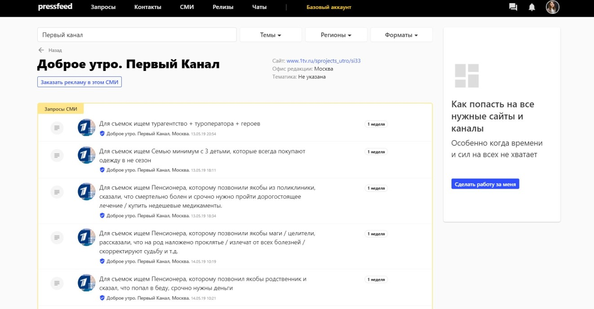
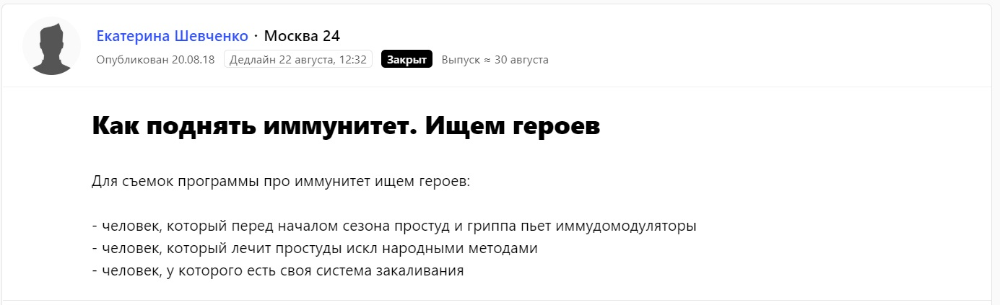
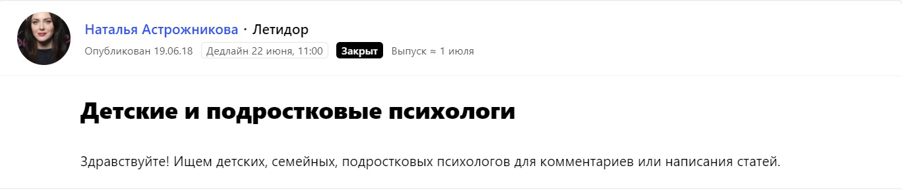
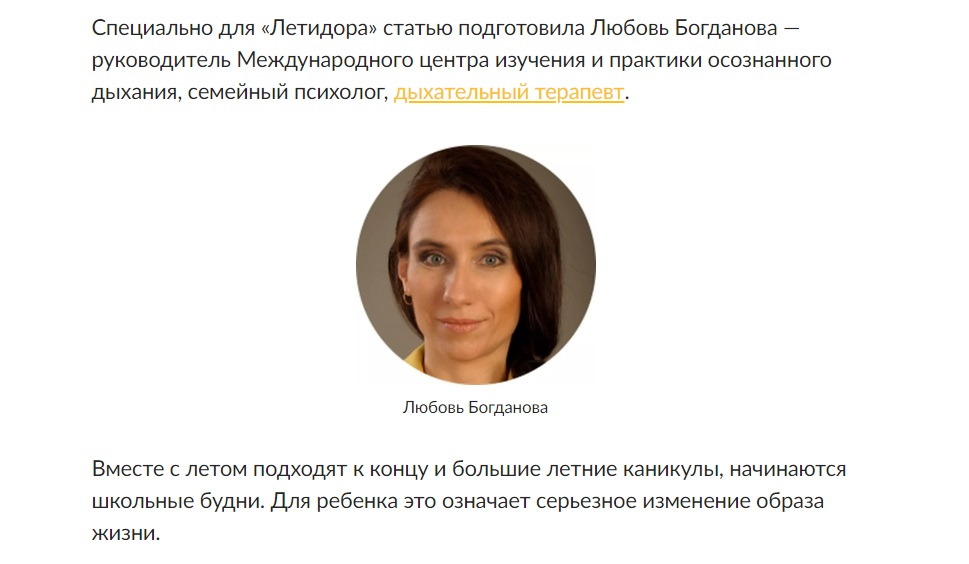
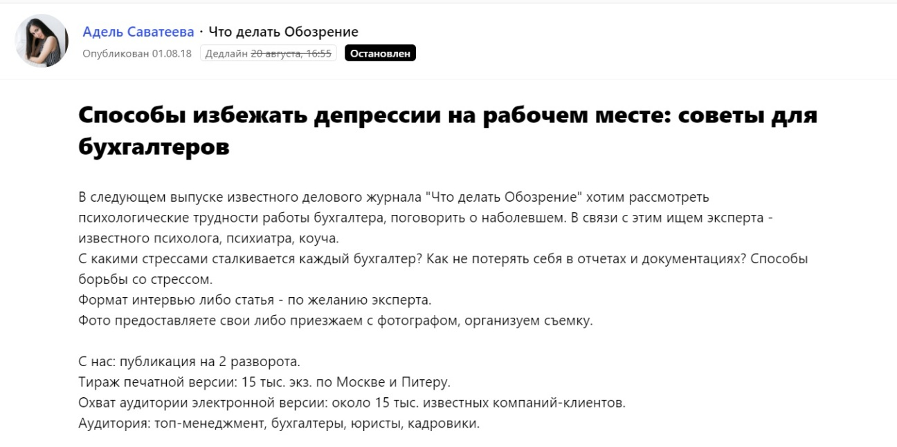
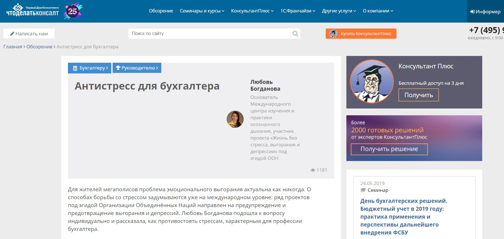

## Как я стала дыхательным терапевтом и запустила свой проект

Я начала увлекаться дыхательными практиками еще в 1993 году, но относилась к ним как к экзотическому отдыху и проводила свои отпуска на выездных тренингах.

В 2000-2006 годах я прошла инструкторское обучение и сама стала инструктором по осознанному дыханию. Начала проводить первые тренинги с программой «дыхание-антистресс»: по вечерам или в выходные собирала группы из знакомых, они приводили своих друзей и знакомых. В 2006 году я решила уйти с наемной работы, полностью посвятить себя дыхательным практикам и обучать им всех желающих.

Через некоторое время я уже работала не только с индивидуальными клиентами и открытыми группами, но и вела корпоративные тренинги. Клиенты находили меня через сайт в интернет или приходили по сарафанному радио ㅡ дополнительным продвижением своих услуг я не занималась.

Осознанное дыхание (дыхательная терапия) ㅡ это соединение возможностей дыхания и осознанности. С помощью этого метода можно избавиться от головных болей, нормализовать давление и сердцебиение, снять астматический приступ и паническую атаку, а при регулярных занятиях ㅡ избавиться от проявлений хронических заболеваний. Кроме того, выполняя короткие дыхательные упражнения, можно самостоятельно снять напряжение, стресс, тревогу, поднять свой уровень энергии, повысить личную эффективность, научиться жить спокойно и уверенно.

В 2010 году я решила расширить свою профессиональную компетенцию и стала изучать всевозможные дыхательные техники, которые попадали в мое поле зрения. Я создала проект «Международный проект изучения и практики осознанного дыхания».

Тогда же я поняла, что у меня есть уникальная информация, которой можно делиться, чтобы привлекать клиентов не только сарафанным радио. У проекта сразу появился сайт ㅡ «база знаний», где мои потенциальные клиенты могли найти статьи и видео об осознанном дыхании, практические советы, книжные обозрения, информацию из первоисточников о разных мировых школах и техниках работы с дыханием, отзывы клиентов, расписание мероприятий.

В это время я поставила себе две цели:

**во-первых**, систематизировать всю доступную информацию о мировом дыхательном наследии и создать новые стандарты обучения специалистов;

**во-вторых,** популяризировать свою профессию, убрать налет мистичности и дилетантизма, который, к сожалению, у большинства ассоциируется с обучением дыхательным практикам. Я хотела, чтобы дыхательные практики вошли в современную жизнь как надежный, удобный и доступный способ управления состоянием тела, эмоций, мыслей.

> Необходимо было продвигать информацию о пользе дыхательных практик среди общественности. При этом я могла использовать только самые бюджетные каналы продвижения. Поэтому основными маркетинговыми инструментами стали мои собственные сайты, а также эфиры на федеральных телеканалах и публикации в СМИ, которые можно организовать бесплатно.

## Работа со СМИ: как попасть на «Первый канал» и выпускать статьи в отраслевых изданиях

С 2015 года я начала активно сотрудничать со СМИ и рассказывать о дыхательных практиках на телевидении. В эфире ТВ-программ я могу не только прокомментировать какой-то вопрос как эксперт, но и показать, как выполнять дыхательные упражнения (получается интересная «картинка», динамичный видеоряд). Аудитория СМИ закормлена однотипной информацией, а проделать практику дыхания — это и необычно, и полезно, и привлекает внимание к моей деятельности как зрителей, так и продюсеров ТВ-каналов.

Выйти на этих самых продюсеров мне помогает сервис журналистских запросов [Pressfeed](https://pressfeed.ru/). Через этот сервис СМИ ищут героев и экспертов для публикаций и эфиров. Чтобы попасть в программу или дать комментарий, нужно оперативно ответить на запрос или рассказать журналисту/продюсеру, чем вы можете быть полезным для него.

**Эфиры на ТВ**

Я сотрудничала с «Первым каналом» и участвовала в сюжете для программы «Доброе утро». Продюсеры искали валеолога, но не нашли, я написала сотрудникам канала, рассказала о себе, и их привлекла моя деятельность и мой опыт — так что на съемку пригласили меня.

[_Запрос_](https://pressfeed.ru/query/22951) _от «Первого канала»_

_Запись сюжета для программы «Доброе утро»_

Однажды почти приняла участие в программе «Модный приговор» в качестве героини.

Я ответила на запрос на Pressfeed: предложила продюсерам подумать над тем, как же должен выглядеть представитель новой зарождающейся профессии «дыхательный терапевт». Меня пригласили в «Останкино», правда, в итоге съемки не состоялись, но для меня это был отличный опыт и шанс познакомиться с внутренней кухней ТВ, и это стало хорошим поводом для рассылки и поста в соцсетях.

> Если вам кажется, что попасть на «Первый канал» сложно и дорого, то это не так. Просто ждите подходящего запроса на Pressfeed. Плюс можете самостоятельно найти продюсеров на сервисе и предложить им какие-то цепляющие темы.

Программа «Доброе утро» ищет на сервисе героев для съемок чуть ли не каждый день. Даже если с первого раза попасть в эфир не получится, то обязательно получится со второго или третьего раза.

_Запросы от программы «Доброе утро»_

В другой раз участвовала в съемке программы канала «Москва 24». На ней я объясняла зрителям, что существует небанальный способ поднять иммунитет и держать тело в тонусе — дыхательные практики.

  
[_Запрос_](https://pressfeed.ru/query/46644) _от «Москва 24»_

Полезное интервью получилось для телеканала «ТВ Центр»: там тоже использовался формат «гость в студии» для утренней программы, и у меня было достаточно времени, чтобы раскрыть тему.

> За год я участвуют в 3-5 телепрограммах, и все это совершенно бесплатно. Все-таки профессия «дыхательный терапевт» и направление «осознанное дыхание» до сих пор вызывает удивление и неподдельный интерес у аудитории, так что продюсеры с радостью сотрудничают со мной.

Более того, участие в федеральных ТВ-программах помогает мне продвигать проект в регионах страны. Когда меня пригласили с тренингом в Хабаровск, я сказала организатору, что могу посетить местное телевидение, чтобы познакомить зрителей с мировым опытом осознанного дыхания. И продюсерам было важно узнать, что я уже неоднократно работала с центральными телеканалами. В результате у нас получилась очень содержательная встреча в эфире.

Получается, что важно начать появляться на ТВ, а затем с каждым разом будет все проще договариваться с каналами об эфирах. Начать же поможет Pressfeed.

**Публикации статей в СМИ**

Продвижение с помощью телевидения, прежде всего, привлекает меня тем, что классические интернет-издания или печатные СМИ чаще всего запрашивают небольшие комментарии, а в кратком тексте сложно объяснить суть эффекта, который дает осознанное дыхание, да еще и описать конкретное подходящее дыхательное упражнение. Однако время от времени на Pressfeed появляются запросы от СМИ на развернутый материал: тогда я пишу хорошую содержательную статью, где даю практики дыхания по затронутой теме.

Например, в 2018 году в Международном фонде по работе с дыханием, с которым я сотрудничаю, под эгидой ООН вышла программа «Дыхание для дошкольников и школьников», и мне было важно поделиться в России информацией о том, как родители могут делать с детьми несложные и безопасные дыхательные практики, поддерживающие физическое и психоэмоциональное здоровье. Я написала статью для портала «НН-мама» и сайта для родителей «Летидор»:

  
[_Запрос_](https://pressfeed.ru/query/44579) _от «Летидор»_

Публикация в издании «Летидор» называлась «Синдром первой четверти: 8 родительских заповедей, которые сохранят школьнику здоровье». Там я давала родителям советы, как сделать процесс адаптации к школе более спокойным для ребенка и всей семьи.

[_Фрагмент публикации_](https://letidor.ru/psihologiya/sindrom-pervoi-chetverti-8-roditelskikh-zapovedei-kotorye-sokhranyat-shkolniku-zdorove.htm) _на сайте «Летидор»_

В другой раз полезным получилось сотрудничество с профильным деловым изданием «Что делать Обозрение» на тему «антистресс для бухгалтера».

[_Запрос_](https://pressfeed.ru/query/46107) _от «Что делать Обозрение»_

Журналист встретилась со мной, мы беседовали больше часа, в итоге получилась [практичная и наглядная публикация](https://www.4dk.ru/news/d/20181012102002-antistress-dlya-bukhgaltera), материал вышел как в бумажном журнале, так и на сайте. Статью прочитали более тысячи раз. 

  
_Фрагмент публикации_

Сервис Pressfeed удобен тем, что запросы я просматриваю в почте. В чистом виде вопросы о дыхании встречаются крайне редко. Поэтому меня интересуют запросы, связанные со здоровьем, стрессами, личной эффективностью, эмоциональным интеллектом, осознанностью (mindfulness), взаимоотношениями в семье, детьми. В приоритете тема, а не издание. Сразу же из рассылки я перехожу на нужный запрос, если журналист ждет небольшой комментарий, то можно быстро написать ответ и тут же отправить. Также на почту приходит уведомление, приняли ли мой запрос или нет.

> В год выпускаю 10-15 публикаций, и опять же бесплатно. Для меня сотрудничество со СМИ ─ пожалуй, самый эффективный формат, с помощью которого я могу и вести просветительскую работу, и сформировать правильное представление общества об осознанном дыхании, и привлечь внимание к своему проекту.

## Как бизнес развивается сейчас

  
Несмотря на то, что я в первую очередь занимаюсь исследованиями и практикой с клиентами, и почти не занимаюсь грамотным продвижением бизнеса, даже то, что я делаю своими силами, приносит результаты: клиенты сами меня находят, и постепенно меняется образ работы с осознанностью и дыханием в обществе.

> Когда люди видят, что я выступаю на центральных каналах ТВ и сотрудничаю с печатными СМИ, читают статьи на сайте, это создает реалистичное понимание, чего можно ожидать от обучения осознанному дыханию.

В последние годы все реже поступают заявки от любителей мистики и магии. Все больше приходят к нам успешные осознанные люди, которые столкнулись с проблемой по здоровью или эмоциональной перегрузкой, сильным стрессом, «кризисом среднего возраста». На обучение также записываются психологи, психотерапевты, логопеды, массажисты, которые хотят применять дыхательные практики в своей работе.

> Сейчас ежемесячно в «Международный центр изучения и практики осознанного дыхания» обращается 5-10 новых клиентов для платных занятий (еще 2 года назад было 1-2 клиента в месяц), а 30-50 человек в месяц записываются на бесплатные ознакомительные курсы на сайте. И это все без рекламы.

Онлайн-курс стоит от 5 тыс. рублей (21 день, 5-6 вебинаров + записи видео-уроков + ежедневные онлайн-письма поддержки). Офлайн курс в Москве ─ 11 тыс. за 3 месяца обучения. Индивидуальные занятия со мной ─ 3500 руб. в час.

Цель на 2019 год — масштабирование проекта. Сейчас на повестке дня вопрос расширения программы, назрела необходимость перехода от одного потока обучения к параллельным потокам по нескольким направлениям. Более того, в данный момент я провожу обучение инструкторов в рамках международной сертификационной программы по осознанному дыханию и дыхательной терапии. Моя задача на ближайшие годы — чтобы в каждом регионе РФ (а в перспективе и в каждом городе) появился как минимум один грамотный специалист по работе с дыханием.
