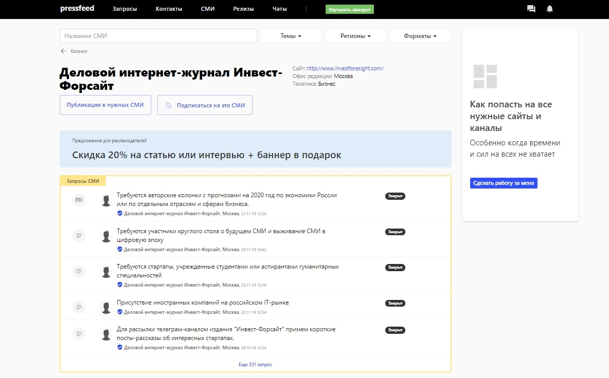

## Проблема: в обществе сохраняются стереотипы о микрофинансах

Все мы неоднократно слышали истории о коллекторах и криминале, связанном с выплатами долгов. Кто-то считает, что в микрофинансовых организациях займы берут только те люди, которых больше никто не кредитует, у которых плохая кредитная история и так далее. Я не буду говорить, что таких категорий заемщиков больше не существует, но это лишь незначительная часть от общего числа наших клиентов.

_Справка о компании:_

_Компания «Экофинанс» — это международная финтех-компания, основанная в 2015 году. В России компания работает под брендом CreditPlus. Компания специализируется на предоставлении услуг в сегменте потребительского кредитования, а основной сервис позволяет клиентам получить заём в режиме онлайн — даже с мобильного телефона._

На самом же деле в отрасли был наведен порядок, Центральный банк взял направление МФО под свой контроль. Рынок стал работать по прозрачным правилам, обязательным для всех участников. Сейчас, выдавая займ, любая финансовая организация в первую очередь оценивает свои риски. Такого агрессивного наращивания кредитного портфеля как раньше, когда займы выдавали всем подряд, теперь нет. Также многое было сделано и для защиты интересов заемщиков.

В 2019 году большинство МФО представляют из себя высокотехнологичные компании, которым удалось за достаточно короткое время полностью изменить весь финансовый сектор. Многие технологии, даже те, которые потом стали использовать в банках, изначально создавались в финтехе. 

## Пиар помогает изменить мнение об отрасли

Рынок изменился, и мы хотим, чтобы отношение к микрофинансовым организациям тоже менялось. Чтобы стереотипы о МФО остались в прошлом. Это не простая задача, а для ее решения нужно задействовать максимум пиар-инструментов. Поэтому в течение 2019 года мы начали вкладывать свои силы, время и средства в пиар — с одной стороны, наряду с маркетинговыми каналами он помогает нам продвигать EcoFinance, привлекать инвесторов и клиентов, с другой стороны, выступления и публикации в СМИ способны медленно, но верно трансформировать мнение общества об отрасли микрофинансов.

Кроме того, обычно в скандальных историях о том, как у заемщика возникли проблемы с МФО или коллекторами, фигурируют те компании, о которых никто ничего не знает. Нельзя найти выход на их руководство, на более подробные данные о компании. Для серьезных микрофинансовых организаций репутация играет большую роль — мы открыто рассказываем о себе в СМИ, наши спикеры ездят на конференции, мы с радостью комментируем любые запросы от журналистов. Для нас важно делиться опытом, говорить о своих достижениях, о новых продуктах.

Отдельно хочу сказать, что пиар в рамках Экофинанс направлен на две целевые аудитории — как на клиентов, так и на инвесторов. Конечно, инвесторы относятся к микрофинансовому рынку менее предвзято — они понимают, что наш продукт может приносить хорошую доходность. При помощи пиар-инструментов мы акцентируем их внимание на плюсах сервисов Экофинанс, а также в целом помогаем сделать им правильный выбор, если они решают, в какую организацию вложить свои средства. Мы даем профессиональные советы — какие вещи стоит изучить, прежде чем инвестировать в продукты МФО. Это и финансовая отчетность, и репутация в СМИ, и бизнес-модель компании.

> Для нас пиар — это не инструмент прямых продаж, скорее, это очень важный «помощник» маркетинга. Хорошая репутация не формируется за один месяц, ее нужно постоянно поддерживать — как подкидывать дров в огонь. Мы знаем, наши клиенты и инвесторы выбирают те МФО, которые вызывают доверие, у которых есть имя на рынке. Для них имеет значение, что о компании пишут в СМИ, на форумах в интернете, кто руководит компанией.

Наш имидж — это один из факторов, который помогает клиенту принять решение.

## Публикации в СМИ могут охватить максимум аудитории

Топ-менеджмент Экофинанс часто выступает на отраслевых конференциях. Однако профильные мероприятия направлены, во-первых, на инвесторов, а не на заемщиков, во-вторых, выступления работают только на участников мероприятий, можно сказать, точечно, и охватывают далеко не всю аудиторию, которая нам нужна.

> Поэтому параллельно с конференциями мы делаем всё, чтобы эксперты Экофинанс как можно чаще появлялись в СМИ и своими словами доказывали, что рынок микрофинансов стал чистым и прозрачным, сюда можно вкладывать деньги, здесь можно занимать деньги без риска, что после дня просрочки к вам не придут коллекторы (такого уже давным давно нет, а в приличных компаниях и не было).

При этом нужно понимать, что эффект от публикаций в медиа виден только в долгосрочной перспективе, выпускать контент нужно регулярно, но зато охваты статей значительно превышают количество участников мероприятий.

## Примеры публикаций в СМИ

В первую очередь мы ориентируемся на **авторитетные СМИ и деловые издания**. Их читают миллионы интернет-пользователей — среди них могут быть и наши инвесторы, и наши заемщики. Например, это такие издания, как «Коммерсантъ», «РБК», E-xecutive и многие другие.

Мы работаем с редакциями СМИ напрямую, а также обязательно мониторим [сервис журналистских запросов Pressfeed](https://pressfeed.ru/). Это специальная платформа для общения редакций и экспертов/пиарщиков. Когда представитель компании или независимый специалист регистрируется на Pressfeed, то он сразу получает доступ к сотне запросов на любые темы от совершенно разных изданий (в том числе финансовых). Дальше он выбирает подходящий запрос, отвечаете в соответствии с требованиями журналиста — обычно все вопросы, указания, а также дедлайн по ответу указан в карточке запроса. Если вы написали развернутый комментарий по делу, то скорее всего, ваше мнение попадет в публикацию.

Регистрация на Pressfeed бесплатная для всех. Но на базовом аккаунте есть некоторые ограничения: доступны не все функции, отвечать можно всего на 3 запроса в месяц. Для эффективной работы советую подключить pro-аккаунт и использовать сервис по максимуму. Подписка на год — чуть более 40 тысяч рублей. Если начать потом измерять такой показатель как PR Value, то эта сумма окупается буквально с первой публикации, сделанной через сервис.

**Плюсы Pressfeed:**

* значительно экономится время пиарщика — ему не нужно писать в каждую редакцию, предлагать темы, договариваться о публикациях. На сервисе все автоматизировано, и в итоге каждый получает то, что хочет: издания — хороший материал с мнением эксперта, а эксперт — упоминание в целевом СМИ;
* все запросы можно фильтровать по темам, ключевым словам, изданиям, журналистам, а также формировать подписки по этим же параметрам. Запросов много, а эти функции позволяют не пропустить самое важное и актуальное для нас;
* после знакомства на Pressfeed всегда можно продолжить общение с журналистом и обсудить варианты взаимодействия, при этом можно даже не уходить из сервиса, а переписываться во внутренних чатах платформы;
* можно выкладывать на сервисе пресс-релизы, которые сразу увидят более 5 тысяч журналистов.

Например, с бизнес-порталом E-xecutive мы сотрудничаем через Pressfeed — редактор спрашивал, правда ли что из-за жесткого регулирования рынка со стороны ЦБ микрофинансовые организации теряют клиентов, а их услуги становятся невостребованными.

[_Запрос от E-xecutive_](https://pressfeed.ru/query/60381)

Леонид Дуленков опроверг это мнение, наоборот, он развернуто объяснил, что такие меры только улучшают отрасль, на рынке становится меньше слабых игроков, остаются высокотехнологичные компании, которые оценивают свои риски. Добросовестные заемщики получают удобные финансовые продукты на лучших условиях, а в стране постепенно решается проблема чрезмерной закредитованности населения.

В интернет-издании был опубликован большой комментарий эксперта:

  
[_Комментарий в E-xecutive_](https://www.e-xecutive.ru/finance/private/1991376-pochemu-rynok-zaimov-do-zarplaty-shlopnulsya)

Также мы активно сотрудничаем с **отраслевыми изданиями**, пишущими о финансах и банковских услугах. Публикации в таких медиа нацелены только на инвесторов — их читают те, кто ищет новые инструменты доходности, кто вообще изучает вопрос, куда выгодно вложить средства.

Через Pressfeed мы давали комментарий для издания «ДОЛГ РФ» — издание готовило статью о новом законопроекте, предусматривающего обязательную квалификацию инвесторов.

  
[_Запрос от «ДОЛГ РФ»_](https://pressfeed.ru/query/60726)

Леонид Дуленков как эксперт считает, что ограничения со стороны регулятора в итоге приведут к оттоку инвестиций, и игрокам рынка нужно быть готовым к этому.

  
[_Фрагмент статьи_](https://xn--c1abvl.xn--p1ai/news/investitsii/90_investorov_budut_ogranicheny_v_pravakh_iz_za_novogo_zakonoproekta_tsb_rf/)

Для делового журнала «Инвест-Форсайт» мы готовили колонку для начинающих инвесторов и описывали плюсы и минусы каждого инструмента. В статье сделали акцент на то, почему в 2018-2019 годах изменилось отношение к МФО, как регулируется этот рынок, почему известные некогда компании закрываются, а кто остался в отрасли и кому можно доверять.

  
[_Колонка в «Инвест-Форсайт»_](https://www.if24.ru/gde-i-skolko-mozhet-zarabotat-chastnyj-investor/)

С редакцией «Инвест-Форсайт» мы сотрудничаем напрямую, но с журналистами этого издания можно познакомиться и на сервисе Pressfeed — они постоянно выкладывают запросы, в которых ищут экспертов по разным финансовым темам.

  
_Профиль интернет-журнала_ [_«Инвест-Форсайт» на Pressfeed_](https://pressfeed.ru/smi/3024)

Причем редакция ищет экспертов, которые готовы писать полноценные колонки для издания, а не просто давать небольшие комментарии.

  
[_Запрос от «Инвест-Форсайт»_](https://pressfeed.ru/query/63079)

Кроме того, можно подписаться на запросы любого конкретного СМИ и всегда быть в курсе того, какие профессионалы нужны редакции в ближайшее время.

На Pressfeed работают более 40 редакций разных финансовых ресурсов, допустим, мы хотим следить за запросами 10 изданий, с которыми хотим сотрудничать больше всего:

  
  
_Подписка на финансовые СМИ_

Формируем подписку, и все новые запросы от этих ресурсов будут автоматически приходить на почту в специальной рассылке.

Итак, пока мы делаем больше всего публикаций в деловых и отраслевых СМИ. Но, конечно, для нас важны и массовые общественно-политические издания, которые читают обычные люди, не имеющие отношения к бизнесу и инвестициям. Это «Комсомольская правда», «Аргументы и факты», «Московский комсомолец» и тому подобное. Увы, пока эти медиа чаще всего пишут о микрофинансах в негативном ключе. Мы надеемся, что это дело времени. Наши планы на будущее — пытаться донести до широкой общественности, что микрофинансовые организации — это далеко не то, что представляют себе многие россияне.

## Пиар-эффект: как меняется мнение о МФО

За 2019 год в СМИ вышло нескольких сотен различных публикаций в СМИ с участием экспертов Экофинанс. Пиар в медиа имеет отложенный и долговременный эффект. Мы не ждем чуда и понимаем, что изменить образ микрофинансового рынка можно только постепенно и планомерно.

> Так или иначе, для нашей аудитории важно следить за Экофинанс в информационном поле, видеть нашу позицию, нашу бизнес-модель. Мы хотим быть более прозрачными для своих клиентов и партнеров — такой подход влияет и на продажи.

Меняется не только мнение о продуктах, но и сами продукты. Финтех-компании одними из первых стали предлагать удобные финансовые онлайн-сервисы, главные игроки рынка вкладывают много усилий и средств в свое развитие, поэтому они никогда не позволят себе использовать мошеннические схемы и оказаться в центре скандала. Уверены, что с течением времени это будет понимать как можно больше людей, а публикации в СМИ помогут нам донести до общественности наши мысли.