## Роль пиара на фоне больших бюджетов на маркетинг

Как, вероятно, любой крупный федеральный холдинг, для продвижения бренда и актуальных торговых предложений, мы используем весь спектр инструментов: от классической рекламы и digital-каналов, до работы с корпоративным и продуктовым PR, блогерами и лидерами мнений. Ежегодно в нашей компании на маркетинг выделяются значительные бюджеты. Эксперты холдинга разрабатывают различные стратегии, тестируют новые каналы коммуникаций, создают рекламные кампании и многое другое. Так мы формируем позиционирование компании и доносим ключевые сообщения до целевой аудитории. И во многих процессах, безусловно, участвует и пиар. В нашем случае, пиар — это не инструмент продаж, но он играет важную роль и дополняет инструменты маркетинга.

> Если компания не будет говорить о себе, рано или поздно о ней начнут говорить другие, и не факт, что в том свете, в каком хотелось бы бренду. Пиар решает конкретные коммуникативные задачи, которые не может решить классическая реклама на ТВ или в интернете.

_Справка о компании:_

_«ЭР-Телеком Холдинг» — ведущая российская телекоммуникационная компания, предоставляющая услуги широкополосного доступа в Интернет, телефонии, цифрового ТВ, Wi-Fi, VPN, видеонаблюдения и комплексных решений на базе технологий промышленного интернета вещей (IoT). Работает в 567 городах России и обслуживает более 13 млн домохозяйств._

_Целевая аудитория компании условно делится на две ключевых группы — массовый рынок, физические лица, использующие домашний интернет, цифровое телевидение и домофонию, а также бизнес-сегмент, включая государственных заказчиков._

## Зачем «ЭР-Телеком» вкладывает ресурсы в пиар

Есть несколько причин.

1. Мы стремимся быть информационно открытой компанией. Подробно рассказываем СМИ обо всем, что происходит в холдинге, чем мы занимаемся, какие направления развития и на что делаем ставку.
2. Для нас важно быть «заметными» по приоритетным для бизнеса тематикам — например, по теме «умная домофония» или «интернет вещей». Различные PR-метрики помогают понять, достаточно ли мы «видны» и как нас при этом воспринимают пользователи.
3. Одна из приоритетных задач 2020 года — повышение узнаваемости бренда «ЭР-Телеком» на столичном рынке. За пределами Москвы наша компания хорошо известна под брендами «Дом.ru» и «Дом.ru Бизнес». Всего же в структуре холдинга несколько десятков брендов, интегрированных в общую структуру компании за последние годы, через приобретения. Наша компания более 18 лет успешно развивается в российских регионах. Но сегодня мы федеральный холдинг и занимаемся не только региональным домашним интернетом или телевидением. Среди наших клиентов крупные национальные компании, государственные и муниципальные заказчики по всей стране. Для нас важно, чтобы рынок понимал, что такое «ЭР-Телеком».
4. Журналисты различных СМИ — это проводники между обществом и брендом. Мы хотим, чтобы журналисты четко понимали: кто мы, чем мы занимаемся, и чем отличаемся от других игроков, а затем доступным языком рассказывали о новых технологиях и наших разработках. Поэтому с ними нужно уметь общаться, договариваться (об этом я еще отдельно скажу дальше), отдавать им достоверную информацию, которую они будут транслировать пользователям.

Пиаром нужно заниматься системно. Любые разовые акции дают краткосрочные результаты.

## Публикации в СМИ работали и будут работать

За последнее десятилетие соцсети довольно серьёзно подвинули традиционные СМИ, но они по-прежнему остаются одним из самых понятных и эффективных с точки зрения продвижения каналом коммуникации. Да, безусловно, появились новые форматы взаимодействия с пользователями, но классические медиа продолжают жить и приносить пользу. Как ни удивительно, люди по-прежнему смотрят телевизор и читают печатные издания.

И здесь я возвращаюсь к своей первоначальной мысли, если компания не будет системно работать в медийном поле, журналисты рано или поздно все равно что-нибудь напишут. Особенно, если это большой бренд с миллионами пользователей. Так что лучше самим «сеять» позитивную повестку, чем потом бороться с негативной.

Если сравнивать пост в соцсетях и публикацию в СМИ, то последняя имеет одно важное и решающее отличие — публикации в СМИ лучше индексируются поисковыми системами. Их довольно легко найти, и они могут многое рассказать о компании — как хорошее, так и плохое.

Здесь еще стоит сказать, что пиар — это ведь не только публикации в СМИ, но еще и различные офлайн-мероприятия. Да, безусловно, и мы участвуем в деловых конференциях, сами организуем некоторые события. Но, мне кажется, что можно провести хоть 100 праздников на главной площади города, но вскоре про их спонсоров организаторов забывают. А вот в «Гугле» или «Яндексе» информация о компании останется. Особенно если она опубликована на страницах топовых изданий.

## Как находим инфоповоды и в каких СМИ «делаем» публикации. Примеры

«ЭР-Телеком» работает в различных направлениях: мы разрабатываем IT-сервисы для простых людей, государственных заказчиков и промышленности. Поэтому тематики, на которые мы говорим в СМИ, отрасли, которые мы затрагиваем в наших статьях и комментариях, исчисляются десятками. От интернета и рынка платного телевидения до интернета вещей, робототехники, стартапов, искусственного интеллекта и компьютерного зрения. Мы «делаем» публикации в отраслевых изданиях, посвященных технологиям, нефтепромышленности, здоровью, экологии, рекрутинге, строительству, логистике, потому что все сферы так или иначе связаны с интернетом вещей.

Каждую тему можно подать интересно, чтобы зацепить представителей из разных целевых групп. Когда у нас появляется какой-то инфоповод, пиар-специалист думает: как рассказать об этом небанально, кто захочет об этом узнать и где об этом лучше написать, чтобы информация дошла до большего количества нужных нам людей.

Приведу примеры.

**Крупные деловые СМИ**, такие как «Коммерсантъ», «РБК», «Ведомости» чаще всего пишут о каких-то глобальных и важных для всего российского общества событиях, также там может быть обсуждение какой-то темы в рамках одной большой отрасли. Для этих изданий важны цифры, тренды, уникальная экспертиза и фактура.

Вот интервью президента «ЭР-Телеком» в «Коммерсанте». Андрей Кузяев рассказал о последствиях для телеком-рынка актуальных законодательных инициатив, о том, в какую сторону будет развиваться компания в будущем, о инвестициях, об увеличении скорости интернета. Это был серьезный разговор о бизнесе и его развитии.

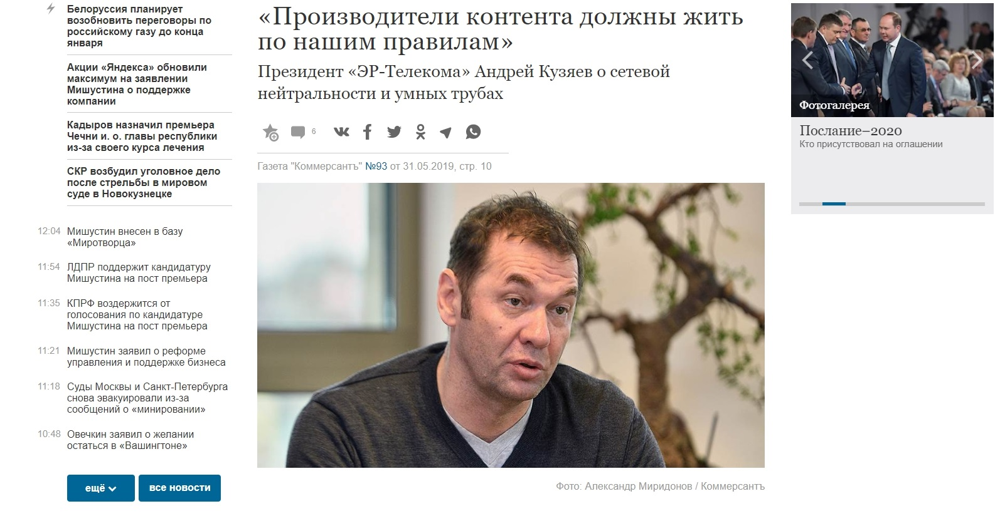

[_Интервью в «Коммерсанте»_](https://www.kommersant.ru/doc/3983875?query=%D0%BA%D1%83%D0%B7%D1%8F%D0%B5%D0%B2)

  
Такой материал, в первую очередь, интересует бизнес-сообщество, и влияет на узнаваемость и лояльность к «ЭР-Телекому» со стороны наших потенциальных партнеров, бизнес-заказчиков.

Или же для «РБК+» мы давали комментарий через [сервис журналистских запросов Pressfeed](https://pressfeed.ru/). Это специальная платформа для общения журналистов и экспертов (пиарщиков, которые представляют компанию). Представители СМИ оставляют запросы с указанием темы будущей статьи и примерной даты выхода, также они отмечают, каких именно экспертов ищут, на какие вопросы нужно ответить. Эксперт из какой-либо отрасли отвечает и высылает комментарий. Если все хорошо, то мнение спикера появляется в публикации. Регистрация на сервисе бесплатная для всех, но на базовом тарифе действуют некоторые ограничения. Большим компаниям лучше подключить тариф «Компания», а экспертам, которые работают сами на себя, — тариф «Эксперт».

Корреспондента «РБК» интересовали технологии в сфере логистики, а «ЭР-Телеком» участвует в создании решений и для транспортной отрасли.

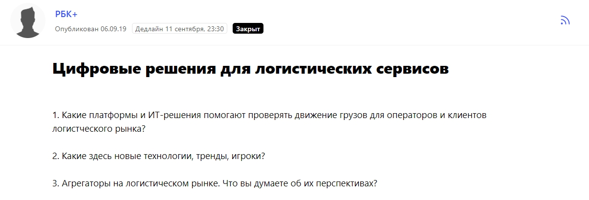  
[_Запрос на Pressfeed_](https://pressfeed.ru/query/60150)

Директор по монетизации инноваций АО «ЭР-Телеком Холдинг» Виктор Мазурик дал развернутый комментарий на эту тему и рассказал о современных датчиках, которые уже используются при перевозке грузов.

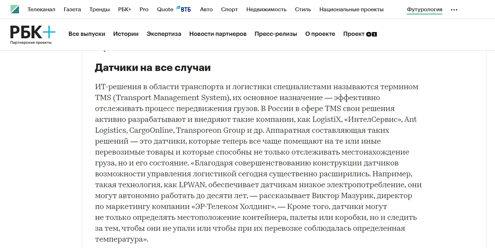  
[_Комментарий в «РБК+»_](https://plus.rbc.ru/news/5d8d063e7a8aa92cebbc8aac)

Данная публикация потенциально способна привлечь внимание со стороны руководителей логистических компаний, которые находятся в поиске digital-решений для своего бизнеса.

С **региональными изданиями** совсем другая история — другие инфоповоды и подача. Сайт из Ростовской области не напишет о том, как мы заработали 40 млрд рублей или внедрили новую ИТ-систему на базе нефтепромышленного предприятия. Зато они наверняка напишут о том, что мы установили «умные домофоны» в городские подъездах и как они повышают безопасность жителей.

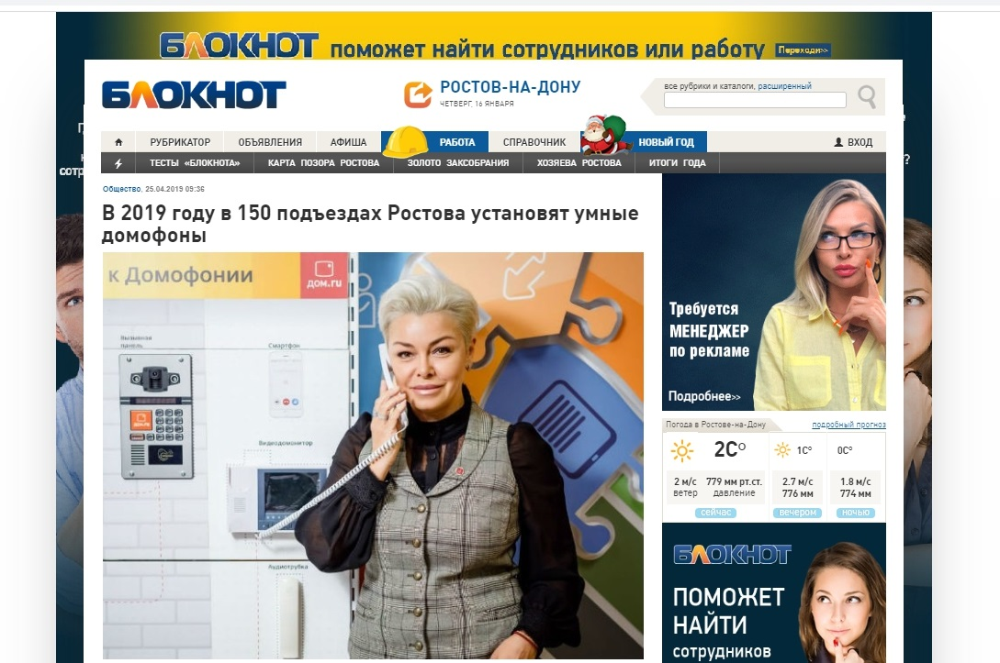

[_Публикация на сайте «Блокнот»_](https://bloknot-rostov.ru/news/v-2019-godu-v-150-podezdakh-rostova-ustanovyat-umn-1094071)

Кстати, на региональные издания тоже можно выйти через Pressfeed. Для этого в разделе «СМИ» необходимо выбрать интересующий город и посмотреть те издания, которые работают на сервисе. Там же можно найти запросы, которые действуют сейчас или которые уже были закрыты.

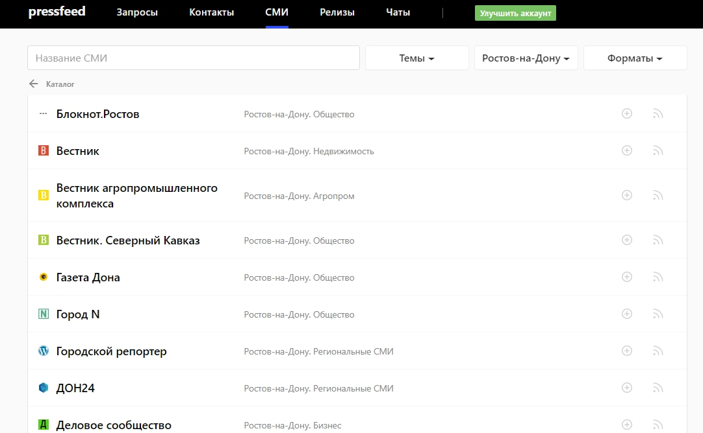  
_Примеры изданий из Ростова-на-Дону_

Также список СМИ на Pressfeed очень пригодится тогда, когда вы планируете выход в какой-либо новый город. Как минимум, через сервис можно составить пул важных региональных изданий для компании, как максимум, сразу связаться с редакторами этих площадок.

Еще одно направление в рамках взаимодействия со СМИ — **публикации на отраслевых сайтах**. Например, для «ЭР-Телекома» это порталы о телекоммуникациях, которые читают наши коллеги и партнеры по рынку.

Вот пример интервью Comnews с директор по технической инфраструктуре компании — разговор касался модернизации сети, больших данных и импортозамещения.

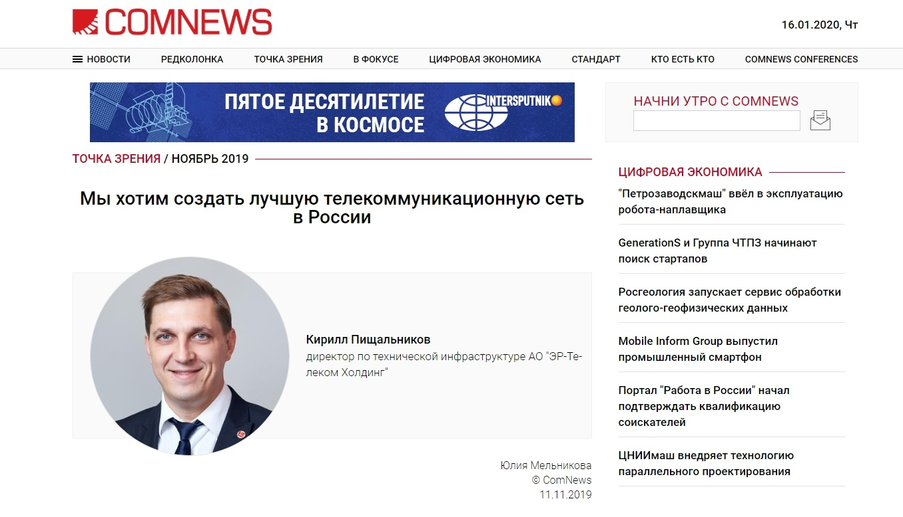

[_Интервью на Comnews_](http://www.comnews.ru/content/202812/2019-11-11/2019-w46/my-khotim-sozdat-luchshuyu-telekommunikacionnuyu-set-rossii)

Создание таких публикаций — это вопрос репутации в глазах телеком-сообщества.

Во-вторых, важно «появляться» на тех профильных сайтах, которые пишут о промышленности, энергетике и так далее. Мы внедряем решения, связанные с технологиями интернета вещей, для различных отраслей. Любой специализированный портал является площадкой для коммуникации с определенной узкой группой из ЦА.

Через Pressfeed мы вышли на сайт Oilcapital.ru — он посвящен нефтегазовой промышленности. Редактор готовил статью о цифровизации отрасли и искал спикеров.

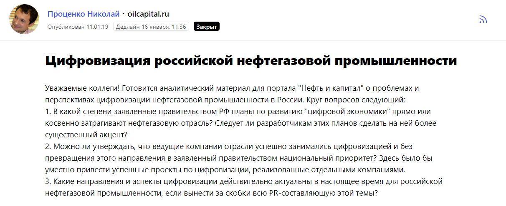  
[_Запрос на Pressfeed_](https://pressfeed.ru/query/51408)

Эксперт «ЭР-Телеком» написал комментарий, в котором объяснил, какие проекты уже сделаны для одного из лидеров российской нефтянки, а какие ИТ-платформы для этого рынка стоит развивать в будущем.

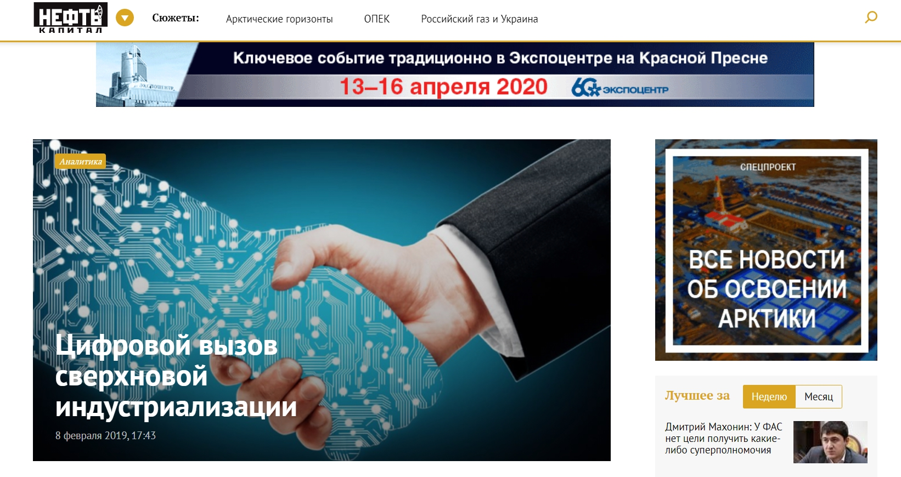

[_Публикация на Oilcapital.ru_](https://oilcapital.ru/article/general/08-02-2019/tsifrovoy-vyzov-sverhnovoy-industrializatsii)

> Традиционно публикации на подобных порталах не набирают миллион просмотров, но здесь охват играет принципально иную роль — допустим, материал прочитали 100 человек, но мы знаем, что каждый из этой сотни работает в нефтегазовой сфере, и каждый может стать нашим клиентом.

Иногда мы также работаем с HR-порталами. В «ЭР-Телеком» трудятся более 20 тысяч человек. Мы можем многое рассказать о рекрутинге, социальной политике, карьере и развитии молодых и зрелых профессионалов. Таким образом, если мы видим [запрос по теме персонала на Pressfeed](https://pressfeed.ru/query/60221), то обязательно отвечаем на него.

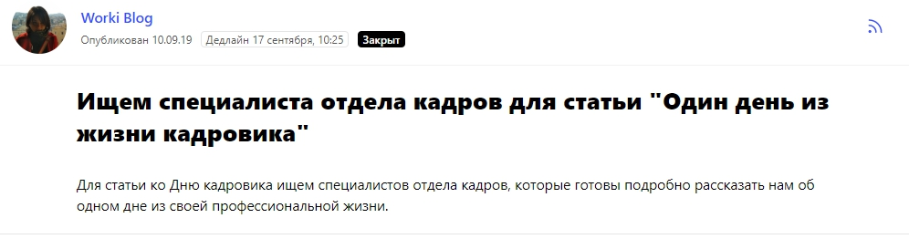

Вот фрагмент статьи с названием «Один день из жизни кадровика» в блоге сайта по поиску работы Worki.ru.

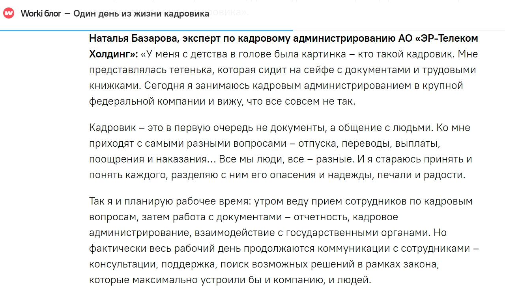  
[_Статья на Worki.ru_](https://worki.ru/blog/odin-dien-iz-zhizni-kadrovika/)

Такие публикации делают заметный вклад в развитие HR-бренда компании. Это немаловажно, поскольку будучи большим федеральным холдингом, мы постоянно находимся в поиске талантливых специалистов.

> Время от времени мы стараемся уходить от тематик, напрямую связанных с телекомом и интернетом вещей. Мы учим наших пиар-специалистов мыслить шире, включать фантазию. IT-технологии проникли во все сферы нашей жизни, так что иногда получается рассказать о чем-то отстраненном, но не менее актуальном и полезном для общества.

Например, совсем недавно руководитель направления информационной безопасности «ЭР-Телеком» Михаил Терешков написал статью о кибербуллинге для Rusbase. Проблема сложная, масштабная, но об этом необходимо говорить, нужно давать родителям рекомендации, как помочь ребенку в случае травли и как отграничить его от негативного влияния интернета.

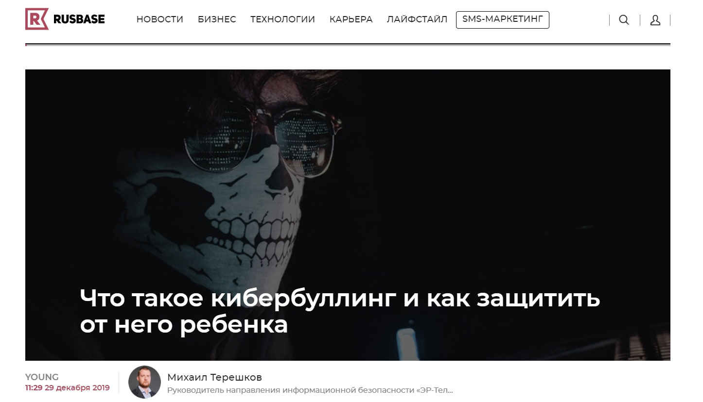

[_Статья на Rusbase_](https://rb.ru/young/kiberbulling/)

## Как договориться с журналистом о публикации

Выйти на нового журналиста или редактора можно через Facebook или через чаты на сервисе Pressfeed (на платформе зарегистрировано более 9 тысяч сотрудников различных изданий). Нужно представиться, дать краткую справку о компании, сразу предложить темы, которые потенциально могут подойти для конкретного издания, обсудить возможные форматы сотрудничества, если это возможно, пригласить на следующую пресс-встречу.

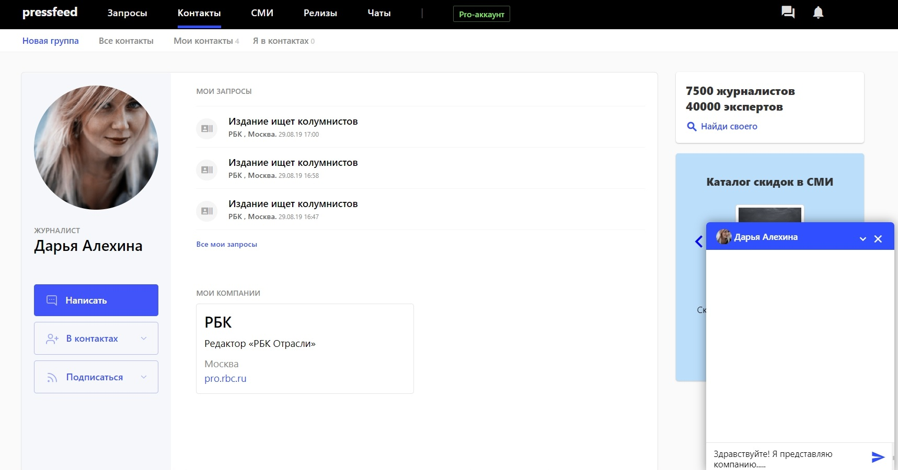  
_Профиль журналиста и чат на Pressfeed_

Чтобы построить долгосрочные хорошие отношения с журналистом, лучше знакомиться с ним лично. Поэтому мы регулярно устраиваем пресс-туры, приглашаем представителей медиа в офис «ЭР-Телеком», отвечаем на их любые вопросы. Такой подход позволяет нам делать сотни публикаций на безбюджетной основе, то есть обычно мы не покупаем рекламные публикации, а готовим материалы, которые редакция хочет ставить бесплатно. В них не должно быть прямой рекламы, максимум пользы для читателя.

За годы работы с журналистами пресс-служба «ЭР-Телеком» сформулировала для себя несколько простых принципов, которых мы стремимся придерживаться при общении с представителями СМИ. Не имеет значения, как вы познакомились — на Pressfeed, на пресс-конференции, через Фейсбук.

Наши правила:

* не бывает «важных» и «неважных» журналистов независимо от того, для какого издания они пишут, нельзя недооценивать людей. Со всеми необходимо общаться уважительно, не нарушать договоренности, не срывать сроки;
* на любой запрос от СМИ мы отвечаем в течение 3 часов — либо сразу готовим комментарий либо обсуждаем, о чем будет материал, какую информацию мы сможем подготовить;
* не стоит ничего навязывать, нужно обязательно «слышать», что именно интересно журналисту (изданию) на данный момент, каким образом удобнее получать информацию и как лучше взаимодействовать. К каждому искать индивидуальный подход.

## KPI в пиаре и их связь с продажами

В нашей компании нет жестких KPI, которые бы объединяли пиар-продвижение и продажи. Невозможно в конкретных цифрах посчитать, как публикации и мероприятия влияют на рост конкретного вида бизнеса, особенно если он не на IPO. Но то, что PR-усилия влияют на восприятие компании, в этом нет никакого сомнения. Здесь все не так просто и очевидно, как это бывает с классической рекламой.

Также я не вижу особого смысла ставить KPI по количеству упоминаний в СМИ. Можно сделать миллион публикаций в тех изданиях, которые не читает ваша целевая аудитория. И зачем были нужны эти публикации? Или если компания будет замешана в скандале, то о ней напишут сотни изданий. И как это отразится на репутации?

Что касается оценки эффективности пиара в СМИ, мы смотрим на тональность каждого материала и насколько он попадает в наши ключевые тематики. Основная цель — быть лидерами по упоминаниям в определенных темах. Например, если взять отчет «Медиалогии» за декабрь 2019 года, то по теме LoRaWAN (беспроводная технология в рамках интернета вещей) мы находимся в топ-5 по упоминаемости, по теме 5G — в топ-10.

Всего за 2019 год вышли десятки тысяч публикаций с участием экспертов «ЭР-Телеком». И каждый материал внес свой вклад в восприятие компании рынком и пользователями, в развитие бренда. О нас говорят, о нас пишут, нас знают и доверяют. Наша задача — это доверие оправдать. Так или иначе, впереди еще много работы.