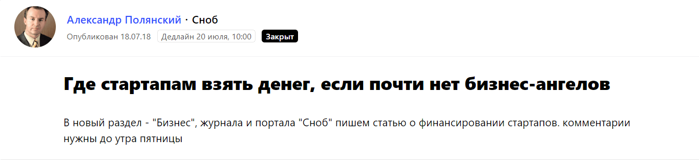
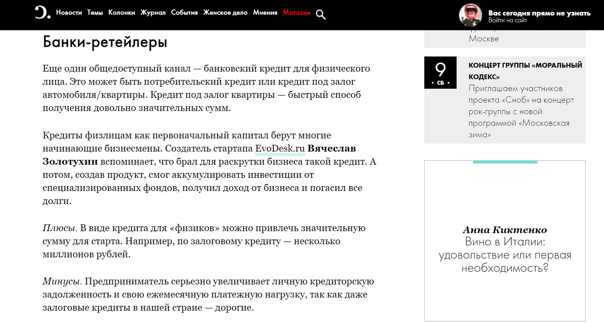
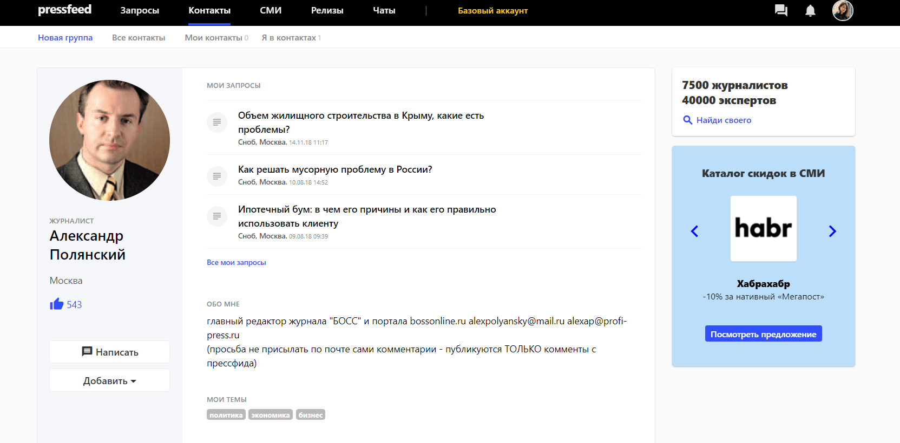
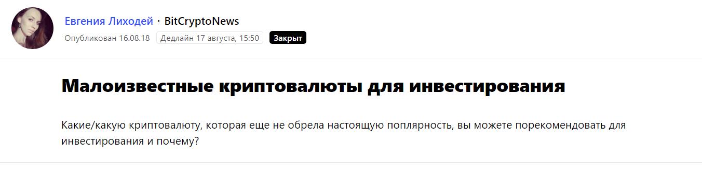
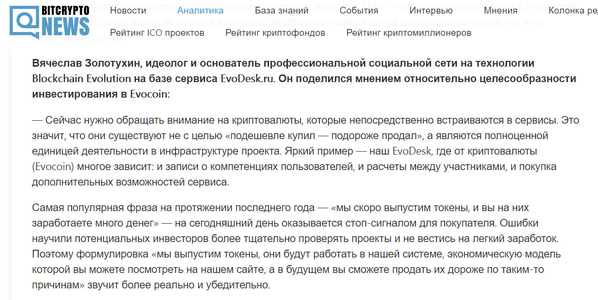
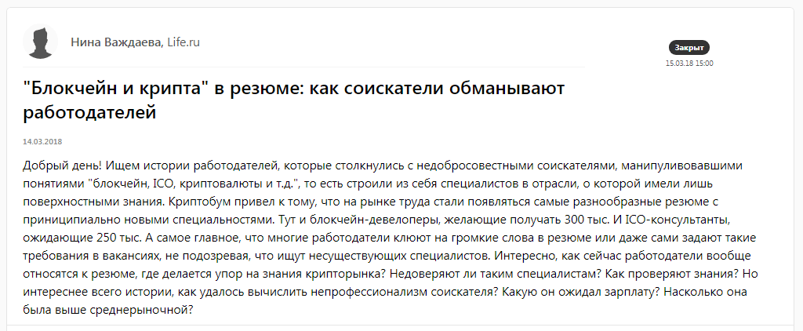
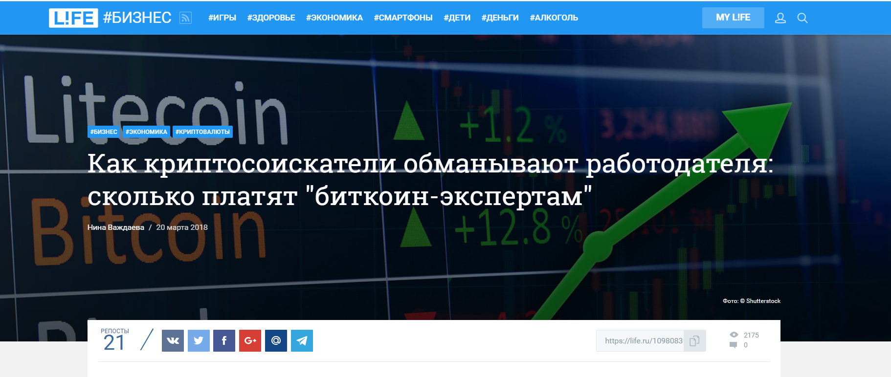
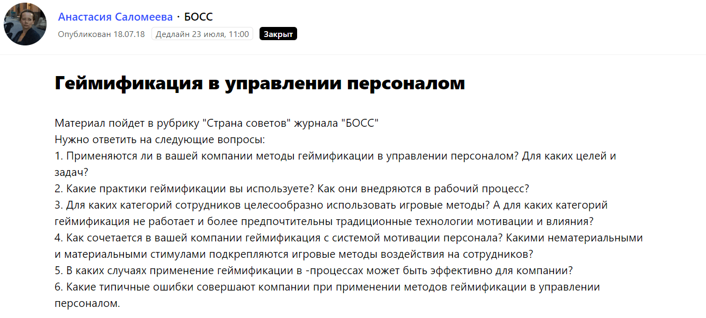
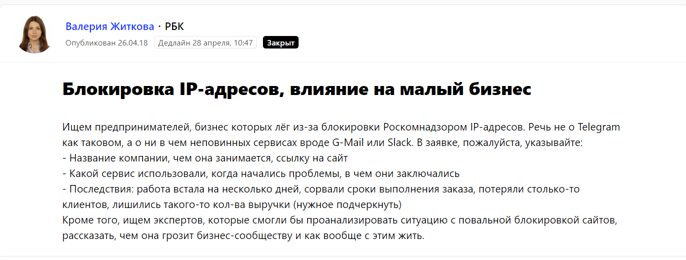
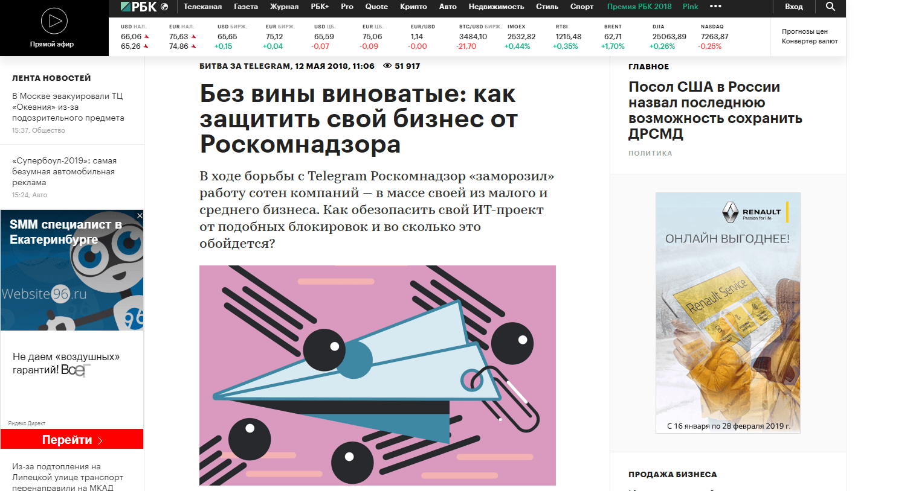

EvoDesk — онлайн-планировщик на основе Blockchain. С помощью сервиса руководители могут ставить задачи себе и команде. Это и планировщик, и социальная сеть: на базе сервиса можно искать партнеров, экспертов, работодателей. Первая версия приложения была представлена в марте 2018 года, а в декабре 2018 года мы планируем официальный релиз дополненной версии.

## Зачем мы начали PR-продвижение за 10 месяцев до релиза продукта

Мы решили заранее подготовить деловое сообщество к новому продукту. Чтобы на момент релиза потенциальные клиенты уже слышали о нем, отраслевые СМИ тоже знали о нем, чтобы рынок ждал EvoDesk. Поэтому весь 2018 год мы вкладывались в пиар-продвижение: работали не ради трафика на сайт, а ради раскрутки бренда EvoDesk. Мы уверены, что пиар удешевляет маркетинг. Чем больше касаний с потенциальным клиентом сделано до старта проекта, тем проще продавать продукт после. Пиар и маркетинг должны работать в связке. В случае с EvoDesk пиар начинает раскручивать, а маркетинг подхватит.

## Конкретные цели: собрать базу журналистов, чтобы пригласить их на презентацию

Однако узнаваемость и репутация ─ скорее, глобальные и даже второстепенные цели. Мы поставили перед pr-специалистом более осязаемую и конкретную задачу ─ собрать как можно больше контактов журналистов и «задружиться» с ними до официального релиза продукта. Собрать ─ не значит скопировать ссылки на их страницы в Facebook и занести всех в табличку. Собрать ─ познакомиться, заявить о себе, договориться о сотрудничестве и выпустить совместный материал. В планах было охватить около 20 целевых изданий, соответственно, наладить связи хотя бы с 20-25 журналистами из этих ресурсов.

Мы преднамеренно не ставили нереальные цели (организовать выходы в 50-70 разных изданий). Не факт, что вам нужны все эти люди и все эти площадки. Если вы пригласите 15 заинтересованных журналистов, которые в дальнейшем обеспечат вам хороший охват и узнаваемость, это будет эффективнее, чем приглашать всех подряд.

## Как наладить связи с журналистами, но не докучать им: использовать автоматизированный сервис

Договариваться с журналистами напрямую, писать в каждую редакцию ㅡ долго, сложно и не всегда эффективно. Журналисты не будут просто так сотрудничать с новой компанией, да еще и бесплатно. Не будут, если не давать им то, что нужно им самим. Поэтому в январе 2018 мы начали использовать сервис Pressfeed, где редакции крупных медиа обозначают темы и выкладывают запросы с просьбой помочь им собрать фактуру для материала. Тем более, наш стартап нацелен на автоматизацию рабочих процессов, так что мы на стороне автоматизации в любых вопросах, в том числе в пиаре и маркетинге.

Сервис Pressfeed дает бесплатный доступ к базовому аккаунту, но мы решили сразу подключить тариф «Эксперт»: он снимает все ограничения по количеству ответов на запросы и включает дополнительные функции (например, подписку на запросы по темам).

> На старте работы у нас была такая гипотеза: если сразу сделать хотя бы одну совместную публикацию и при этом показать, что спикеры компании EvoDesk ㅡ адекватные и оперативные эксперты, то будет проще «залоялить» журналиста, договориться о повторном сотрудничестве, найти точки соприкосновения, подружиться.

## Тематики запросов и примеры публикаций

Каждое утро в 10.00 наш pr-специалист проверял рассылку от сервиса и отбирал запросы, подходящие для нас по теме. Как выбрать запрос? Мы отталкивались от своих компетенций и формата издания. Говорили о блокчейне, об эффективности, об управлении персоналом. Начинали мы с любых изданий, которые размещали запросы по нашей теме, но затем стали ориентироваться только на крупные и известные нам.

**Дадим совет:** ищите запросы по вашей теме, но не ограничивайтесь ими. Расширяйте горизонты. Управление бизнесом не заканчивается описанием вашего продукта. Тем, кто решился запустить стартап, всегда есть о чем рассказать. Пишите о том, что вас волнует, о том, что наверняка волнует таких же, как и вы, подавайте пример, делитесь опытом.

Например, мы работали с изданием «Сноб» (7 миллионов читателей ежемесячно), делились опытом, как открыть стартап, если нет денег.

  
[_Запрос_](https://pressfeed.ru/query/45587) _от издания «Сноб»_

  
[_Публикация_](https://snob.ru/entry/163688) _в издании «Сноб»_

Тогда pr-специалисту удалось познакомиться с редактором издания Александром Полянским и, оказалось, что он по совместительству является главным редактором делового журнала «БОСС». Это была удача, и потом мы писали комментарий и для его журнала тоже.

  
[_Профиль журналиста_](https://pressfeed.ru/people/2130)

> Первый принятый запрос и опубликованный комментарий ㅡ это отличный повод для знакомства и дальнейшего сотрудничества. После выхода совместного материала можно написать журналисту в личные сообщения (чат) на сервисе, спросить, какие темы еще могут быть интересны, подробнее рассказать о компании.

Так как планировщик EvoDesk работает на основе Blockchаin мы даем комментарии отраслевым медиа на **тему криптовалют.** Для крупной отраслевой площадки BitCryptoNews (в месяц публикации сайт зафиксировал 160 тысяч посетителей) мы рассказывали о криптовалюте Evocoin — именно ее можно будет получить во время работы с нашим продуктом.

_Запрос от_ [_BitCryptoNews_](https://pressfeed.ru/query/46574)

Такие издания читают те, кто уже разбирается в теме блокчейна — этой целевой аудитории проще объяснить, в чем заключаются преимущества EvoDesk.

[_Материал_](https://bitcryptonews.ru/analytics/cryptocurrency/novyie-monetyi-dlya-investirovaniya-analiz-i-rekomendaczii-ekspertov) _с участием компании_

Узкоотраслевые издания хороши тем, что там сидит совершенно конкретная целевая аудитория. Но это не значит, что она не читает другие, более массовые издания. Те, кто заинтересован, прочитают ваше мнение в любом крупном издании.

Впрочем нужно просвещать и неподготовленную публику, поэтому мы отвечали на запросы непрофильного, но крупного популярного издания. Например, life.ru.

  
[_Запрос_](https://pressfeed.ru/query/41312) _от Life.ru_

Мы поделились с изданием совершенно реальной историей о соискателях-самозванцах.

> Немного о схеме работы. Внутри компании удобнее всего работать так: пиар-специалист отбирает запросы — согласовывает темы со экспертом (руководителем, начальником отдела и т.д.) — конкретизирует требования журналиста — эксперт наговаривает ответы — специалист оформляет их и редактирует — отправляет журналисту в установленные сроки. Без пиар-специалиста здесь не обойтись.

Кстати, для уже знакомого нам журнала «БОСС» мы писали комментарий о геймификации в управлении персоналом.

  
[_Запрос_](https://pressfeed.ru/query/45613) _от журнала «БОСС»_

Этот выход был ценным, потому что в журнале было не просто упоминание EvoDesk, а полноценное описание функционала платформы: в чем заключается геймификация, зачем копить баллы, что это дает пользователю.

> Обращайте особое внимание на запросы, итогом которого станет не маленький комментарий в издании, а полноценная статья или большой подробный комментарий. Некоторые интернет-площадки всегда ищут новых бизнес-авторов.

Конечно, как и любой компании, нам хотелось наладить контакты с и такими медиагигантами, как «РБК» или «Коммерсантъ».

В случае с «РБК» нам помогла «горячая тема». Помните, в апреле 2018 года Роскомнадзор всеми силами блокировал Telegram, а с ним и другие сервисы, которые просто попались под руку? Многие СМИ спрашивали, как эти блокировки повлияли на бизнес. Мы дали несколько советов, как избежать блокировок, для издания «РБК».

  
[_Запрос_](https://pressfeed.ru/query/42912) _от «РБК»_

Публикация «Без вины виноватые: как защитить свой бизнес от Роскомнадзора» набрала более 50 тыс. просмотров. Такого охвата мы бы не получили ни в одном профильном издании.

> Увидели интересный запрос, хайповую тему, вам есть что сказать ─ говорите. Такие публикации имеют огромный охват. Публикация в таких медиагигантах, как «Коммерсантъ», «РБК» ─ это большой плюс в карму компании. Это то, что работает на репутацию. На такие комментарии нужно тратить время, а с журналистами этих медиа нужно дружить и не упускать их из виду.

  
[_Материал_](https://www.rbc.ru/own_business/12/05/2018/5af150199a794761d5357b1d) _на «РБК»_

Тогда мы обратили внимание на корреспондента [Валерию Житкову](https://pressfeed.ru/people/17017), которая регулярно размещает запросы от издания на Pressfeed. Большой плюс сервиса, что мы можем отследить на какие темы выкладывают запросы, насколько журналист активен, идет ли он на контакт в переписке и так далее.

## Что удалось достичь к концу 2018 года

С начала 2018 года с нашим участием вышло около 400 публикаций в крупных индексированных СМИ (с учетом всех перепечаток). При этом 75% публикаций мы сделали через Pressfeed: всего за 10 месяцев мы ответили на 105 запросов, 50% комментариев были приняты.

Меньше чем за год (за 10 месяцев) нам удалось установить контакты с более чем 20 журналистами крупных изданий. В декабре 2018 года мы планируем провести презентацию, на которую хотим собираемся пригласить всех знакомых нам журналистов лично. Скорее всего, это будет email или приглашение в мессенджере. Они охотнее откликнутся на наше приглашение, если уже будут знать нас, понимать, чем мы занимаемся, что продвигаем.

В целом публикации в прессе дают нам возможность рассказывать о себе больше, чаще и подробнее, чем если бы мы работали исключительно на проработку клиентской базы. Чем раньше мы заявим о нашем продукте, тем быстрее мы раскрутим платформу, тем проще будет продавать его инвесторам и клиентам.

_(Материал подготовлен в конце ноября 2018 года)._
