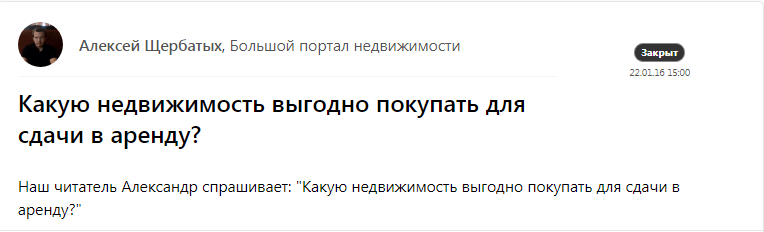
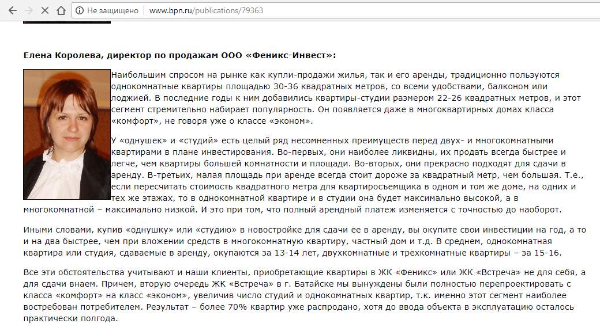
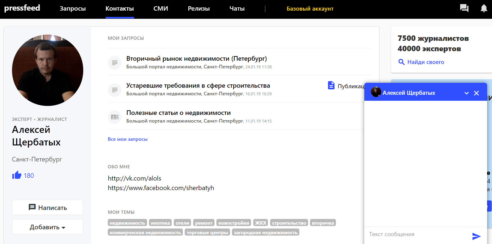
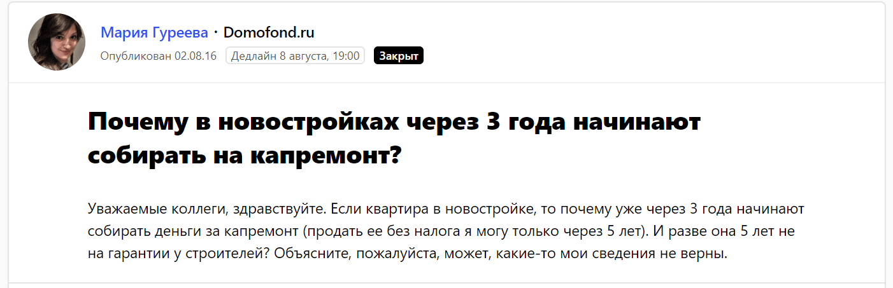
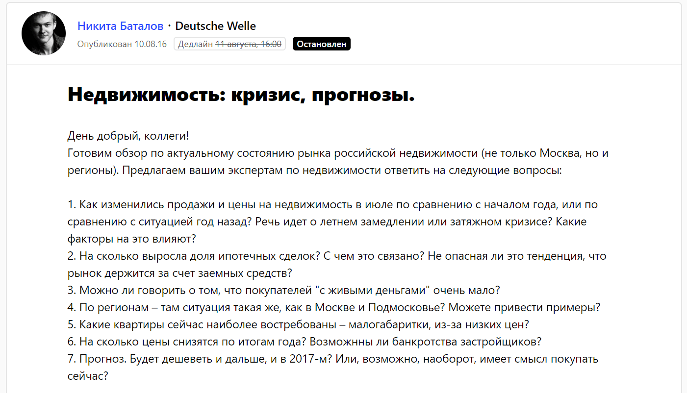
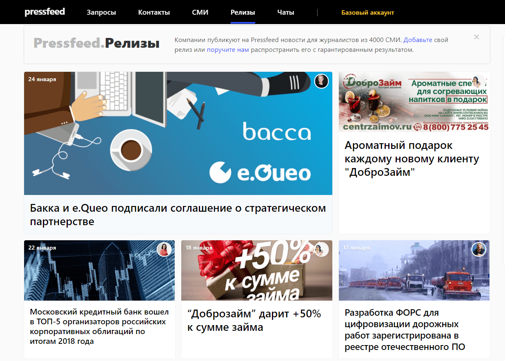

Около трех лет назад в наше PR-агентство обратилась небольшая девелоперская компания «Феникс-Инвест». Это региональный бизнес по строительству и продаже недвижимости в Ростове-на-Дону и Ростовской области. До того, как компания начала серьезно заниматься PR, ее продвижение сводилось к классическим для девелоперов рекламным кампаниям. Никакие pr-инструменты задействованы не были.

В определенный момент руководство компании провело аналитику и пришло к выводу, что вложения в прямую рекламу не оправдываются. Стоимость рекламы повышается, но количество клиентов не растет. Пришли к выводу, что для поднятия конверсии нужно начинать работать с аудиторией раньше, на другом этапе воронки продаж. Необходимо было повысить узнаваемость «Феникс-Инвест» на рынке девелоперов в глазах потенциальных клиентов, сформировать доверие и лояльность к компании. «Греть трафик» особенно важно при продаже сложного и дорогого продукта, ведь никто не покупает квартиру после первого взгляда на баннер в интернете. Было решено начать работать со СМИ и рассказывать о компании как о проверенном, надежном застройщике и в местных, и в федеральных изданиях.

## С чего начать продвижение в СМИ: постановка задач

На этапе планирования мы обозначили ключевые для компании медиа и примерные KPI: ежемесячно мы должны были генерировать 6-7 инфоповодов (3 пресс-релиза, каждый из которых может нам дать 7-8 упоминаний, плюс 3-5 отдельных комментариев от эксперта компании). Делать больше было нецелесообразно, ведь пресс-релиз должен содержать новость, которая должна быть интересна не самой компании, а ее аудитории. Целевые издания — это федеральные деловые и общественные СМИ, отраслевые федеральные издания в области недвижимости и строительства и региональные ростовские издания.

На следующем этапе мы определили основных экспертов компании: от чьего имени будут выходить комментарии в СМИ, кто может и хочет общаться с журналистами, кто станет лицом «Феникс-Инвест» в медиа. Генеральный директор не стремился к построению публичного личного бренда, и главным спикером стала Елена Королева, директор по продажам. Большинство тематик, потенциально интересных СМИ, было в компетенции Елены. Она знала обо всем, что происходит в компании и на рынке недвижимости в регионе. Поэтому около 80% всех публикаций с участием «Феникс-Инвест» выходили с комментариями Елены.

## Как выстраивать отношения со СМИ: работа с Pressfeed

В PR-агентстве были налажены отношения с региональными ростовскими изданиями, но в приоритете стояли федеральные медиа и отраслевые строительные издания, поэтому мы создали для компании аккаунт на сервисе журналистских запросов [Pressfeed](https://pressfeed.ru/). Хочу еще раз подчеркнуть, что «Феникс-Инвест» — некрупный девелопер, а журналисты отраслевых СМИ охотнее идут на прямой контакт с пресс-службами федеральных строительных компаний и за комментарием, скорее всего, обратятся к ним же. А Pressfeed уравнивает всех — на сервисе журналист примет комментарий любой компании, если спикер говорит четко, оперативно и по делу.

**3 совета, как писать комментарий для журналистов, чтобы спич на Pressfeed взяли в публикацию**

1. Внимательно вчитывайтесь в вопросы журналиста. Не нужно говорить о своем. В деловом пиаре это неприемлемо. Пишите то, что от вас хотят услышать.
2. Учитесь отвечать оперативно. Это вообще проблема многих региональных специалистов: они боятся отвечать быстро, боятся говорить без подготовки. Иногда это чревато пропуском важной для компании публикации. Даже если дедлайн — неделя, не затягивайте с ответом.
3. Не давайте непроверенную информацию или информацию с чужих слов. Это серьезно, так как в большинстве случаев лишние слова нельзя убрать из публикации после ее выхода. Да и такое поведение просто испортит отношение с журналистом.

Приведу примеры нашей работы с Pressfeed. Через сервис мы познакомились и стали сотрудничать с авторитетным профильным медиа «Большой портал о недвижимости» (bpn.ru). Журналист Алексей Щербатых регулярно публикует там запросы, а мы регулярно на них отвечали.

  
[_Запрос_](https://pressfeed.ru/query/15332) _журналиста bpn.ru_

Один раз Елена подробно рассказала, какая недвижимость будет приносить больше дохода ее владельцу при сдаче в аренду.

  
_Комментарий «Феникс-Инвест» на_ [_bpn.ru_](http://www.bpn.ru/publications/79363)

С журналистом «Большого портала о недвижимости» у нас сложились хорошие доверительные отношения. Ему нравилось, насколько подробно и логично мы отвечаем на все запросы в Pressfeed (всего мы ответили на 6 запросов через сервис, 5 комментариев вышли в публикациях). Сначала мы общались через чаты Pressfeed, там можно переписываться как в обычном мессенджере: уточнять детали, прикладывать файлы, фотографии, отправлять ссылки и так далее.

  
_Профиль журналиста с чатом_

В дальнейшем Алексей начал присылать запросы на нашу рабочую почту за 3-4 дня до того, как он опубликует их на Pressfeed. Иногда журналист высылал нам тематический план на неделю, и мы заранее решали, на какие вопросы дадим ответы.

Другой пример, публикации с участием «Феникс-Инвест» выходили в блоге сайта Domofond.ru (портал по продаже квартир, ежемесячно его просматривают около 7,4 млн человек).

  
[_Запрос_](https://pressfeed.ru/query/22289) _от Domofond.ru_

В то же время мы работали и с деловыми, и с общественными федеральными медиа. С помощью Pressfeed мы опубликовали комментарий в одном из крупнейших европейских СМИ на русском языке Deutsche Welle.

  
[_Запрос_](https://pressfeed.ru/query/22289) _от Deutsche Welle_

Эксперт «Феникс-Инвест» [описал ситуацию на рынке региональной недвижимости](https://www.dw.com/ru/%D0%B6%D0%B8%D0%BB%D0%B0%D1%8F-%D0%BD%D0%B5%D0%B4%D0%B2%D0%B8%D0%B6%D0%B8%D0%BC%D0%BE%D1%81%D1%82%D1%8C-%D0%B2-%D1%80%D0%BE%D1%81%D1%81%D0%B8%D0%B8-%D0%BF%D0%B0%D0%B4%D0%B5%D0%BD%D0%B8%D0%B5-%D1%86%D0%B5%D0%BD-%D0%BF%D1%80%D0%BE%D0%B4%D0%BE%D0%BB%D0%B6%D0%B8%D1%82%D1%81%D1%8F/a-19468889) в России.

Всего за год работы мы ответили на 36 запросов на сервисе Pressfeed, из них 26 питчей было принято, соответственно, вышло 26 публикаций.

Кроме работы на Pressfeed, мы рассылали пресс-релизы в 25 редакций региональных и профильных СМИ и так же размещали их на 40-50 площадках, где пресс-релизы публикуются бесплатно. Например, publishernews.ru, openmarket.ru, press-release.ru и так далее. Между тем, на Pressfeed тоже можно разместить пресс-релиз во вкладке [«Релизы»](https://pressfeed.ru/releases), и он сразу появится в личном кабинете всех журналистов сервиса (на конец 2018 года на Pressfeed работают около 7,5 тысяч журналистов).

_Релизы, размещенные на Pressfeed_

Релизоприемники дают разную отдачу: время от времени мы получали несколько бесплатных публикаций благодаря подобным сайтам. По нашему опыту смысл тратить на них силы и время все-таки есть.

Новости, которые мы рассылали по изданиям, были разными: аналитика ситуации на рынке за квартал, полугодие или год, ввод или закладка очередного дома, встречи с жильцами, городские праздники и профессиональные мероприятия (ярмарки жилья). Кроме того, мы делали обзоры ипотечных предложений, комментарии изменений федерального законодательства, давали отчеты о введенном метраже и количестве квартир за год.

## Результаты года работы

Всего за один год PR-продвижения вышло 70 публикаций в ключевых для «Феникс-Инвест» СМИ. Шли по плану: писали 3 пресс-релиза и делали около 4-5 комментариев в месяц. Со всеми перепечатками общее количество упоминаний компании перевалило за несколько сотен. Важное замечание: ссылки на все материалы мы обязательно распространяли на официальных страницах компании в социальных сетях.

С момента старта работы компания «Феникс-Инвест» стала узнаваемым экспертом в сфере строительства и недвижимости. Компанию стали приглашать на строительные конференции и «круглые столы», организованные на территории Ростова и Ростовской области. Например, портал 161.ру проводил встречу с представителями строительного бизнеса на тему «Рынок жилья в условиях сложившейся экономической ситуации: ипотека, предложения, цены». На конференции девелоперов и риэлторов «Рынок жилищного строительства» Елена Королева была модератором встречи. За экспертными оценками и комментариями в компанию стали обращаться региональные редакции «Российской газеты», «Делового квартала», «Коммерсанта».

До начала нашей работы у небольшого девелопера не было сформированного имиджа, но мы смогли представить «Феникс-Инвест» как надежного, достойного, качественного, экспертного застройщика, опираясь только на реальные факты. Это вызывало доверие новых клиентов и вело к повышению количества заявок.

> Основной показатель — в 2016 году компания «Феникс-Инвест» на 100% распродавала свои объекты к моменту сдачи. Это редкая ситуация для региона, к тому же, на падающем рынке недвижимости. Таких результатов удалось достигнуть благодаря выстроенной PR-стратегии и грамотной работе с журналистами.
