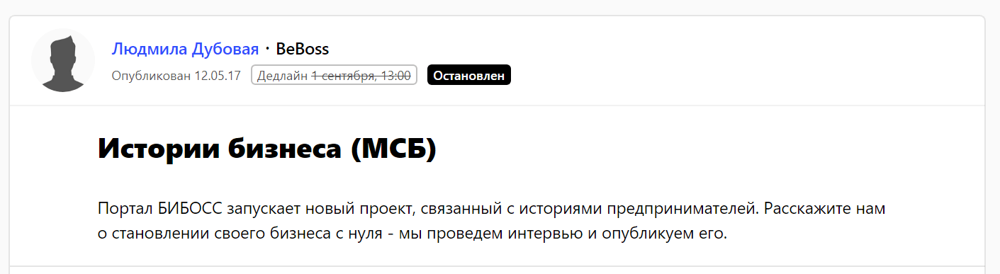

В 2018 году сеть Gelateria Plombir насчитывает около 200 торговых точек в 6 странах (Россия, Казахстан, Киргизия, Беларусь, Грузия, Таджикистан). Второй год подряд мы входим в рейтинг самых прибыльных российских франшиз по версии Forbes: в 2018 году мы заняли в рейтинге шестое место.

Продвижение Gelateria Plombir работает на две принципиально разные (хотя и пересекающиеся) аудитории:

* потребители, то есть посетители наших кафе,
* потенциальные партнеры-франчайзи.

Среди последних могут быть опытные предприниматели и те, кто только хочет заняться бизнесом. Основная работа в сфере public relations ориентирована на партнеров: на тех, кто уже с нами и на тех, кто еще только собирается выбрать нашу франшизу. Рекламой и продвижением своих точек среди потребительской аудитории обычно занимаются сами франчайзи, хотя основные направления мы согласуем вместе.

## **Почему публикации в СМИ так важны для продавца франшизы и ее покупателя**

Конечная цель любого продвижения — продажи. PR формирует имидж и репутацию компании. Любой деловой партнер, любой потенциальный покупатель франшизы должен за считанные минуты найти максимум информации о нашей компании в интернете. Представим, что он вбивает в поисковую строку запрос «Gelateria Plombir франшиза». Все, что он найдет — сайт, отзывы, наши интервью в крупных деловых медиа, наши комментарии на специализированных сайтах, информацию о франшизных рейтингах — повлияет на его решение «быть или не быть». Поэтому для нас важно всегда поддерживать образ качественной, проверенной, работающей франшизы в медиа (в преимущественно деловых и отраслевых изданиях) и социальных сетях.

> Чем больше в интернете положительных публикаций о нас, тем вероятнее, что будущий покупатель подумает: это открытая компания, их собственник публичная личность, их обсуждают, о них говорят, им есть, чем поделиться с другими предпринимателями.

Значит, с франшизой должно быть все в порядке, это честный и нормальный бизнес. Такая схема работает и в России, и в странах СНГ.

## **Как выходить на СМИ и успешно с ними сотрудничать**

Так как мы заинтересованы в постоянном потоке публикаций, мы хотим работать с различными СМИ регулярно, а не спонтанно (ждать, когда знакомый журналист сам попросит комментарий, можно долго). Кроме того, для франшизного бизнеса важно появляться и в крупных федеральных изданиях, и в региональных медиа с хорошей аудиторией, и в отраслевых бизнесовых. С такими мыслями и желаниями мы пришли на [Pressfeed](https://pressfeed.ru/). Удобный сервис журналистских запросов, где издания сами определяют актуальные для них темы. Мы знакомы с западными сервисами с подобной механикой и знаем, что Pressfeed — лучший российский аналог.

С помощью сервиса мы познакомились с рядом узкоспециализированных СМИ. Пример — франчайзинговый портал Buybrand. Наша франшиза изначально была размещена там, но полноценных материалов мы с ними не делали. Однако Buybrand размещал на Pressfeed запросы, мы отвечали на них и смогли обратить на себя внимание редакции.

###### Один из [запросов](https://pressfeed.ru/query/22834) издания Buybrand на Pressfeed

В итоге мы рассказали изданию, как мы [вышли на рынок Грузии](http://www.buybrand.ru/news/12931/?sphrase_id=106501), о нашем [пакетном предложении для франчайзи](http://www.buybrand.ru/news/13154/?sphrase_id=106501), давали комментарий по поводу [развития франчайзинга в России](http://www.buybrand.ru/articles/13012/?sphrase_id=106501).

Также Pressfeed принес нам нужный контакт в казанском проекте о бизнесе Beboss. Они вплотную занимаются нашей основной темой – франчайзингом. Мы организовали [большое интервью](https://www.beboss.ru/journal/persons/2794-evgeniy-dray).

[_Запрос_](https://pressfeed.ru/query/30995) _от BeBoss_

_Публикация с Евгением Драем_

Через Pressfeed легко выйти на таких медиа-гигантов, как «Коммерсантъ». Журналист вовремя разместил запрос по нашей отрасли, мы оперативно отреагировали. Вышел материал [«Рестораторы сохраняют аппетит»](https://www.kommersant.ru/doc/3447196?query=Gelateria%20Plombir) о росте рынка общественного питания Санкт-Петербурга.

[_Запрос_](https://pressfeed.ru/query/35650) _журналиста издания «Коммерсантъ»_

_Публикация с участием Gelateria Plombir_

А в другой раз попали в популярное бизнесовое издание Business Story: редакции издания понравилась история появления и развития Gelateria Plombir.

[_Запрос_](https://pressfeed.ru/query/27314) _от Business Story_

_Итоговая_ [_публикация_](http://businesstory.ru/istorija-kafe-morozhenyh-gelateria-plombir/)

Даже когда компания формально знакома с журналистом издания, вы не можете знать его редакционные планы. На Pressfeed же можно каждый день мониторить актуальные повестки недели/месяца.

## **История знакомства с Forbes**

Pressfeed — это отличная площадка для нетворкинга. Даже если журналист не возьмет ваш комментарий к запросу с первого раза, ваше общение может перерасти в дальнейшее сотрудничество. Например, как было с российским Forbes: сперва мы долго общались с разными журналистами, и параллельно участвовали в рейтинге франшиз — он у них бесплатный и не ангажированный. Потом с помощью сервиса мы продолжили расширять контакты с изданием, еще раз напомнили о себе. Наконец, выслали пару мыслей для публикаций, которые им понравились. И написали для Forbes колонку [«Сила в глубинке. Как заработать на франшизе в регионах»](http://www.forbes.ru/karera-i-svoy-biznes/364451-sila-v-glubinke-kak-zarabotat-na-franshize-v-regionah).

_Публикация в Forbes_

Могу с уверенностью сказать, что в случае с ведущими деловыми СМИ многое зависит от ваших собственных идей и от того, насколько ясно они сформулированы. Редакторы привыкли к своему формату. Они с удовольствием будут с вами сотрудничать, если вы умеете говорить на их языке. Так что, если вам есть что сказать, трибуна у вас рано или поздно появится.

## **Еще раз о целях публикаций в СМИ**

Партнеры, предприниматели читают о нас в крупных изданиях, а затем приходят на официальный сайт. Там они находят другую необходимую информацию, убеждаются, что мы реальная и честная компания, работающая франшиза, и, в конце концов, выходят на связь. Таким образом, продажи действительно растут. А главное, процесс становится более технологичным.

Именно поэтому я веду собственную колонку в блоге Forbes, также регулярно появляюсь в «Деловом Петербурге», в проекте Beboss, Marketmedia и других деловых СМИ. А в последнее время часто выступаю в СМИ как эксперт именно по франчайзингу в широком смысле. «Токсичные франшизы», «Взаимообман франчайзи и франчайзеров» — вот только несколько наших свежих тем. При этом приглашать высказаться стали чаще. Кроме того, всегда интересно и полезно держать руку на пульсе рынка. К тому же, если наши комментарии или цитаты действительно попадают «в тему», то дискуссия обычно продолжается (в СМИ или в сети), и мы часто получаем обратную связь, которая нас радует. Важно ведь не только «выстрелить», но и уметь поддержать разговор с читателем. Это тоже «цепляет» и вызывает доверие потенциального покупателя.

## **Результаты: рост сети и оборота в 1,5 раза**

После выхода особенно прорывных материалов о нас вполне ожидаемо увеличивается и трафик на наш сайт (мы используем несколько способов измерения, например, метрику Liveinternet).

> Когда материал выходит на серьезных площадках (и со ссылками) по типу Forbes, трафик повышается мгновенно и скачкообразно, минимум в 10 раз.

Задачи нашего PR-отдела лежат в основном в секторе В2В, поэтому мы более трезво  относимся к «нагону трафика». Эти цифры не означают для нас продаж. Скажем, эффект от моих экспертных комментариев вообще, казалось бы, трудно отследить, но на самом деле он лежит в другой плоскости — в репутационной. А вот репутация продажи дает. На самом деле, я говорю очевидные вещи, но почему-то они часто нервируют интернет-маркетологов.

Мы стараемся делать 3-4 публикации в месяц. Хотя иногда одна идея отрабатывает лучше десятка других. Тут важно постоянно генерировать эти идеи. Умело их интерпретировать для разных аудиторий. Бороться не за количество, а за качество публикаций. Дальше происходит накопление «критической массы». Главное, чтобы компании, действительно, было что показать. У нас с этим все в порядке.

За прошедший год сеть выросла примерно в 1,5 раза. Только в течение 2017 года по франшизе Gelateria Plombir было открыто 79 новых точек по России (не считая СНГ) и около двух десятков за рубежом.

Подтверждена международная регистрация нашей торговой марки на 7 стран, включая новые для нас — Армения, Азербайджан, Беларусь, Казахстан, Украина. Годовой оборот всех точек, включая выручку управляющей компании с доходом от продажи франшизы, увеличился за год примерно в полтора раза и составил около 350 000 000 рублей. Публикации в СМИ сыграли свою роль: без них наши франчайзи могли бы упустить нас из виду, не заметить среди массы других франшиз. Особенно это касается тех, кто еще не имеет опыта во франчайзинге.
