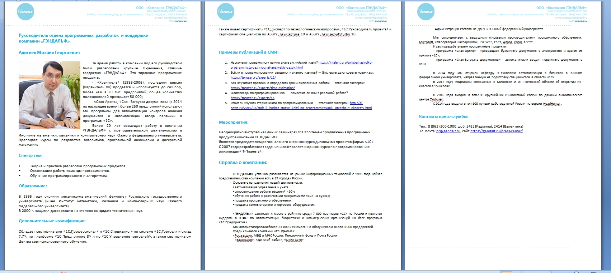
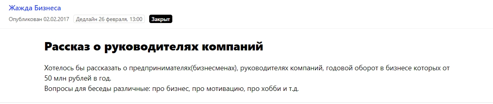
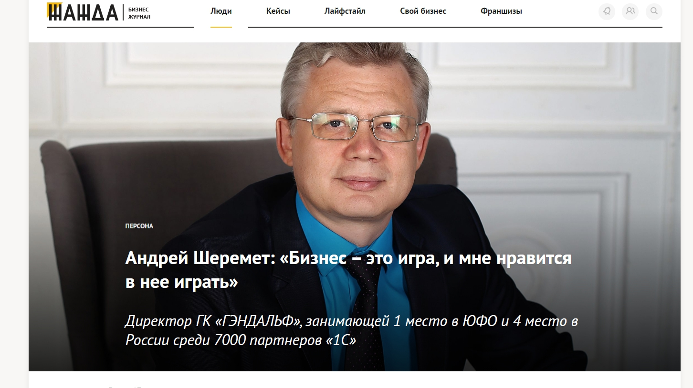
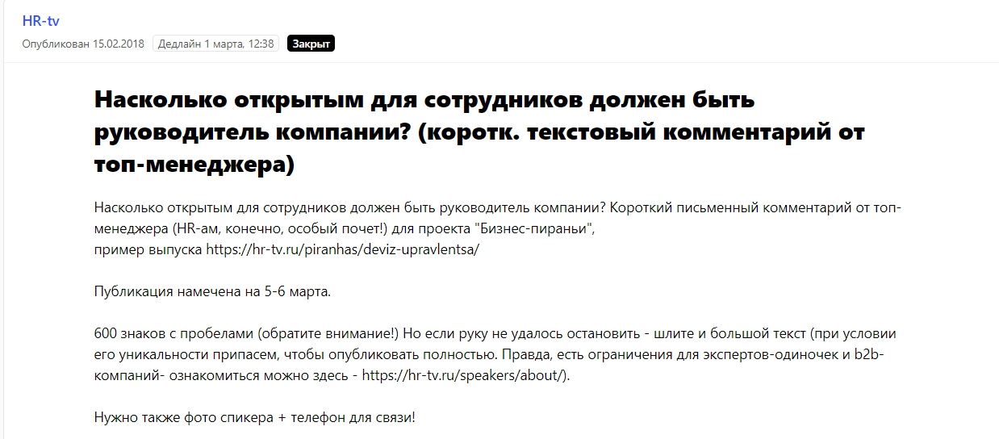
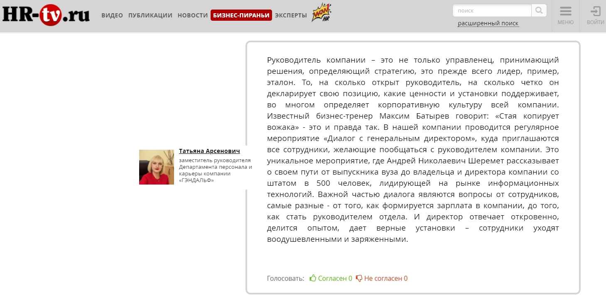

Компания [«ГЭНДАЛЬФ»](https://gendalf.ru/) — одна из крупнейших франчайзи фирмы «1С» в России. Помимо основной деятельности, связанной с внедрением «1С», мы разработали программы «Скан-Архив» и «Скан-Загрузка документов». Поставляем клиентам ПО мировых производителей — Microsoft, «Лаборатории Касперского», Adobe и других. Занимаемся продажей компьютерного, торгового оборудования. И активно участвуем в подготовке специалистов в области «1С». Например, открыли IT-классы в школах Ростовской области и основали кафедру «Технологии автоматизации в бизнесе» в Южном федеральном университете.

«ГЭНДАЛЬФ» — прежде всего, B2B-компания. Но спектр направлений широкий, и наши клиенты относятся к разным целевым аудиториям. В первую очередь работаем с коммерческим и бюджетным организациями: взаимодействуем с учредителями, директорами, бухгалтерами, руководителями IT-отделов. IT-специалисты нередко участвуют в подборе ПО и оборудования, поэтому мы учитываем их сегмент. При технологическом оснащении образовательных учреждений — установке 3D-классов, видеонаблюдения, интерактивных песочниц — нашими клиентами становятся завучи, учителя или воспитатели.

Но и это далеко не все, с кем мы работаем. Физическим лицам предлагаем обучение в в нашем Учебном центре, ПО и оборудование для дома.

Чтобы продвигать продукты на такое количество аудиторий, в «ГЭНДАЛЬФ» создан отдел маркетинга и рекламы, который включает в себя подразделения интернет-проектов, пиара и маркетинга. За каждым маркетологом в отделе закреплены свои направления для рекламного продвижения.

> Но это маркетинг. А вот сотрудникам пиар-подразделения приходится учитывать все целевые аудитории одновременно. Чтобы никого не упустить, необходимо было выстроить систему, работающую как часы.

## Как пиар помогает маркетингу продавать

Влияет ли пиар на продажи? Вечный вопрос, вызывающий споры. Мы уверены, что влияет. Пиар стоит в самом начале воронки продаж. Он «цепляет» целевую аудиторию и создает узнаваемость. Затем формирует убежденность в экспертности, положительную репутацию и доверие. Все это постепенно приводит к покупке продуктов или услуг.

Пиар разогревает клиента, а маркетинг уже подводит к финальному решению купить.

Но бывают продажи и быстрые. К примеру, один агрохолдинг пришел к нам, увидев кейс об автоматизации другого сельскохозяйственного предприятия. Клиент позвонил и сказал: «Я читал вашу статью в журнале “Деловой крестьянин”, хочу, чтобы мне так же наладили процессы». И мы начали работать с ними.

## Публикации в СМИ — лучший метод охватить разные ЦА

Публикации на внешних площадках можно по праву считать главным пиар-инструментом, особенно когда продвижение направлено на несколько целевых аудиторий. Чтобы добиться успеха и научиться договариваться с различными медиа, которые, в свою очередь, пишут для разных представителей вашей ЦА, необходимо определить оптимальную схему и придерживаться ее при взаимодействии со СМИ.

> Стоит отладить процессы — будет гораздо проще выпускать больше материалов на разных площадках и тем самым охватывать бОльшую аудиторию.

Рассказываем о нашей отработанной схеме: как попасть в желаемое издание и получить внимание нужных людей.

**Этап 1. Определить формат текстов**

Выявить, какие форматы текстов, во-первых, лучше всего решают задачи компании, во-вторых, точно интересны той или иной целевой группе.

Например, **кейсы** — популярный формат в IT-сфере. Они лучше всего показывают, как продукты и услуги помогают клиентам решать их проблемы. Мы строим кейсы по стандартному принципу «описание предприятия клиента — проблема — решение — результат — отзыв клиента». Кейс решает задачу «показать, что мы умеем делать», но в то же время кейсы читают IT-специалисты (в том числе высшего уровня), потому что им интересно, как компания справилась с определенной проблемой.

**Интервью или экспертные мнения**, прежде всего, работают на имидж компании или на продвижение конкретных ее представителей. Такие форматы решают задачу «продемонстрировать нашу компетенцию и вызвать доверие». Интервью или комментарии касаются управления бизнесом, аналитики в HR, подбора и развития кадров. Такие материалы читают топ-менеджеры, руководители крупных подразделений.

**Пресс-релизы и новости** используем реже, когда нам нужно рассказать аудитории о каких-то значимых событиях, таких как открытие IT-классов в школах, кафедры в ЮФУ. Они направлены на более широкий круг лиц, в том числе на физических лиц — тех, кто может потенциально захотеть учиться по нашим программам.

Самый сложный формат — **аналитические статьи**. Такие тексты требуют от пиарщиков глубокого анализа сферы и привлечения экспертов из различных организаций. На проработку аналитического материала (от начала сбора информации до публикации) может уйти месяц и более. Эти материалы читают как представители IT-сферы, так и топ-менеджеры, так и бухгалтеры (в зависимости от темы).

\**Этап 2. Решить, кто будет представлять компанию в СМИ

\**Не все специалисты компании должны выступать в медиа. Достаточно выбрать пул экспертов, которые будут говорить за всю компанию. В «ГЭНДАЛЬФ» мы выделили 10 топов, обговорили с ними детали продвижения, составили личное досье на каждого.

_Пример досье_

Досье включает: краткую характеристику эксперта, образование, дополнительные квалификации, список уже вышедших публикаций в СМИ, список мероприятий, на которых он был спикером, и, конечно, темы, на которые он может дать интервью или экспертное мнение. Например, директора освещают в СМИ вопросы экономики страны и региона, стратегического планирования, IT-рынка, развития бизнеса.

Такое досье направляется журналисту или редактору нужной нам площадки.

**Этап 3. Выбрать целевые издания и определить, какие форматы им подходят**

Мы отбираем издания для публикации по двум критериям: процент нашей целевой аудитории среди читателей и общий охват.

Кейсы об использовании наших разработок «Скан-Архив» и «Скан-Загрузка документов» выходят на профильных IT-ресурсах Cnews.ru, Tadviser.ru и CRN. Также для этих изданий мы готовим аналитику и в них размещаем пиар-тексты об автоматизации крупных предприятий на базе «1С».

Методические статьи для бухгалтеров чаще всего публикуем в Klerk.ru, Audit-it.ru и в «Гуру бухгалтерии».

Статьи о школьных проектах обычно публикуем на профильных площадках — Pedsovet.org и «Навигатор образования».

Интервью об управлении бизнесом, экспертные мнения выходят в деловых изданиях — «Коммерсантъ», «Эксперт», а об HR-трендах говорим в отраслевых HR-tv или «HR по-русски».

**Этап 4. Тестировать варианты, как легче выйти на нужное издание**

С одной стороны, принято считать, что к каждому изданию нужен свой подход. Это правда, но на деле вариантов, как познакомиться с хорошей площадкой и договориться о публикации, не так уж и много. Мы считаем, что основных подходов всего четыре.

* Пригласить журналиста/редактора на личную встречу на нейтральной территории, где представитель СМИ рассказывает о своих интересах и предложениях, а мы в свою очередь о наших крупнейших проектах и экспертах. Выявляем, чем можем быть полезны друг другу, и планируем дальнейшие действия.
* Мониторить **сервис журналистских запросов Pressfeed**, отвечать на актуальные запросы, сохранять контакты редакций и продолжать сотрудничество.
* Посещать мероприятия, на которых присутствуют журналисты. Знакомиться, обсуждать перспективы взаимодействия.
* Делать холодную рассылку, если уверены, что инфоповод представляет интерес для изданий.

**Этап 5. Когда наладили связь, договариваться о совместных материалах и действовать в интересах редакции**

По умолчанию у нас нет бюджета на пиар-тексты. Поэтому для нас важно договориться о бесплатном сотрудничестве. Чтобы редактор не перенаправил вас в рекламный отдел, текст с участием компании или от лица компании должен быть действительно полезным и интересным для читателей издания.

Например, мы уже давно дружим с изданием CNews — это известная площадка о высоких технологиях, они пишут об IT-новинках, трендах, интересных проектах. Мы вышли на редакцию напрямую (знакомились лично), обговорили темы, актуальные и для нас, и для них. Теперь издание регулярно публикует и кейсы компании, и аналитические статьи.

Методические статьи для бухгалтеров публикуем в Klerk.ru, Audit-it.ru и в «Гуру бухгалтерии». Мы договорились с этими изданиями, чтобы наши тексты выкладывали с utm-метками, и теперь мы всегда в курсе, сколько читателей приходят из этих источников на сайт компании.

Что касается интервью с топами «ГЭНДАЛЬФ» и экспертных комментариев на тему управления бизнесом, построения команды, то в этом направлении часто помогает [сервис Pressfeed](https://pressfeed.ru/). Это специальная платформа, на которой журналисты оставляют запросы с указанием: какой эксперт требуется для статьи и на какие вопросы необходимо ответить.

Ценность сервиса в том, что на нем работают журналисты из более чем 4 тысяч изданий — от медиагигантов («РБК», «Коммерсантъ», «Ведомости») до камерных бизнес-площадок. Через платформу получится связаться с практически любым сотрудником редакции.

Мы зарегистрировались на Pressfeed несколько лет назад и были в приятном шоке — как это, действительно, больше не обязательно подходить к журналистам на мероприятиях и спрашивать, какие темы их интересуют, или писать письма на общий ящик? Конечно, сервис не решает все задачи, и классические методы общения с редакциями никуда не делись, но с помощью платформы мы наверняка знаем, что нужно конкретному журналисту, в какой конкретный срок. Мы можем охватить площадки, о которых ранее даже не слышали.

Регистрация на Pressfeed бесплатная для всех, но на базовом тарифе действуют ограничения — отвечать можно всего лишь на 3 запроса в месяц. Лучше подключить PRO-аккаунт (цена — около 3,5 тысяч в месяц), и тогда все ограничения будут сняты. Можно будет не только отвечать на десятки запросов от разных изданий, но и видеть запросы раньше остальных (тех пользователей, у которых базовый аккаунт).

Первое масштабное интервью, которые мы дали изданию не из Ростовской области, было сделано как раз через Pressfeed. В 2017 году мы откликнулись на запрос бизнес-журнала «Жажда Бизнеса».

[_Запрос от издания «Жажда Бизнеса»_](https://pressfeed.ru/query/28036)

Усердно готовились, старались создать качественный контент. В итоге материала хватило даже на две полноценных публикации — «[Андрей Шеремет: «Бизнес – это игра, и мне нравится в нее играть»](https://zhazhda.biz/interviews/andrej-sheremet) и[ «Тотальная автоматизация»](https://zhazhda.biz/cases/gendalf). В первой было интервью с генеральным директором, а во второй — больше об истории компании.

  
_Публикация на сайте_

Статьи такого формата работают в большей степени на топ-менеджмент и влияют на решение в пользу «ГЭНДАЛЬФ» при выборе партнера.

Также благодаря Pressfeed Татьяна Арсенович, замруководителя Департамента персонала и карьеры, уже несколько раз становилась экспертом информационного портала HR-tv. Этот сайт полностью посвящен карьере и управлению персоналом.

  
[_Запрос от HR-tv_](https://pressfeed.ru/query/40443)

Например, Татьяна рассказывала о том, каких [навыков не хватает менеджерам по продажам](https://hr-tv.ru/piranhas/kakih-navykov-ne-hvataet-menedzheru-po-prodazham/) или должен ли [руководитель компании быть открытым для сотрудников](https://hr-tv.ru/piranhas/otkrytyi-rukovoditel-kompanii/). Такие материалы нацелены на развитие HR-бренда компании.

  
[_Фрагмент публикации на HR-tv_](https://hr-tv.ru/piranhas/otkrytyi-rukovoditel-kompanii/)

> Каждый день на сервисе «висит» более двух сотен запросов, но, к счастью, там легко делать выборку по тематикам. Можно выбрать «финансы», «право», «управление персоналом», «маркетинг», «инновации», «IT» или «бизнес». И исключить далекие от нас «авто», «фитнес» или «моду». Это экономит время пиарщиков.

Даже с теми изданиями, с которыми мы уже работали напрямую, время от времени проще коммуницировать через Pressfeed. Допустим, одну тему вы предлагаете лично, но тут же видите запрос от площадки на сервисе — и реагируйте на него тоже. Такая работа дает двойной результат. Так Михаил Адигеев, руководитель отдела программных разработок и поддержки «ГЭНДАЛЬФ», стал постоянным экспертом сайта tproger.ru по вопросам программирования. Его комментарии мы высылаем в редакцию и через почту, и через платформу журналистских запросов.