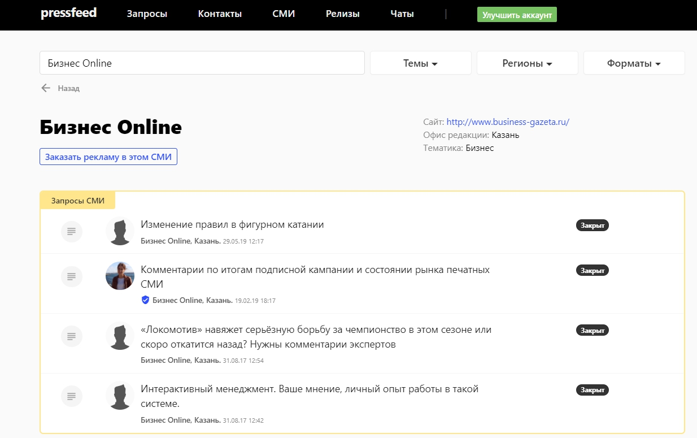
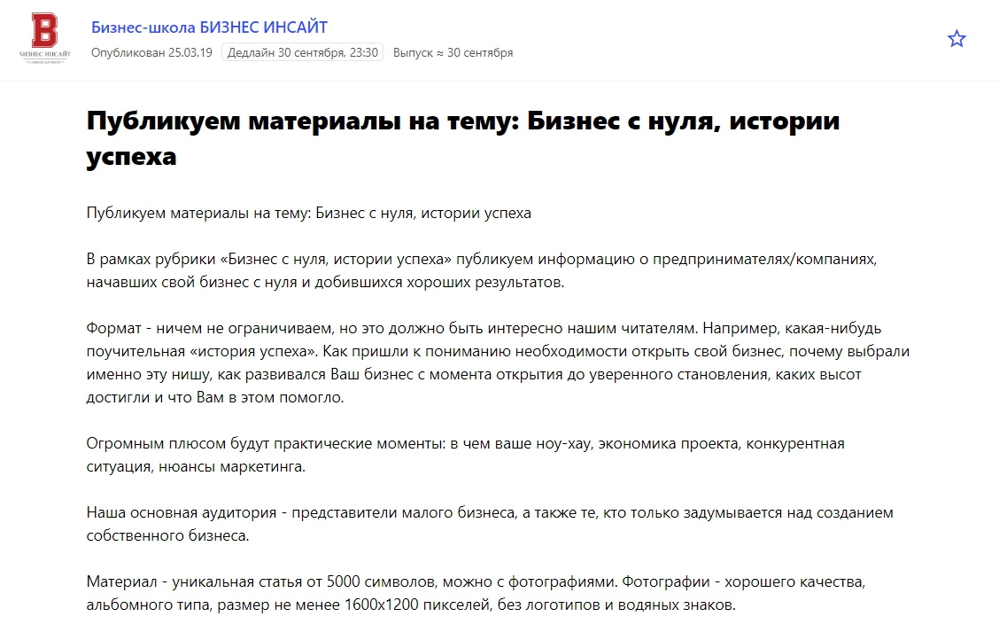
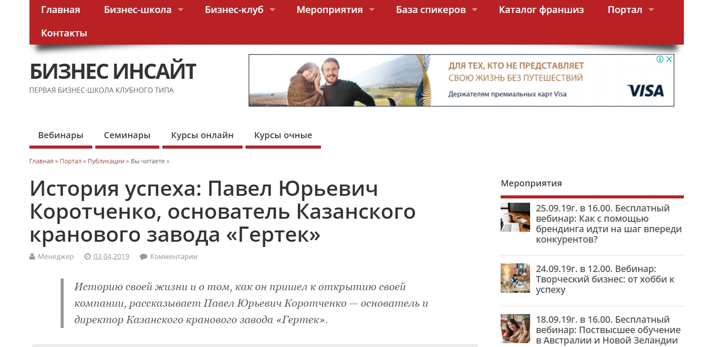
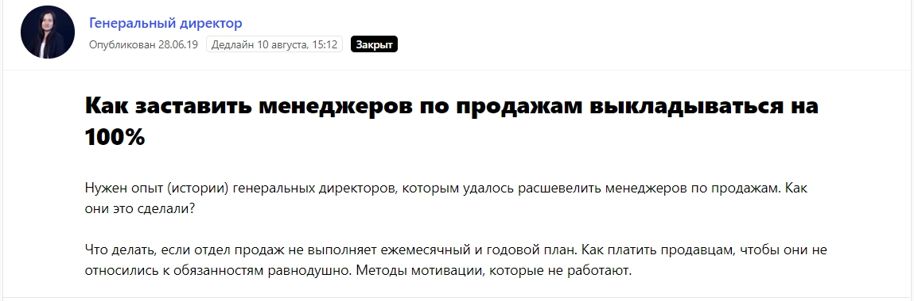
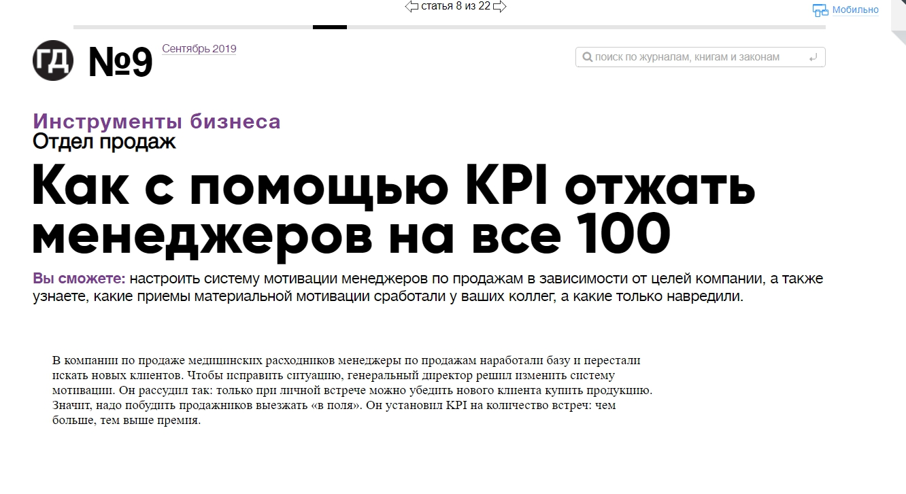

Компания [«Гертек»](https://www.gertek.ru/) является производителем кранового оборудования. Сразу уточню, что это не те многометровые краны, которые строят высотные жилые дома. Наши краны используются на складах, в цехах, на производствах. Клиенты компании — предприятия из сферы металлопроизводства, машиностроения и станкостроения, строительные организации и т. д. Мы делаем сложный b2b-продукт: каждый кран создается по индивидуальному заказу, стоимость одного крана зависит от функциональности и комплектации, а цена может варьироваться от десятков тысяч до нескольких миллионов рублей.

## Почему именно пиар

До ноября 2018 года мы не использовали никакие пиар-инструменты, чтобы продвигать Казанский крановый завод «Гертек». Не делали публикаций в СМИ, не участвовали в каких-либо профильных мероприятиях. Клиенты узнавали о нас через два стандартных канала — контекстная реклама и холодные звонки. Каждый месяц мы закладывали большой бюджет на контекст, плюс в компании отлично работает отдел продаж — менеджеры обзванивают базы потенциальных клиентов и в итоге заключают сделки.

За 7 лет работы (компания была образована в 2012 году) у «Гертек» появились постоянные клиенты. Они знают нас как качественного и ответственного производителя. При этом логично, что «здоровый» бизнес хочет развиваться дальше, расти быстрее, выходить на новые отрасли, на новые рынки. Например, мы видели, что нашего ближайшего конкурента знают лучше, чем нас. Представители целевой аудитории уже слышали о нем, а вот нашим менеджерам приходилось с нуля объяснять — кто мы такие, что производим, в чем преимущества кранов «Гертек».

Плюс к этому стоимость лида в контекстной рекламе постоянно возрастает, и закрывать планы по входящим заявкам только с помощью контекста становилось затратно. Пришло понимание того, для того, чтобы расти, необходимо подключать новые инструменты продвижения.

> Почему ставку сделали именно на пиар-инструменты? Мы хотели, чтобы потенциальные заказчики, которые еще никогда не работали с нами, заранее понимали — с «Гертек» можно сотрудничать, это компания с большим опытом. Нужно было «прогревать» клиентов до того, как с ними свяжется менеджер по продажам. Возникла гипотеза: публикации в СМИ — самый очевидный инструмент, чтобы донести определенную мысль до целевой аудитории, то есть заявить о компании и достигнуть максимального охвата аудитории.

На мой взгляд, в целом, пиар через СМИ решает три основные задачи:

* привлечение внимания к компании,
* формирование репутации (доверия и лояльности),
* повышение узнаваемости.

Если сложить все эти факторы, успешный пиар ведет к достижению основной цели любого бизнеса — получению прибыли. Так с ноября прошлого года мы переориентировались, изменили приоритеты в распределении средств на продвижение и стали вкладываться в пиар.

В целом пиар-продвижение включает много инструментов, но мы пока вкладываем максимум сил в публикации в СМИ. Считаем, что СМИ остаются главным каналом для коммуникации бренда и общественности. Да, соцсети тоже имеют большое значение, но если компания относится к b2b-сфере и ей важно привлекать представителей бизнес-сообщества, то без публикаций в СМИ никак не обойтись.

## Публикации в СМИ как главный пиар-инструмент

Когда мы только начали внедрять пиар-стратегию, в первую очередь нужно было ответить на вопросы: что говорим и куда идем.

**Что говорим?**

Главные темы, на которые рассуждают эксперты компании в публикациях:

1. управление бизнесом, история успеха «Гертек», управление командой, эффективные продажи;
2. технические вопросы, связанные непосредственно с продукцией компании.

**Куда идем?**

Выбор изданий зависит как от тематики, так и от читателей ресурса. Таким образом, про бизнес, продажи, команду пишут деловые издания — их читают предприниматели, топ-менеджеры. Технические подробности раскрывают отраслевые журналы и сайты, посвященные промышленности — такие медиа интересны только узким специалистам.

**Как выйти на деловые издания?**

Так как ранее компания не занималась пиаром, а конкуренты не спали и время уходило, действовать нужно было быстро — то есть как можно скорее начать выпускать статьи в СМИ с участием «Гертек». Мы подключили все свои связи и начали договариваться о публикациях со знакомыми журналистами. Параллельно с этим мониторили запросы на [сервисе журналистских запросов Pressfeed](https://pressfeed.ru/) — это автоматизированная платформа для оперативной связи с более чем 5 тысячами редакций. Регистрация бесплатная для всех, но на базовом тарифе есть ограничения. Но даже на бесплатном доступе можно делать публикации в крупных изданиях, а если функционала будет недостаточно, то всегда можно подключить PRO-аккаунт (цена — около 3,5 тысяч рублей в месяц, в рамках маркетинговых бюджетов — это весьма скромно).

Первая удачная публикация, после которой стало понятно, что пиар — это то, чего нам действительно не хватало, и мы приняли правильное решение, когда запустили все эти пиар-активности, вышла в издании «Бизнес Online». Журналист площадки сделал большое интервью с генеральным директором «Гертек» Павлом Коротченко.

[_Публикация на сайте «Бизнес Online»_](https://www.business-gazeta.ru/article/412898)

Павел Коротченко, генеральный директор компании, рассказал о старте бизнеса, о текущих делах, о пути к успеху. Неожиданно для нас, это интервью вызвало волну положительных отзывов — и это были не только комментарии к публикации.

> Директору начали звонить уже действующие клиенты со словами: «Мы так много интересного узнали о компании». Но самое главное для бизнеса — материал привел одного нового заказчика. Он обратился в компанию, затем приехал на экскурсию на производство и в итоге заказал кран.

Также после выхода интервью мы проследили всплеск посещаемости сайта «Гертек» — рост был примерно в 2 раза, если сравнивать показатели 2018 и 2019 года.

Вот так имиджевая публикация смогла привлечь внимание к компании. Сыграло два фактора — правильное издание + актуальная для целевой аудитории тема. «Бизнес Online» читают те, кто заинтересован в развитии собственного бизнеса и находится в постоянном поиске адекватных подрядчиков.

Дам совет компаниям, которые только начинают свой путь в пиаре, как недавно делали мы: если не получается выйти на хорошее издание напрямую, нет контактов журналистов, почта редакции не отвечает, то попытайтесь достучаться до них через сервис Pressfeed. Отвечайте на их запросы и пишите журналистам через внутренний чат платформы. Например, те же «Бизнес Online» работают на Pressfeed.

[_Аккаунт «Бизнес Online» на сервисе_](https://pressfeed.ru/smi/1045)

> Всего же на сервисе зарегистрировано 8 тыс. журналистов. Более того, вы сразу знаете, какие эксперты, темы, комментарии требуются тому или иному изданию. Они сами сообщают об этом в запросах, а компании необходимо лишь грамотно ответить на запрос. Если у эксперта есть уникальный опыт или интересное мнение по конкретному вопросу, то его комментарий появится в материале.

Кроме того, часто редакции ищут через сервис экспертов, которые готовы написать полноценный текст от своего имени. Так мы познакомились с бизнес-школой «Бизнес Инсайт» — школа ведет собственный блог, это фактически небольшое деловое издание.

[_Запрос от «Бизнес Инсайт»_](https://pressfeed.ru/query/53823)

На данный момент выпустили 2 совместных текста: первый был посвящен истории успеха «Гертек», а второй — формированию отдела продаж в компании.

  
[_История успеха «Гертек» в бизнес-блоге_](https://bi-school.ru/istoriya-uspeha-pavel-korotchenko-gertek/)

Также с помощью Pressfeed мы вышли на издание «Генеральный директор» и вновь рассказали им об отделе продаж.

  
[_Запрос от издания «Генеральный директор»_](https://pressfeed.ru/query/57306)

Журналисты готовы рассказывать о нашем опыте, потому что продажи выстроены неклассическим способом. Распространенная ситуация, когда менеджер и продает, и заключает сделку, и дальше сам ведет клиента. В «Гертек» продажи строго разделены по конвейерному типу: менеджер работает в команде с несколькими ассистент-менеджерами. Ведущий менеджер отвечает только за продажу: он не ищет контакты сам и не отвечает за работу с клиентом после заключения сделки. Такой подход показывает более высокую эффективность, так как менеджер не отвлекается на «канцелярские» дела.

  
[_Публикация в журнале «Генеральный директор»_](https://e.gd.ru/753723)

Работа с деловыми СМИ является первостепенной — скоро выйдет большая статья в журнале «Коммерческий директор», мы регулярно даем комментарии для площадки «Реальное время». Чем больше вы сотрудничайте с каким-то изданием, тем чаще его редакция готова брать ваши тексты, потому что они знают, что вы можете предоставить хороший комментарий или написать полезную статью в указанные сроки. Это касается и работы напрямую, и через Pressfeed.

Все публикации на бизнес-площадках выходят на безбюджетной основе — пользоваться Pressfeed можно бесплатно (хотя мы думаем о подключении PRO-аккаунта), знакомые журналисты также принимают тексты безвозмездно, ведь это качественный контент для их издания. Получается, что единственная затрата в данном случае — время специалиста на подготовку материала.

## Эффективность пиара: результаты за год работы

Наша практика показала, что статьи в СМИ могут приводить новых клиентов напрямую. Однако не стоит воспринимать это как правило, лучше радоваться этому как удачному стечению обстоятельств. В b2b-сфере цикл сделки может доходить до полугода, так что история «прочитал — купил» — не совсем про нас. Потенциальный клиент, прежде всего, смотрит на имидж компании, на репутацию на рынке. Публикации в СМИ формируют репутацию, доверие со стороны клиента.

> Если контекстная реклама собирает лиды, то пиар «прогревает» эти заявки и влияет на окончательное решение заказать продукцию в «Гертек».

Что касается роста узнаваемости, то измерить ее полностью прозрачными метриками затруднительно, но существует много косвенных метрик, одна из главных — рост брендовых запросов по компании.

> Например, в феврале 2018 года, когда мы не подключали пиар-инструменты, по компании было всего 44 брендовых запроса, а через год уже — 95 запросов. Не удивляйтесь небольшим цифрам: наша сфера бизнеса не подразумевает, что крановый завод будут искать миллионы человек в месяц.

Важно, что потенциальные клиенты узнают о нас извне до того, как в дело включится менеджер по продажам. Как минимум, мы облегчаем работу менеджерам — им уже не приходится в подробностях объяснять всем, что такое «Гертек».

## Рост бизнеса на фоне сокращения бюджета на маркетинг

В 2019 году компания пересмотрела свои расходы на маркетинг: теперь на контекстную рекламу уходит меньше средств, а часть вложений перешла на развитие SEO-сайта и пиар-деятельность. При этом по сравнению с 2018 годом общий бюджет на продвижение сократился, но это никак не отразилось на доходах бизнеса, наоборот, ситуация изменилась в лучшую сторону.

За первое полугодие 2019 года компания уже перевыполнила план 2018 года. В прошлом году общая выручка составила 239 млн рублей, а сейчас в планах — довести ежемесячную выручку до 84 млн рублей. И как показывает динамика, это вполне реально. Конечно, на рост выручки влияет комплекс факторов. Нельзя видеть в этом только заслугу пиара или заслугу опытных менеджеров. Роль играет все. В случае с «Гертек» пришло понимание, что контекстная реклама, которая дорожает с каждым годом, и холодные звонки, которые с течением времени становятся менее актуальными, не могут обеспечить нам того уровня развития и прибыли, которых бы хотелось достичь.

Мы стали использовать новые инструменты и увидели результат.