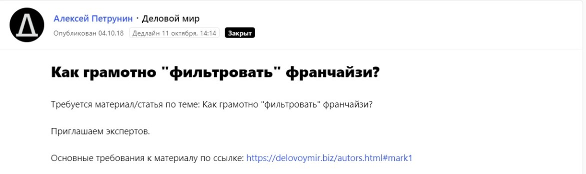
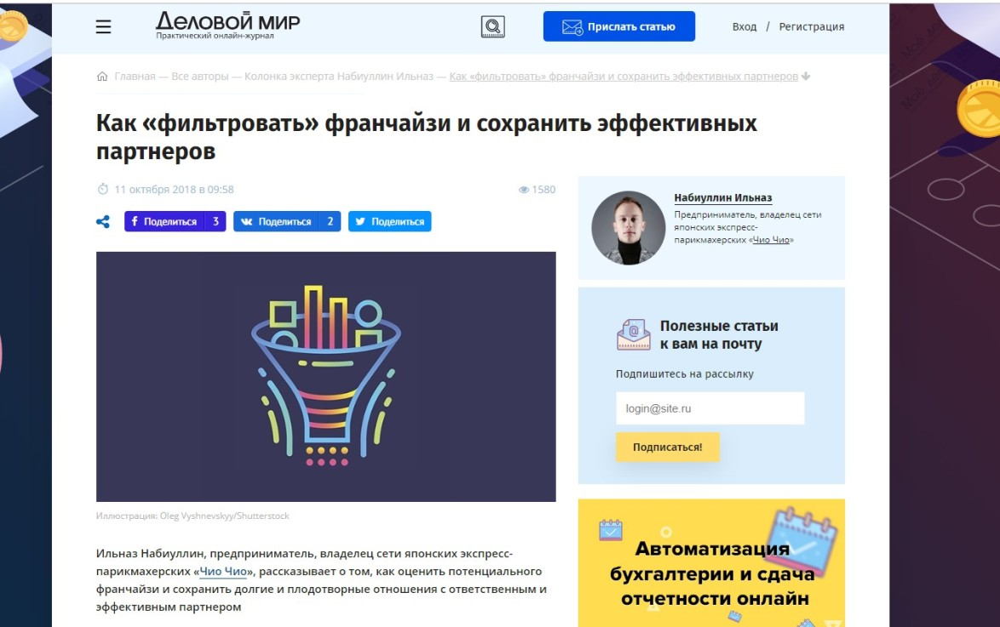
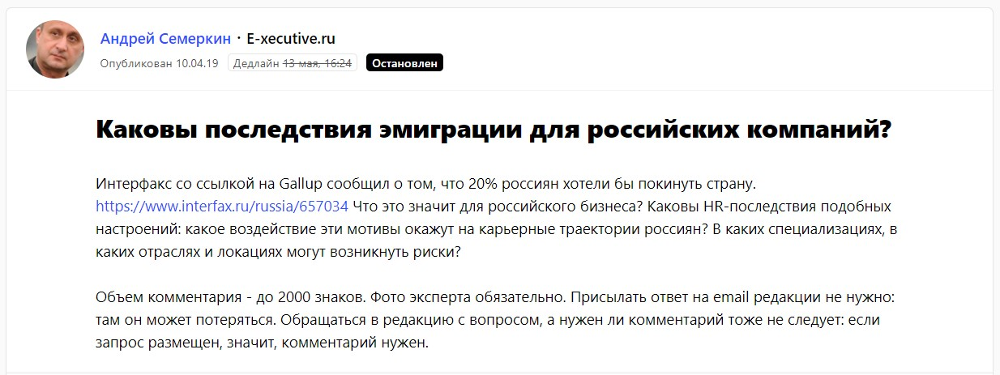
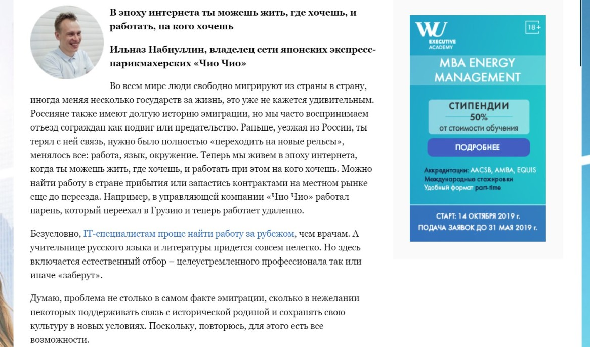
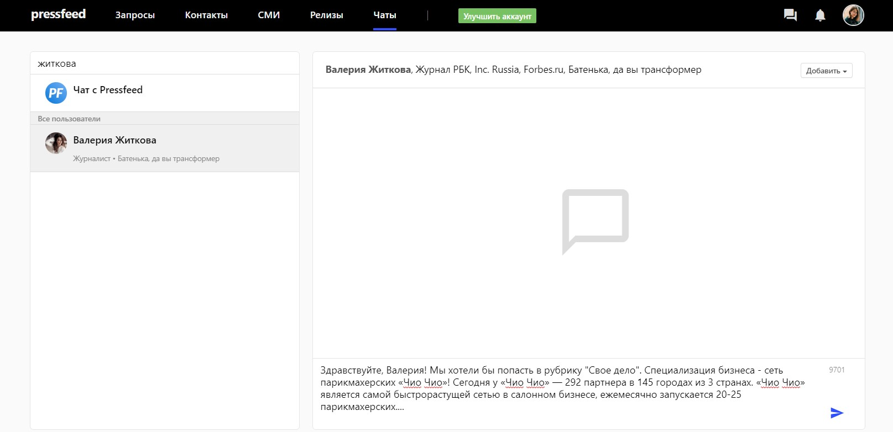
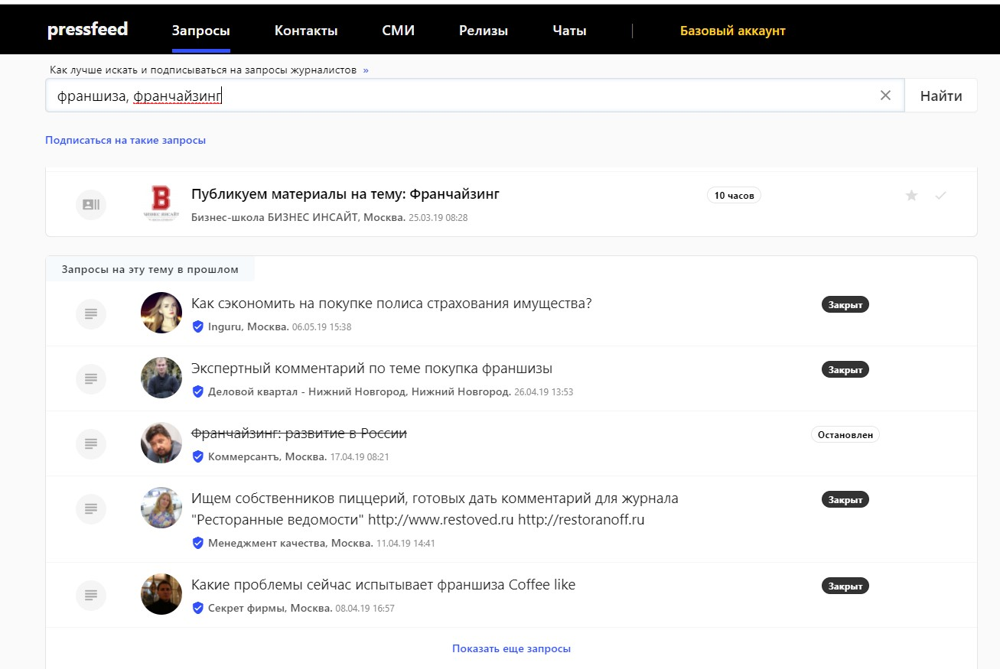
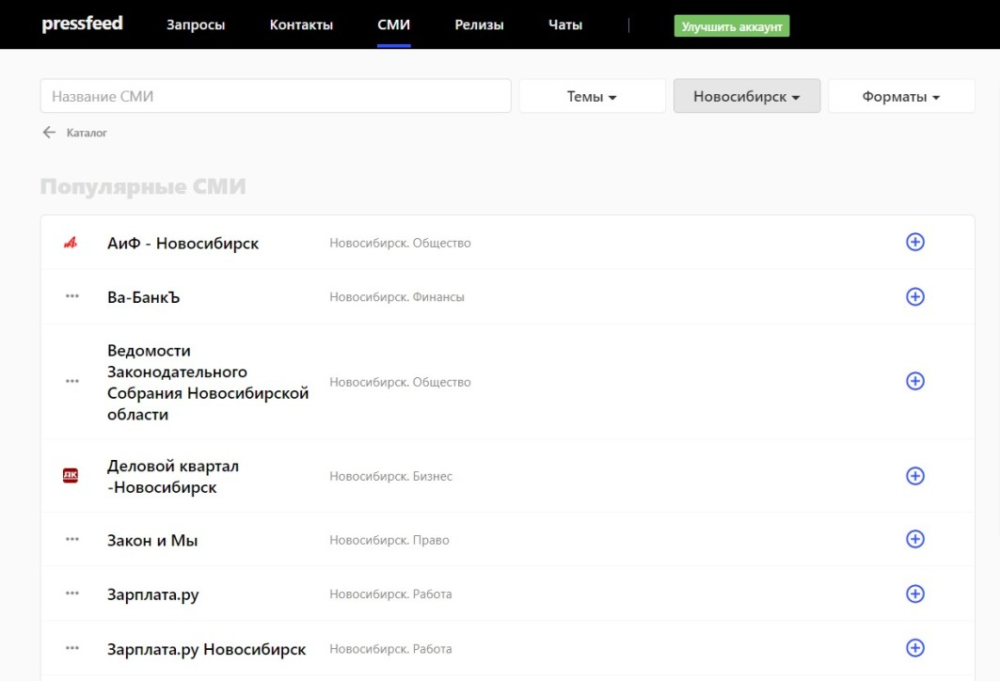
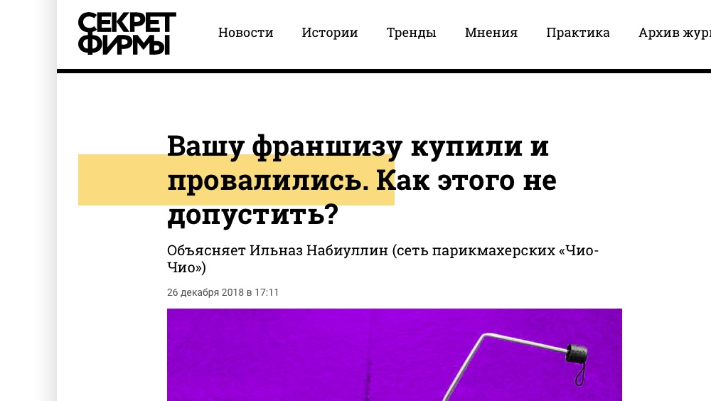
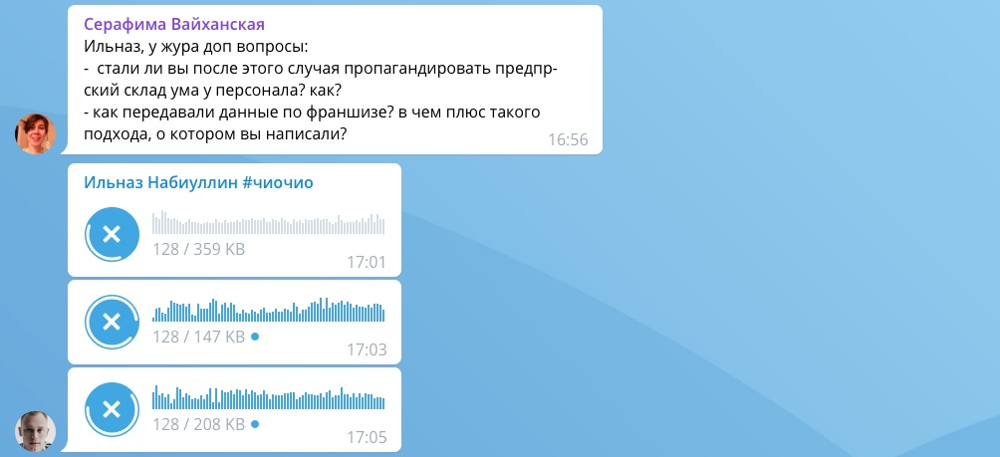

Мы, [контент-бюро «Хорошая история»](http://www.gstory.ru/), пишем простые тексты для сложных бизнесов. В начале 2018 года к нам обратился Ильназ Набиуллин, опытный франчайзер, его основной проект на данный момент — сеть японских экспресс-парикмахерских «Чио Чио». Клиент поставил перед нами задачу — трансформировать его репутацию с помощью контент-маркетинга, то есть публикаций в крупных российских СМИ.

Трансформировать, значит превратить заказчика из регионального предпринимателя в узнаваемого бизнес-эксперта федерального уровня.

## Зачем клиенту стало нужно продвижение в СМИ

Прежде всего, потому что Ильназ Набиуллин занимается федеральным бизнесом. Логично, что он заинтересован в том, чтобы привлекать покупателей франшизы со всей России (и зарубежных стран). Недостаточно быть известным только в своем регионе (для Ильназа — это Татарстан), чтобы продавать франшизы парикмахерских и во Владивостоке, и в Калининграде. Необходимо, чтобы о тебе знали все, кто входит в целевую аудиторию. Несмотря на то, что в управляющей компании «Чио Чио» отлично функционируют отдел продаж и рекламный отдел (были подключены таргетинг, соцсети, контекст и другие маркетинговые инструменты), публикации в СМИ должны работать не на прямое привлечение лидов, а на формирование доверия и репутации к бренду и его владельцу.

Представьте ситуацию, что предприниматель собирается купить франшизу. Обратил внимание на «Чио Чио» (например, увидел таргетированную рекламу в соцсети), зацепился, пошел изучать сайт компании, условия, доходность. Все понравилось. Однако приобретение франшизы — это не поход в супермаркет. Нужно взвесить все плюсы и минусы, узнать все. В том числе и о конкретном человеке, который эти франшизы продает. Правда ли, что он эксперт в данном бизнесе, какой у него опыт, философия, мысли и т. д. Начинает гуглить информацию об Ильназе Набиуллине. Находит статьи о нем в крупных изданиях, таких как «Генеральный директор» и «Секрет фирмы». Понимает, что это известный опытный бизнесмен, который честно рассказывает о своем деле.

Может быть и наоборот. Сначала наткнулся на статью об Ильназе и «Чио Чио» на хорошей медиаплощадке, поверил в качество бренда, а затем уже пошел на официальный сайт франшизы читать об условиях.

> На самом деле, публикации в СМИ влияют не только на решение потенциальных покупателей, но и облегчают взаимодействие с партнерами (владельцами площадей, поставщиками и другими). Они автоматически вызывают доверие и уважение к компании со всех сторон.

Кстати, была еще одна причина, почему Ильназ хотел писать статьи для СМИ. Он занимается предпринимательством с 16 лет, в 2014 году он открыл первый магазин мужской бижутерии Gentlz, в 2015 году — сеть магазинов женских украшений и аксессуаров эконом-класса Zifa. У него, действительно, большой опыт и много интересных историй. Ему есть о чем рассказывать, чтобы быть полезным для бизнес-сообщества.

Поэтому мы в середине 2018 года перед контент-бюро «Хорошая история» была поставлена задача — писать и выпускать как можно больше экспертных текстов с участием Ильназа Набиуллина. В итоге в спокойном режиме мы делали примерно 10 текстов в месяц.

## Какие метрики эффективности взяли за основу

Просто считать количество вышедших публикаций с участием клиента — это устаревшая и неработающая метрика. Она не может объективно оценить работу агентства, так как статья в Forbes и статья на маленьком региональном сайте — не одного поля ягоды.

После долгих обсуждений и поисков мы совместно с Ильназом пришли к решению использовать метрику Perfectness Rate — коэффициент приближения публикации к идеалу. Рассчитывается для каждой публикации. За основу берется ряд критериев, которые нужно определить с заказчиком еще до запуска «фабрики контента».

Критерии идеальной публикации следующие:

* насколько целевая аудитория издания пересекается с ЦА клиента и его бизнеса: заранее определили площадки, в которые хотим попасть, в основном это были бизнес-медиа;
* с какой тональностью написана новость / статья — с позитивной или нейтральной;
* используется ли в заголовке имя Ильназа Набиуллина;
* упоминается ли «Чио Чио» в лиде;
* перечислены ли все преимущества бизнеса;
* перечислены ли все преимущества продукта;
* насколько удачно переданы ключевые сообщения: мы выделили несколько сообщений, которые мы собирались транслировать в бизнес-сообщество.

При помощи метрики Perfectness Rate, с одной стороны, легко выяснить, насколько каждый текст соответствует тем задачам, которые стояли перед агентством. С другой стороны, не всегда получается играть в историю с чем-то идеальным. Например, упоминание персоны в заголовке. Журналисты СМИ не любят ставить имя эксперта в заголовке, они, скорее, заменят его на что-то вроде «бизнесмен из Татарстана», «молодой предприниматель».

> Если объяснять простыми словами, то коэффициент Perfectness Rate показывает, насколько публикация была заметной для целевой аудитории, смогли ли она привлечь внимание читателя к персоне и бренду, какова вероятность, что читатель запомнит основные ключевые сообщения, скрытые в тексте.

## Как выстраивали контент-стратегию

Под контент-маркетингом в данном случае мы подразумевали только некоммерческие статьи в медиа, то есть бесплатные. Клиента не интересовали спецпроекты или нативная реклама в СМИ.

**Что делали:**

* подключили сервис журналистских запросов Pressfeed;
* договаривались о публикациях с журналистами целевых изданий напрямую, писали в редакции, искали точки соприкосновения;
* публиковали тексты на площадках с UGC-контентом (например, vc.ru).

## Сервис Pressfeed: как он помогает пиарщикам бесплатно получать тексты в медиа

[Сервис журналистских запросов Pressfeed](https://pressfeed.ru/) был создан для того, чтобы облегчить жизнь пиарщиков и журналистов. С его помощью можно получить статьи в СМИ, не проходя через утомительные переговоры с редакциями. Здесь все наоборот: журналисты сами просят желающих экспертов написать текст или комментарий для их издания.

Как это происходит: сотрудник издания публикует на платформе запрос. Пиарщик компании, зарегистрированный на сервисе, видит этот запрос и отвечает на него, если он подходит по тематике. Можно пользоваться бесплатным базовым аккаунтом, можно подключить платный — в нем больше удобных возможностей. Например, при подключении аккаунта «Эксперт» можно отвечать на неограниченное количество запросов, рассылать пресс-релизы, формировать подписку по ключевым словам и видеть запросы раньше тех, кто использует бесплатный аккаунт.

Например, мы реагировали на запрос от бизнес-ресурса «Деловой мир». Тематика была наша на 100%.

[_Запрос от «Делового мира»_](https://pressfeed.ru/query/48283)

Написали статью, которая соотносилась со всеми требованиями редакции. В итоге получили публикацию с хорошим показателем Perfectness Rate в федеральном онлайн-журнале.

  
[_Публикация в «Деловом мире»_](https://delovoymir.biz/kak-filtrovat-franchayzi.html)

Или же в другой раз организовали не статью, а большой комментарий от имени Ильназа на площадке E-xecutive. Редакция спрашивала, чем грозит эмиграция граждан для российского бизнеса.

  
[_Запрос на E-xecutive_](https://pressfeed.ru/query/54485)

Ильназ Набиуллин высказал свою точку зрения по теме, в итоге комментарий появился в материале. Текст прочитали более 7,5 тысяч посетителей сайта.

  
[_Фрагмент публикации_](https://www.e-xecutive.ru/career/planirovanie-karery/1990566-bilet-v-odin-konets-pochemu-karernaya-traektoriya-vedet-za-granitsu?preview=true) _в E-xecutive_

Честно говоря, у Pressfeed больше преимуществ, чем кажется на первый взгляд. Особенно для тех, кто только начинает общаться со СМИ, только учится этому тонкому искусству.

Если использовать сервис регулярно, то он превращается в отличный инструмент для:

1. обучения навыкам коммуникаций: на сервисе можно завести знакомство сразу с десятками журналистов и смотреть, как они реагируют на сообщения, что отвечают, какие вопросы задают и т. д., для этого существуют чаты;

_Пример чата с журналистом_

2. изучения конкретной отрасли: нам как агентству приходится постоянно разбираться в новых областях, а Pressfeed дает посмотреть типы запросов по разным темам, помогает быстро «въехать» в происходящее в отрасли в целом и интересы журналистов в определенной нише в частности.

Например, давайте посмотрим, что журналисты спрашивают о франшизах и франчайзинге:

  
_Пример поиска запросов_

3. формирования баз СМИ: там можно легко найти любые издания по отраслям и регионам. Например, мы хотим обновить нашу базу СМИ по Новосибирску. Заходим в [раздел «СМИ»](https://pressfeed.ru/smi-catalog), выбираем нужный город — перед вами список изданий этого города.

  
_База СМИ Новосибирска_

## Работа со СМИ напрямую: как это происходит

Начнем с некоторого подобия «свода правил», которого нужно придерживаться, если вы хотите публиковаться в СМИ бесплатно. Эти советы мы не выдумали, они основаны на горьком и сладком опыте, примерно на тысяче обращений в редакции и тонне переписок с журналистами.

Эти правила работают и при прямом обращении в редакции, и если вы хотите познакомиться с журналистом через Pressfeed.

* Нужно заранее хорошо изучить площадку. Прочитать не только ту рубрику, в которую вы планируете попасть, но и все остальные.
* Попасть бесплатно в СМИ — большое одолжение. Никто не будет делать за вас вашу работу. Не отправляйте редактору черновик или сборник идей, готовьте сразу «финальный» материал.
* Отправляйте материал редактору (журналисту) нужной рубрики — не стоит писать главреду, если на сайте указан ответственный за конкретное направление.
* Когда придет обратная связь, адекватно воспринимайте критику, оперативно вносите правки и, в случае отказа, будьте готовы пробовать снова.
* Если изданию нравится текст, все происходит довольно быстро, и в течение недели-двух материал встанет на сайт. Но ваш текст могут опубликовать под другим заголовком или убрать из него то, что вам кажется особенно ценным. Это нормально, просто будьте к этому готовы.
* Будьте адекватным в коммуникации. Если вам отказали, это повод поблагодарить за ответ и пойти работать дальше.

Примерно по такой схеме мы выпустили публикации в изданиях «Секрет фирмы», «Про бизнес», «Генеральный директор» и других.

Например, для «Секрета фирмы» Ильназ Набиуллин рассказал, как не допустить провала бизнеса, работающего по франшизе.

  
[_Публикация в «Секрете фирмы»_](https://secretmag.ru/opinions/vashu-franshizu-kupili-i-provalilis-kak-etogo-ne-dopustit.htm)

Над каждым текстом (неважно делаем мы напрямую или через Pressfeed) мы работаем втроем — автор, редактор и пиарщик. Поначалу у нас был час в неделю на общение с Ильназом, из которых рождались по 2−3 статьи. Позже мы заменили интервью на аудиозаписи. Чтобы сэкономить время, просили Ильназа записать аудиоответ и формировали текст.

_Так происходит общение с заказчиком_

Хотя все статьи писали специалисты агентства, нам важно было сохранить, как это сейчас модно говорить, tone of voice Ильназа.

  
_Каждая фраза играет роль_

## Как контент-маркетинг влияет на развитие бизнеса

За период с сентября 2018 по июнь 2019 года мы написали 108 текстов. Главное, что они все были выпущены бесплатно. Примерно ⅔ материалов мы инициировали своими силами и через прямые договоренности, а с ⅓ публикаций помогал сервис Pressfeed.

Вопрос, который волнует всех: как публикации в СМИ влияют на рост бизнеса, как измерить уровень узнаваемости и популярности компании.

Эффективность публикаций можно оценивать статистически: проводить опросы фокус-групп. Смотреть, «проросли» ли ключевые сообщения. Только сразу отметим, что одна публикация ничего не дает, и нужно измерять эффект только после долгой и усердной работы со СМИ. Тогда мы получим более или менее реальные результаты.

> Есть метод косвенный, но в целом он покажет «работает или не работает». Если мы провели конкретную PR-кампанию, либо после определенного количества времени (полгода, год и т.д.) к заказчику начинают приходить потенциальные франчайзи и говорят: «Мы хотим купить франшизу у вас, потому что она крутая, и вы тоже, мы читали в СМИ», то вы все делаете правильно. Аналогичная ситуация с инвесторами, партнерами и даже органами государственной власти. Все читают крупные медиа, и чем больше текстов появляется, тем скорее вас «запомнят» в хорошем смысле.

По словам самого Ильназа Набиуллина эффект виден как минимум в том, что незнакомые ему лично люди знают о компании из публикаций в СМИ и говорят ему об этом. Сегодня у «Чио Чио» — 292 партнера в 145 городах из 3 странах. «Чио Чио» является самой быстрорастущей сетью в салонном бизнесе, ежемесячно запускается 20-25 парикмахерских. Это тоже некий показатель успеха. Разумеется, на такие результаты влияет слаженная работа большой команды — от руководителя и управляющей компании до всех подрядчиков бизнеса. В том числе и контент-бюро «Хорошая история».
