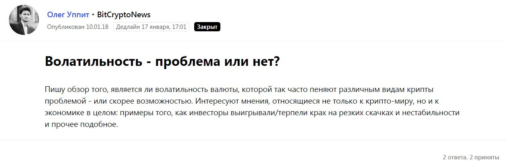
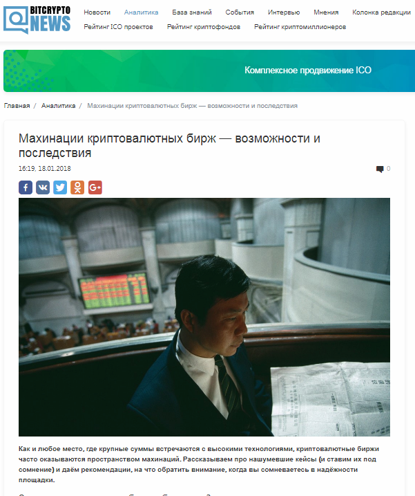
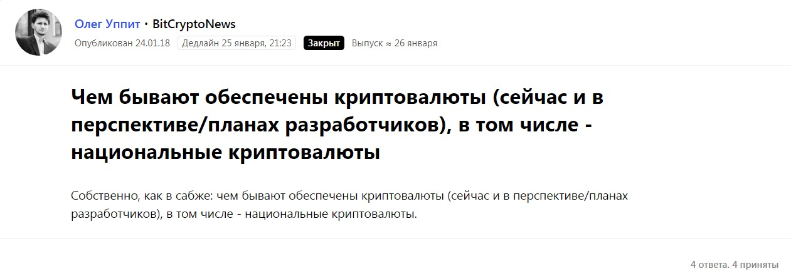

## Если нужна альтернатива

Несколько лет подряд я много писал о блокчейне, в частности криптовалютах, о различных сферах цифровой экономики и ИТ. Я всегда старался общаться и в рамках профессии, и за ее пределами с экспертами этих отраслей. Это позволяло находиться в курсе всех изменений в этих сферах и ориентироваться в новых трендах и исследованиях.

Поэтому подготовка текстов, касающихся того же блокчейна, давалась мне легко. Зачастую даже не было необходимости обращаться к экспертным мнениям, достаточно было изучить аналитику и обзоры по своей тематике. В случае же, когда все-таки помощь эксперта была необходима или формат текста предполагал наличие мнения спикера, я мог просто «расшарить» свой вопрос в социальных сетях или напрямую там написать любому эксперту — почти всех я знал лично.

Сервис журналистских запросов Pressfeed мне понадобился лишь год назад, когда я хотел получить больше альтернативных мнений в вопросе про волатильность для подготовки текста для bitcryptonews.ru. У меня были свои эксперты по этому вопросу, но я решил, что мне нужны в тексте новые имена и мнения. Правда, сначала большую ставку на сервис не делал, но быстро понял — это работает.

[Запрос на Pressfeed](https://pressfeed.ru/query/39090)

Ответы поступили на почтовый адрес и личный кабинет на сервисе уже через пару часов. И почти все из них я смог использовать в своей работе.

[Публикация](https://bitcryptonews.ru/analytics/kriptovalyutnyij-puzyir) на bitcryptonews

С тех пор периодически я стал оставлять запросы на Pressfeed. Только за один месяц сервис мне помог подготовить три лонгрида для bitcryptonews.ru.

[Запрос на Pressfeed](https://pressfeed.ru/query/39613)

Поскольку тогда я работал сразу на несколько изданий, то, естественно, обращался за помощью в поиске экспертов и для них. Я понял, по ряду вопросов бесполезно «стучаться» в какие-либо компании, ответ можно ждать неделями, если PR-служба не настроена на оперативную реакцию. На Pressfeed же эксперты порой заинтересованы в журналисте больше, чем он в них.

> Особенно четко я это понял после запроса, оставленного на сервисе о проблемах франшизы Coffee Like. Я не мог добиться ни одного комментария от компании. Но как только разместил запрос на Pressfeed, тут же с удивлением увидел, что ко мне «стучится» сам директор сети.

Он был заинтересован в том, чтобы я узнал все о франшизе из первых рук. И это несмотря на то, что мой запрос был сформулирован довольно резко. Правда, пока этот текст не вышел — идет постредактура.

## Колумнисты идут сами

Сейчас я занимаю должность редактора портала онлайн-университета [Skillbox](https://skillbox.ru/), занимающегося обучением digital-профессиям. Удивительно, но Pressfeed особенно помогает нам в поиске фактуры и экспертов. В основном наши тексты — это экспертные колонки. При этом найти хороших колумнистов по маркетингу или программированию самостоятельно практически нереально. А вот запросы на Pressfeed мониторят помощники и пиарщики, которые сразу понимают, готов ли их автор говорить или писать на заданную тему.