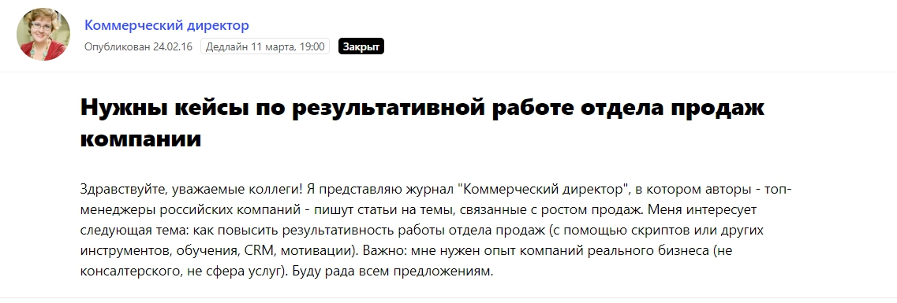
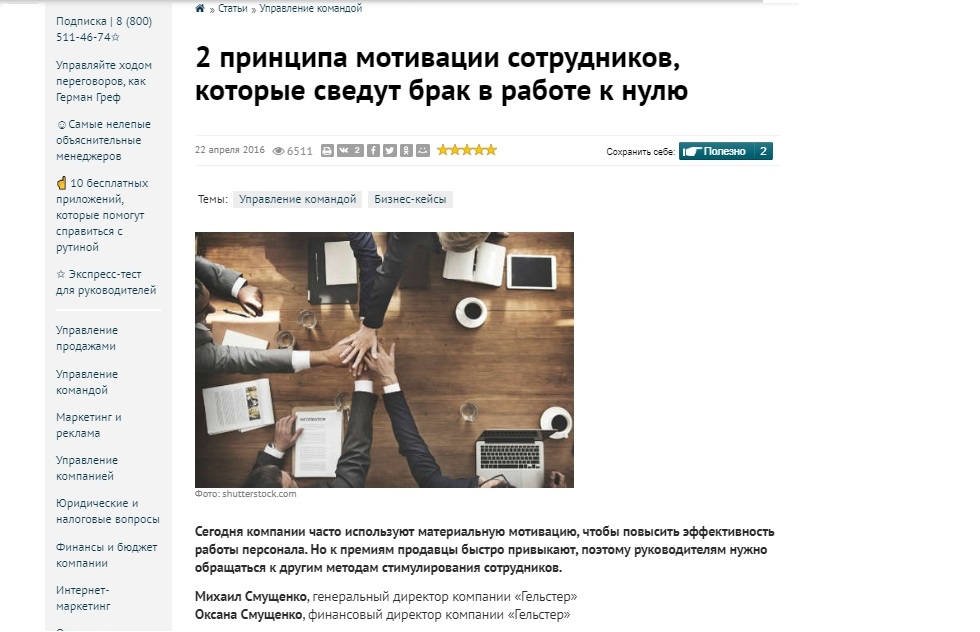
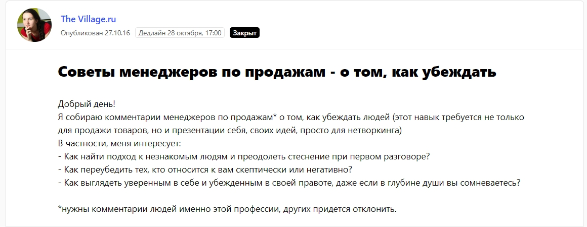
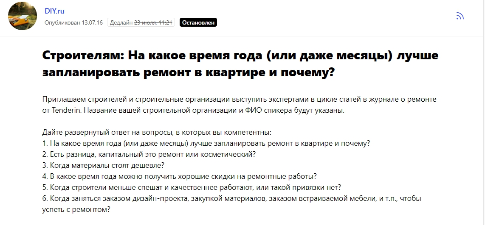
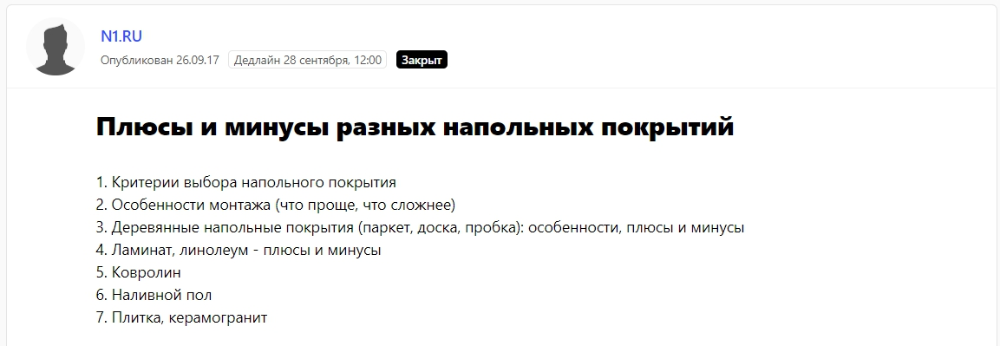
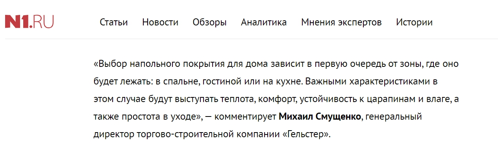
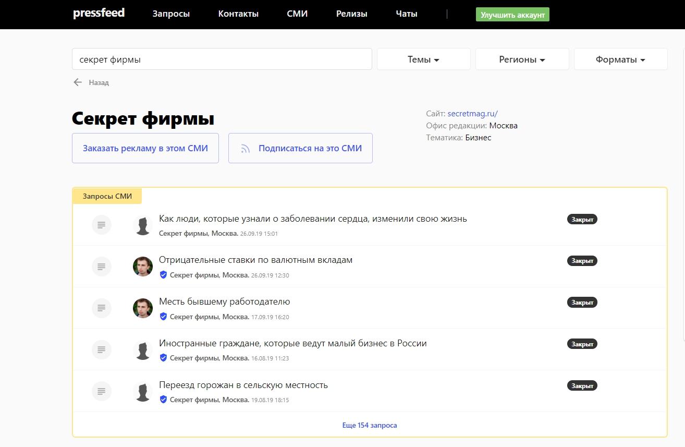
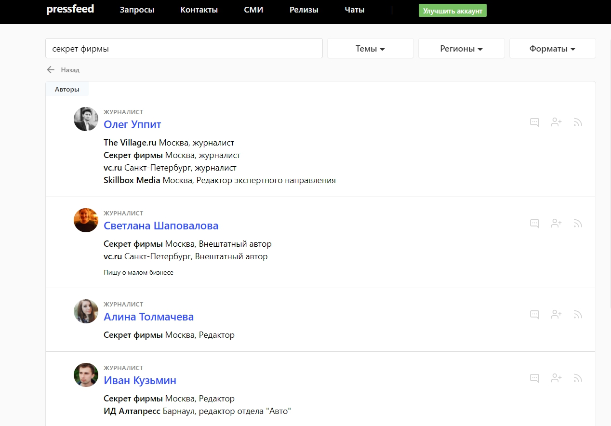

Кратко о нашем бизнесе: более 12 лет назад мы открыли торгово-строительную компанию «Гельстер» и с тех пор занимаемся продажей и укладкой напольных покрытий. География поставок — вся Россия и страны СНГ. В основном работаем в b2b-сегменте, примерно 90% клиентов — юридические лица. Это строительные подрядные организации, архитектурные бюро и дизайн-студии, а также сетевые клиенты, с которыми мы сотрудничаем регулярно, — фитнес-клубы, языковые школы, медицинские центры. Остальные 10% — это частные заказчики, физлица, которые покупают напольные покрытия для дома.

## Какие инструменты используем для продвижения сегодня

Всю работу в компании, которая касается маркетинга, можно разделить на несколько направлений.

**Во-первых,** это SEO-продвижение. В нашей отрасли высокая конкуренция, и при этом один и тот же товар могут продавать несколько компаний. Поэтому особенно важно, чтобы в поисковых системах наши сайты стояли выше, чем сайты конкурентов.

**Во-вторых,** это стандартная интернет-реклама: используем как контекстную рекламу, так и рекламу в социальных сетях. Контекст включаем, когда не можем пробиться на первую страницу поисковика по конкретной товарной позиции.

**В-третьих,** контент-маркетинг. Под контентом мы имеем в виду работу со СМИ и публикацию статей в блоге и рассылке «Гельстер». Некоторые владельцы компаний не придают значение этому инструменту и считают, что достаточно будет двух первых каналов для привлечения клиентов — SEO и контекст. Однако это неправильно, особенно в таких конкурентных отраслях, как строительные и отделочные материалы.

> Полезные тексты и регулярное «мелькание» экспертов компании в медиа влияет на развитие бизнеса, рост продаж и узнаваемость бренда. Это способ «греть» клиентов еще до того, как те оконачательно решатся на покупку. В b2b-сфере от момента заявки до заключения сделки иногда проходит от 6 месяцев до нескольких лет. За это время вы должны удержать внимание клиента и убедить его, что работать с вами — правильное решение. Забегая вперед скажем, что в первый год, когда мы стали заниматься контентом, объемы продаж увеличились на 85%.

## Зачем мы вкладываем силы в контент

Прежде всего, любой контент, как в СМИ, так и в блоге, преследует одну главную цель — продемонстрировать экспертность компании и, если говорить простыми словами, ее подход к делу. В случае малого и среднего бизнеса работа над контентом позволяет выделиться, отстроиться от конкурентов. Плюс к этому, в сегменте b2b-продаж, где результат сделки часто зависит от межличностных отношений с заказчиком, публикации в прессе/блоге играют роль «первого касания», заочного знакомства с компанией. О нас узнают раньше, чем менеджер по продажам начинает работать с потенциальным клиентом.

Мы стали активно работать с контентом в начале 2016 года. На тот момент у нас не было проблем с репутацией в профессиональных кругах, но вот узнаваемость на рынке оставляла желать лучшего. То есть те, с кем мы уже работали, воспринимали нас как качественных ответственных поставщиков и подрядчиков, а вот те, на кого мы хотели выйти впервые, просто никогда не слышали о нас.

Тогда мы взяли в штат взяли PR-специалиста, который должен был договариваться о публикациях в СМИ с журналистами и писать тексты в блог компании. Изначально все наши траты на пиар сводились к зарплате этого специалиста, но в дальнейшем отдел расширился, например, пришел дизайнер.

> Уже в течение первого года после внедрения инструментов контент-маркетинга мы заметили изменения в узнаваемости, которые в дальнейшем повлияли на итоговые доходы бизнеса.

## Публикации на внешних площадках: с чего начать, как попасть в нужное издание

В публикациях на внешних площадках мы делаем большую ставку на темы, связанные с организацией бизнеса и внутренними процессами компании.

> Работаем в первую очередь с деловыми СМИ — особое внимание уделяем профильным изданиям для генеральных и коммерческих директоров, владельцев бизнеса. Именно эти люди чаще всего принимают окончательное решение о закупке строительных материалов и сотрудничестве с тем или иным контрагентом.

Бизнес-издания (и их читателей) интересует наш личный опыт: как мотивируем сотрудников повышать свою квалификацию, как организуем обучение персонала в нашей компании, как работаем над лояльностью клиентов и какими принципами руководствуемся в бизнесе.

Чтобы договориться с нужными СМИ о публикации, используем два проверенных пиар-метода, мы с самого начала сделали ставку на [сервис журналистских запросов Pressfeed](https://pressfeed.ru/), потому что с его помощью действительно легче налаживать отношения с журналистами и расширять базу контактов. Кроме того, сервис помогает сориентироваться в новостной повестке, которая интересна аудитории прямо сейчас.

Работа на сервисе строится так: журналист публикует запрос, в котором прописывает тему, вопросы, требования к ответу, дедлайн. Если нам есть что сказать, мы готовим комментарий и высылаем автору будущей публикации. Журналист оценивает ответ и принимает либо отклоняет его. Большинство наших комментариев принимали, здесь главное — следовать инструкции журналиста и говорить по делу.

Регистрация на сервисе бесплатная для всех, но на базовом тарифе есть ограничения — можно отвечать всего на 3 запроса в месяц. Конечно, этого мало, чтобы увидеть эффект от публикаций в медиа. Лучше подключить PRO-аккаунт (цена — около 3,5 тысяч рублей в месяц, в рамках маркетинговых бюджетов — это весьма скромно) и отвечать на любые запросы журналистов без каких-либо рамок.

Одной из самых знаковых публикаций стал наш первый материал для журнала «Коммерческий директор». С редактором этого издания мы познакомились через Pressfeed и теперь уже три года плодотворно сотрудничаем. Пишем как полноценные большие тексты, так и даем комментарии к аналитическим материалам.

[_Запрос от журнала «Коммерческий директор»_](https://pressfeed.ru/query/16798)

Вопрос касался работы отдела продаж. В итоге мы написали текст о том, от чего зависит мотивация продажников в компании «Гельстер», что мы думаем по этому поводу, какие методы используем и какие результаты видим.

  
[_Статья в журнале «Коммерческий директор»_](https://www.kom-dir.ru/article/1204-qqq-16-m4-22-04-2016-printsipi-motivatsii-sotrudnikov)

> Материал прочитали более 6,5 тысяч пользователей сайта. С тех пор у нас сложились настолько дружеские отношения с редакцией, что недавно издание пригласило нас выступить на конференции «Воронка продаж» в качестве спикеров. В 2019 году мы начали уделять внимание и офлайн-продвижению, так что для нас это очень ценно.

Также через Pressfeed мы вышли на журналиста сайта The Village. Это не совсем деловое издание, но зато портал имеет большую и активную аудиторию. Тем более, тема запроса была наша — советы от менеджеров по продажам.

  
[_Запрос от The Village_](https://pressfeed.ru/query/25061)

Требования журналиста выполнили: попросили нашего менеджера по продажам ответить на все вопросы. В итоге комментарий взяли в публикацию.

  
[_Статья от The Village_](http://www.the-village.ru/village/business/lifehack/249065-sale)

> Статья собрала 51 тыс. просмотров и изначально была размещена в разделе «Бизнес», а позднее перемещена на главную страницу. Конечно, большинство читателей вряд ли владеет собственной компанией, но цель такого комментария — еще одно упоминание, которое так или иначе делает свой вклад в общую узнаваемость бренда.

Также мы обращаем внимание на издания, посвященные строительной тематике и коммерческой недвижимости. Для нас важно быть на слуху среди потенциальных партнеров — это помогает налаживать контакты с новыми поставщиками.

В этих изданиях мы говорим непосредственно о продуктах — материалах, особенностях их эксплуатации, характеристиках и инновациях в сфере напольных покрытий, трендах отрасли.

Например, для сайта DIY, который пишет о дизайне, ремонте, строительстве, отвечали на вопрос — [когда начинать ремонт в квартире](http://www.diy.ru/blog/tenderin/post/8618/). С площадкой связались [через Pressfeed](https://pressfeed.ru/query/21587).

  
_Запрос от площадки DIY_

Для портала о недвижимости N1 готовили комментарий о плюсах и минусах разных напольных покрытий.

  
[_Запрос от N1_](https://pressfeed.ru/query/35392)

Также мы не пропускаем запросы, связанные с управлением персоналом, рекрутингом. Несколько раз сотрудничали с сайтом «Зарплата.ру», Hr-tv и другими.

> В нашей практике были реальные случаи, когда соискатели обращались к нам после прочтения публикации с участием «Гельстер». Таким образом, PR решает еще одну, хоть и не основную задачу, — развитие HR-бренда компании.

С некоторыми площадками мы работали только через Pressfeed, на некоторые выходили сами, напрямую через почту редакции.

Между тем, можно выходить на новые площадки и через Pressfeed. Например, вы задумали познакомиться с журналистом из издания «Секрет фирмы». Заходите в раздел «СМИ» и ищите «Секрет фирмы» по поиску. Сначала вы увидите последние запросы от издания.

  
_Страница сайта «Секрет фирмы» на Pressfeed_

Но если пролистать ниже, то всех авторов и журналистов, которые работают в этом издании.

  
_Журналисты «Секрет фирмы»_

Выбирайте журналиста, который пишет статьи на близкие компании темы, и напишите ему во внутреннем чате сервиса — можно предлагать темы для публикаций, спикеров, в целом искать варианты сотрудничества.

Мы продолжаем делать публикации в СМИ, однако в 2019 году мы сместили акценты в плане продвижения и переключились на офлайн-мероприятия и ребрендинг сайта компании.

> Пока придерживаемся такого плана: минимум раз в неделю одна публикация о компании должна появляться в СМИ. Ставку делаем на большие авторские материалы — колонки, экспертные статьи в профильных деловых изданиях. Они требуют много времени и усилий, однако лучше знакомят потенциального клиента с принципами компании, вызывают больше доверия к бренду.

## Статьи в блоге: о чем писать, если продукт не особо интересный

В блоге, который находится на сайте компании, рассказываем непосредственно о товаре, его характеристиках, особенностях укладки напольных покрытий и ухода за ними. Нужно понимать, что напольные покрытия — это вам не новости из мира селебрити или лайфхаки по похудению. Продукт сложный, технический, но и о нем можно рассказать интересно, а главное — полезно для читателя. Таким образом, мы решили, что тексты в блоге будут появляться не регулярно, а ситуативно.

Что это значит: например, мы видим, что один из наших товаров — плитку ПВХ — вдруг стали называть виниловым ламинатом. Клиенты активно ищут товар в интернете именно под этим названием, хотя оно является в корне неверным с профессиональной точки зрения, и мы не можем использовать его на страницах сайта. Поэтому мы готовим для блога текст про виниловый ламинат — что это такое, в чем особенности материала, и почему называть его так неправильно.

> Определяем популярный запрос в поиске — видим тренд — выпускаем текст на эту тему.

## Как оценить эффективность контент-маркетинга

  
Эффективность публикаций СМИ довольно сложно посчитать, так как результат можно увидеть не моментально после выхода какой-то статьи, а лишь с течением времени. Мы поняли, что двигаемся в верном направлении, когда клиенты, конкуренты и соискатели стали рассказывать, что видели нас в том или другом издании. Следующим маркером для нас стало приглашение на бизнес-конференцию в качестве спикеров.

> Хотя в 2016 году, когда мы только начали заниматься пиаром и контент-маркетингом, мы смогли провести явную параллель «количество публикаций — рост продаж». К концу 2016 года продажи выросли на 85%, и мы уверены, что дело в пиаре, потому что на тот момент это был основной канал для продвижения.

В нашем случае был мощный скачок в первый год после внедрения контент-инструментов, а затем нам нужно было только удерживать этот уровень и постоянно оставаться на слуху.

В 2017 году продажи немного упали, а в 2018 году вновь выросли на 2%. Но здесь сыграли роль уже другие внешние факторы: во-первых, это общее снижение объемов рынка, во-вторых, уход из компании сильного менеджера по продажам.

Сейчас мы пришли к выводу, что контент-маркетинг не должен быть единственным средством для продвижения. Мы продолжаем делать публикации в СМИ (в том числе через Pressfeed), развивать блог компании. При этом важно, чтобы помимо сарафанного радио и узнаваемости, компания оказалась в нужное время в нужном месте, например, на одной из первых строчек поисковой выдачи. Между тем, упоминания компании на внешних площадках косвенно влияют и на выдачу сайта в поисковиках, а также заранее «греют» тех клиентов, кто приходит к нам по контекстной рекламе. Так что все взаимосвязано, и необходимо искать баланс среди разных инструментов интернет-маркетинга.