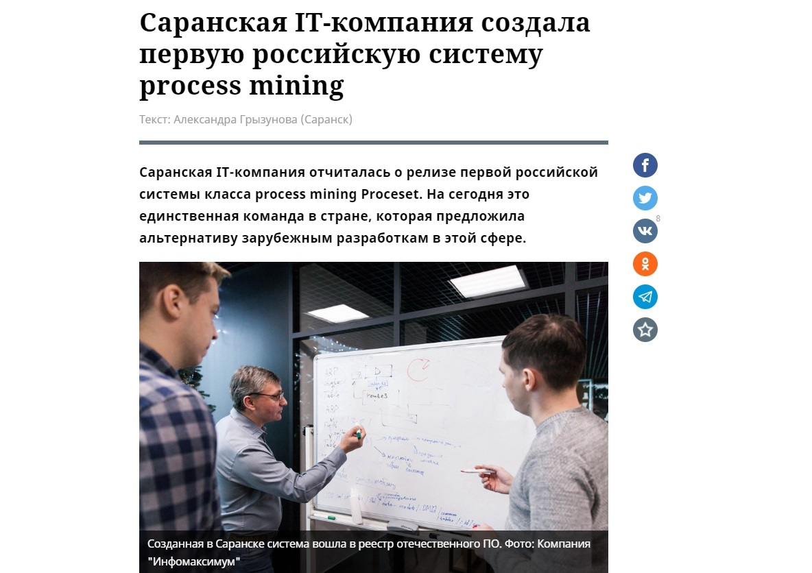
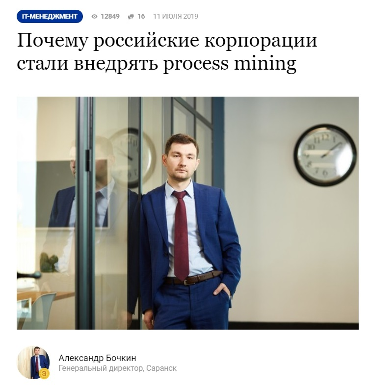
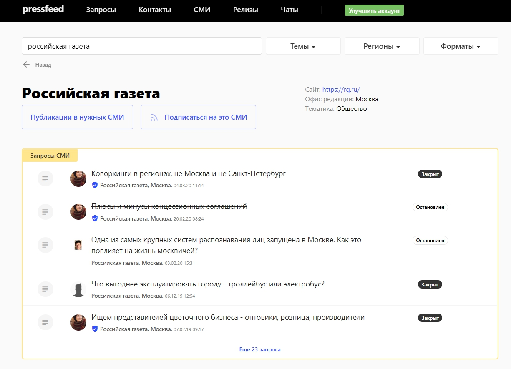
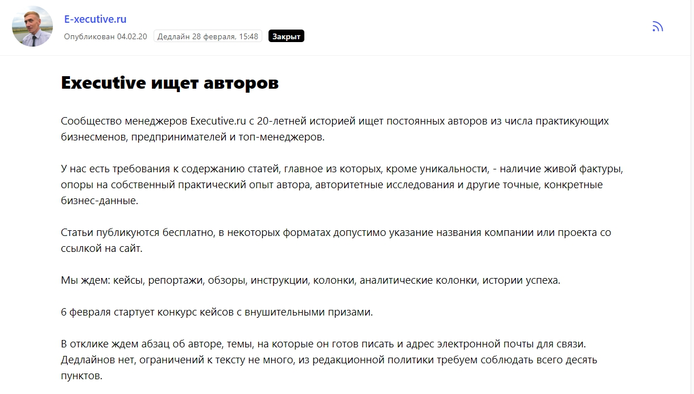

## Что такое «Инфомаксимум»

Компания «Инфомаксимум» 11 лет работает на рынке IT, офис находится в Саранске. Мы создаем высокоинтеллектуальные IT-решения для повышения эффективности крупного бизнеса. Два основных продукта — система учета рабочего времени CrocoTime и первая российская система класса process mining Proceset.

Для тех, кто не слышал о «process mining»: система Proceset на основе данных из разных информационных источников способна построить точную цифровую копию бизнес-процессов, обнаружить отклонения и узкие места, которые мешают развитию. Например, создать копию процесса приема заявок от клиентов и показать, какие обработаны в срок, какие — нет. Система выявит причины ошибок и поможет принять верные управленческие решения.

Среди наших клиентов более 700 крупных компаний — это как технологические гиганты, так и представители телекоммуникационной и банковской сфер, ритейла и других отраслей.

## Как продвигаем компанию на рынке

Мы работаем в b2b-секторе, и наша общая цель в рамках продвижения — рассказать о продуктах и донести их ценность и важность для бизнеса до собственников компаний, генеральных и коммерческих директоров, руководителей HR-служб и ИТ-департаментов. Традиционно именно эти лица принимают решения о покупке сложных и дорогих IT-систем.

Чтобы достигнуть этой цели, мы используем разные инструменты маркетинга, рекламы и пиара. Основные активности условно можно поделить на четыре направления:

1. запускаем таргетированную интернет-рекламу в Директе и в социальных сетях;
2. участвуем в конференциях, ивентах, профильных выставках, кроме того, сами организуем мероприятия для клиентов и участников рынка;
3. занимаемся контент-маркетингом — пишем тексты для блогов, а также создаем статьи для СМИ совместно с редакциями разных изданий;
4. развиваем официальные аккаунты компании в соцсетях.

> Здесь хотим рассказать о продвижении с помощью контент-маркетинга — экспертных текстов в блогах и СМИ, которые читает целевая аудитория «Инфомаксимум». Дело в том, что мы стали развивать это направление всего лишь год назад, но быстро убедились, насколько это эффективный инструмент в IT-отрасли, когда речь идет о продаже очень сложных и дорогих продуктов.

## Зачем компании нужно продвижение с помощью контента

Ранее мы продвигали только один продукт, систему мониторинга загруженности персонала CrocoTime, потом появилось второе решение — система класса process mining Proceset, встал вопрос о масштабировании бизнеса и разработке единой информационной политики.

Иначе было бы сложно развиваться дальше, точнее, развитие бы шло гораздо медленнее. Ведь правильное позиционирование с помощью контента и других PR-инструментов может стать решающим фактором в момент, когда клиент до конца не готов к сотрудничеству. Открытость, тексты в блогах, публикации и комментарии в крупных изданиях влияют на восприятие не только образа компании, но и тех услуг, которые она предлагает. Открытые = честные. Владельцы бизнеса, в большинстве случаев, охотнее сотрудничают с теми IT-компаниям, которые на слуху: печатаются в профильных медиа, презентуют собственные кейсы, делятся лайфхаками. Банально, но это правда — хорошая репутация имеет огромное значение для b2b-рынка.

Задачи контент-продвижения:

* рассказывать просто о сложном. Мы реально хотим повысить уровень знаний у аудитории о технологии process mining, доказать, что это важный инструмент в области повышения эффективности. А с выходом нашей системы еще и доступный;
* создать положительный бэкграунд «Инфомаксимум», повысить узнаваемость компании и наших экспертов на IT-рынке — наши сотрудники готовы делиться опытом и тем самым увеличивать уровень доверия к IT-решениям, которые мы создаем;
* влиять на настроение в коллективе: когда сотрудники выступают спикерами в СМИ, участвуют в подготовке материалов, они чувствуют, что их мнение и опыт ценятся компанией, а это мотивирует расширять компетенции.

В задачи PR-отдела входит в том числе организация и участие в отраслевых мероприятиях, но все же основной упор делается на полезный экспертный контент. Выступления на конференциях и форумах продвигают бизнес точечно, а вот публикации способны охватить гораздо больше представителей ЦА, плюс тексты в интернете живут вечно и могут привлечь клиента даже через 5 лет после выхода какой-либо статьи.

## На какие темы пишем тексты в СМИ

В контент-стратегии компании все темы, о которых мы хотим говорить в инфопространстве, делятся на четыре группы.

* **Бизнес-темы.** Как создать компанию, как собрать команду в регионе, как подготовиться к выводу продукта на рынок. Все, что касается развития бизнеса, — советы, личный опыт, ошибки.
* **Продающие тексты.** Статьи о продуктах «Инфомаксимум»: как появилась идея создать первую российскую систему класса process mining, как и чем разработки «Инфомаксимум» могут помочь в решении задач крупного бизнеса.
* **HR-темы.** Работа с командой, мотивация, стажировки в IT, как успешно пройти собеседование, что писать в резюме на должность разработчика и так далее.
* **Имиджевые темы.** О команде в целом, о жизни разных отделов, о принципах продвижения, об IT-технологиях.

В зависимости от темы выбираем ту или иную площадку, где можно опубликовать статью и где она точно «зайдет».

Бизнес-издания пишут о развитии бизнеса — это «Ведомости», «Российская газета», Forbes, «Генеральный директор», «ПРОбизнес», «Российская газета», Rusbase. IT-порталы принимают статьи о технологиях, о новых решениях в IT, о жизни программистов и разработчиков — это tproger, Cnews и другие. О жизни компании всегда можно рассказать на площадках с UGC-контентом, таких как Spark и VС — там мы делимся реальным опытом наших сотрудников по совершенно разным направлениям.

Для нас нет приоритетных изданий — мы готовы работать со всеми, кто пишет на «наши» темы, заложенные в контент-стратегии. Потому что любая публикация делает вклад в развитие бренда, и никогда не знаешь, какой текст выстрелит, и что он нам принесет.

Теперь перейдем к примерам публикаций, а также дадим советы, как общаться с журналистами, чтобы они брали тексты компании бесплатно (рекламу в СМИ мы не покупаем).

## Бизнес-издания: как выходить на журналистов

«Российскую газету» заинтересовала история о том, что «Инфомаксимум» — первая и единственная компания в стране, которая создала систему process mining в России. До этого такое решение использовалось лишь в зарубежных разработках. В публикации генеральный директор компании рассказал, как он пришел к идее развивать такую систему, как изучал рынок, прежде чем взяться за смелый проект. На редакцию мы вышли через конкретного журналиста.

[_Публикация в «Российской газете»_](https://rg.ru/2020/01/20/reg-pfo/saranskaia-it-kompaniia-sozdala-pervuiu-rossijskuiu-sistemu-process-mining.html)

> Появление в таком крупном издании привлекло внимание к компании, и лучшее доказательство этому — обращение потенциального заказчика. Нам позвонили из крупной добывающей компании (не можем разглашать название) сразу после выхода материала. Сейчас мы в стадии переговоров.

Также мы наладили контакты с редакцией бизнес-портала E-xecutive. Написали несколько материалов, которые вышли от имени гендиректора. На этом сайте статьи может выкладывать каждый желающий, но они проходят жесткую модерацию — редактор одобряет далеко не все, только самое интересное и ценное для бизнес-сообщества. Например, в тексте нежелательно упоминать название компании, можно только имя эксперта.

[_Статья на E-xecutive_](https://www.e-xecutive.ru/management/itforbusiness/1990765-pochemu-rossiiskie-korporatsii-stali-vnedryat-process-mining)

Одна из самых удачных статей называлась «Почему российские корпорации стали внедрять process mining». Ее прочитали более 12 тысячи пользователей сайта, а через некоторое время в официальную группу Facebook пришло сообщение с ссылкой на этот материал и благодарностями за полезную информацию.

Чтобы выйти и на «Российскую газету», и на E-xecutive легче всего через [сервис журналистских запросов Pressfeed](https://pressfeed.ru/) — это специальная платформа для общения журналистов и экспертов (либо пиарщиков, которые представляют компанию). Журналисты из 5 тысяч изданий выкладывают на Pressfeed запросы с указанием темы будущей статьи и вопросов для экспертов по данной теме. Эксперт выбирает актуальный для себя запрос и пишет на него ответ со своим мнением, и если комментарий подходит журналисту, то слова спикера появляются в материале.

Ценность в том, что сервис очень экономит время: этап, который включает в себя общение, обсуждение статьи с редакцией, либо сокращается до минимума, либо вообще исчезает. Есть конкретный запрос — есть конкретный ответ. Дальше журналист или принимает, или отклоняет комментарий. Каждый (журналист и эксперт) получает то, что ему было нужно, в итоге все довольны.

Например, вот запросы от «Российской газеты»:

_Запросы от «Российской газеты»_

Редакторы E-xecutive регулярно выкладывают запросы на комментарии, а также ищут на платформе авторов, которые готовы писать полноценные колонки:

  
_Запрос на поиск авторов_

Так что если вы еще не работаете с этими изданиями, мониторьте запросы на сервисе.

## IT-издания: больше всего помогает сервис Pressfeed

Отдельный пласт публикаций — выходы в отраслевых изданиях, посвященных IT, программированию, разработке. Попадать на страницы таких ресурсов — значит, быть в IT-тусовке, заявлять о себе на рынке как о значимом опытном игроке. Для региональной компании это важно вдвойне.

Так, через Pressfeed мы не раз сотрудничали с изданием tproger. Однажды корреспондент спрашивал у программистов, нужно ли тратить время на написание «красивого кода».