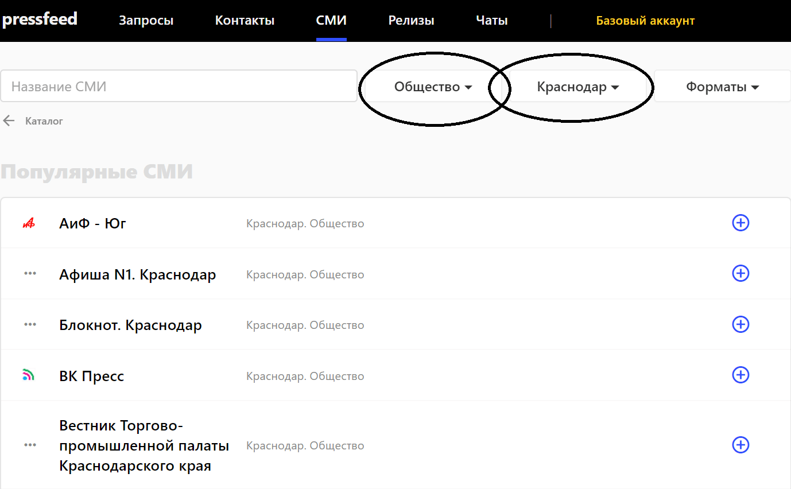
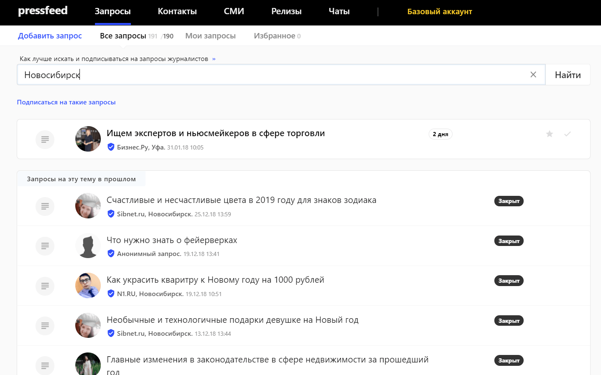
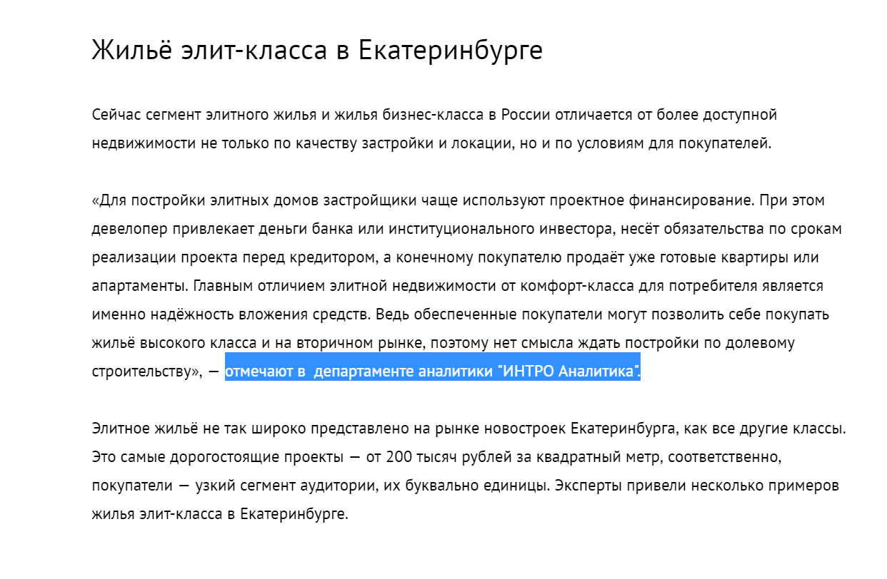
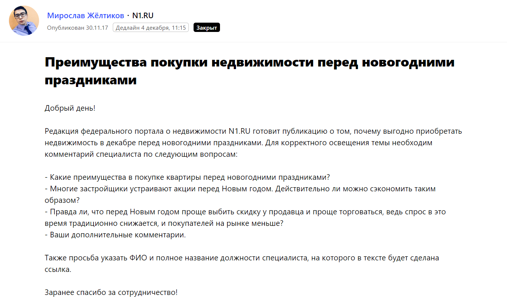
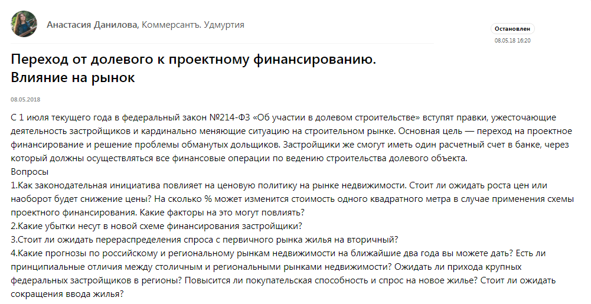
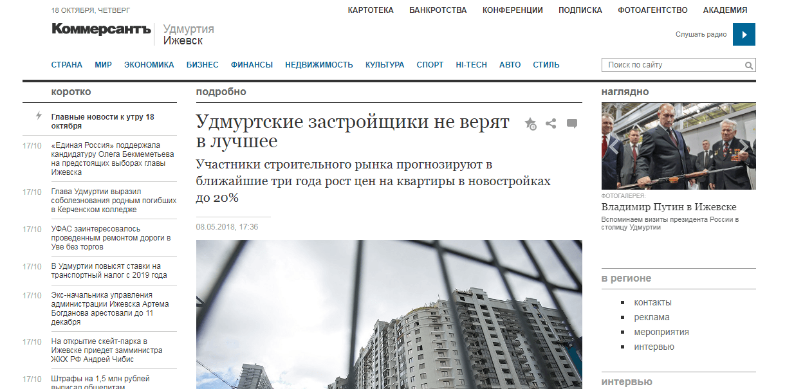
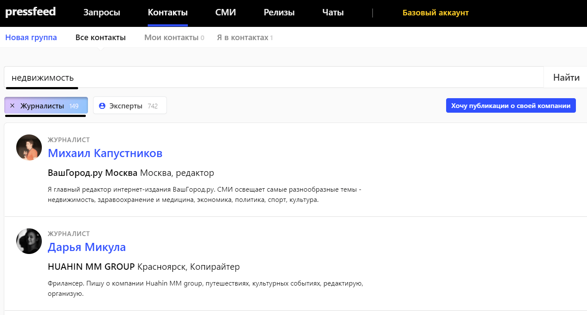
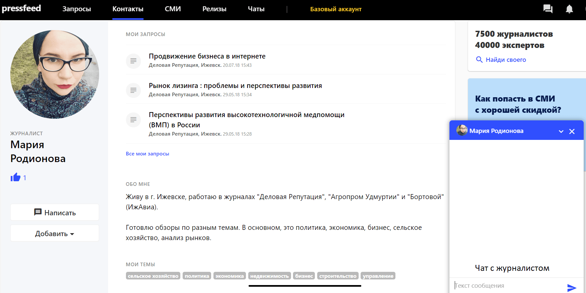

## Кто мы и зачем нам выходить в новые регионы

INTRO Technology Rus занимается разработкой профессионального ПО для участников рынка недвижимости. Делаем мобильные приложения и онлайн-сервисы для рынка новостроек. Наш основной продукт «ИНТРО Аналитика» — это система BI (Business Intelligence) для девелоперов, инвесторов, агентств недвижимости и других игроков рынка.

Осенью 2017 года проект вошел в стадию роста: у нас появились заявки из разных регионов России. Мы начали масштабировать сервис и заходить на новые локальные рынки.

На этапе масштабирования мы тестировали различные способы выхода в регионы. Поняли, что для средних и крупных городов (города 300+, 500+) наиболее эффективен метод прямых продаж: в таких городах у нас нет прямых конкурентов. А вот в городах-миллионниках конкуренция возрастает: полных аналогов нашей системы нет, но есть местные разработчики, которые предлагают свои решения по автоматизации аналитики и бизнес-процессов компаний в сфере недвижимости. Поэтому мы решили подключить PR-инструменты.

В крупных городах нам было важно быстро и эффективно повысить узнаваемость бренда и наших экспертов-аналитиков. Мы хотели добиться того, чтобы целевые клиенты знали о нашем продукте и понимали плюсы работы с «ИНТРО Аналитикой» еще до того, как к ним обратиться наш менеджер по продажам.

За полгода нам нужно было охватить 5-6 новых российских регионов (УрФО, ЮФО и другие). Мы подключили имиджевый PR, и публикации в СМИ стали одним из главных инструментов для продвижения и повышения узнаваемости компании. С помощью СМИ мы хотели добиться увеличения количества заявок на подключение онлайн-сервиса «ИНТРО Аналитика» из целевых для нас регионов.

## Как мы наращивали узнаваемость: публикации в региональных медиа

Нам были интересны **три формата изданий:**

1. деловые федеральные СМИ с региональными редакциями («РБК Екатеринбург», «Коммерсант. Юг России» и так далее);
2. крупные новостные порталы регионов;
3. региональные СМИ о недвижимости и строительной отрасли (как коммерческие, так и государственные).

Сложности возникли на старте работы с региональными медиа: журналисты разбросаны по разным городам, провести личные встречи с ними практически невозможно, регионов, которые мы должны были охватить, было много, в каждом городе-миллионнике находятся не менее 10 целевых изданий.

Тогда мы решили взаимодействовать с региональными редакциями через сервис журналистских запросов [Pressfeed](https://pressfeed.ru/). Мы и раньше отвечали на запросы изданий на сервисе, но теперь стали глубже погружаться в заявки от журналистов из нужных нам городов.

Возьмем для примера город Краснодар. ЮФО — это один из крупнейших региональных рынков недвижимости, где сконцентрирован большой капитал и высокая конкуренция на рынке аналитических сервисов для застройщиков и других участников рынка. Поэтому с этим регионом мы работали особенно плотно. Как с помощью PR-инструментов, так и других маркетинговых механик.

На сервисе зарегистрировано 26 краснодарских изданий с тематикой «Общество», 4 издания с тематикой «Бизнес» и 1 профильное издание о недвижимости. Итого 31 издание, которое может быть нам потенциально интересно. Все медиа из Краснодара можно найти по поиску в [базе СМИ](https://pressfeed.ru/smi-catalog): нужно только поставить фильтры по городу и по тематике издания.

  
_Поиск издания по фильтрам «Общество» и «Краснодар»_

Можно связаться с каждым изданием напрямую, можно посмотреть текущие и архивные запросы. Даже если сейчас от редакции запросов нет, по архивным записям легко понять, какие тематики интересуют их чаще всего.

Так мы познакомились с редакцией аналитического портала ЮФО «Обзор»: издание всегда ищет колумнистов и экспертов для публикаций. Аудитория у издания небольшая (около 300 тысяч посещений в месяц по данным Similarweb), однако она довольно узкая и соответствует нашим требованиям.

[_Запрос_](https://pressfeed.ru/query/34926) _на сотрудничество от издания «Обзор»_

Эксперты «ИНТРО Аналитики» получили возможность опубликовать в «Обзоре» свои авторские колонки с аналитикой рынка недвижимости. Одна из них [«Остатки несладки: застройщики Краснодара строят слишком много?»](http://obzor.io/2018/03/15/ostatki-nesladki-zastrojshhiki-krasnodara-stroyat-slishkom-mnogo-14160/).

Между тем, существует и другой способ искать запросы из определенного города. Можно вводить название города в поисковой строке во вкладке [«Запросы»](https://pressfeed.ru/all-queries). Приведу пример по Новосибирску.

  
_Поиск запросов по ключевому слову «Новосибирск»_

Поиск Pressfeed ищет город не только формально в карточке СМИ, но и в названии издания, описании, а также в должности журналиста. Затем вы можете подписаться на такие запросы, и они будут приходить в отдельной рассылке.

Так мы начали сотрудничать с порталом о недвижимости N1.RU — это федеральное профильное издание с редакцией в Новосибирске, корреспонденты которого оставляют на Pressfeed запросы на аналитику рынка недвижимости по городам России. Они пишут как федеральные тексты, так и те, которые выходят только в одном конкретном городе.

Мы давали изданию комментарий о жилье элит-класса:

  
[_Запрос_](https://pressfeed.ru/query/37587) _от издания N1.ru_

  
[_Публикация_](https://ekaterinburg.n1.ru/articles/kvartiry_dlya_topov-51540451/) _с участием «Интро Аналитика»_

В другой раз рассуждали о плюсах покупки квартиры в конце года, и мнение «ИНТРО Аналитики» появилось в публикации [«Новоселье в подарок: почему выгодно покупать жильё перед Новым годом»](https://samara.n1.ru/articles/novosele_v_podarok_pochemu_vygodno_pokupat_zhilyo_pered_novym_godom-51650801/).

[_Запрос_](https://pressfeed.ru/query/38002) _от издания N1.ru_

За полгода ответили на 8 запросов от редакции, получили контакты 4 журналистов, и все наши комментарии были приняты и вышли на страницах сайта.

Через сервис можно попасть в издания любого формата. Особенно, когда по вашей тематике появляется горячий инфоповод и журналистам нужны срочные комментарии. Для нас таким «хайповым» поводом стали изменения в законе о долевом участии в строительстве.

[_Запрос_](https://pressfeed.ru/query/43169) _от «Коммерсантъ. Удмуртия»_

Мы участвовали в публикации «Коммерсантъ. Удмуртия», так как в наших интересах было выйти на компании Ижевска.

[_Публикация_](https://www.kommersant.ru/doc/3623603) _с участием «Интро Аналитика»_

Еще один лайфхак по работе с Pressfeed, если ваша компания хочет давать комментарии только на одну профильную тему. Например, для нас это недвижимость. Лучше сразу искать конкретных журналистов, которые пишут материалы именно на эту тему. Обычно в издании есть рубрика «Строительство / недвижимость». Скорее всего, материалы о недвижимости выпускают только 3-4 человека в редакции. Нам они и нужны.

Схема поиска:

1. заходим в раздел [«Контакты»](https://pressfeed.ru/people);
2. вводим ключевое слово «недвижимость»;
3. нажимаем на кнопку «журналисты» — так у нас отфильтруются эксперты;
4. изучаем страницы журналистов, выбираем тех, кто кажется более интересным;
5. пишем в личные сообщения (в чат) прямо через сервис — и рассказываем о компании. Все любят эксклюзивы, так что покажите редакции, чем вы можете быть полезны и какую уникальную информацию можете дать.

_Пример поиска контактов журналистов_

Ответят не все и не сразу, но определенная база контактов будет собрана — это факт. В дальнейшем можете найти этих журналистов в социальных сетях, попросить почту и общаться уже напрямую.

  
_Заходите в профиль журналиста и пишите ему в чат_

Параллельно с организацией публикаций в СМИ мы участвовали в профильных конференциях. Однако подобные отраслевые мероприятия проходят только несколько раз в год, а присутствие в медиа нужно поддерживать постоянно. Чтобы добиться регулярных упоминаний бренда в СМИ, необходимо мониторить запросы на Pressfeed и параллельно искать контакты и выходить на профильных авторов в целевых изданиях.

## Результаты: рост заявок и лояльность клиентов

Мы активно работали на Pressfeed с ноября 2017 по май 2018 — за это время ответили на 68 запросов, 57% питчей были приняты, более 35 публикаций вышло. Особенно плотно взаимодействовали с изданиями ЮФО, УрФО и Удмуртии.

Все публикации в СМИ работают на узнаваемость и помогают нам переводить заявки в продажи. Как мы это отслеживаем? 

**Во-первых**, мы всегда отслеживаем карту посещений сайта и видим, что раздел «СМИ о нас» часто просматривается посетителем. Это влияет на такие показатели, как глубина просмотра сайта и длительность просмотра сайта. Когда потенциальный клиент видит знакомые названия, интересные заголовки — федеральных изданий или привычных ему региональных медиа — он сразу отмечает в голове «плюс» в пользу компании.

**Во-вторых**, в какой-то момент мы перестали использовать контекстную рекламу совсем. Но заявки с сайта продолжали поступать.

Все заявки с сайта — это во многом результат PR-активности. Целевых заявок по «ИНТРО Аналитике» в среднем поступало 15-20 в месяц, из них новых подключений — от 3 до 6 в месяц. При этом нужно понимать, что средний чек — около 90 000 руб./мес. с абонентским договором на 6-12 месяцев.

**В-третьих**, заявки шли из разных регионов — иногда даже из тех регионов, где мы не начинали целевое продвижение.

**Наконец**, в общении с нашими менеджерами по продажам представители некоторых компаний вспоминали, что встречали имя спикера в публикациях в СМИ или на конференции. Это показатель, что мы провели правильное позиционирование в регионе.

Нужно понимать, что все PR-активности, включая публикации в СМИ, — это чаще всего дополнительное касание с представителями ЦА, на которых так или иначе выходил отдел продаж. Для многих клиентов сделка по подключению длится больше месяца, так как требуются согласования на разных уровнях, а также включение абонентской платы в смету постоянных расходов. Поэтому одна из основных задач публикаций — это сохранение интереса к продукту, подтверждение экспертного статуса его разработчиков. При этом узнаваемость, которую обеспечивают PR-активности, влияет на решение потенциального клиента и эффективность продаж сервисов «ИНТРО Аналитика».
