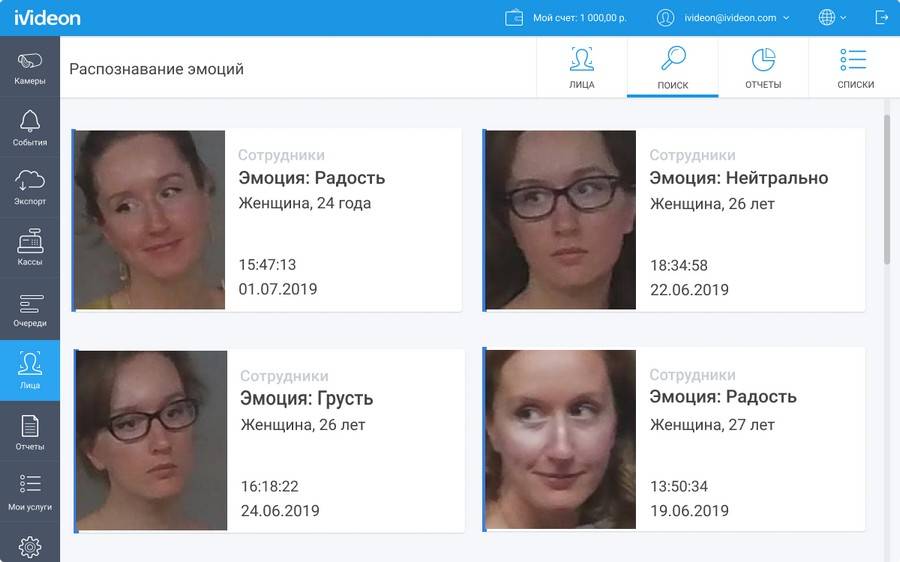
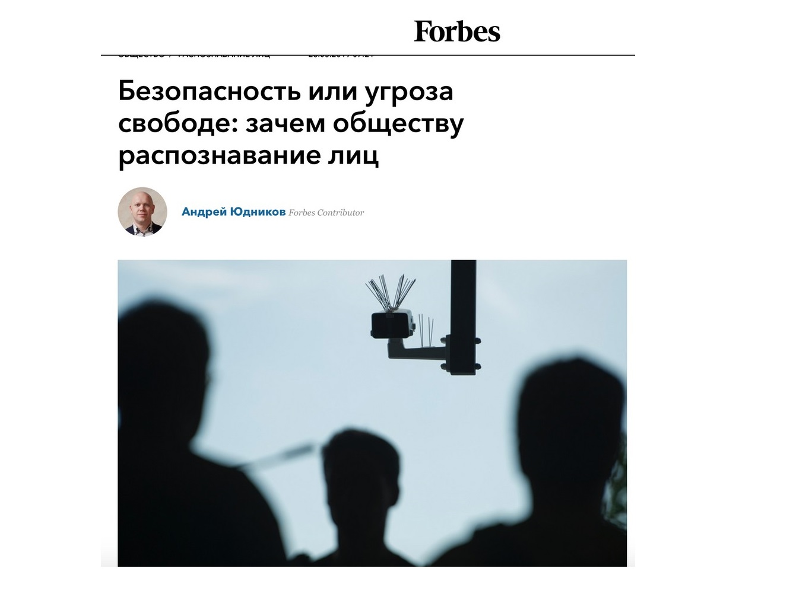
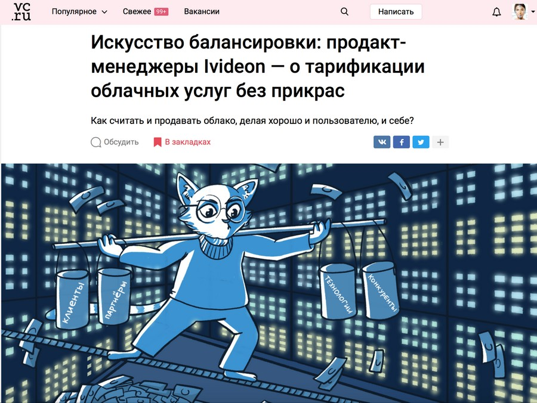
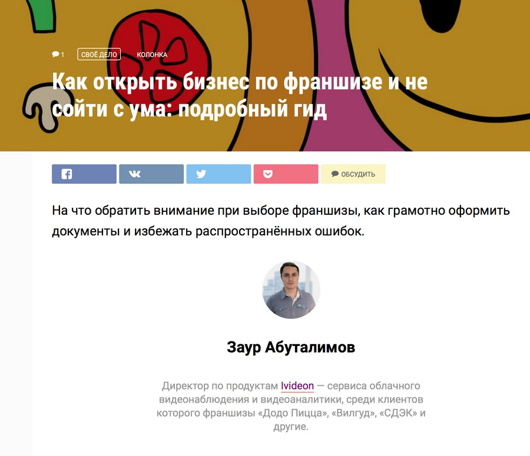
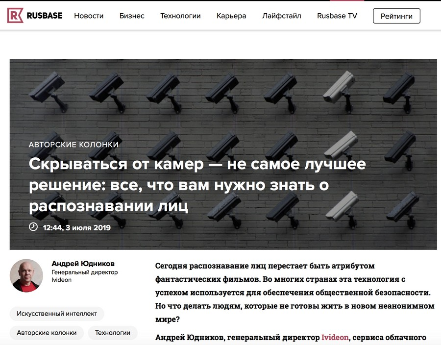
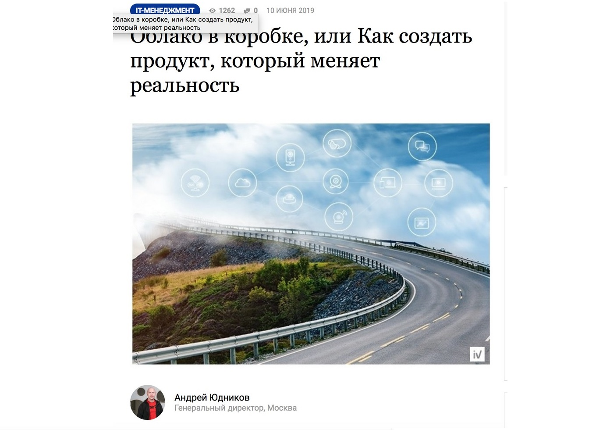

Типичное рабочее утро: я иду по офисному коридору с чашкой кофе в одной руке и телефоном в другой, яростно и ласково убеждая автора, что описывать облачные сервисы надо как хорошую еду — с эпитетами, метафорами и лирическими отступлениями, если потребуется. Камеры наблюдения под потолком фиксируют мои эмоции: от надежды до отчаяния и обратно.

_Алгоритмы компьютерного зрения определяют только базовые эмоции: ярко выраженную радость, грусть, гнев, удивление и нейтральное выражение. Не магия, но удобный инструмент для ритейлеров, сферы услуг и организаторов массовых мероприятий._

Ivideon на рынке с 2011 года, когда слово «видеонаблюдение» связывалось с устрашающего вида камерами, стеной из мониторов и скучающе-бдительным представителем службы безопасности. Как можно связать видеонаблюдение и интернет вообще практически никто не понимал. В Ivideon захотели, чтобы было вот так:

Сегодня в компании более 200 сотрудников в Москве, Санкт-Петербурге, Екатеринбурге и Рязани, представительства в США и Великобритании, около 3,5 млн пользователей, 15 удаленных дата-центров и партнеры по всему миру, внушительный отдел облачной разработки, мобильная и веб-разработка. Ключевые продукты: удаленное видеонаблюдение, облачный архив для хранения видео, интеллектуальные аналитические модули на базе компьютерного зрения и облачных вычислений — распознавание лиц, счетчик посетителей, учет рабочего времени, детектор очередей.

## Контент-маркетинг в IT: необходимые ингредиенты

Главный ресурс Ivideon — разработчики, инженеры, продуктологи, бизнес-аналитики, менеджеры по работе с клиентами из малого, среднего и крупного бизнеса. Сотрудники, досконально изучившие не только продукты, но и возможности их применения в разных сферах. От и до, включая подводные камни, боли, трудности, потребности — все, что составляет драматургию и соль контент-маркетинга, который, в сущности, был и остается ни чем иным, кроме как искусством рассказывания интересных историй. Историй о клиентах и для клиентов, рассказанных на языке клиентов.

> Неизбежная ошибка контент-стратегии любого IT-сервиса, выскакивающая на ранних этапах: упорно и развернуто рассказывать в статьях исключительно о себе и своих достоинствах, по касательной затрагивая боли бизнеса и предполагая, что предприниматели досконально знают все о своих проблемах и постоянно ищут IT-сервисы, чтобы их решить (на самом деле, нет).

Продукты Ivideon нацелены на малый и средний бизнес, поэтому мы быстро поняли, что помимо прямого рассказа о технологиях, софте и оборудовании, необходимо взять на себя функцию бизнес-тренера и обратить внимание потенциальных клиентов на «узкие» места в процессах, которые можно устранить с нашей помощью.

Мы выпускаем материалы для ритейлеров, финтеха, HoReCa, где эксперты Ivideon фокусируются не столько на видеоаналитике и видеоданных как таковых, сколько объясняют, как сделать так, чтобы данные с бизнесом заговорили. И отвечают на простые ежедневные вопросы: как экономить на аренде, как перевести устаревшую систему видеонаблюдения в облако и получить преимущества облачной инфраструктуры, предотвратить ЧП, запустить прогрессивную программу лояльности с помощью распознавания лиц, отследить мошенничество на кассах, оптимизировать работу персонала, разобраться в популярных технологиях «умного» дома и города и занять там свою нишу.

Материалы на эти темы выходили у нас в разных крупных СМИ: Forbes, РБК, Executive, «Деловая среда», Retail.ru, «Лайфхакер», Spark, «Коммерсантъ» и многих других.

[_Колонка_](https://www.forbes.ru/obshchestvo/376663-bezopasnost-ili-ugroza-svobode-zachem-obshchestvu-raspoznavanie-lic) _генерального директора Ivideon в Forbes_

Еще мы не боимся запускать статьи-исследования на объемные и сложные темы. Так, например, мы анализировали рынок облачных услуг России на vc.ru в материале [«Рынок Шрёдингера»: почему нам всё ещё приходится рассказывать, что такое VSaaS»](https://vc.ru/ivideon/57726-vsaas). Сравнивали его с другими мировыми рынками на Rusbase в публикации [«Перегнать Поднебесную: кто и зачем распознает лица в Китае и России»](https://rb.ru/opinion/peregnat-podnebesnuyu/).

Также на vc.ru мы [рассказали](https://vc.ru/ivideon/58388-tariffs) про юридические аспекты распознавания лиц и видеонаблюдения, раскрыли особенности ценообразования и тарификации облачных сервисов.

_Такого до нас вообще никто не делал. Но B2B-клиенту всегда интересно и важно понимать, за что он платит, поэтому мы решились._

У Ivideon много клиентов-франшиз и мы не понаслышке знакомы с проблемами франчайзи и франчайзеров. Поэтому мы недавно выпустили на «Лайфхакере» самый полный гид по рынку франчайзинга [«Как открыть бизнес по франшизе и не сойти с ума: подробный гид»](https://lifehacker.ru/biznes-po-franshize/).

Клиенты и партнеры — также ценный источник информации, ведь с их помощью рождаются кейсы. Именно этот формат, на котором теоретически контент-маркетинг должен стоять, как на крепком фундаменте, чаще других бывает яблоком раздора.

> Чем удачней кейс по оптимизации бизнеса, тем меньше клиент стремится о нем рассказать. Это характерно и для малого бизнеса, который опасается похищения работающей бизнес-идеи, и для крупного, который недостаточно заинтересован в том, чтобы лишний раз мелькнуть в СМИ.

Выход — убеждать, договариваться, согласовывать материалы, хвастаться вышедшими статьями. Мы показываем статьи на крутых площадках, которые ничего не стоили клиенту или партнеру, но при этом поддержали имидж технологичной и продвинутой компании, выбирающей передовые IT-решения.

Обычно этот аргумент работает, поэтому на нашем счету уже есть очень яркие кейсы: к примеру, с проектом [«Свалка»](https://vc.ru/ivideon/64074-keys-svalki-pobedit-vorovstvo-i-zarabotat-100-millionov-rubley-za-god-na-vyvoze-nenuzhnyh-veshchey) на vc.ru и сетью кофеен [«Правда кофе»](https://delovoymir.biz/video-oblaka-i-neyroseti-kak-tehnologii-rabotayut-dlya-formata-kofe-s-soboy.html) в «Деловом мире».

Еще на том же vc.ru мы рассказали, как устанавливали облачное видеонаблюдение в жилом доме и помогли раскрыть преступления, организовали онлайн-трансляцию экстремальных мотогонок, предотвратили кражи в фитнес-центрах и аварии на стройплощадках.

## Дистрибуция контента: кейс Ivideon и Pressfeed

Публикации на внутренних площадках (в блоге и соцсетях) рассчитаны на удержание уже существующих и достаточно лояльных клиентов. Привлечь новых клиентов способны СМИ — общей тематики и отраслевые, с достойной репутацией и доказанным хорошим охватом. Бренды традиционно приходят на такие площадки с рекламными продуктовыми статьями и уходят несколько разочарованными, получив публикацию с маленькой, но такой заметной пометкой «партнерский материал».

Партнерские и нативные рекламные размещения материалов делать можно и нужно. Это — единственный верный путь рассказать о своем продукте без обиняков и напрямую. Другое дело, что сделать нативный проект интересным аудитории, — и этого менеджеры рекламных размещений в СМИ вам никогда не расскажут, — неимоверно сложно.

> Пометки «промо», «партнерский», даже «спецпроект» на имидж компании не работают точно, потому что имидж рождается там, где заканчивается ощущение «втюхивания» чего-то, пусть даже очень хорошего. Продавать в нативных размещениях и промо-историях нужно уметь, но об этом следует писать отдельную статью.

Итак, чтобы перестать быть просто втюхивателем хорошего продукта и стать брендом, нужно качественно мелькать в качественных же редакционных материалах. Слово «редакционные» подразумевает включение в процесс еще одного звена, строгого и безразличного к вам цензора — собственно, журналиста и редактора, для которого вы либо поставщик интересного и актуального контента, либо не существуете.

> Журналист обязан быть вредным, это определяет его профпригодность, и рекламу такой вредный журналист не любит; так что, предоставив ему фантастическую фактуру от эксперта мирового уровня по распознаванию лиц, вы все равно будете биться за каждую гиперссылку в тексте.

Редакторам и журналистам можно писать на Facebook или на корпоративные email-адреса, предлагать темы и драфты написанных статей. Мы в Ivideon тоже так делаем, и нередко общение напрямую приносит свои результаты. Отношения с редактором выстраиваются тем легче, чем больше вы вкладываетесь в тексты и фактчекинг.

И все же нужного нам масштаба и темпа выпуска материалов индивидуальный подход не обеспечивает. Поэтому мы обратились к сервису Pressfeed и потестили все его возможности: базовый аккаунт, чтобы следить за запросами журналистов нужных изданий, PRO-аккаунт, чтобы публиковать свои пресс-релизы, и, наконец, услугу «Виртуальный пиарщик», на которой мы и остановились в итоге.

Сейчас, когда в Ivideon порой происходит по два крупных продуктовых релиза в день (не самая типичная ситуация, но прецедент был зафиксирован), мы подумываем подключить Pressfeed к рассылке пресс-релизов и новостей о новых продуктах и мероприятиях для партнеров и клиентов.

Взаимодействие Ivideon и Pressfeed выглядит так: у нас есть персональный менеджер, который мониторит подходящие нам запросы в СМИ, список которых мы заранее согласовали и утвердили, и предлагает нужным площадкам подготовленные нами статьи. Практически мы получили PR-менеджера — посредника между нами и целевыми площадками, в штат, только присутствует он не в офисе, а в Telegram (зато почти круглосуточно).

> И еще через Pressfeed площадки вступают в диалог охотнее. Со стороны клиента сложно сказать, с чем это связано, возможно, с тем, что Pressfeed создан профессиональными журналистами и редакторами «из тусовки».

## Чек-лист успешного контент-маркетинга IT-бренда: 9 «не»

**1. Не пишите статей для скролла и не ориентируйтесь всерьез на правила вроде «люди в интернете читают буквой F»**

Возможно, они так и делают, но это неважно, если статья не интересная. В целом, слово «интересный» — единственное важное слово для контента, и именно его почему-то очень часто недооценивают. Да, контент должен быть таргетирован на вашу ЦА, релевантен площадке, часто (но не всегда, есть же еще развлекательный контент) полезен, в идеале оригинален и самобытен, чтобы индексироваться и гуглиться. И всегда интересен абсолютно всем, от вашей мамы до незнакомого банкира, о чем бы вы ни писали — о распознавании лиц для бизнеса, булочках, автосервисе, курсах SQL.

> Это и есть метод блокбастера, ведь блокбастеры используют все возможные средства для захвата внимания. Поэтому они интересны всем — хотя бы в момент просмотра. Каждый раз вкладывайтесь в метафоры, добавляйте красиво оформленную (и корректную!) статистику, вычитывайте и круто преподносите скучные, но важные законы, красиво верстайте, придумывайте оригинальные иллюстрации и видео.

Сроки производства хороших статей, которые с удовольствием принимают редакции читаемых СМИ, иногда сопоставимы с производством кинофильма. Тем не менее потраченные ресурсы себя оправдают — из интернета ведь по-прежнему ничто никуда не исчезает бесследно, а контент-маркетинг рассчитан скорее на цифровые СМИ, нежели на печатные.

**2. Не разбрасывайтесь фактурой**

Главный совет контент-маркетологу при сборе фактуры: проявляйте поистине хомячиную бережливость.

> Превратите каждую секунду вашей жизни в компании в сбор материала, носите два диктофона на интервью, записывайте цитаты, яркие мысли и шутки, запоминайте обрывки разговоров, превращайте их в идеи и темы и собирайте материала в 400 раз больше, чем оставляете в текстах.

Если объем профессионального знания, вдохновения, обаяния, ума и опыта в компании не позволяет вам собрать столько фактуры, контент-маркетинг запустить не получится.

**3. Не бойтесь «опасных» тем**

Ivideon работает на рынке видеонаблюдения и распознавания лиц, и оба понятия достаточно легко вписывается в негативный контекст. В какой-то момент мы поняли, что просто акцентировать внимание читателей на возможностях видеоаналитики для бизнеса — мало. И перестали игнорировать болезненные темы, перехватили инициативу и начали отвечать на неудобные вопросы, как, например, для упомянутой выше статьи в Forbes.

Теперь журналисты, работающие с Pressfeed, знают, куда идти с вопросами по face recognition, которые соприкасаются не только с бизнесом, но и обществом.

Колонка генерального директора Ivideon на ту самую тему, которую многие в отрасли стараются избегать.

**4. Не перегибайте палку, когда гонитесь за хайповыми темами**

Когда пишешь про IT-продукт, часто приходится «желтить» заголовки и вовсю пользоваться законным правом рассуждать на востребованные темы. В нашем случае это искусственный интеллект, нейросети, интернет вещей, умный дом, умный город и весь спектр «умных» технологий.

Однако без экспертных знаний на жонглировании терминами далеко не уедешь. Forbes, к примеру, уже внес словосочетание «искусственный интеллект» в список стоп-слов, наряду с «блокчейном».

**5. Не забывайте про инфоповоды**

С инфоповодами и в IT бывают проблемы, ведь не каждый новый релиз — событие мирового масштаба. Новость от компании следует обратить в объективно интересную и только затем распространять. Это не так сложно, когда выпускаются продукты, востребованные или давно ожидаемые рынком, или же принципиально новые и революционные. У нас, например, есть такой продукт, о чем мы сделали [публикацию](https://www.e-xecutive.ru/management/itforbusiness/1990684-oblako-v-korobke-ili-kak-sozdat-produkt-kotoryi-menyaet-realnost) на Executive.

Не менее важно заниматься ситуативным маркетингом и отслеживать инфоповоды партнеров, смежных отраслей, бизнеса, общества, даже конкурентов — все, что можно прокомментировать, чтобы подсветить профессионализм сотрудников.

**6. Не возлагайте больших надежд на планирование**

Скорее всего, тотальной системности не будет, а ваши собственные взгляды на стратегию продвижения будут меняться. Инженеры и эксперты Ivideon больше похожи на талантливых изобретателей, чем на суровых аналитиков: они предоставляют идеи для статей постоянно, не прерываясь на кофе и обед. Все время приходят новые клиенты, выпускаются продукты и обновления.

Добавьте к этому множество инфоповодов в сфере технологий и смежных отраслях, профессиональные мероприятия и выставки, где презентуется сервис, продукты и выступают с докладами спикеры от компании. А теперь представьте, как собрать все перечисленное в единую стратегию.

**7. Не воспринимайте правила слишком серьезно**

Все, что касается контента для бизнес-организаций, — вроде бы молодая наука, но в ней уже есть свои авторитеты, которые будут вам настоятельно что-то рекомендовать или не рекомендовать. Это может касаться, к примеру, допустимого количества экспертов от компании, активно публикующихся в СМИ.

Хорошо ли, когда спикеров много? Или нужно лишь несколько ответственных экспертов? А вдруг представлять бренд должен один человек?

Отвечая на этот вопрос можно воспользоваться правилом пяти аргументов. Пять — число произвольное, кому-то достаточно и трех, кому-то мало пятнадцати. Адаптируйте под себя. Если нужное число аргументов подобралось – делайте так, как хочется вам.

**8. Не увлекайтесь одним жанром или форматом**

Даже если вы работаете в крайне серьезной компании, с очень официальным ton of voice, сложной разработкой, богатой экспертизой и безупречной репутацией, от необходимости регулярно выпускать развлекательный, ироничный, научно-популярный и ситуативный контент это вас не освобождает.

Контент должен распространяться регулярно и равномерно во всех смыслах — без ощутимых перекосов в академичность, серьезность, слишком узкую тематику или, наоборот, сплошное безудержное веселье.

> В контент-стратегии могут быть представлены все жанры, кроме скучного. Хотя и он в итоге пригодится для SEO.

**9. Не идите работать контент-маркетологом в компанию, которая вам не нравится**

По всем параметрам — от людей до предметной области. Иначе вы будете очень средним контент-маркетологом. Универсальной механики по наращиванию лидов для плохих текстов пока не изобрели.

Если контент-маркетолог вовлечен в процессы, а его коллеги щедро делятся знаниями и временем, — контент будет. В противном случае получится реклама, наполненная клише и штампами. И недовольное лицо руководства, слабо представляющего, как вы окупаетесь.