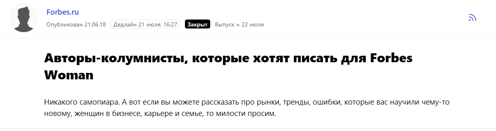
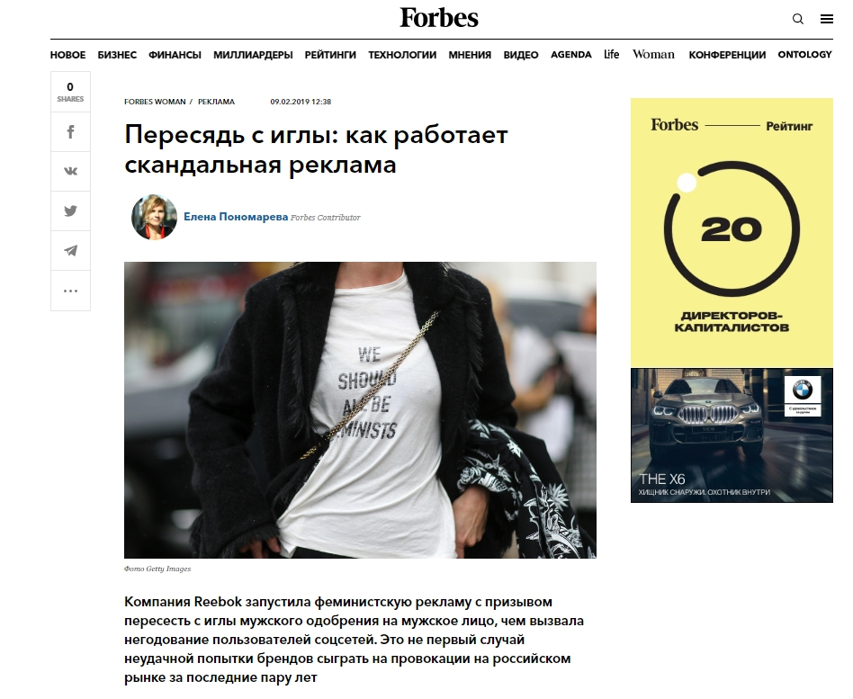
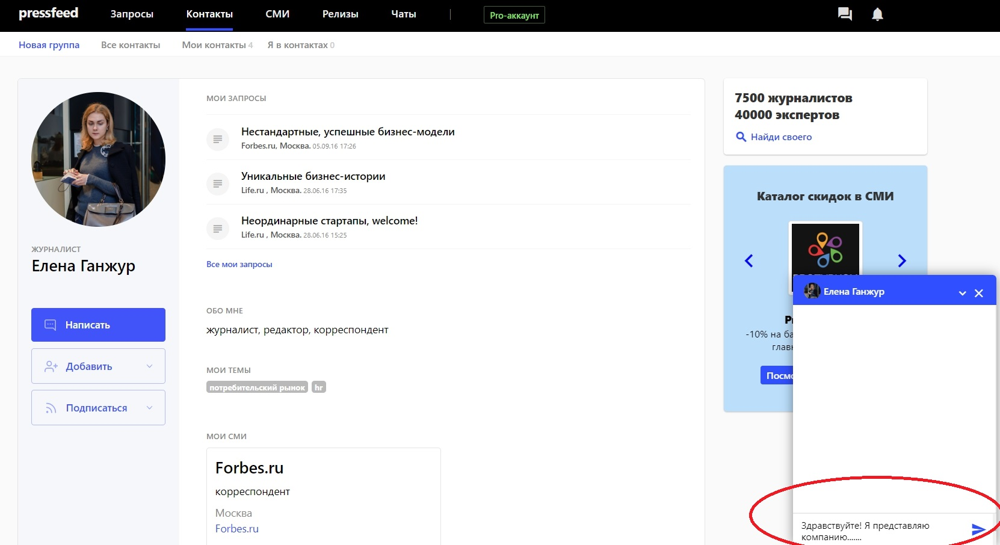
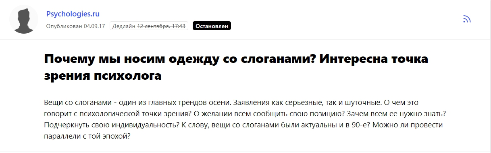
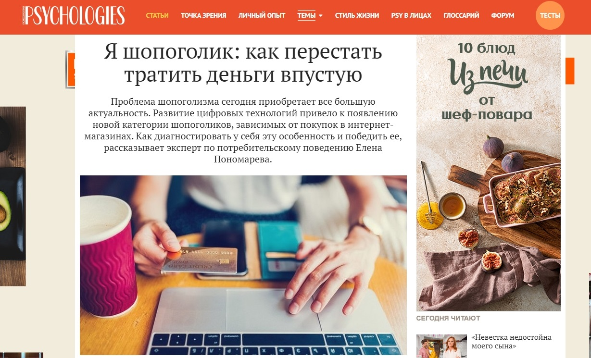
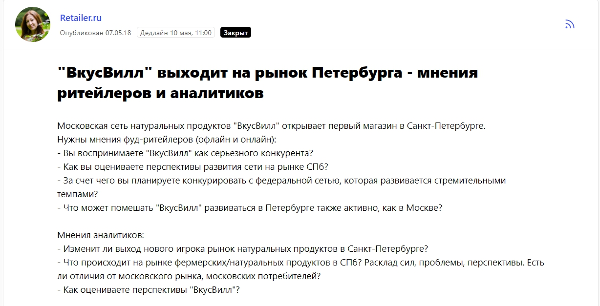
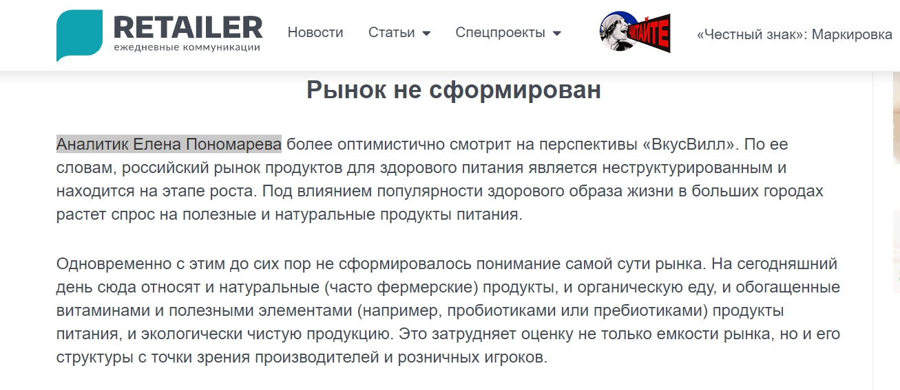

[«Лаборатория трендов»](https://t-laboratory.ru/) была создана в 2017 году как научно-исследовательская компания, которая специализируется на изучении рыночных трендов и моделей потребительского поведения. В 2019 году мы отказались от слов «научно-исследовательская» в названии и выводим теперь на первый план не сами тренды, а то, как бизнес может использовать их для своего развития.

«Мы не ищем ответов в прошлом, мы смотрим в будущее» — наш слоган, который отражает то, что мы делаем. Мы оказываем клиентам полный комплекс маркетинговых услуг — от разработки стратегий, бизнес-моделей и концепций новых товаров до интернет-маркетинга, брендинга, пиара и много другого. При этом мы всегда и во всем ориентируемся на тренды и моделирование поведения целевой аудитории.

С кем работает «Лаборатория трендов»? Наша целевая аудитория — малый и средний бизнес. Компании, которые находятся на этапе роста, которые достигли «стеклянного потолка» и теперь ищут новые пути повышения эффективности и укрепления конкурентоспособности. Мы помогаем также микробизнесу и стартапам, у которых обычно нет больших бюджетов, — но только если проект заинтересовал, и мы видим его реальные перспективы.

## Какие инструменты помогли нам покорить рынок

Мы не из тех компаний, которых называют «сапожник без сапог». Раз мы хотели помогать другим брендам с маркетингом, то необходимо было составить маркетинговую стратегию и для себя. Мы решили (говорю мы, когда подразумеваю нашу команду), что будем развивать семь направлений в рамках продвижения. Что делаем:

1. выпускаем публикации в деловых и отраслевых СМИ;
2. выступаем на профильных мероприятиях;
3. ведем социальные сети и говорим о «Лаборатории трендов» как в официальных группах компании, так и на личных страницах — моих (у меня около 7 тыс. подписчиков в Facebook), а также страницах наших руководителей;
4. развиваем Клуб «Лаборатории трендов» — это бесплатные очные мероприятия для маркетологов и предпринимателей Санкт-Петербурга;
5. проводим партнерские мероприятия — они нацелены на взаимный PR со смежными компаниями и бизнес-сообществами;
6. делаем email-рассылку по «живой» базе адресов — в среднем в неделю мы отправляем 1-2 рассылки с полезными текстами и приглашениями на мероприятия;
7. работаем над видео-проектом «Сказки про маркетинг» — вместе с экспертом в b2b-маркетинге Денисом Баталовым еженедельно мы помогаем одному предпринимателю или наемному сотруднику решать вопросы повышения эффективности или развития бизнеса.

На самом деле, все эти инструменты можно объединить под емким понятием — контент-маркетинг. То есть мы продвигаемся за счет полезного контента, который мы бесплатно даем бизнес-сообществу, маркетинговому сообществу. Конечно, на начальном этапе было страшно, что наши наработки используют конкуренты, но у нас было два варианта — играть в открытую и полюбить своих «соперников», так как мы вместе работаем на развитие российского бизнеса, или инвестировать в другие способы продвижения (имею в виду прямую рекламу и так далее), но на это потребовались бы огромные бюджеты. Мы выбрали первый вариант и не ошиблись.

Мы хотим быть полезными, при этом понимаем, что чем больше мы делимся, тем больше к нам возвращается — контент обеспечивает работу сарафанного радио, а также напрямую привлекает новых клиентов. Если компания на слуху, вероятность того, что она одной из первых придет на ум потенциальному клиенту или появится в первых строках поисковиков, существенно выше.

> В комплексе каждый из перечисленных инструментов влияет на продажи, ведь клиенты идут к тем компаниям, которые могут доказать свою компетентность еще до момента начала переговоров. У нас нет холодных продаж, клиенты обращаются к нам сами или мы предлагаем свои услуги тем компаниям, которые уже как-то взаимодействовали с нами.

Я хотела бы подробнее рассказать о публикациях в СМИ как о самом масштабном и, возможно, трудозатратном канале коммуникации с целевой аудиторией.

## Как делать много публикаций в СМИ бесплатно

На первых этапах, когда компания только-только вышла на рынок, экспертные тексты и комментарии в медиа помогли нам заявить о себе и сформировать образ «Лаборатории трендов». Я считаю, что публикации в СМИ очень важны именно в плане репутации, подтверждения экспертности.

> Если у руководителей компании много публикаций в значимых изданиях — это всегда плюс «в карму» бренда и еще одно преимущество перед теми конкурентами, которые контент-маркетингом не занимаются.

Что мы публикуем в СМИ:

* рыночные и отраслевые обзоры (аналитика, тренды и др.);
* комментарии по поводу интересных бизнес-новостей (почему произошло какое-то событие, как будет дальше развиваться ситуация);
* разбор интересных кейсов (оценка вышедшего на рынок продукта, новых инструментов бизнеса т. д.);
* тексты в формате «как решить какую-то задачу» (рассказываем о различных инструментах маркетинга и бизнеса, делимся своим опытом, кейсами и методами и др.);
* материалы, касающиеся психологии и коучинга (бизнес-психология, поведение потребителей, личная эффективность).

Что касается изданий, то в приоритете ведущие деловые СМИ (Forbes, «РБК», «Коммерсантъ», «Эксперт», «Ведомости» и др.), а также отраслевые медиа — так сложилось, что мы плотно работаем с изданиями, пишущими о пищевой промышленности (RussianFoodmarket, «Мясной ряд», «Мясная промышленность» и т. д.), так как у нас много клиентов из этой сферы. Кроме того, делаем статьи и даем комментарии для бизнес-ресурсов — «Генеральный директор», «Деловой мир», E-xecutive и так далее.

С момента появления «Лаборатории трендов» мы успели посотрудничать с десятками изданий, и все же для нас важнее тема, чем известность площадки. Каждый материал, каждое упоминание влияют на репутацию бренда, кроме того, любой выход на внешней площадке (если там будет ссылка на наш сайт, а затем мы еще продублируем статью на сайте) повышает позиции сайта в поисковых системах. За 2018-2019 годы от «Лаборатории трендов» опубликовано более 250 статей и комментариев.

Как нам удается договариваться с журналистами всевозможных СМИ? Отмечу, что все статьи выходят на безбюджетной основе, а за некоторые материалы даже платят нам! Иногда сотрудники редакции выходят на нас сами (в большей степени из отраслевых изданий, связанных с пищевой промышленностью), журналисты стучаться в Facebook, предлагают что-то написать вместе, а порой я сама предлагаю им темы для публикаций. Но большую часть материалов мы делаем с помощью [сервиса журналистских запросов Pressfeed](https://pressfeed.ru/) (или с теми журналистами, с которыми мы познакомились до этого на сервисе). Это специальная платформа, на которой представители редакции выкладывают запросы, в которых указано, какой эксперт им нужен, на какие вопросы ответить, до какого срока. То есть эксперту (пиарщику) не нужно самому «ломиться» в издание, уточнять, какие темы для них актуальны, о чем можно написать.

С Pressfeed всё то, что интересует журналистов прямо сейчас, находится у меня перед глазами, да еще и постоянно обновляется (около 400 запросов ежедневно «висит» на сервисе). Плюс через сервис работают пять тысяч изданий — от самых именитых до самых маленьких отраслевых. Регистрация на сервисе бесплатная для всех, но на базовом тарифе действуют ограничения. Мы хотим выпускать как можно больше публикаций, так что у меня подключен PRO-аккаунт. На профессиональном аккаунте можно отвечать на неограниченное количество запросов, общаться с журналистами в чатах, создавать подписки по ключевым словам, темам, СМИ, журналистам.

Например, именно через Pressfeed я вышла на редакцию Forbes. Теперь я регулярно пишу для них комментарии, а также веду свою колонку.

[_Запрос от Forbes на Pressfeed_](https://pressfeed.ru/query/44685)

Активнее всего обсуждалась моя статья, посвященная нашумевшей в начале 2019 года рекламной кампании Reebook. Это прекрасный пример того, как на волне хайпа с помощью публикации в СМИ можно привлечь к себе внимание. Моя колонка в Forbes позиционирует меня как эксперта в маркетинге, но ведь я являюсь лицом компании «Лаборатория трендов», поэтому то, что влияет на мою репутацию, в дальнейшем влияет и на репутацию бренда. Всё взаимосвязано.

[_Статья в Forbes_](https://www.forbes.ru/forbes-woman/372147-peresyad-s-igly-kak-rabotaet-skandalnaya-reklama)

Вообще эта классическая схема — знакомитесь с редактором / журналистом издания на Pressfeed, а затем продолжаете общаться в Facebook или почте. Кроме того, с каждым журналистом можно связаться в чате — озвучить все свои предложения там.

Для этого нужно найти журналиста, например, через раздел [«Контакты»](https://pressfeed.ru/people). Перейти в его профиль и нажать кнопку «Написать». Ему на почту сразу придет письмо с уведомлением, что ему пришло сообщение на Pressfeed.

  
_Как написать журналисту_

С популярным журналом Psychologies я познакомилась как раз на сервисе — нужно было через призму психологии дать ответ, почему одежда со слоганами стала вновь популярной.

  
[_Запрос от Psychologies_](https://pressfeed.ru/query/34622)

Мое мнение опубликовали на страницах печатного журнала. Спустя некоторое время я продолжила сотрудничество с изданием уже напрямую и писала статьи на сайт. Одна из самых интересных, на мой взгляд, была посвящена шопоголизму, — ее прочитали около 5 тысяч пользователей.

  
[_Статья на сайте Psychologies_](http://www.psychologies.ru/articles/ya-shopogolik-kak-perestat-tratit-dengi-vpustuyu/)

Как я уже отметила, мы много пишем о трендах на рынке пищевой промышленности и о ЗОЖ. Эти темы самые популярные у нас на сайте (когда мы дублируем туда статьи), они же периодически приводят новых клиентов. Такие тексты мы делаем чаще всего напрямую с конкретными изданиями, а также никогда не пропускаем запросы на эту тему на Pressfeed — на платформе же работают сотни редакций отраслевых площадок.

Например, я стала колумнистом на [сайте Marketmedia](https://marketmedia.ru/media-content/kak-coffee/) — это издание о торговой и коммерческой недвижимости, ритейле и новостях ресторанов. Пишу о трендах в сфере ритейла, предприятий общественного питания.

Или же как-то я комментировала новость об открытии «ВкусВилла» в Санкт-Петербурге. Этот запрос я увидела на Pressfeed.

[_Запрос от Retailer_](https://pressfeed.ru/query/43142)

Проанализировала ситуацию, подготовила развернутый ответ по теме — и журналист поставил мои комментарии в материал.

  
[_Фрагмент публикации в Retailer.ru_](https://retailer.ru/vkusvill-vyhodit-v-peterburg-kak-jeto-izmenit-produktovyj-ritejl/)

> Считаю, что секрет хороших отношений с редакциями кроется в том, что эксперту в момент самого первого контакта важно показать, что он умеет писать интересно, оперативно, готов погружаться в тему и адекватно реагировать на правки. Тогда редакторы изданий будут с вами сотрудничать и второй, и третий раз.

В 2019 году мы планировали выпустить 100 публикаций в СМИ, но на конец ноября 2019 года у нас уже сделано 122 статьи и комментария. В 2020 году собираемся идти в сторону увеличения количества выходов в топовых деловых СМИ. Хотим сделать не менее 200 публикаций, при этом 25% должны выйти в крупнейших бизнес-изданиях. Уверена, что Pressfeed сильно поможет нам в осуществлении этих планов.

Подытожу, что публикации в СМИ делают огромный вклад в репутацию компании, в ее узнаваемость на рынке. Они играют роль, когда потенциальный клиент выбирает компанию-подрядчика и ему важно быть уверенным в экспертности специалистов этой компании. Кстати, также на публикации в медиа смотрят при проведении тендеров.

> В то же время иногда конкретные статьи приводят клиентов напрямую — у нас были случаи, когда заказчик ссылался на определенный материал. Он прочитал его и понял, что именно мы сможем грамотно решить его маркетинговые задачи.

## Сколько мы тратим на продвижение компании

Очень мало в денежном эквиваленте, но довольно много, если говорить о времени. В целом на маркетинг тратим не более 8-10 тысяч рублей в месяц. В эту сумму входит плата за использование вебинарной площадки, за услуги дизайнера (заказываем разные мелкие макеты), за продление PRO-аккаунта на Pressfeed. Иногда нужно купить какую-то статистику для статей (Росстат или Федеральная таможенная служба). Но даже такая сумма полностью окупается платными статьями (некоторые СМИ платят за материалы экспертам — от 4 до 15 тыс. за статью объемом 10-15 тыс. знаков).

Платную рекламу в социальных сетях не подключаем — несколько раз пробовали продвигать посты, но поняли, что это не дает нужного результата, так как нашим клиентам важнее контент, который мы транслируем по разным каналам.

## Итоги: какие результаты дает продвижение с помощью полезного контента

Если сравнивать первое полугодие 2018 года и 2019 года, то по выручке мы выросли в 2,3 раза. За последний год посещаемость нашего сайта увеличилась почти на 200%. Что не менее важно, растет и уровень наших клиентов, и сложность задач — мы медленно, но верно идем к проектам в формате «Дорого, быстро, интересно».

Я не могу сказать, что на эти результаты повлияли только публикации в СМИ, только выступления или только мои посты в соцсетях.

> Абсолютно всё играет роль, это комплекс инструментов, а каждый канал коммуникации с аудиторией взаимодополняет, поддерживает другой канал. Потенциальные клиенты следят за тем, что мы пишем в медиа, подключаются к нашим вебинарам, читают новости в Facebook, получают рассылку, интересуются проектом «Сказки про маркетинг». А затем обращаются к нам за помощью, потому что уже знают, что мы умеем, что мы можем. Это «хорошо прогретые» лиды, если можно так сказать.

Всё, что мы делаем, приносит свои плоды, а PR и контент-маркетинг — это действительно лучший способ продвижения для «Лаборатории трендов».

Кстати, еще один признак, что экспертность и узнаваемость компании растет, — это когда к вам начинают обращаться журналисты из разных изданий напрямую, приходит все больше заявок от организаторов мероприятий через почту или Facebook. В этом плане я тоже ощутила на себе весомые изменения.