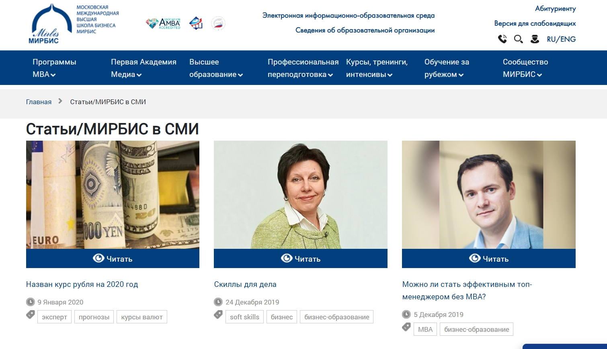
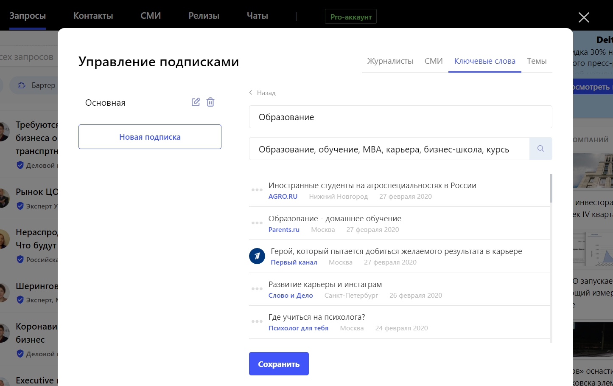
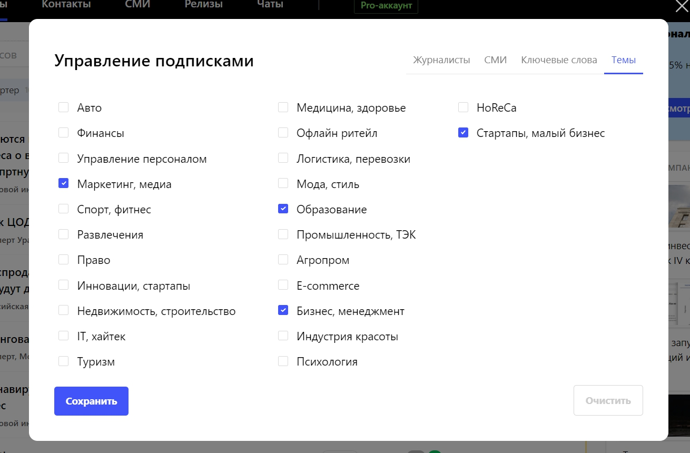
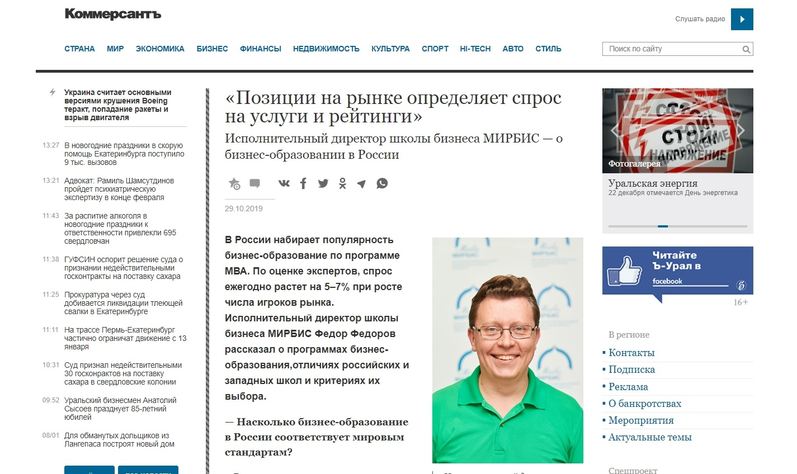
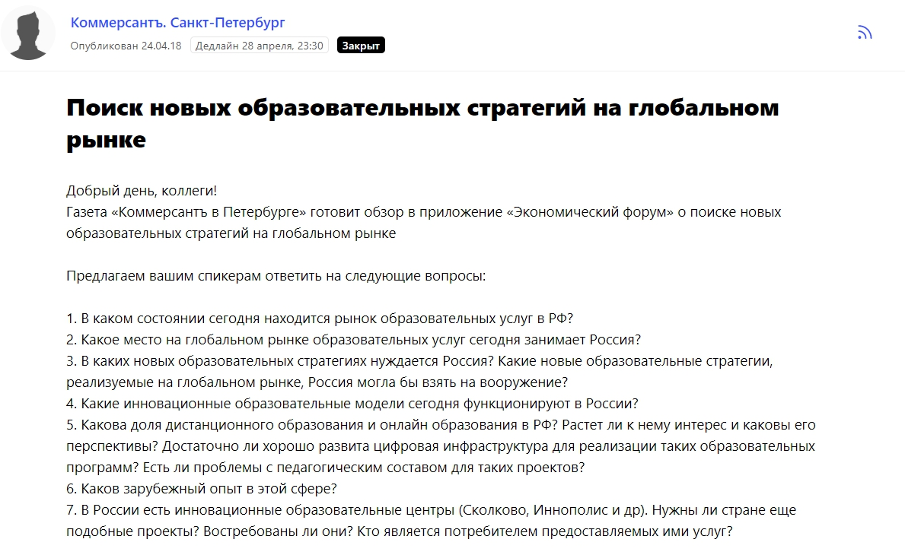
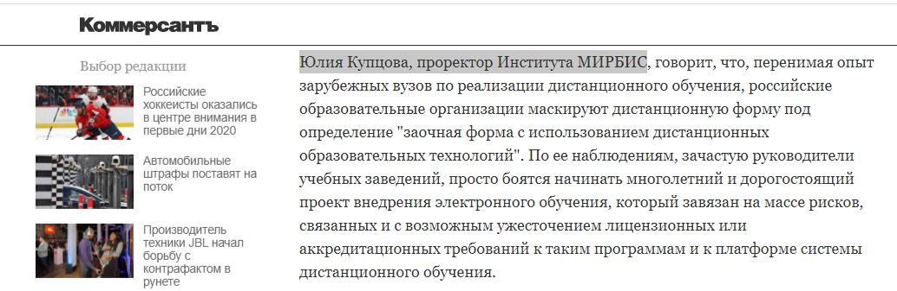

Международная школа бизнеса МИРБИС — это первая в России школа, которая начала обучать программам MBA и Executive MBA еще в далеком 88-м году. Наши слушатели — это менеджеры среднего звена, директора департаментов, топ-менеджеры, собственники компаний и акционеры. Чаще всего эти люди уже добились значимых успехов в карьере, но хотят развиваться дальше, быть в курсе трендов в управленческой сфере.

## Одной рекламы недостаточно, чтобы продвигать образовательные услуги

Для продвижения школы бизнеса МИРБИС мы используем классические маркетинговые инструменты — таргетированную рекламу в социальных сетях, контекстную рекламу в Директе, иногда баннеры на профильных сайтах. Мне кажется, эти каналы продвижения — это просто обязательный минимум практически для любой компании. Они позволяют потенциальному клиенту узнать о бренде, вовлечь его в воронку продаж. Но достаточно ли их для эффективного привлечения? Увы, но нет.

> Мы продаем сложный и довольно дорогой продукт — образование. Его не потрогаешь руками, он не дает моментального и очевидного эффекта, а результаты от его «применения» порой можно увидеть лишь спустя многие годы.

Плюс к этому на рынке с каждым годом растет конкуренция — бизнес-школ становится все больше, предлагаются более дешевые, но менее качественные услуги. Кроме того, зачастую людям приходится делать выбор: или получить степень MBA, или отложить капитал, а может просто отвезти семью в отпуск.

Все эти факторы приводят к тому, что для бизнес-школы крайне важна репутация в целом, репутация преподавателей в частности, отзывы выпускников и многое другое. Мы должны быть на слуху, чтобы будущие слушатели хотели получать образование именно у нас, были уверены, что преподаватели МИРБИС — опытные практики, что программы составлены в соответствии со стандартами. Только так мы можем убедить потенциальных клиентов прийти в МИРБИС.

> Чтобы создать вокруг бренда безупречную репутацию и развивать лояльность клиентов, мы вкладываем много ресурсов в пиар-продвижение.

Во-первых, это то, что называется офлайн-пиаром — мы проводим образовательные мероприятия в стенах школы, организуем конференции и мастер-классы, на которых выступают как ведущие преподаватели школы бизнеса, так и приглашенные «звезды» изразличных сфер бизнеса. Также участвуем во «внешних» образовательных форумах, мероприятиях по недвижимости, HR, финансам, экономике и т. д.

Во-вторых — эксперты школы дают комментарии по финансам, экономике, психологии, HR, пишут статьи для крупных общественно-политических, деловых, отраслевых СМИ.

> Отдельно хочу рассказать о публикациях в СМИ, так как в сравнении с мероприятиями, которые действуют точечно, комментарии и тексты в медиа от лица преподавателей и руководителей МИРБИС могут охватить больше представителей нашей целевой аудитории и позволяют всегда оставаться на виду.

## Зачем нужны публикации в СМИ

Публикации в СМИ не ведут к прямым продажам, они, как и все пиар-инструменты, влияют на продажи, но лишь опосредованно. Выходы в медиа важны, прежде всего, с точки зрения упоминаемости и репутации. Чем чаще ваш бренд появляется в тех медиа, которые читают ваши клиенты, тем больше доверия к вам, тем больше внимания вы получаете с их стороны. Я бы даже сказала, что это модно — публиковаться в больших и уважаемых СМИ.

Мы часто спрашиваем у слушателей МИРБИС, какие сайты и журналы они читают, на что они обращают внимание. Также стараемся понять, откуда они узнали о нашей школе, что повлияло на их решение в итоге учиться у нас. Это факт, что люди очень серьезно подходят к выбору бизнес-школы, делают некое исследование, взвешивают все«за» и «против».

_Мирбис в СМИ_

> Для наших слушателей, действительно, имеет значение, что говорят о школе в СМИ, какие издания о нас пишут, о чем рассказывают эксперты.

Если они видят такие медиа как «РБК», «Коммерсант», «Эксперт», «Генеральный директор» — для них это дополнительный показатель, что нам можно доверять, что мы на хорошем счету у бизнес-сообщества. Когда потенциальный клиент узнает, что мы сотрудничаем с такими СМИ, то они как бы переносят их авторитет и на нашу компанию. И это тоже играет роль при выборе школы.

## Как делать публикации в СМИ практически бесплатно

Мы стремимся к тому, чтобы делать как можно больше публикаций в тех СМИ, которые интересны слушателям МИРБИС. А таких изданий десятки — от деловых до узкоспециализированных, и с каждой площадкой необходимо выстроить долгосрочные партнерские отношения — познакомиться с журналистами и редакторами, определить темы для комментариев и текстов, понять, в каком формате будем сотрудничать.

В целом чтобы связаться с нужным изданием, договориться с ним о сотрудничестве, запланировать публикацию или дать комментарий, можно действовать двумя способами. Первый — классический и требующий больше усилий и времени, второй — технологичный и более оперативный.

Итак, традиционный вариант — это писать в редакции напрямую, связываться с журналистами по почте или через Facebook. Рассказывать о спикерах, обсуждать, чем мы можем быть полезны друг другу, предлагать темы для статей. Это эффективный подход, но нужно быть готовым к тому, что редакторы будут отвечать не сразу, долго «проверять» вас, а некоторые журналисты будут игнорировать ваши предложения.

Другой способ — работать на[ сервисе журналистских запросов Pressfeed](https://pressfeed.ru/). Суть платформы в том, что сотрудники изданий размещают там запросы с указанием темы будущей публикации и открыто заявляют, что ищут экспертов, которые готовы помочь с написанием текста. Обычно журналисты просят прислать ответы на определенные вопросы. Таким образом, любой желающий эксперт (или пиарщик, который представляет компанию), который разбирается в теме, может поучаствовать в создании материала для СМИ. 

Ежедневно на Pressfeed висит около 300 запросов от совершенно разных зданий, мне кажется, что практически каждый найдет там то, что для него актуально. Главный плюс в том, что на сервисе журналисты сами ждут новых экспертов, то есть они точно готовы сотрудничать с хорошими спикерами. Часто бывает так, что общение начинается на сервисе, а затем плавно перетекает в личную почту, и в дальнейшем пиарщик работает с изданием уже напрямую.

Чтобы не пропустить ни один важный для компании запрос — нужно сформировать подписку по ключевым словам, темам или СМИ. Эта функция доступна только на Pro-аккаунте.

Допустим, делаем подписку по ключевым словам — для нас это любые темы, которые связаны с образованием. Вводим определенные слова, и когда на сервисе появятся запросы с такими тематиками, они сразу же придут к нам в рассылке по почте.

  
_Пример подписки на запросы по ключевым словам_

Также отдельно делаем подписку на тему «Образование» — ведь запросы с такой тематикой могут и не содержать те ключевые слова, которые мы указали. Плюс для нас актуальны вопросы об управлении бизнесом.

  

_Подписка на определенные темы_

Лучше действовать двумя способами — писать в редакции и параллельно мониторить запросы на сервисе Pressfeed. Так будет больше шансов чаще выпускать статьи и комментарии с участием компании в ключевых СМИ.

## Примеры публикаций в СМИ, которые влияют на узнаваемость бренда

Интервью для «Коммерсанта»: исполнительный директор школы рассказал об образовательных программах и что влияет на выбор наших слушателей.

  
  
[_Статья в «Коммерсанте»_](https://www.kommersant.ru/doc/4141586)

> Такая публикация влияет на узнаваемость школы на рынке и, конечно, может подтолкнуть человека, который только выбирал место для обучения, прийти именно к нам. Интервью в «Коммерсанте» однозначно вызовет доверие к бренду МИРБИС.

Если договориться напрямую пока не получается, на тот же «Коммерсантъ» и его региональные филиалы можно всегда выйти через Pressfeed. По крайней мере мы работаем с этим СМИ и так, и так. Отвечали на запрос об образовательных стратегиях от «Коммерсантъ.Санкт-Петербург».

  
[_Запрос от издания «Коммерсантъ»_](https://pressfeed.ru/query/42855)

Проректор МИРБИС Юлия Купцова поделилась своим мнением о дистанционном образовании в России, и в итоге мы получили еще одно упоминание в топовом медиа.

  
[_Комментарий в «Коммерсанте»_](https://www.kommersant.ru/doc/3635053)

Похожая история была с «РБК Pro» — по прямому запросу журналиста руководитель программы MBA дал развернутый комментарий о маркетинговом приеме «честные цены», который в последнее время часто встречается в ресторанах и магазинах.