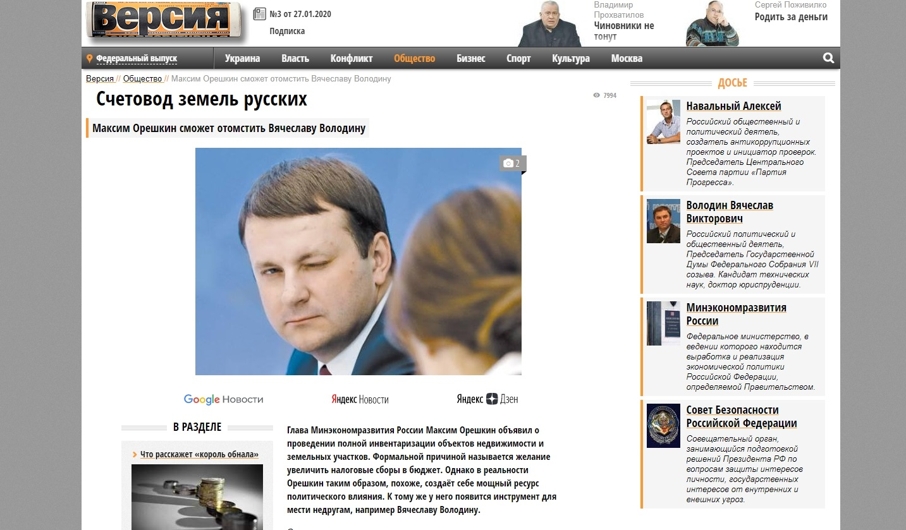
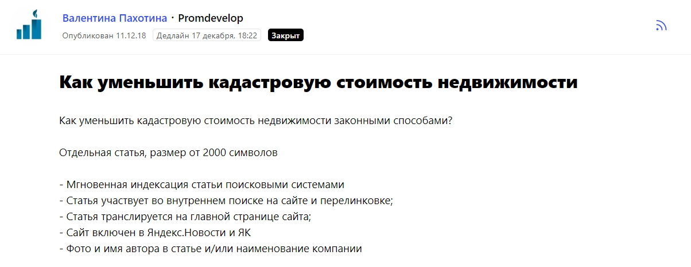
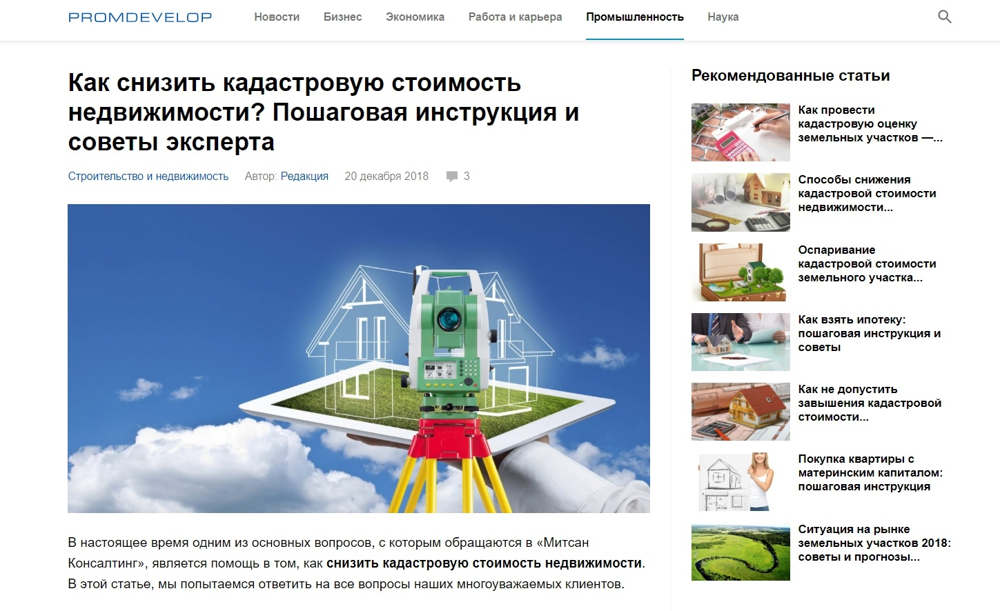

Меня зовут Дмитрий Желнин, я управляющий партнер компании Mitsan Consulting. Мы занимаемся юридическим консалтингом в сфере недвижимости и земельных отношений. Физические лица обычно обращаются к нам с вопросами по оформлению земли или разрешению каких-либо споров, связанных с захватом территорий, а юридические лица чаще всего хотят снизить кадастровую стоимость своей недвижимости и тем самым уменьшить размер налоговых выплат.

## Продвижение компании: что работает в нашей отрасли

За два года работы мы (я и команда Mitsan Consulting) поняли, что в юридической сфере лучше всего «продает» сарафанное радио. Если мы кому-то помогли, то этот клиент затем посоветует нас другому и так далее. Юристы — это как врачи, всегда спокойнее обратиться к тому специалисту, о котором хорошо отзывались твои знакомые.

Однако сарафанное радио — неуправляемый инструмент, его и инструментом называть не совсем корректно. Кто-то порекомендует, кто-то нет, а если клиенту что-то не понравилось, то это радио уже не будет работать нам на руку. Поэтому мы подключаем более понятные инструменты маркетинга и пиара — и в целом делим их на офлайн и онлайн-активности.

Офлайн подразумевает участие в профильных мероприятиях, чтение образовательных лекций, встречи по интересам и так далее. Важно находиться в юридическом сообществе, быть в курсе трендов рынка и так далее. На отраслевых конференциях можно встретить и клиентов, и партнеров, обрасти полезными знакомствами.

В то же время без онлайн-продвижения сейчас не сможет существовать, наверное, ни одна компания, и что касается онлайна, то тут все действия можно поделить на два направления. Первое — непосредственно реклама в сети, наша основная рекламная площадка — Facebook. Второе — общение с редакциями СМИ и участие в публикациях, а именно мы регулярно даем комментарии и пишем тексты для разных медиа. Публикации в СМИ относятся не к рекламе, а к пиару, так как они, прежде всего, влияют на узнаваемость и репутацию компании на рынке и среди ЦА.

## Почему мы решили повышать узнаваемость с помощью СМИ

Узнаваемость бренда — сложная сущность. Её практически невозможно измерить, даже опросы целевой аудитории не покажут объективную картину. При этом узнаваемость, репутация, имидж компании играют особую роль именно в сфере консалтинга.

Выше я сказал о сарафанном радио и рекомендациях, но ведь не все приходят к нам по отзывам. Допустим, мы запустили рекламу в Facebook, и человек кликнул по ссылке, перешел на наш сайт. И дальше что? Если он заинтересовался услугами компании, то мы должны каким-то образом убедить его, что нам точно можно доверять, что мы сможем помочь решить проблему. Тем более, недвижимость — это деньги человека, чаще всего, очень большие деньги. А Mitsan Consulting будет отвечать за них, и клиент будет спокоен, только если его уверенность в компетенции компании будет на уровне 100%.

> Когда потенциальный клиент переходит на сайт, он может, во-первых, прочитать благодарности от реальных заказчиков, во-вторых, посмотреть публикации с нашим участием в таких изданиях как «Коммерсантъ», «Российская газета», «РБК», «Аргументы и факты», разных отраслевых площадках. О чем это ему скажет? Что специалисты Mitsan Consulting — профессионалы в своем деле, и это подтверждают и отзывы, и статьи в крупных уважаемых медиа.

Плюс к этому, появления компании в СМИ не только влияют на репутацию, но могут даже привести клиентов напрямую. Хотя это скорее исключение из правил, но в нашей практике были такие случаи.

## Как мы поняли, что СМИ — эффективный инструмент продвижения

Расскажу о том, как мы в компании окончательно поняли, что публикации в СМИ — это действительно эффективный способ донести до клиентов какие-то важные мысли, связанные с недвижимостью, показать себя экспертами, повысить доверие к нам.

Как только Mitsan Consulting начала свою работу, мы с партнером стали думать, что делать в рамках продвижения, какие инструменты использовать, как заявить о себе на рынке. Договорились с известным радио (не хочу его называть), я выступил в эфире одной программы, где шел разговор о недвижимости. Это было не бесплатно, выход в эфир стоил приличных денег. После программы мы получили отклики от друзей, знакомых, но вау-эффекта не было.

Однако я не оставил затею сотрудничать со СМИ, но мне не хотелось вкладывать в это большие бюджеты. Тогда же я вышел на [сервис журналистских запросов Pressfeed](https://pressfeed.ru/) — это платформа, где журналисты и редакторы разных изданий (всего платформу используют более 5 тыс. редакций) ищут экспертов для будущих публикаций. Как все происходит: представителю компании или независимому специалисту нужно зарегистрироваться на Pressfeed, и он сразу увидит сотни запросов на любые темы. Дальше он выбирает подходящий запрос, отвечаете в соответствии с требованиями журналиста — обычно все его вопросы, указания, а также дедлайн по ответу указан в карточке запроса. Если вы написали развернутый комментарий по делу, то скорее всего, ваше мнение попадет в публикацию.

Все просто и понятно, а главное — не надо тратить много времени на переговоры с журналистами. Дали ответ — отправили — ждете публикацию.

> Что касается платы за использование сервиса, изначально регистрация на Pressfeed бесплатная для всех. Но на базовом аккаунте есть некоторые ограничения: доступны не все функции, отвечать можно всего на 3 запроса в месяц. Я решил подключить pro-аккаунт и использовать сервис по максимуму. Подписка на год — чуть более 40 тысяч рублей. Если начать потом измерять такой показатель как PR Value, то эта сумма окупается буквально с первой публикации, сделанной через сервис.

Так вот, я начал использовать Pressfeed, писать комментарии и почти сразу стали выходить материалы с моим участием. Я отвечал на запросы примерно полгода, и однажды увидел запрос от газеты «Версия». Журналист Ксения Веретенникова хотела узнать мнение экспертов о инициативе главы Минэкономразвития Максима Орешкина. Министр предложил провести полную инвентаризацию недвижимости. Эксперт должен был ответить на вопросы, зачем это нужно, сколько это будет стоить для бюджета и так далее.

  
[_Запрос от газеты «Версия»_](https://pressfeed.ru/query/53954)

Я написал комментарий, высказал мнение, привел цифры, и журналист принял его. При этом я оказался единственным экспертом в этом материале, а сама статья вышла и на сайте «Версия», и в печатной газете.

  
[_Публикация на сайте «Версия»_](https://versia.ru/maksim-oreshkin-smozhet-otomstit-vyacheslavu-volodinu)

В онлайне статью прочитали около 8 тысяч человек. Однако самое интересное произошло потом. Вскоре мне позвонил журналист «РБК» с подобным вопросом и предложил выступить в эфире телеканала «РБК». Так я попал в телевизор, да еще и бесплатно.

> На этом история не заканчивается — в компанию обратился новый клиент, который упомянул, что видел выпуск и у него есть некоторые вопросы по делу. В итоге мы начали с ним работать. Позже представитель «РБК» позвал меня записать еще один сюжет, уже по другой теме.

С этого момента стало ясно, что все-таки стоит вкладывать свои ресурсы в продвижение с помощью СМИ. Что этот канал коммуникации с ЦА прекрасно влияет на репутацию и даже приводит лиды.

## На какие темы говорим в СМИ

В приоритете темы, напрямую связанные с услугами компании — кадастровая стоимость, снижение имущественных налогов и так далее. Поэтому я часто отвечаю на запросы от **отраслевых СМИ**, которые пишут о недвижимости и земельных отношениях.

Например, для сайта Promdevelop я совместно с редактором подготовил полноценную статью с инструкцией, как законно снизить кадастровую стоимость недвижимости.

[_Запрос от Promdevelop_](https://pressfeed.ru/query/50758)

Материал получил хорошие отклики, надеюсь, читатели узнали и о нашей компании, и о том, что уменьшить кадастровую стоимость реально и что на этом можно сэкономить.

  
[_Статья в Promdevelop_](https://promdevelop.ru/kak-snizit-kadastrovuyu-stoimost-nedvizhimosti-poshagovaya-instruktsiy/)

Также через Pressfeed получится попасть в **топовые деловые СМИ**, тот же «Коммерсантъ».