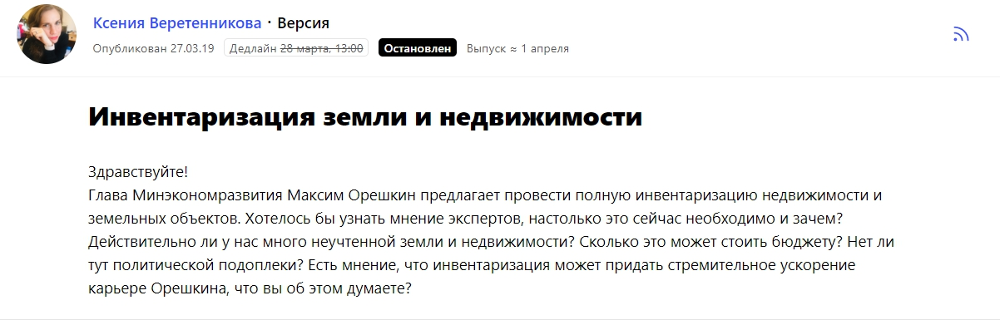

Меня зовут Дмитрий Желнин, я управляющий партнер компании Mitsan Consulting. Мы занимаемся юридическим консалтингом в сфере недвижимости и земельных отношений. Физические лица обычно обращаются к нам с вопросами по оформлению земли или разрешению каких-либо споров, связанных с захватом территорий, а юридические лица чаще всего хотят снизить кадастровую стоимость своей недвижимости и тем самым уменьшить размер налоговых выплат.

## Продвижение компании: что работает в нашей отрасли

За два года работы мы (я и команда Mitsan Consulting) поняли, что в юридической сфере лучше всего «продает» сарафанное радио. Если мы кому-то помогли, то этот клиент затем посоветует нас другому и так далее. Юристы — это как врачи, всегда спокойнее обратиться к тому специалисту, о котором хорошо отзывались твои знакомые.

Однако сарафанное радио — неуправляемый инструмент, его и инструментом называть не совсем корректно. Кто-то порекомендует, кто-то нет, а если клиенту что-то не понравилось, то это радио уже не будет работать нам на руку. Поэтому мы подключаем более понятные инструменты маркетинга и пиара — и в целом делим их на офлайн и онлайн-активности.

Офлайн подразумевает участие в профильных мероприятиях, чтение образовательных лекций, встречи по интересам и так далее. Важно находиться в юридическом сообществе, быть в курсе трендов рынка и так далее. На отраслевых конференциях можно встретить и клиентов, и партнеров, обрасти полезными знакомствами.

В то же время без онлайн-продвижения сейчас не сможет существовать, наверное, ни одна компания, и что касается онлайна, то тут все действия можно поделить на два направления. Первое — непосредственно реклама в сети, наша основная рекламная площадка — Facebook. Второе — общение с редакциями СМИ и участие в публикациях, а именно мы регулярно даем комментарии и пишем тексты для разных медиа. Публикации в СМИ относятся не к рекламе, а к пиару, так как они, прежде всего, влияют на узнаваемость и репутацию компании на рынке и среди ЦА.

## Почему мы решили повышать узнаваемость с помощью СМИ

Узнаваемость бренда — сложная сущность. Её практически невозможно измерить, даже опросы целевой аудитории не покажут объективную картину. При этом узнаваемость, репутация, имидж компании играют особую роль именно в сфере консалтинга.

Выше я сказал о сарафанном радио и рекомендациях, но ведь не все приходят к нам по отзывам. Допустим, мы запустили рекламу в Facebook, и человек кликнул по ссылке, перешел на наш сайт. И дальше что? Если он заинтересовался услугами компании, то мы должны каким-то образом убедить его, что нам точно можно доверять, что мы сможем помочь решить проблему. Тем более, недвижимость — это деньги человека, чаще всего, очень большие деньги. А Mitsan Consulting будет отвечать за них, и клиент будет спокоен, только если его уверенность в компетенции компании будет на уровне 100%.

> Когда потенциальный клиент переходит на сайт, он может, во-первых, прочитать благодарности от реальных заказчиков, во-вторых, посмотреть публикации с нашим участием в таких изданиях как «Коммерсантъ», «Российская газета», «РБК», «Аргументы и факты», разных отраслевых площадках. О чем это ему скажет? Что специалисты Mitsan Consulting — профессионалы в своем деле, и это подтверждают и отзывы, и статьи в крупных уважаемых медиа.

Плюс к этому, появления компании в СМИ не только влияют на репутацию, но могут даже привести клиентов напрямую. Хотя это скорее исключение из правил, но в нашей практике были такие случаи.

## Как мы поняли, что СМИ — эффективный инструмент продвижения

Расскажу о том, как мы в компании окончательно поняли, что публикации в СМИ — это действительно эффективный способ донести до клиентов какие-то важные мысли, связанные с недвижимостью, показать себя экспертами, повысить доверие к нам.

Как только Mitsan Consulting начала свою работу, мы с партнером стали думать, что делать в рамках продвижения, какие инструменты использовать, как заявить о себе на рынке. Договорились с известным радио (не хочу его называть), я выступил в эфире одной программы, где шел разговор о недвижимости. Это было не бесплатно, выход в эфир стоил приличных денег. После программы мы получили отклики от друзей, знакомых, но вау-эффекта не было.

Однако я не оставил затею сотрудничать со СМИ, но мне не хотелось вкладывать в это большие бюджеты. Тогда же я вышел на [сервис журналистских запросов Pressfeed](https://pressfeed.ru/) — это платформа, где журналисты и редакторы разных изданий (всего платформу используют более 5 тыс. редакций) ищут экспертов для будущих публикаций. Как все происходит: представителю компании или независимому специалисту нужно зарегистрироваться на Pressfeed, и он сразу увидит сотни запросов на любые темы. Дальше он выбирает подходящий запрос, отвечаете в соответствии с требованиями журналиста — обычно все его вопросы, указания, а также дедлайн по ответу указан в карточке запроса. Если вы написали развернутый комментарий по делу, то скорее всего, ваше мнение попадет в публикацию.

Все просто и понятно, а главное — не надо тратить много времени на переговоры с журналистами. Дали ответ — отправили — ждете публикацию.

> Что касается платы за использование сервиса, изначально регистрация на Pressfeed бесплатная для всех. Но на базовом аккаунте есть некоторые ограничения: доступны не все функции, отвечать можно всего на 3 запроса в месяц. Я решил подключить pro-аккаунт и использовать сервис по максимуму. Подписка на год — чуть более 40 тысяч рублей. Если начать потом измерять такой показатель как PR Value, то эта сумма окупается буквально с первой публикации, сделанной через сервис.

Так вот, я начал использовать Pressfeed, писать комментарии и почти сразу стали выходить материалы с моим участием. Я отвечал на запросы примерно полгода, и однажды увидел запрос от газеты «Версия». Журналист Ксения Веретенникова хотела узнать мнение экспертов о инициативе главы Минэкономразвития Максима Орешкина. Министр предложил провести полную инвентаризацию недвижимости. Эксперт должен был ответить на вопросы, зачем это нужно, сколько это будет стоить для бюджета и так далее.

[_Запрос от газеты «Версия»_](https://pressfeed.ru/query/53954)

Я написал комментарий, высказал мнение, привел цифры, и журналист принял его. При этом я оказался единственным экспертом в этом материале, а сама статья вышла и на сайте «Версия», и в печатной газете.

  
[_Публикация на сайте «Версия»_](https://versia.ru/maksim-oreshkin-smozhet-otomstit-vyacheslavu-volodinu)

В онлайне статью прочитали около 8 тысяч человек. Однако самое интересное произошло потом. Вскоре мне позвонил журналист «РБК» с подобным вопросом и предложил выступить в эфире телеканала «РБК». Так я попал в телевизор, да еще и бесплатно.

> На этом история не заканчивается — в компанию обратился новый клиент, который упомянул, что видел выпуск и у него есть некоторые вопросы по делу. В итоге мы начали с ним работать. Позже представитель «РБК» позвал меня записать еще один сюжет, уже по другой теме.

С этого момента стало ясно, что все-таки стоит вкладывать свои ресурсы в продвижение с помощью СМИ. Что этот канал коммуникации с ЦА прекрасно влияет на репутацию и даже приводит лиды.

## На какие темы говорим в СМИ

В приоритете темы, напрямую связанные с услугами компании — кадастровая стоимость, снижение имущественных налогов и так далее. Поэтому я часто отвечаю на запросы от **отраслевых СМИ**, которые пишут о недвижимости и земельных отношениях.

Например, для сайта Promdevelop я совместно с редактором подготовил полноценную статью с инструкцией, как законно снизить кадастровую стоимость недвижимости.

[_Запрос от Promdevelop_](https://pressfeed.ru/query/50758)

Материал получил хорошие отклики, надеюсь, читатели узнали и о нашей компании, и о том, что уменьшить кадастровую стоимость реально и что на этом можно сэкономить.

  
[_Статья в Promdevelop_](https://promdevelop.ru/kak-snizit-kadastrovuyu-stoimost-nedvizhimosti-poshagovaya-instruktsiy/)

Также через Pressfeed получится попасть в **топовые деловые СМИ**, тот же «Коммерсантъ».

Комментировал ситуацию о строительстве поликлиники — с точки зрения юриста.

  
[_Комментарий в «Коммерсанте»_](https://www.kommersant.ru/doc/3844312)

> Выходы в таких уважаемых изданиях влияют на имидж компании, прежде всего, в глазах наших b2b-клиентов. Это показатель экспертности для делового сообщества, когда тебя «печатают» в Forbes, «РБК», «Коммерсантъ». Скажем так, это всегда плюс в карму бренда.

Однако среди наших заказчиков есть и обычные люди, которые обращаются к нам по другим проблемам — нужно оценить участок в садовом товариществе и тому подобное. Мы хотим давать полезную информацию в СМИ и для них тоже. Для этого необходимо идти в массовые издания, например, «Аргументы и факты». Как раз был запрос от редакции о том, как сэкономить на налогах.

[_Запрос от сайта «Аргументы и факты»_](https://pressfeed.ru/query/51931)

В своем комментарии я объяснил, как сделать перерасчет налогов на недвижимость.

  
[_Комментарий для сайта «Аргументы и факты»_](https://aif.ru/money/mymoney/keshbek_ot_gosudarstva_kak_zakonno_sekonomit_na_nalogah)

Через Pressfeed мы сотрудничали с порталами E-xecutive, «Оценка инвестиций», «Коммерческий директор», 6 раз отправляли комментарии для профильной площадки Domofond.ru, сейчас ждем большой комментарий о [законе кадастровой оценки](https://pressfeed.ru/query/63899) в газете «Промышленные страницы Сибири» (вышли на эту газету также через Pressfeed).

  
[_Запрос от газеты «Промышленные страницы Сибири»_](https://pressfeed.ru/query/63899)

В компании нет пиарщика (но есть копирайтер на подмоге), я сам мониторю все запросы на сервисе, захожу на платформу 2-3 раза в день и выбираю то, что считаю интересным. Далее отправляю запрос копирайтеру и надиктовываю ответ в аудиосообщениях. Копирайтер у нас на фрилансе: он помогает мне «причесывать» тексты, приводить их в читабельный вид. Затем я высылаю готовый комментарий журналисту издания. Без профессионального автора мне было бы тяжелее готовить ответы и, скорее всего, редакции реже бы принимали их: я же юрист, мне не так просто избавиться от сложных конструкций в своей речи.

> На всю работу со СМИ у меня уходит 15-20 минут в день, не более. В неделю я отвечаю на 2-3 запроса. То есть всего час в неделю — и ваша компания появляется в хороших СМИ, тем самым увеличивает охваты свой целевой аудитории. По деньгам тоже получается немного: подписка на сервис плюс гонорар копирайтера.

## Как пытаемся выходить на журналистов напрямую (тоже с помощью Pressfeed)

В декабре 2019 я прослушал [вебинар от Pressfeed](https://www.youtube.com/watch?v=Vara0MTw8_o&feature=youtu.be) с названием «Дистрибуция контента. Как увеличить отдачу от публикации в 10 раз», его вел создатель сервиса Константин Бочарский. Стало понятно, что мы используем далеко не все возможности, которые могут дать СМИ. В будущем хотим глубже погружаться в контент-маркетинг, а именно стараться объяснять клиентам суть наших услуг. Дело в том, что мы снижаем кадастровую стоимость необычным способом, он полностью законный, но не очевидный. И порой те, кто мог бы к нам обратиться и действительно платить меньше налогов, просто не понимает, что у него вообще есть такая проблема как завышенная кадастровая стоимость недвижимости и что её можно легко снизить.

> Так что планируем писать больше полноценных текстов для СМИ, не ограничиваться только комментариями. Но для этого нужно общаться с журналистами напрямую, и не с любыми журналистами, а которые пишут конкретно на тему недвижимости. Чтобы найти таких корреспондентов, опять же удобнее использовать Pressfeed.

Как искать: зайти во вкладку «Контакты» — ввести запрос «Недвижимость» — отметить категорию «Журналисты». Сервис покажет всех журналистов, которые при заполнении профиля указали специализацию на недвижимости.

  
_Поиск журналистов_

Я отобрал несколько человек, нашел их в социальных сетях (на Фейсбуке) и написал им. Когда обращаюсь к журналисту, представляюсь и сразу предлагаю тему, а именно хотелось бы сделать целую серию публикаций о «годе проведения оценки». Это такое понятие в отрасли, когда недвижимость оценивают в течение года и это происходит в несколько этапов. Будет полезно рассказать читателям о каждом этапе оценки, подсказать, что делать, куда смотреть, какие документы проверять, чтобы в конце года госорганы не предъявили какую-то неадекватную кадастровую стоимость.

Уже несколько журналистов ответили на мое предложение, начнем сотрудничать с ними. Между тем, со всеми журналистами можно связаться прямо через сервис — с помощью внутренних чатов платформы. Для этого нужно перейти в профиль журналиста, убедиться, что он работает по вашей теме, и написать ему на сервисе. Как только вы напишите сообщение с предложениями, журналисту придет уведомление на почту.

Вот пример с журналистом из «Коммерсанта»:

## Почему после публикации в СМИ работа только начинается

Любая публикация в медиа — это отлично, и даже небольшой комментарий делает вклад в узнаваемость компании. Но если в СМИ вышла статья с вашим участием, а вы просто посмотрели ее, порадовались и закрыли, то она не сделает такой вклад в развитие бизнеса, который могла бы. Этим я хочу сказать, что после выхода публикации работа с ней только начинается. Публикацию (особенно в значимых в вашей отрасли медиа) нужно показать целевой аудитории — да, конечно, кто-то прочитает её и так, но охват можно увеличить и тем самым, возможно, привлечь больше заинтересованных клиентов.

Что происходит после того, как в СМИ появляется публикация с упоминанием Mitsan.pro?

Во-первых, делаем пост о выходе материала в группу Facebook, там размещаем ссылку на оригинал статьи.

Во-вторых, без изменений копируем статью на сайт компании (с указанием первоисточника). Таким образом, пользователь, который приходит на сайт, может сразу посмотреть и статьи, и издания, в котором они выходили.

В-третьих, самые интересные публикации мы ставим на продвижение в Facebook. Рекламу запускаем на 4-5 дней, бюджеты закладываем небольшие. Пока окончательно не определили, что лучше — делать рекламу с ссылкой на первоисточник статьи, то есть именно на СМИ, либо же с ссылкой на текст на нашем сайте. Проводим тестирования, но склоняемся к тому, чтобы все-таки вести трафик на сайт с помощью статьи, а там уже читатель увидит, где был опубликован материал, прочитает другие статьи или же захочет перейти на главную страницу сайта,

А вообще для сферы консалтинга считаю рекламу в Facebook одним из самых эффективных способов продвижения, по крайней мере, она у нас работает намного лучше, чем реклама в Директе, приводит много заявок.

## Как можно увидеть эффект от публикаций в СМИ

Пиар-продвижение в СМИ сложно связать с продажами и увеличением количества клиентов напрямую. Даже когда статья приводит нового заказчика, это не значит, что другие публикации сработают также, скорее, это просто удачное стечение обстоятельств.

Чтобы делать какие-то выводы, лучше смотреть на косвенные показатели:

* рост брендовых поисковых запросов по названию компании или имени эксперта;
* анализировать трафик на сайт компании после выхода очередной публикации;
* обязательно спрашивать у клиентов, как они узнали о компании.

В рамках Mitsan Consulting мы оцениваем общее положение дел — в 2019 году мы помогли бОльшему количеству клиентов, чем в 2018 году, и по итогу года сэкономили нашим заказчикам около 300 миллионов рублей только на сокращении налогов на недвижимость. Выросли обороты компании, продажи идут в гору, и это результат и работы всей команды, и всех маркетинговых и пиар активностей, в том числе продвижения в СМИ.