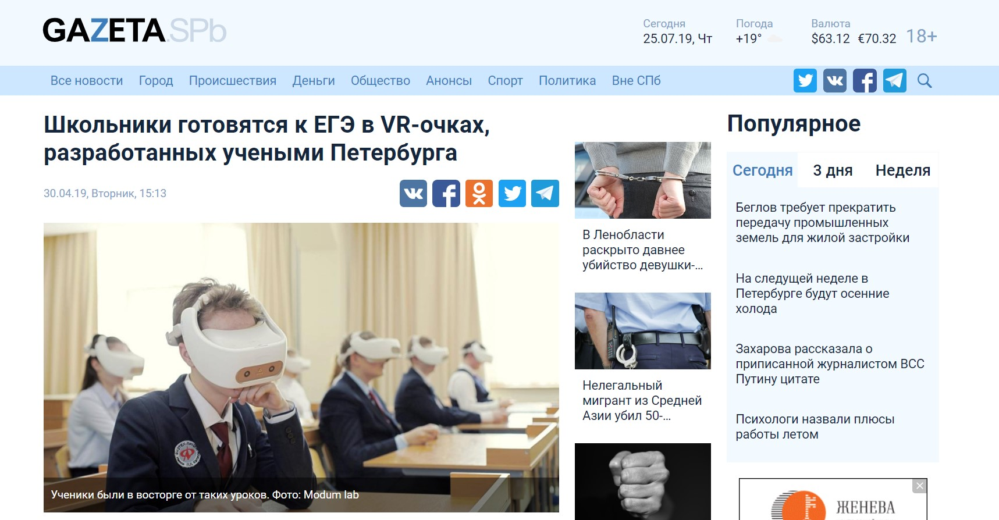
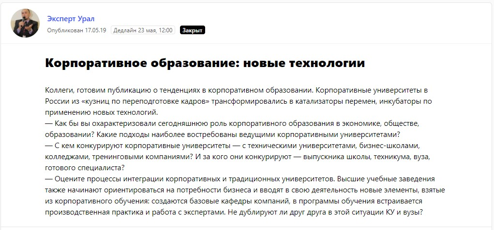
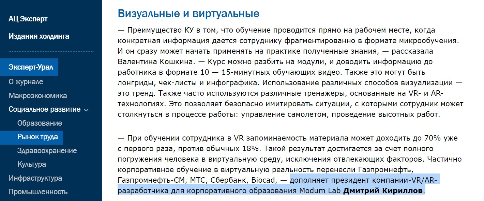
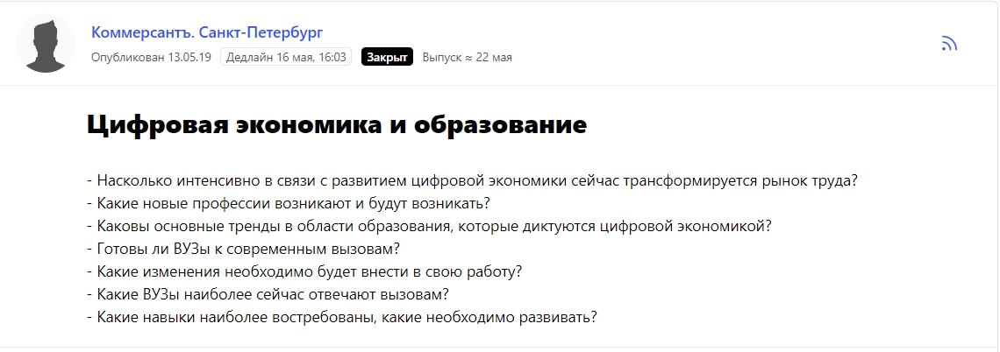
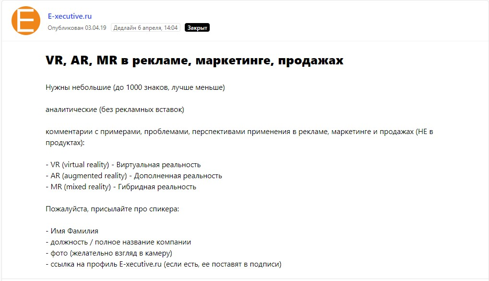
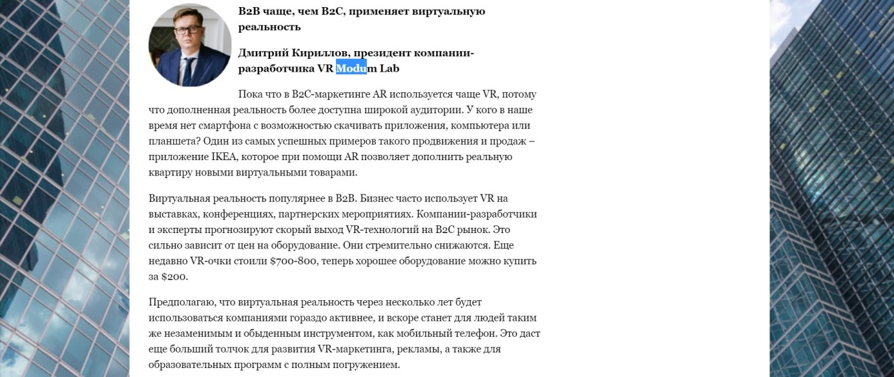
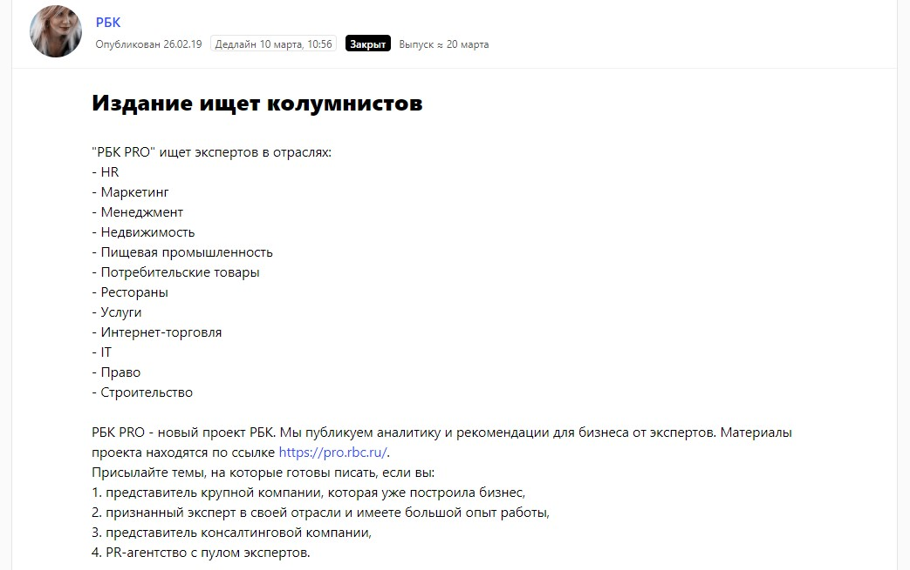
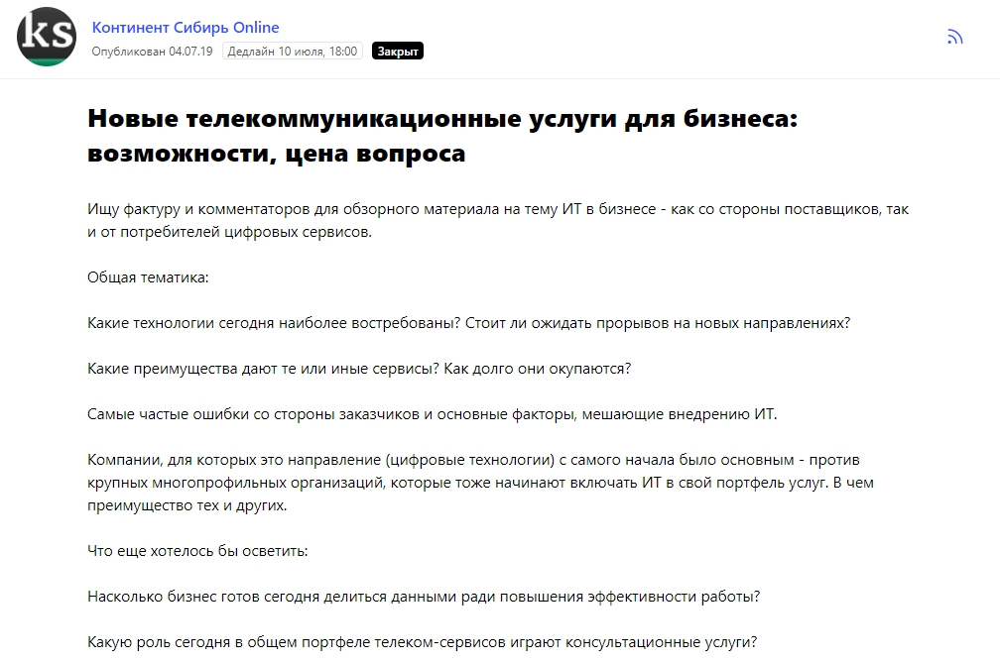
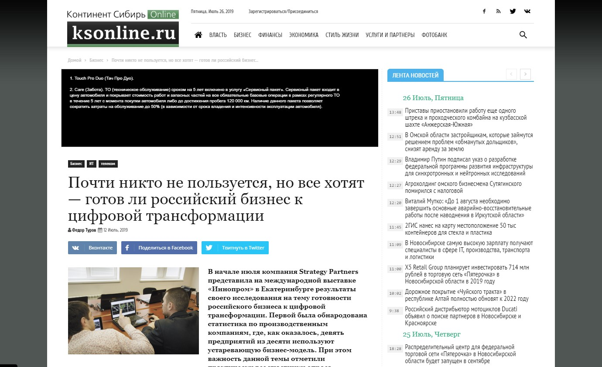
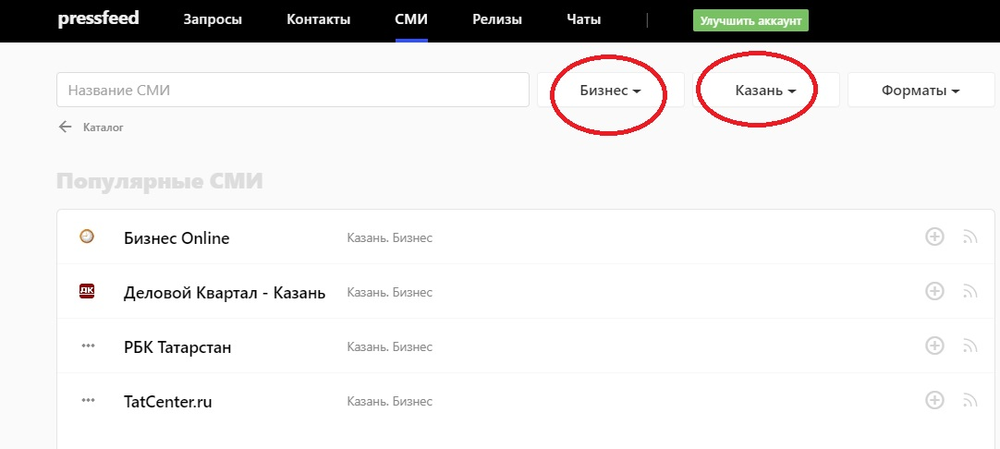

_Рассказывает Каролина Подплетько, руководитель пресс-службы компании Modum Lab._

Мы ― компания Modum Lab ― занимаемся разработкой VR/AR-проектов. До недавнего времени специализировались на заказах для крупного бизнеса, но сейчас запустили и активно продвигаем новое направление ModumEducation ― хотим внедрять VR/AR-технологий в школьное и университетское образование. Например, студенты могут использовать виртуальную реальность для подготовки к экзаменам или публичным выступлениям, также подобные технологии могут стать основой для практических занятий. VR/AR предполагает массу возможностей как для развлечения, так и для обучения.

Целевая аудитория Modum Lab делится на две группы: бизнес-направление ― это промышленные и строительные компании, банки, крупный бизнес. Сегодня среди наших заказчиков ― «Газпромнефть», BIOCAD, «Альфа банк», «ВТБ», «Сбербанк» и другие корпорации. По ModumEducation ― государственные и окологосударственные образовательные учреждения, вузы, частные школы и детские образовательные центры. В наших интересах работать со всеми, так что продвижение компании направлено на обе группы.

## Как технологичный проект находит клиентов

Мы работаем в b2b-сфере и продаем дорогой продукт. Чаще всего новые крупные клиенты приходят по сарафанному радио ― это случается, когда известные компании, для которых мы уже создали классный VR/AR-проект, рассказывают о своих технологичных новинках в СМИ или на различных бизнес-мероприятиях. Опыт одних корпораций мотивирует других создать и внедрить для своих клиентов или сотрудников что-то подобное. Так или иначе, лидеры рынка стараются не отставать друг от друга. Время от времени участвуем в тендерах, особенно часто их запускают компании из сфер детского образования и промышленности. Также руководители Modum Lab часто выступают на профильных выставках, конференциях и рассказывают о возможностях VR/AR-технологии ― там тоже всегда есть шанс познакомиться с будущим бизнес-партнером.

> Знакомства с потенциальными клиентами происходят точечно. Нам нет смысла использовать прямую рекламу или запускать рекламу в соцсетях, потому что для сложных бизнесов со сложным продуктом такие инструменты продаж не работают. При этом, чтобы как можно больше потенциальных клиентов захотели создать собственный VR/AR-проект, мы должны постоянно говорить о преимуществах этой технологии, вести политику открытости, быть публичной компанией.

Для начала нужно вообще объяснить общественности и в частности собственникам крупного бизнеса, что такое VR/AR. Поэтому одно из главных направлений работы по продвижению Modum Lab ― это качественный и грамотный пиар.

## Почему мы вкладываем много сил в пиар

Мы выделяем 4 причины, почему технологичной компании, которая продает сложный продукт, нужно обязательно использовать пиар-инструменты.

**Во-первых**, сегодня на российском рынке виртуальной реальности десятки многообещающих стартапов, но на деле же можно пересчитать по пальцам тех VR-разработчиков, которые могут похвастаться готовыми и уже работающими в конкретных компаниях проектами. Большинство стартапов ― просто демо-версии, которые еще не научились нормально использовать VR/AR-технологии. Однако это все равно наши конкуренты, они сильно «размывают» рынок.

Пиар для нас ― это единственный эффективный способ рассказать как о технологии, так и о наших уже действующих решениях для бизнеса, и за счет этого выделить Modum Lab на фоне по сути нереализованных демо-проектов.

**Во-вторых**, часть крупных игроков бизнеса просто не понимает, зачем внедрять виртуальную и дополненную реальность в свою компанию, что это может дать. То есть еще одна цель пиар-продвижения ― доказать бизнесу и государству на примерах наших клиентов, что виртуальная реальность ― это не только игры, но и полезный прикладной инструмент.

**В-третьих**, мы сталкиваемся с недоверием компаний к VR/AR-технологиям. Они знают, что это такое, но видят в виртуальной реальности какие-то опасности, думают, что это может повредить их клиентам. Часто приходится развенчивать мифы, например, о том, что VR укачивает или вызывает слепоту. Для этого мы проводим собственные исследования, делимся с аудиторией результатами экспертных и медицинских исследований. На данном этапе развития технологии мы готовы сделать все, чтобы VR/AR перестал вызывать у пользователей страх или недопонимание.

**В-четвертых**, пиар не считается инструментом прямых продаж, но безусловно косвенно он влияет на продажи. И выступления, и публикации в различных СМИ повышают узнаваемость компании и развивают личный бренд руководителя ModumLab. Становится значительно проще завязывать новые контакты, нам поступает больше приглашений на участие в бизнес-встречах, мы опережаем конкурентов по присутствию в медиаполе. Все это, в конце концов, приводит к заключению контрактов.

## Публикации в СМИ могут охватить больше, чем выступления

Директор Modum Lab и руководители подразделений регулярно принимают участие в отраслевых конференциях, не пропускают выставки, связанные с технологиями, выступают на бизнес-форумах. Такие мероприятия ― великолепные площадки для нетворкинга и поиска новых клиентов.

Однако отраслевые встречи работают только на участников мероприятий, это безусловно важные для нас люди, но мы хотели бы охватывать более широкую аудиторию ― как можно больше собственников крупного и среднего бизнеса, так и топ-менеджеров, причастных к образовательным проектам. Поэтому мы уже много лет плотно сотрудничаем с всевозможными медиа-площадками: от федеральных бизнес-изданий, таких как «РБК» и Forbes, до профильных площадок о рекрутинге, технологиях и образовании. Наша задача ― выпускать как можно больше публикаций в СМИ с участием экспертов компании Modum Lab, в которых мы сможем делится опытом и готовыми кейсами.

Сейчас мы ежемесячно инициируем 8-15 публикаций с упоминанием Modum Lab. Пока этого достаточно, чтобы опережать наших конкурентов и оставаться на слуху.

> Когда компания постоянно находится в медиаполе, то почти ежедневно о ней узнают миллионы людей, публикации в СМИ охватывают самую широкую аудиторию: среди них наверняка найдутся те, кто заинтересован в продукте компании и хотел бы внедрить VR/AR-технологии в свой бизнес, или же те, кто только слышал о виртуальной реальности, но готов разобраться в этой технологии подробнее.

Каждая публикация делает свой вклад в узнаваемость компании и формирует экспертный образ бренда Modum Lab, выделяет нас среди конкурентов-стартапов.

## Как работать со СМИ совершенно бесплатно

Публикации в СМИ ― не только эффективный, но еще и практически бесплатный канал продвижения. За выпуск текста даже в самых именитых изданиях мы не платили ни разу, рекламные статьи не покупали. Секрет в том, что вы безвозмездно даете журналистам интересную и полезную для их читателей информацию ― редакция ставит мнение эксперта компании или статью от лица компании как нерекламный материал.

Наши тематики в медиа ― это технологии в целом, цифровизация бизнеса и производства, технологичные новинки в образовании. Это могут быть темы «VR для HR» или «VR для промышленности» и тому подобное.

Если вы предлагаете рынке по-настоящему интересный продукт, он даже не обязательно должен быть связан с технологиями, то советуем сотрудничать с изданиями по следующим принципам.

Итак, советы, как попасть в желаемое СМИ бесплатно.

**Совет 1.** Наблюдайте за исследованиями в вашей отрасли или сами проводите аналитику рынка, ищите примеры, подтверждающие данные (можно из вашей практики), упаковывайте их в интересную форму и рассылайте по изданиям. Даже так: сначала предложите аналитические данные одной площадке ― той, в которую хотите попасть больше всего. Скажите, что это эксклюзив ― так редакция будет более охотно работать с вами.

**Совет 2.** Если делаете какие-то проекты, которые несут реальную пользу обществу (а не надуманную бизнесом), то о них нужно говорить, говорить и еще раз говорить. Нередко мы совместно с партнерами организовываем мероприятия, которые бывают интересны СМИ как инфоповод. Так было с подготовкой школьников к ОГЭ по физике при помощи технологий виртуальной реальности. Об этом событии написали больше десятка изданий, сняли сюжеты федеральные телеканалы.

_Пример публикации_

**Совет 3.** Если компания нацелена на b2b-сегмент, следует делить все темы по отраслям. Например, строительному порталу наверняка будет интересно узнать об использовании VR для строительства, изданию о банках ― о виртуальной реальности в банковской сфере и так далее. Когда пишите в профильное издание ― сразу делайте акцент на их отрасль, не пытайтесь предлагать какие-то общие темы.

Пример: статья о запуске совместного проекта «Газпромнефти», HTC и Modum Lab по созданию цифровых образовательных программ с использованием VR-технологий. Материал был [опубликован на отраслевом портале Neftegaz.ru](https://neftegaz.ru/news/education/200276-gazprom-neft-sovmestno-s-htc-i-modum-lab-vnedryaet-immersivnye-obrazovatelnye-tekhnologii-foto/). Его прочитали более 4 тыс. пользователей ― это отличный показатель для профильного ресурса, ведь читатели площадки ― только те люди, которые работают в нефтегазовой сфере.

**Совет 4.** Параллельно с тем, что вы общаетесь в редакциями напрямую, обязательно следите за запросами от журналистов на специальной платформе [Pressfeed](https://pressfeed.ru/). Это сервис, которым пользуются более 4,5 тысяч изданий (в том числе самые топовые). С его помощью сотрудники СМИ ― как журналисты, так и редакторы ― ищут героев и экспертов для публикаций. Это происходит так: сотрудник издания публикует запрос с указанием темы, вопросов и даты, до которой он будет принимать ответы. Вы выбираете запрос, пишите мнение эксперта компании и высылаете его до дедлайна. Если ответ подходит, то через некоторое время комментарий появится в материале издания.

Зарегистрироваться на сервисе можно бесплатно. При этом на базовом аккаунте действует множество ограничений — например, можно отвечать всего лишь на 3 запроса в месяц. Кроме того, пользователи PRO-аккаунта видят запросы раньше, чем все остальные. Там есть и другие функции — добавление журналистов в «Контакты», также можно переписываться с редакциями в специальном внутреннем чате сервиса.

Так именно через сервис мы работали с журналом «Эксперт». Вопрос от журналиста касался новых технологий в образовании, это на 100% наша тематика.

  
[_Запрос от журнала «Эксперт»_](https://pressfeed.ru/query/55593)

Мы оперативно подготовили комментарий от лица президента Modum Lab. В итоге вышел текст, в котором президент компании рассуждает об образовании вместе с Министром образования РФ и другими спикерами ― теми, кто является представителями нашей целевой аудитории в направлении Education.

  
[_Фрагмент публикации в «Эксперте»_](http://www.acexpert.ru/archive/nomer-24-800/kadri-eto-lyudi.html)

Близкую тему освещали и в «Коммерсанте». Журналист опубликовал на сервисе запрос с вопросами о цифровой экономике и образовании.

[_Запрос от издания «Коммерсантъ. Санкт-Петербург»_](https://pressfeed.ru/query/55418)

В статье также был размещен комментарий президента Modum Lab.

Или в другой раз был запрос непосредственно о VR/AR-технологиях от бизнес-портала E-xecutive.

  
[_Запрос от E-xecutive_](https://pressfeed.ru/query/54146)

Руководитель компании рассказал, что на b2c-рынке бренды часто внедряют дополненную реальность (AR), а вот технологии виртуальной реальности в большей степени используют в b2b-секторе.

  
[_Комментарий на E-xecutive_](https://www.e-xecutive.ru/management/marketing/1990368-virtualnaya-realnost-obnazhila-problemy-marketinga)

Pressfeed часто выступает площадкой для первичного знакомства с журналистом. Бывает, что пиарщик пытается зайти в новое издание, но коммуникация не клеится, или его сразу переводят в отдел продаж. Тогда нужно пробовать зайти через сервис. Например, с РБК PRO мы познакомились напрямую, однако редакторы издания время от времени ищут колумнистов с помощью запросов на Pressfeed.

  
[_Пример запроса от РБК PRO_](https://pressfeed.ru/query/52971)

Через запрос мы недавно познакомились с корреспондентом Forbes и дали

комментарий на тему VR/AR-технологий. На момент написания этого текста материал на этапе согласования.

**Совет 5.** Если вы работаете на федеральном уровне, не оставляйте в стороне региональные площадки. Конечно, большинство корпораций сосредоточено в столице, но крупные компании есть и в регионах, и вполне вероятно, что они заинтересованы в вашем продукте.

Конечно, топ-менеджеры в региональных холдингах также читают федеральные сайты «Коммерсантъ», «Ведомости», «РБК», но все же эффективнее будет воздействовать на них и через местные деловые СМИ.

Был запрос о новых технологиях в бизнесе от издания из Новосибирска «Континент Сибирь Online».

[_Запрос от издания «Континент Сибирь Online»_](https://pressfeed.ru/query/57583)

Мы не пропустили его, так как среди читателей портала могут быть представители крупного бизнеса Сибирского региона, а мы хотели бы создавать VR проекты для компаний со всей России.

  
[_Публикация в издании «Континент Сибирь Online»_](https://ksonline.ru/351664/pochti-nikto-ne-polzuetsya-no-vse-hotyat-gotov-li-rossijskij-biznes-k-tsifrovoj-transformatsii/)

На Pressfeed удобно искать региональные площадки: нужно зайти в [базу СМИ](https://pressfeed.ru/smi-catalog) и поставить фильтры. Допустим, ищем бизнес-издания в Казани.

Ставим фильтры «Казань» в регионах и «Бизнес» в тематике.

_Фильтры в базе СМИ_

Итак, можем смело отправлять предложения в редакции этих ресурсов.

**Совет 6.** Во времена популярности контент-маркетинга параллельно с публикациями в уже проверенных СМИ, важно заниматься развитием собственного медиа. Мы ведем [блог Modum Lab](https://medium.com/modum-lab) на блог-платформе Medium.

Для того, чтобы сделать контент интересным, не рекламируем ваши продукты, а объективно рассказываем о технологии, о проблемах ее внедрения, отвечаем на часто задаваемые вопросы и развенчиваем мифы. Блог повышает экспертность компании в глазах потенциальных партнеров: перед тем, как будущий клиент будет готов заключить сделку с вами, хороший блог окончательно подтвердит правильность его намерений.

## Можно ли измерить эффективность от публикаций в СМИ

Внутри компании мы ведем таблицу, в которой собираем ссылки на опубликованные материалы. Упоминания компании и наших спикеров ищем через стандартные поисковики или «Яндекс.Новости». С декабря 2018 года по июль 2019 года вышло более 100 публикаций с участием компании, 70% мы сделали через прямые контакты, а 30% ― через Pressfeed.

При анализе эффективности работы со СМИ сложно использовать прозрачные метрики или устанавливать жесткие KPI. Важно постоянно следить за изменением разных показателей и сравнивать их в разных моментах (например, январь 2018 и январь 2019) ― смотреть на рост числа приглашений на мероприятия и выставки, на увеличение числа предложений о партнерстве, фиксировать повышение интереса к нашим продуктам, считать количество сделок за год. Если показатели меняются в позитивную сторону, то значит, система пиара и маркетинга работает правильно, и каждый инструмент играет роль в развитии бизнеса.

> Хотя бывает и так, что публикации в СМИ сразу приводят клиентов. Например, после [публикации на «РБК» о строительстве](https://pro.rbc.ru/news/5c0e5d1c9a79472d9939aac6) к нам массово обращались застройщики с вопросами о технологии, просили сделать «так же, как в приложенных видео».

В любом случае потенциальные клиенты (даже если они пришли благодаря знакомству на выставке или сарафанному радио) всегда ищут информацию о компании в СМИ, читают статьи о компании. Это фактор, который подталкивает их к принятию решения ― подписывать с компанией контракт или нет.

## Рост компании в цифрах

За 2018 год компания Modum Lab выросла во всех отношениях: выросли и доходы бизнеса, и команда сотрудников, появились новые клиенты и партнеры, интересные масштабные проекты.

> На конец 2018 итоговый финансовый результат компании Modum Lab составил 109 млн рублей. На сегодня мы занимаем одну из лидирующих позиций в России среди VR/AR-разработчиков.

Хочется отдельно отметить, что объем глобального рынка VR в 2018 году по данным аналитиков IDC достиг $12 млрд, а через год может наблюдаться рост до $20,4 млрд. При этом в [GoldmanSachs оценивают](https://www.goldmansachs.com/insights/podcasts/episodes/05-18-2018-heather-bellini.html), что капитализация VR–рынка к 2020 году и вовсе «подскочит» до $80 млрд.Это значит, что рынок VR-технологий растет бешеными темпами, и компании (особенно в России) только начинают узнавать о возможностях виртуальной реальности.

У Modum Lab впереди еще много работы по завоеванию рынка. Наша цель ― не заменить впечатления от реальной жизни виртуальной реальностью, а внедрить VR в такие важные сферы, как образование, медицина, маркетинг, безопасность и промышленность.