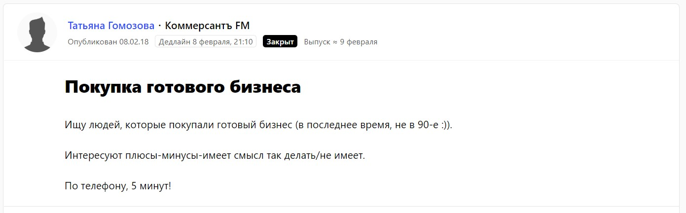
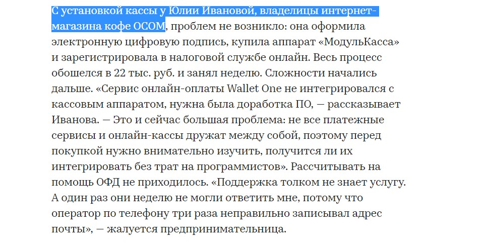

#### Продукт и целевая аудитория

Все началось с моей любви к кофе. Я считаю, что только качественный свежеобжаренный кофе имеет безупречный вкус и тот самый бодрящий эффект. Долгое время я заказывала кофе в интернет-магазине «ОСОМ Кофе». Однажды в соцсетях магазина появилось объявление от владельцев: если вы хотите купить наш бизнес — мы готовы обсудить условия. Оказалось, что магазин дохода не приносил. Я решила рискнуть. Так, с января 2018 года он принадлежит мне.

Мы занимаемся продажей specialty-кофе с доставкой по всей России.

Сейчас мы работаем на две целевые аудитории.

* Во-первых, это владельцы бизнеса или руководители крупных отделов, которые хотят централизованно закупать кофе для сотрудников.
* Во-вторых, это просто любители кофе, обычные покупатели. Это люди, которые действительно разбираются в кофе, его сортах, странах производства, понимают, в чем преимущества свежеобжаренного кофе.

Согласно [исследованию](https://iz.ru/654393/roksana-avetisian/rossiiane-perekhodiat-s-chaia-na-kofe) газеты «Известия», в 2017 году россияне стали потреблять на 20% больше кофе. Пока средний объем потребления кофе на человека в России всего 800 грамм, и по сравнению с Европой — это очень мало. В Финляндии этот показатель — 11 килограмм на человека! Кофейная культура в России только развивается, и спрос на хороший кофе растет.

#### Какие инструменты продают?

Как только я купила магазин, я начала продумывать и реализовать систему продвижения бренда. На этом этапе развития компании мы хотим формировать имидж интернет-магазина. На самом деле, для ценителей кофе невероятно важен бренд магазина и даже личный бренд обжарщика. Мой бизнес только начинает приносить прибыль, поэтому я решила по максимуму использовать все бесплатные инструменты для продвижения и сделать ставку на контент-маркетинг.

Моя компания должна «воспитывать» кофейных гурманов. Мы стараемся сформировать экспертную позицию, объяснять людям, почему нужно покупать кофе высшего качества и свежей обжарки, чем он отличается по вкусу, почему нужно платить за это деньги.

Основные бесплатные инструменты:

* [Instagram](https://www.instagram.com/osomcoffee/)
* Яндекс.Дзен
* [Pressfeed](https://pressfeed.ru/)

В будущем планируем найти время для email-рассылки. По моему опыту, эти инструменты реально продают.

#### 1. Социальные сети

Прошлые владельцы магазина вели соцсети, и у них хорошо получалось — мне досталась лояльная аудитория подписчиков, большинство из которых — наши постоянные клиенты.

Сейчас я больше работаю с Instagram, чем с другими социальными сетями. Мы выкладываем атмосферные фотографии с нашим кофе, рассказываем о новинках, интересных сортах, акциях, о планах. Посты выпускаем нечасто — примерно раз в неделю, но зато стараемся быть полезными, а не просто спамить фотографиями.

###### Instagram интернет-магазина

Лояльные подписчики всегда оставляют к постам комментарии, спрашивают о новых поставках и делают заказы через Директ.

Недавно для привлечения новых пользователей мы сделали коллаборацию с авторами книг по рекламе и пиару — конкурс, где разыгрывается набор из книг и кофе. За два дня он принес больше 100 подписчиков, но бума продаж пока не случилось. В любом случае мы экспериментируем, проводим аналитику — что же больше интересно нашим клиентам. Мы замечали, что если выходит пост о новинке, редком сорте — сразу может поступить несколько заказов.

#### 2. Блог

Я сразу решила, что у нас будет свой блог. Мне нравится писать о кофе, и мы запустили блог на «Яндекс.Дзен».

Пока делаем самое стандартное — рецепты из кофе, обзоры аксессуаров для заваривания. Однако писать хочется что-то социально ответственное. Например, как работают фермеры в разных странах мира, почему арабика может погибнуть из-за изменения климата, почему нужно отказаться от пластиковых трубочек к стаканчику кофе. Полезности можно найти и в интернете, а о кофейной индустрии как таковой на русском очень мало пишут. Четкого контент-плана мы не делаем, хотя в будущем планируем перейти на регулярный режим постинга.

В последнее время публикуем короткие советы в формате нарратива. Фото и немного текста. Такой формат удобно сохранять в закладки на телефоне и читать, когда будет время.

###### Нарратив в блоге

Я внимательно слежу за статистикой «Яндекс.Дзена», потому что для нас это новый инструмент, требующий быстрых корректировок по контенту. Подписчики растут медленно, но думаю, блог еще «выстрелит», и в будущем «Дзен» поможет продавать больше кофе за счет нативной рекламы.

#### 3. Публикации в СМИ

У меня большой опыт работы PR-специалистом в IT-компании, и я знаю, как нужно работать со СМИ. Упоминание в крупных массовых СМИ влияют на узнаваемость и имидж. С помощью СМИ ваш бренд могут заметить те, кто вам интересен. И рано или поздно прийти к вам. Сейчас для нас важно, чтобы как можно больше людей соприкасались с нами, чтобы бренд был на слуху.

Я потратила всего 5 минут и получила бесплатную публикацию в одном из крупнейших российских медиа.

Прежде всего нам интересны деловые медиа, ведь их читает наша основная целевая аудитория — предприниматели, руководители. Деловым СМИ редко интересны истории о кофе, но публиковаться можно с косвенными бизнес-темами. Например, я давала комментарий для издания «Коммерсантъ FM». Я попала туда с помощью сервиса журналистских запросов [Pressfeed](https://pressfeed.ru/). Это профессиональная платформа, где журналисты тысячи российских СМИ размещают запросы на комментарии и вопросы по различным темам. Я пользуюсь этим сервисом более трех лет, еще со времен прошлой работы. Увидела запрос от журналиста «Коммерсантъ» — нужно было срочно рассказать об опыте покупки готового бизнеса. Я быстро отреагировала, мы созвонились, и комментарий вышел.

###### [Запрос от «Коммерсантъ FM»](https://pressfeed.ru/query/40193)

Действительно, я потратила всего 5 минут и получила бесплатную публикацию в одном из крупнейших российских медиа.

###### Публикация на «Коммерсантъ FM»

Другой пример — [публикация на rbc.ru](https://www.rbc.ru/own_business/30/06/2018/5b35ff679a7947a89520dae2). Журналиста интересовал целый ряд вопросов о внедрении онлайн-касс ([запрос выглядел так](https://pressfeed.ru/query/44779)). А мы с ними намучились: долго устанавливали, разбирались…

И снова мой комментарий опубликовали в крупном СМИ, и я сразу получила фидбэк. Один из наших постоянных клиентов попросил у нас помощи по установке онлайн-кассы. Считаю, что любое упоминание в массовом СМИ влияет на укрепление репутации, а в этом случае удалось еще и «залоялить» важного клиента, повысить его доверие к нам. Кроме того, несколько других клиентов при покупке кофе вспоминали, что читали про нас на rbc.ru.

###### [Публикация на rbc.ru](https://www.rbc.ru/own_business/30/06/2018/5b35ff679a7947a89520dae2)

Именно такие моменты и формируют имидж компании, влияют на финальное решение клиента покупать именно у нас, любить нас и советовать наш кофе своим знакомым. Работает связка: публикация — имидж — увеличение продаж.

> Я стараюсь отслеживать запросы журналистов на Pressfeed каждый день. Это очень удобно: сразу видеть все, что интересует деловые медиа, искать любые варианты для упоминаний.

За полгода работы с магазином я опубликовала комментарии в деловых медиа 7 раз: все они были посвящены онлайн-кассам, продвижению компании в соцсетях, покупке готового бизнеса. К новогодней кампании хочу поставить себе условный KPI: буду делать по 3-5 публикаций в месяц на тему подарков, итогов года и рождественских распродаж. По итогам года проведу аналитику: как публикации повлияли на продажи, сколько было откликов, отзывов.

#### Текущий результат и планы

За время работы над продвижением бизнеса я осознала, что нельзя надеяться на один инструмент и вкладывать в него все силы. Каждая платформа показывает результаты. Пока Instagram работает на прямые продажи, а вот «Дзен» и Pressfeed — на формирование имиджа, репутации, лояльности клиентов, а это влияет на получение новых заказов.

В ближайшее время будем увеличивать аудиторию соцсетей и развивать рассылку, а также разрабатывать новые продукты (например, подписку на кофе), чтобы существующие клиенты покупали больше.

Наши промежуточные итоги радуют: за 2018 год мы окупили расходы на покупку бизнеса и выросли в продажах на 20%. На наш рост повлиял микс каналов продвижения. Сейчас бесплатные инструменты работают и дают неплохой результат. Если увижу, что их недостаточно, буду решать, куда вкладывать деньги для развития бизнеса.
