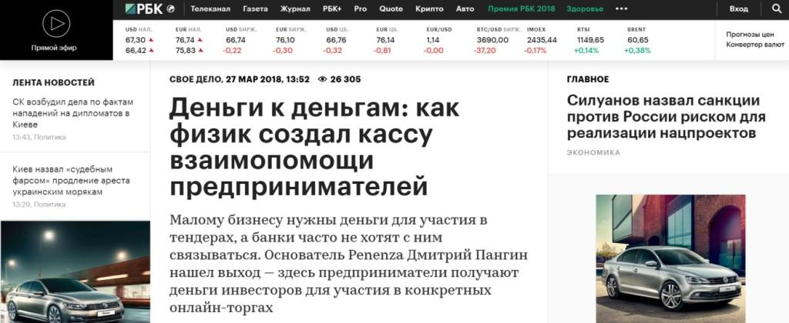

Penenza ㅡ краудлендинговая платформа для p2b кредитования юридических лиц. С конца 2017 года инвесторами могут выступать как юридические, так и физические лица (до этого кредиторами выступали только юр.лица). С обновлением платформы, когда мы открыли ее для физических лиц, перед нами встала большая задача ㅡ в 2018 году привлечь как можно больше так называемых «народных инвесторов». Кажется, очевидное решение ㅡ вложить деньги в рекламу. Однако в случае с таким сложным продуктом, как краудлендинговая платформа, прямая реклама не будет работать без «объяснительной» поддержки.

## Задача, которую решает продвижение в СМИ

Предположим, что наш потенциальный клиент, который интересуется инвестированием, увидел рекламу Penenza. Понял, что это еще не изученный им способ получить дополнительный доход. Или же он уже пользовался другими краудлендинговыми платформами, но не знал о Penenza. Ему хочется узнать больше: как вложить деньги, какие риски, какая доходность, есть ли подводные камни. Чтобы получить ответы на эти вопросы, пользователь идет в интернет. На этапе «принятия решения» мы должны захватить внимание клиента, вызвать его доверие, убедить его обратиться к нам. Для этого в начале 2018 года мы решили подключить инструменты PR.

PR-активности — это, в первую очередь, публикации в СМИ. Для СМИ готовим аналитику, цифры, динамику, связанные с отраслью и развитием, объясняем суть краудлендинга и так далее.

> Все тексты и комментарии, которые мы готовим для СМИ, имеют одну цель — повышать конверсию из лидообращения в покупку, чтобы к нам приходило как можно больше качественных заемщиков и народных инвесторов. PR формирует доверие. Если потенциальный инвестор будет знать, что о нас пишут «РБК» и «Коммерсантъ», то он будет уверен, что наша компания заслуживает внимания.

KPI поставили такие: ежемесячно выпускать не менее 10-15 публикаций с участием компании. Это может быть либо полноценная статья от лица экспертов Penenza или же их комментарии по какому-либо актуальному вопросу. С учетом перепечаток должно было выходить примерно 35-40 упоминаний в СМИ каждый месяц. Это хорошая цифра, чтобы поддерживать влияние компании в медиапространстве и сохранять МедиаИндекс (по системе «Медиалогия») на высоком уровне.

## Целевая аудитория как центр PR-стратегии

Чтобы PR-стратегия работала, важно правильно описать портрет целевой аудитории на этапе планирования.

Мы работаем на 2 целевые группы: заемщики и инвесторы. В 2018 году в приоритете были физические лица, мы их называем народными инвесторами. Это люди, которые: а) отлично разбираются в управлении личными финансами, активно занимаются инвестированием; б) хотят попробовать краудлендинг. Это мужчины (80%), 25-34 года, жители Москвы, Санкт-Петербурга и городов миллионников, которые разбираются в технологиях и ищут пути увеличения дохода.

Целевая аудитория влияет на итоговый план работы: на какие темы компания будет говорить в СМИ и в каких именно изданиях. 

Темы, интересные нашей целевой аудитории, ㅡ краудлендинг и финансы в России и в мире; состояние малого и среднего бизнеса в стране; поведение народных инвесторов: сколько готовы инвестировать и во что вкладывать; как устроена платформа, как устроен скоринг, какие возможности для доходности.

## Как выйти на нужные СМИ и писать для них: Pressfeed и личные связи

Издания, которые являются приоритетными для Penenza, ㅡ прежде всего, «первая четверка», куда хотят попасть все компании: «Коммерсантъ», «Ведомости», Forbes, «РБК». Кроме того, отраслевые издания по теме финансов: Banki.ru, Zaim.com, Credits.ru и другие

Чтобы начать публиковать статьи о вашей компании в целевых СМИ, существует два пути: либо связываться с редакциями напрямую, знакомиться с журналистами, предлагать темы, либо использовать автоматизированный помощник ㅡ сервис журналистских запросов [Pressfeed](https://pressfeed.ru/?utm_source=businesstory&utm_medium=content&utm_campaign=case&utm_content=penenza). Оба сценария принесут результаты, но в первом случае вам потребуется много времени на выстраивание хороших отношений с изданиями, и, скорее всего, после первого обращения найти точки соприкосновения не получится. Это долгая и усердная работа. Во втором случае с Pressfeed ㅡ публикации с участием компании могут выйти уже через 3-4 дня после регистрации на сервисе.

Я советую работать по двум фронтам. Кроме того, при работе со СМИ следует придерживаться определенных правил, о них я расскажу ниже.

**Совет 1.** Ищите то небанальное, что есть в вашем бизнесе или продукте. Особенно это актуально для стартапов, новых онлайн-сервисов. 

Например, на сайте «РБК» есть рубрика «Свое дело». В ней редакция пишет о бизнесменах и их проектах: с чего начинался бизнес, в чем особенности, как зарабатывает, как развивается. Мы предложили изданию написать об [основателе Penenza Дмитрии Пангине](https://www.rbc.ru/own_business/27/03/2018/5ab4e86b9a7947fadf2435a6).

[_Материал_](https://www.rbc.ru/own_business/27/03/2018/5ab4e86b9a7947fadf2435a6) _о компании Penenza_

После выхода материала на сайте Penenza.ru зарегистрировалось около 100 новых пользователей.

**Совет 2.** Для журналистов всегда будет актуальна статистика и аналитика вашей отрасли.

Например, издание «Бизнес.ру» разместило на сервисе Pressfeed запрос о госзакупках для малого и среднего бизнеса. Мы оперативно предоставили статистику по платформе: сколько займов выдали, какие гостендеры являются самыми распространенными. Журналист принял нашу статистику и опубликовал комментарий в материале.

[_Запрос_](https://pressfeed.ru/query/47013) _от «Бизнес.ру»_

[_Комментарий_](https://www.business.ru/article/1149-kak-vyigrat-goszakaz-pervoe-podrobnoe-posobie-dlya-malogo-i-srednego-biznesa) _в издании «Бизнес.ру»_

На сервисе Pressfeed компания Penenza зарегистрировалась год назад. Регистрация бесплатная, но на базовом аккаунте действуют ограничения по количеству ответов на запросы в месяц (не более 5 ответов). Мы подключили платную версию, чтобы пользоваться функциями сервиса по максимуму: она включает возможность отвечать на неограниченное количество запросов, подписываться на запросы по темам, рассылать пресс-релизы по базе журналистов и многое другое.

**Совет 3**. Если в вашей отрасли произошло что-то значимое, и это все обсуждают, постарайтесь попасть «в волну». Оперативно прокомментируйте новость, дайте свое мнение, привлеките к себе внимание на фоне этого события.

Самый свежий пример ㅡ [комментарий ](https://www.rbc.ru/finances/17/01/2019/5c403b429a7947c5e658ad5c)главы Penenza для «РБК» по поводу выхода «Сбербанка» на рынок краудлендинга.

  
_Публикация с участием компании_

> В день выхода новости, которая содержала прямую ссылку на сайт Penenza, платформу посетили 577 раз, и эти визиты превратились в 162 регистрации новых инвесторов. За 48 часов после выхода комментария сайт зафиксировал 197 регистраций. Это почти в 8 раз больше, чем в обычный день. Из 197 зарегистрировавшихся 40 инвесторов подтвердили регистрацию и ввели на платформу Penenza около 1 млн рублей.

_Показатели «Яндекс.Метрики» по визитам на сайт Penenza.ru. Пик пришелся на 17.01.2019_

**Совет 4.** Никогда не пропускайте запросы, напрямую касающиеся вашей отрасли.

На Pressfeed я практически всегда отвечаю на запросы от отраслевых СМИ (там работают 57 СМИ в тематике «Финансы»). Например, был запрос от издания Zaim.ru о скоринговых моделях.

  
[_Запрос_](https://pressfeed.ru/query/49591) _от Zaim.com_

Мы рассказали, как работает наша [система скоринга](https://zaim.com/articles/rabota-s-naseleniem/sluchaynyy-les-i-gradientnyy-busting-pomogayut-otsenivat/) и как она создавалась.

Или же отвечали на вопросы издания «Инвест-Форсайт» об экспертизе на финансовых p2p-платформах.

  
[_Запрос_](https://pressfeed.ru/query/49763) _от «Инвест-Форсайт»_

Глава Penenza Дмитрий Пангин объяснил, как на платформе происходит анализ риска для каждого займа.

  
[_Комментарий Дмитрия Пангина_](https://www.if24.ru/p2p-ekspertiza-proektov/) _в «Инвест-Форсайт»_

**Совет 5.** Несмотря на предыдущий совет, не ограничивайтесь темами отрасли! Иногда выстреливают материалы по смежным тематикам.

Я просматриваю все запросы на сервисе Pressfeed ежедневно и не пользуюсь поиском, потому что время от времени меня цепляют неочевидные запросы. То есть те, что не касаются напрямую финансов, но нам есть что сказать или мы сможем собрать аналитику по этой теме.

Так было с изданием «Коммерсантъ» и запросом на Pressfeed об инфраструктурных проектах в Санкт-Петербурге.

[_Запрос_](https://pressfeed.ru/query/47994) _от издания «Коммерсантъ»_

Мы посмотрели, по каким тендерам на благоустройство города компании берут займы в платформе, и предоставили эти данные редакции.

[_Материал с комментарием_](https://www.kommersant.ru/doc/3763792?query=penenza) _Penenza_

**Совет 6.** Иногда на конкретного журналиста (который пишет по вашей отраслевой теме) проще выйти через Pressfeed, чем писать на почту редакции.

Это делается так: заходите в раздел [«Контакты»](https://pressfeed.ru/people), указываете тему и нажимаете на кнопку «Журналисты». Так вы увидите всех авторов, кто специализируется на конкретной тематике.

_Поиск журналистов, пишуших на определенные темы_

Через сервис я нашла редактора бизнес-издания «[Что делать Обозрение](https://pressfeed.ru/smi/130)» и написала ему через внутренний чат сервиса.

  
[_Профиль редактора_](https://pressfeed.ru/people/25654) _издания «Что делать Обозрение»_

Предложила статью «Народное финансирование бизнеса», редактору понравилась идея материала, и текст вышел [в августовском номере](https://www.4dk.ru/news/4do-magazine/2018/7). Удобно, что в чатах можно знакомиться с журналистами, обсуждать материал, добавлять вложения, иллюстрации и так далее.

## Эффективность PR с точки зрения продаж

Издание не всегда разрешает поставить UTM-метку в текст или даже просто ссылку на сайт. Но мы все равно можем измерить эффективность опубликованного материала.

> Когда в СМИ выходит статья с участием Penenza, мы следим за всплесками обращений в день публикации (и 1-2 дня после). С публикации в крупных СМИ может приходить до 90-100 потенциальных инвесторов, которые вводят деньги и начинают тестировать платформу. С отраслевых ㅡ до 30-40 инвесторов. Именно так PR-продвижение повышает конверсию из обращения в покупку.

Хотя в целом публикации в СМИ и статьи в блоге не обязаны напрямую влиять продажи, ведь они работают, на узнаваемость, на доверие, на создание информационного шума вокруг компании.

## Итоги работы компании за 2018 год

За 2018 год вышло 523 публикации (считаю вместе с перепечатками и только в СМИ, без блогов и соцсетей) с участием Penenza. Как минимум 50 материалов были выпущены с помощью сервиса Pressfeed (вообще всего за время моей работы на Pressfeed я ответила на 105 запросов, и 50% комментариев были приняты).

Однако важно не только количество, но и качество. Необходимо сравнивать себя с кем-то и анализировать положение компании относительно конкурентов. Этот параметр помогает оценить система «МедиаИндекс» от «Медиалогии». За вторую половину 2018 года наш МедиаИндекс составил 3139 ㅡ это в 2 раза больше, чем у нашего ближайшего конкурента StartTrack.

> И вот таких результатов мы добились в 2018 году: на Penenza зарегистрировалось 5974 физических лиц, из них 1708 подтвердили регистрацию платежом, а 1389 человек стали народными инвесторами (выдали хотя бы один заем).

Если бы не PR-инструменты и активное продвижение в СМИ, народные инвесторы бы не поверили в Penenza или вообще не знали, что существует такая платформа, что на ней можно инвестировать и получать реальный доход.
