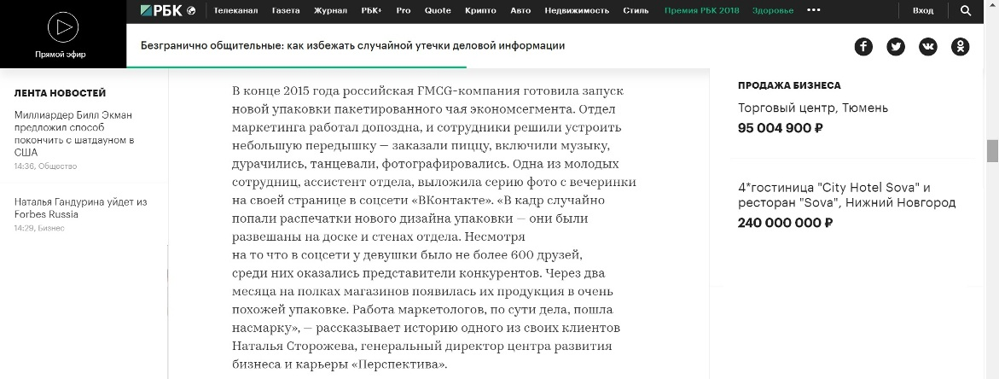
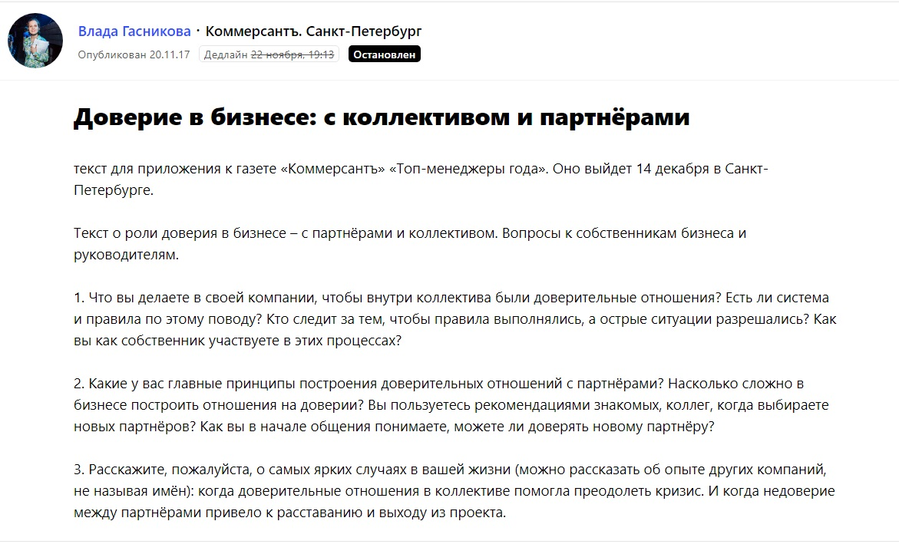
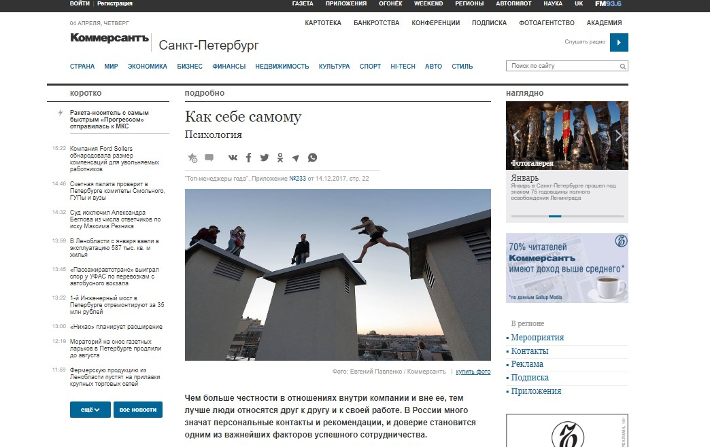
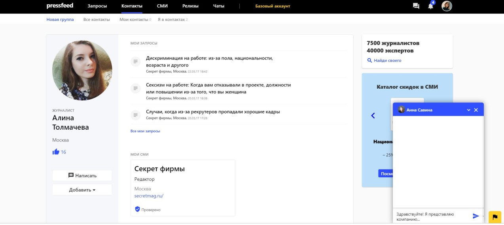
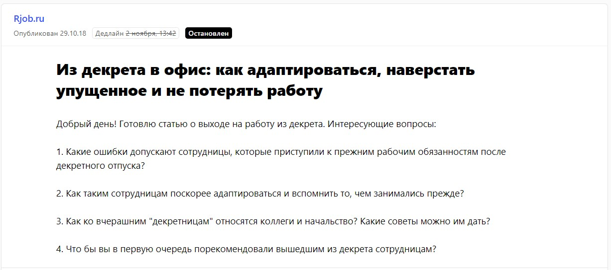
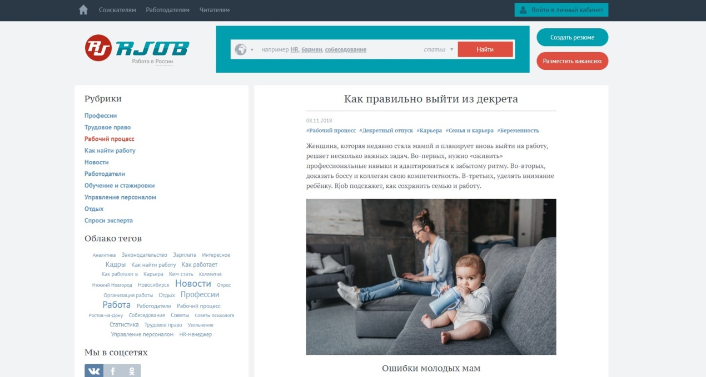
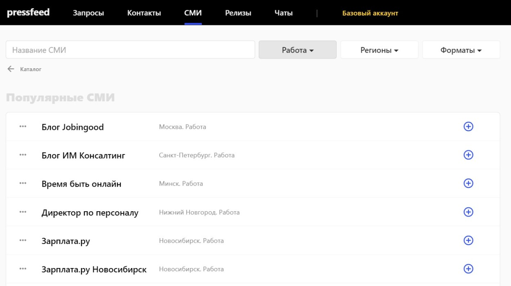
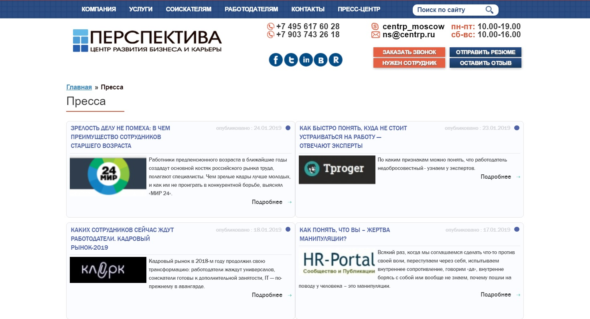

Мы никогда не использовали прямую рекламу. Считаю, в случае с кадровым агентством и b2b-рынком классические рекламные форматы не работают. Главный способ продвижения для кадрового агентства — рекомендации, сарафанное радио, когда один руководитель советует нас другому. Сарафанное радио всегда приводит уже «горячих» клиентов. Они знают о компании от своих знакомых, о нашей экспертизе, заранее доверяют нам и готовы сразу заключить договор. Однако повлиять на работу этого инструмента (да это и не инструмент) невозможно: кто-то порекомендует нас, а кто-то — нет, даже если он остался доволен сотрудничеством.

***

**_Справка о компании:_**

[_«Перспектива»_](http://www.centrp.ru/) _— кадровая компания, занимается подбором персонала, консультирует бизнес по вопросам рекрутинга и проводит обучающие тренинги для сотрудников. На HR-рынке с 2007 года, клиенты — компании, в штате которых от 50 до 2000 человек._

***

## Почему мы сотрудничаем со СМИ уже 10 лет

Клиентов нужно дополнительно «подогревать». Хочется, чтобы как можно больше компаний были изначально лояльны к нам, были знакомы с нашим подходом к набору персонала, понимали, что мы умеем. Поэтому компания «Перспектива» уже почти 10 лет сотрудничает с федеральными общественными СМИ и отраслевыми HR-изданиями.

Публикации в СМИ — это:

1. формат продвижения, который помогает компании заявить о себе и сформировать ее образ в глазах потенциальных заказчиков;
2. поддержание связей с текущими клиентами, ведь мы точно знаем, что они читают те издания, для которых мы пишем (они сами говорят об этом);
3. возможность делиться накопленным опытом, нам хочется быть полезными для HR-сообщества, нам не жалко бесплатно делиться кейсами и обучать других.

Важно заранее понимать, что работа со СМИ — это игра «в долгую». Наивно ждать ошеломляющих результатов, если вы выпускаете 2-3 публикации в год. Этим нужно заниматься постоянно и регулярно. Не все лиды, пришедшие после прочтения статьи, станут заказом. Но каждая публикация сделает свой вклад в копилку с названием «репутация компании».

Каждый месяц в различных медиа выходит 10-15 публикаций с упоминанием компании «Перспектива». Это либо полноценная статья от моего имени, либо мой комментарий по теме. Получается, всего около 100 публикаций в год (без учета перепечаток).

Таких объемов мы добились не сразу, и без специальных автоматизированных сервисов мы бы точно не справились. Расскажу обо всем по порядку.

## Как наладить отношения с журналистами и выпускать по 100 публикаций в год

На выстраивание взаимоотношений с журналистами потребовалось несколько лет. Мы работали по классической схеме до 2015 года (писали напрямую в редакции, рассказывали о компании, предлагали свои темы), пока не открыли инструмент для автоматизации общения с журналистами [Pressfeed](https://pressfeed.ru/). Это сервис, где журналисты оставляют запросы на комментарии и ищут экспертов для публикации. Компании нужно выбрать подходящий по теме запрос, написать развернутый ответ, переслать его журналисту в установленный дедлайн и ждать ответа редакции. Журналист может принять или отклонить запрос. У нас конверсия питчей, то есть запросов, которые были приняты, около 58%. Считаю, это хороший показатель.

Чтобы публикации о вашей компании выходили регулярно, действовать нужно по двум фронтам. Сейчас мы 50% публикаций делаем через Pressfeed, а остальные 50% — по прямым контактам.

С какими СМИ мы работаем:

1. крупные общественно-деловые СМИ: «РБК», «Коммерсантъ», «Ведомости», «Деловой Петербург», «Компания» и так далее;
2. отраслевые издания в тематике компании. Для нас это HR-площадки: «Управление персоналом», «Директор по персоналу», Rjob, Hr-tv.ru и другие.

Лучше держать баланс: у популярных площадок большая, но очень разная аудитория, а у профильных сайтов может быть скромная посещаемость, но зато каждый читатель — ваш потенциальный клиент.

Запросы выбираем те, которые так или иначе связаны с рекрутингом, персоналом, корпоративной культурой. Специальные подписки не настраивала, удобнее ежедневно просматривать все запросы вручную.

Приведу примеры публикаций. Начну с медиа-гигантов. С «РБК» мы сотрудничаем чаще всего через Pressfeed (ответили на 12 запросов).

[_Запрос_](https://pressfeed.ru/query/30307) _от «РБК»_

На вопрос журналиста о болтливых работниках я вспомнила случай, когда сотрудница одной российской FMCG-компании случайно разместила в интернете фотографию новой упаковки продукции бренда. Конкуренты увидели фото и просто скопировали дизайн.

  
_Комментарий на «РБК»_

В другой раз, тоже с помощью [запроса на Pressfeed](https://pressfeed.ru/query/40544), я рассказала свое мнение о тестировании соискателей в материале [«Из другого теста: насколько полезны задачи и анкеты при найме сотрудников»](https://www.rbc.ru/own_business/28/02/2018/5a8d72e89a79473657cc87f3).

С «Коммерсантом» общаемся как через сервис, так и напрямую. Как-то говорили с редакцией на тему доверия в бизнесе, почему руководителю иногда полезно быть ближе к своим подчиненным.

  
_Запрос от издания «Коммерсантъ» на сайте Pressfeed_

С помощью Pressfeed вышла публикация [«Как себе самому»](https://www.kommersant.ru/doc/3494000) на сайте и отдельная публикация в приложении к печатной газете.

  
_Публикация в «Коммерсанте»_

У нас выходили материалы в деловых изданиях «Секрет фирмы», Inc.Russia и E-xecutive и других. На Pressfeed зарегистрированы журналисты всех крупных изданий (около 7,5 тысяч журналистов всего работают на сервисе), иногда получается познакомиться в рамках сервиса, а потом переписка перемещается в личную почту.

Чтобы наладить отношения с нужным журналистом — напишите ему в личный чат прямо на сервисе. Для этого:

1. найдите целевое издание;
2. просмотрите журналистов издания;
3. оцените архивные запросы от журналистов и решите, кому писать в первую очередь;
4. расскажите журналисту о своей компании, предложите спикеров, объясните, чем вы можете быть полезны друг другу.

_Пример, если вы хотите связаться с редактором сайта «Секрет фирмы»_

Что касается отраслевых изданий, то интервью и какие-то глобальные материалы обычно делаем непосредственно с редакциями: заранее обсуждаем тему, вопросы, сроки и так далее. А если нужен комментарий, то намного удобнее и быстрее отправить его через Pressfeed. Честно говоря, главная ценность сервиса для меня — это оперативность. Сегодня написал комментарий, а через несколько дней уже можешь увидеть его в статье на сайте.

Мы часто пишем для блога rjob.ru: только через Pressfeed было опубликовано 11 текстов с участием «Перспективы», кроме того, мы выпустили десяток материалов отдельно вместе с редактором.

[_Запрос_](https://pressfeed.ru/query/49178) _от Rjob_

Из недавнего — публикация на горячую тему, как правильно выйти из декрета. Я дала молодым мамам рекомендации, чего нужно избегать, если вы только недавно вышли на работу после декретного отпуска.

  
[_Материал с комментарием_](http://rjob.ru/articles/kak_pravilno_vyyti_iz_dekreta/) _Натальи Сторожевой_

Давно дружим с профильной площадкой hr-tv.ru. Они знают о наших компетенциях, мы понимаем, какие тематики обычно интересуют редакцию. Иногда проще ответить на запрос на Pressfeed, а иногда редактор хочет задать вопрос конкретно мне, тогда пишет в почту. Для издания я давала комментарии, как [организовать корпоратив](https://hr-tv.ru/articles/25586.html), как [не ошибиться в выборе начальника](https://hr-tv.ru/articles/kak-ne-oshibitsja-v-vybore-nachalnika.html), рассуждала, [повлияет ли искусственный интеллект на систему рекрутинга](https://hr-tv.ru/piranhas/iskusstvennyj-intellekt-ubet-rekruting-vy-soglasny/) (это был ответ на [запрос на сервисе](https://pressfeed.ru/query/44867)).

Также мы сотрудничаем с отраслевыми изданиями HR-Portal, блогом hh.ru, «Hr по-русски», «Клерк» и другими.

Найти все издания, которые пишут на HR-тематику, легче всего опять же с помощью Pressfeed. Просто заходите в раздел «СМИ» и выберите фильтр «Работа».

  
_СМИ с фильтром «Работа»_

Считайте, что таким образом у вас уже готова база профильных СМИ, для которых может писать ваша компания.

## Что нам дают публикации в СМИ: репутацию и новых клиентов

Мы выпускаем более 100 публикаций каждый год и это без учета перепечаток. Ссылки на все материалы появляются в социальных сетях компании и на сайте.

  
_Раздел на сайте «Пресса»_

Дальше мы обязательно следим за активностями: комментируют ли статьи, сколько репостов, лайков. Есть темы, которые выстреливают всегда, например, «Как поднять себе зарплату» или «Секреты женской карьеры». Со временем мы поняли, что аудитория замечательно реагирует на конкретные рекомендации, а вот банальные рассуждения ее не интересуют. Поэтому еще одна рекомендация: пишите по делу, приносите людям пользу, тогда публикации в СМИ точно приведут к вам клиентов.

Не раз я сталкивалась с ситуацией, когда клиент приходил и говорил: «Я читал о вас в этой статье» или «Вы писали об этом, но я не совсем согласен, давайте обсудим». Клиенты видят наши публикации, запоминают их. Даже во время нетворкинга на конференциях стоит мне протянуть визитку, как репутация «догоняет» меня, и собеседник заранее знает, какую компанию я представляю, какие у нас достижения.

Репутацию сложно измерить, ведь это некое информационное поле, которое работает на вас. Репутацию нельзя создать за один день, это накопительный результат, над которым нужно трудиться долго, последовательно, системно, качественно. Но это стоит того. Репутация — это фундамент продаж. И именно микс «публикации в СМИ + выступления на конференциях + ваши заслуги» обеспечивает компании стабильный поток клиентов. Для нас это проверенная и рабочая схема.

В 2018 году мы не прибегали к новым маркетинговым инструментам, не запускали рекламу, но при этом увеличили количество клиентов по различным отраслям на 15%. Объем вакансий, по которым мы работаем, также вырос на 21%. Наша репутация с каждым годом становится только крепче, и благодаря ей компания «Перспектива» продолжает развиваться.
